<h1 align="center">
  <br>
  <a href="https://www.vulnhub.com/entry/unknowndevice64-1,293/">Unknowndevice64</a>
  <br>
</h1>

## Nmap

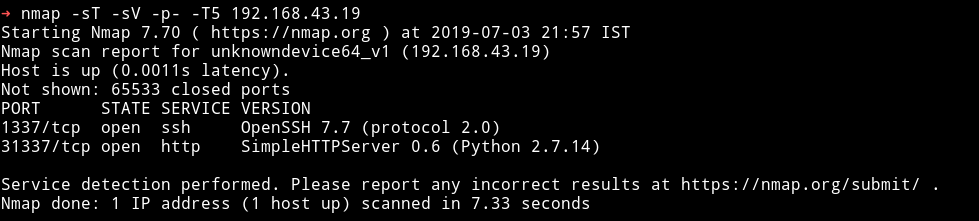

Not a lot of ports open. There's a web server running on port 31337 and good old SSH but instead of being on port 22 it's on port 1337.

***

Let's see what we find on the we can find on the website via cmd.

```bash
➜ http http://192.168.43.19:31337
```

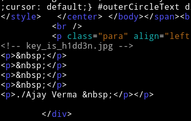

If we visit the website via browser we can see a line saying `key is h1dd3n`

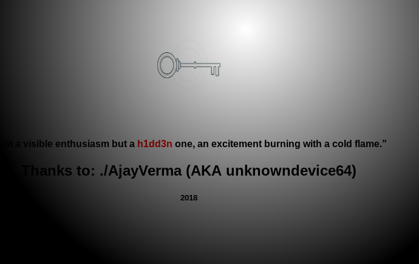

Now let's get the `key_is_h1dd3n.jpg` file and see what we find.


***

Simple strings doesn't bears anything out so I used `steghide` with key as `h1dd3n` and we got a file.

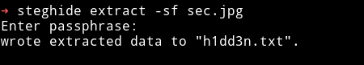

`h1dd3n.txt` file had some `brainfuck` code in it and decoding it we get some credentials.

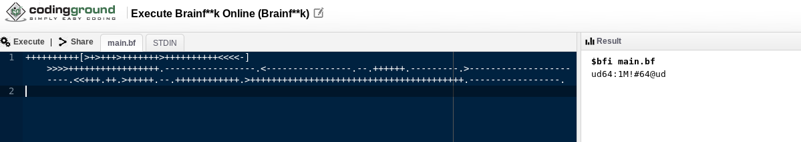

Username: `ud64`
Password: `1M!#64@ud`

We can use those credentials to login via SSH.

## Low Privilege shell

When we login as `ud64` we cannot execute normal commands like `ls` or `cd` because doing so we get `rbash` error.

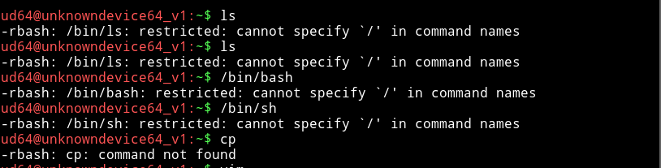

I've bypassed rbash shells before, mostly in Jeopardy style CTFs so I tried few things that I knew.

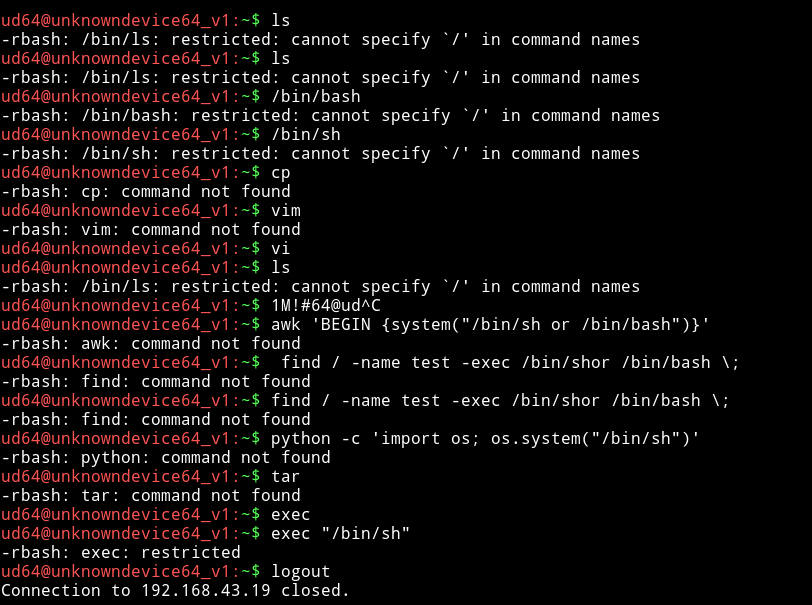

None of these seemed to work, so I decided to refer to the guide I always for bypassing `rbash`, [linux-restricted-shell-bypass-guide](https://www.exploit-db.com/docs/english/44592-linux-restricted-shell-bypass-guide.pdf
). This is pretty good guide and it's got almost all the trick that bypass `rbash` shell(most of the time).

I tried the SSH `-t "bash --noprofile"` trick and it worked.

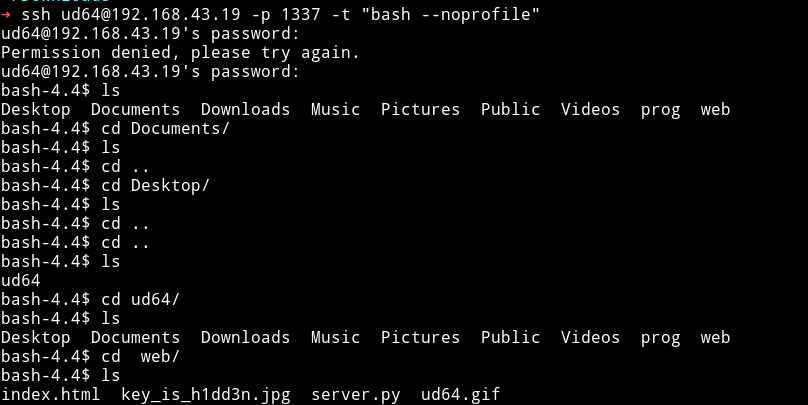

## Privilege Escalation

As I always do, I started with Enumeration script but I didn't saw anything interesting so I tried some manual things from this [guide](https://sushant747.gitbooks.io/total-oscp-guide/privilege_escalation_-_linux.html) and when I tried `sudo -l` I got something interesting:


Okay so that means we can run `sysud64` with `sudo`. Let's see what does `sysud64` do. When I ran `sysud64` I got a message saying I should run `sysud64 -h` and doing that I got something that just made me smile

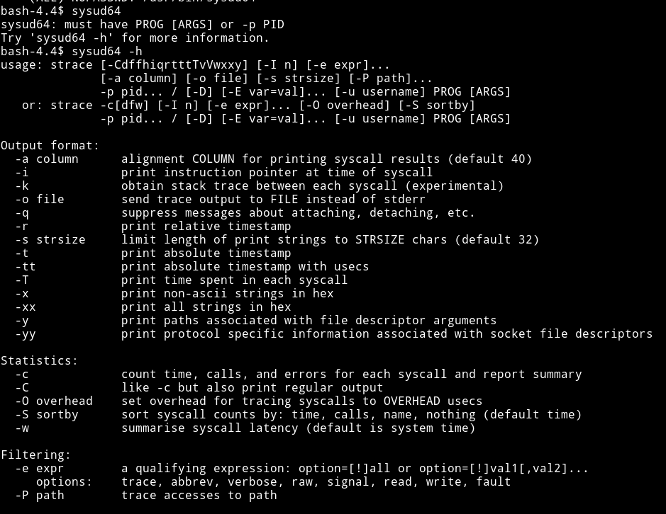


It's `strace` just with a different name. Now as I said above I've done some jeopardy type CTFs and there I have done some `jail` type challenges. In short I already knew how to use strace to escalate the privilege :)

If we run `sudo strace -o /dev/null /bin/bash` it will actually spawn the root shell.

But When I did that I was prompted for password which was weird.

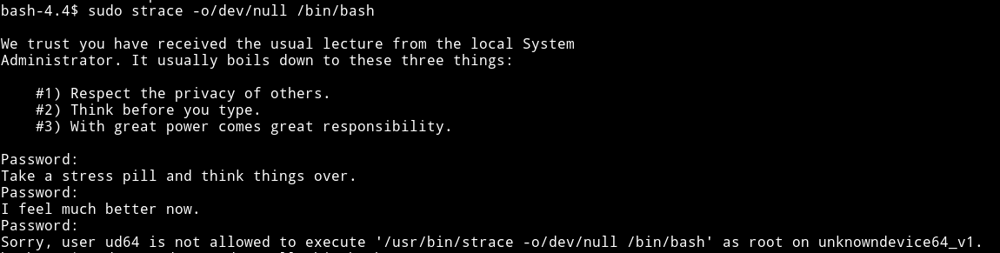

I tried this few times but then I realized I was so dumb. The name of `strace` is actually changed to `sysud64` so I got a root shell.


Then just cat the `flag.txt` in `/root`

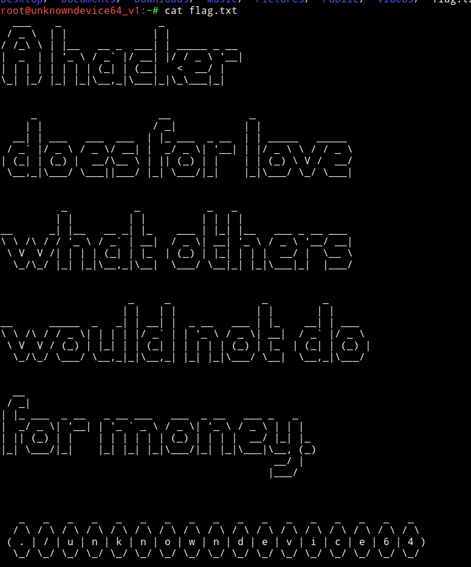

***

It was really easy machine really enjoyed it :)
`ud64:1M!#64@ud`

I am happy that I was able to pwn this machine within 30 minutes.
