<h1 align="center" style="font-size:30px;">
  <br>
  <a href="https://www.vulnhub.com/entry/mission-pumpkin-v10-pumpkingarden,321/">Pumpkin Garden</a>
  <br>
</h1>

<h4 align="center"> Author: <a href="https://twitter.com/askjayanth"> Jayanth</a></h4>

## Nmap

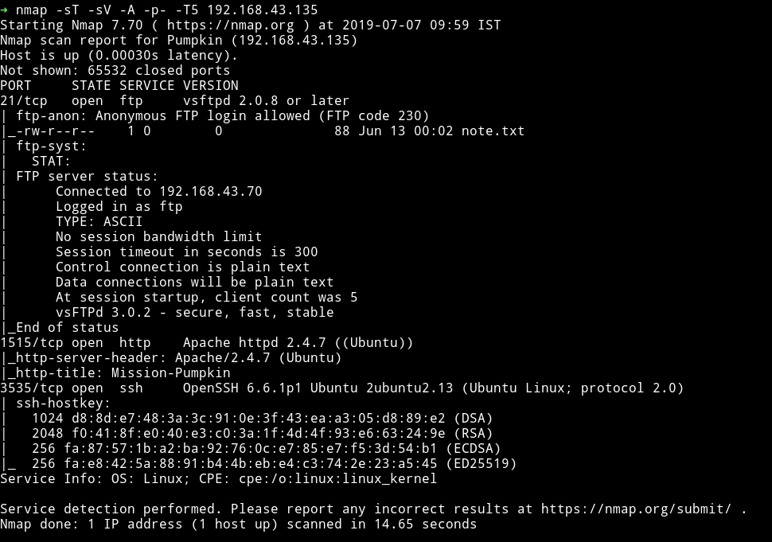

We've got three open port running FTP, SSH and http service. Since FTP allows `Anonymous` login. I guess I'll just start with that one.

## FTP

The FTP server had only a file name `note.txt`

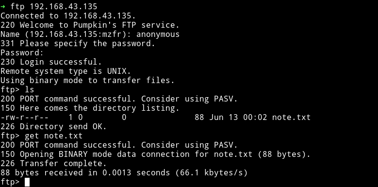

And that note contain a simple message:

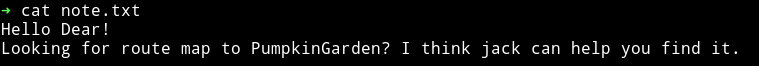

The only new information we get from this is that there's a guy named `jack`. This can be used as a username in future.


## HTTP

When we visit the website at port `1515` we get a very appealing website

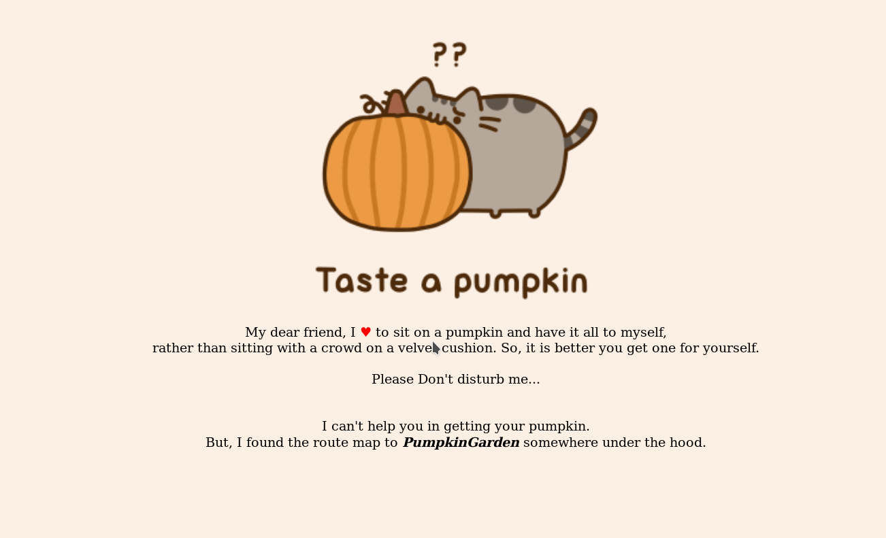

In the source of that page I found a comment saying

```
<!-- searching for the route map? Pumpkin images may help you find the way -->
```


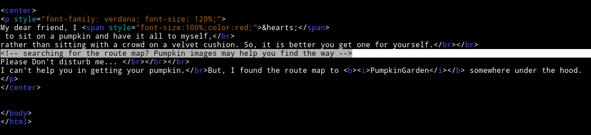

This mean we might have to use some `stegano` tools on the image to find our way to so called `pumpkin garden`.

I downloaded the gif and used all kind of tools on it but couldn't find anything. I decided to just run gobuster while I was trying to find something in that gif.

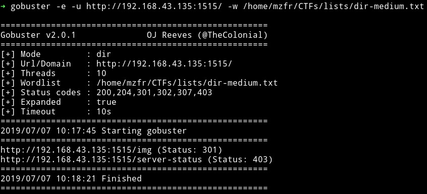

I don't think we were supposed to find anything in that `gif` because as we can see there's a path, `/img/` which had multiple images of pumpkin in it along with a folder named `hidden_secet/`.

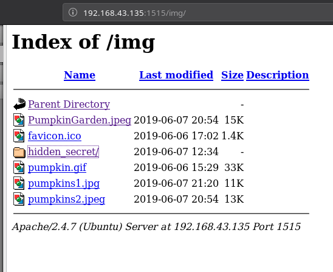

In that folder there was file called `clue.txt` and in tht file was a base64 encoded strings. Decoding that string gave some `credentials`.

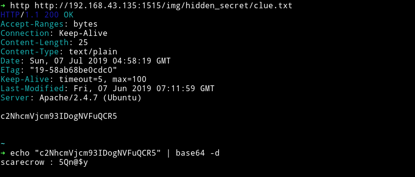

`scarecrow : 5Qn@$y`

***

***

Using those credentials I was able to login into `scarecrow` account via SSH.

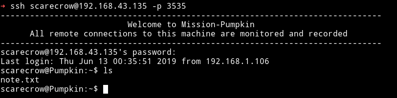

We see there was a `note.txt` file present in the `/home/scarecrow`.

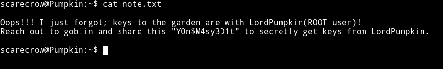

`Y0n$M4sy3D1t` can be the password for `goblin`'s account.

I tried to `su` into goblin account using the given password and it worked.

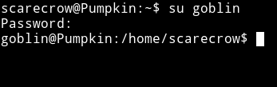

In the goblin's home directory I found another note:

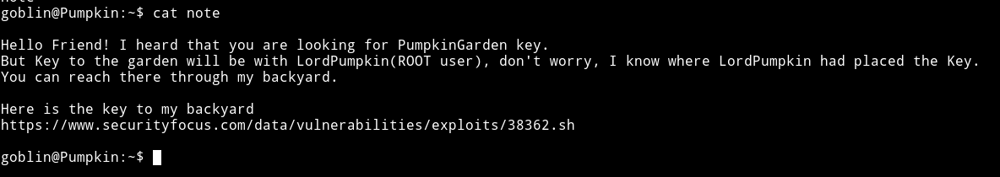

I downloaded exploit from the given URL and it exploits the sudo right.

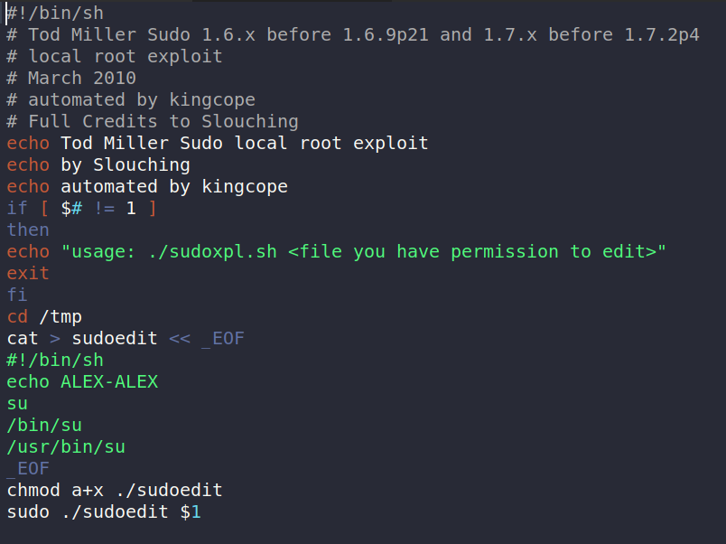

We can get that file from our system to the machine using `SimpleHTTPServer` or `netcat`.

As we can see in the code that the exploit expect an argument which is the path of the file that the current user can run as `sudo`. So to find that we can just use the `sudo -l` command.

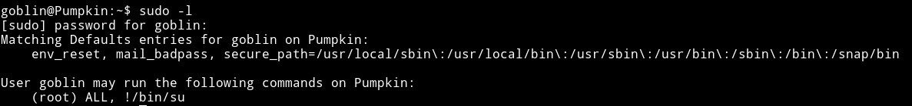

I ran the exploit and got the root shell. Then I listed the flag.

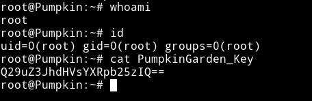

***

Chances are that you might not find any file in the `goblin` directory when you wget the exploit from your system to the machine. Or maybe when you run the exploit you might get error saying `file not found` or something similar.

This is possible because there are some command running in the back:

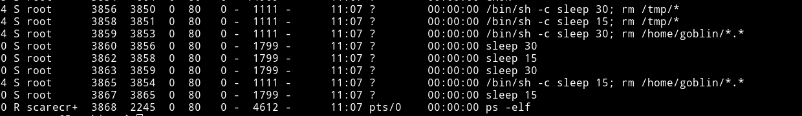

Those lines means that in every 15 seconds the content of `/home/goblin/` and `/tmp` will be wiped out. There are two way to bypass it:

1) Like you can see in my writeup I didn't face that problem because I did everything within `75` sec i.e those 3 sleep commands gives us `75` sec in which everything stays where it's put. In other word you'll be lucky :)

2) Login with `scarecrow` account, get the exploit in his home directory and then change the permission of that file by running

```bash
chmod 777 exploit.sh
```

This way goblin will also be able to run the file. Now go back to goblin's account and execute the exploit.

