<h1 align="center" style="font-size:30px;">
  <br>
  <a href="https://www.vulnhub.com/entry/mission-pumpkin-v10-pumpkinraising,324/">Pumpkin Raising</a>
  <br>
</h1>

<h4 align="center"> Author: <a href="https://twitter.com/askjayanth"> Jayanth</a></h4>

## Nmap

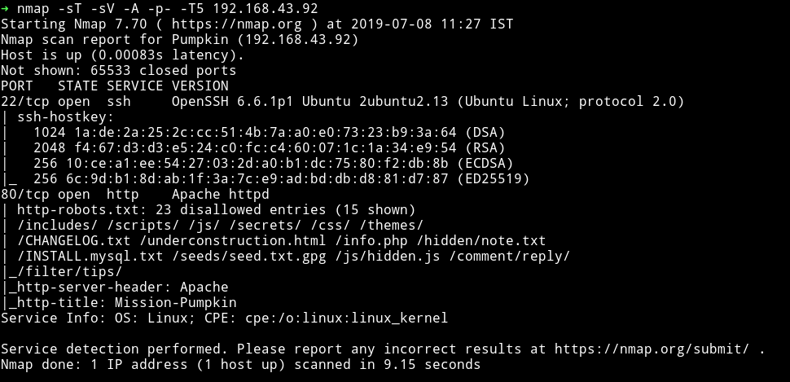

Only two ports are open and obviously we'll be starting with the website.

***

## HTTP

As we can see in the nmap scan there are lot of directories disallowed in the robots.txt.

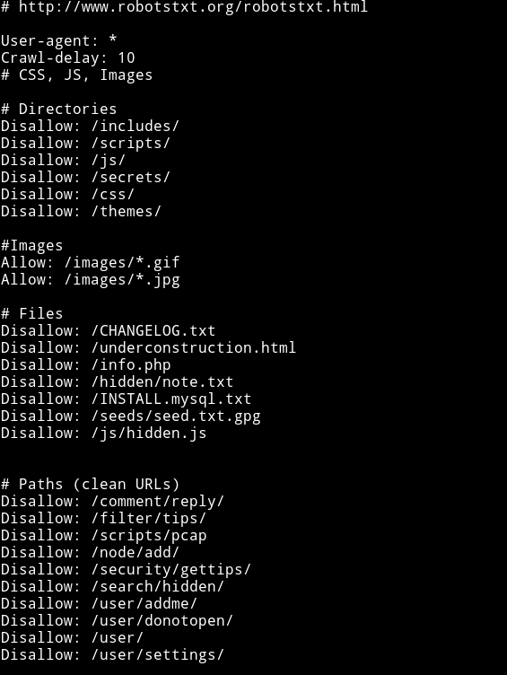

But still let's run `gobuster` to see if we can find anything else.

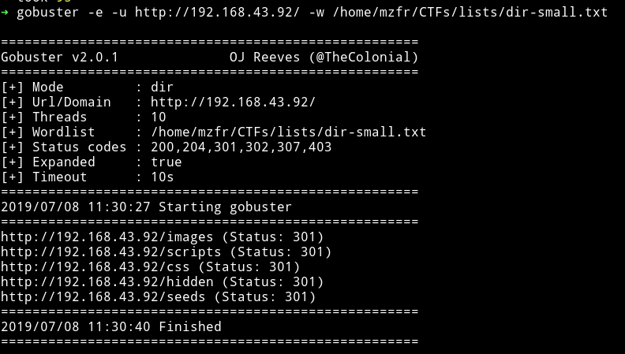

Yeah so gobuster didn't find anything new.

Lot of those URLs were either `Forbidden` or `Not found`. But in the hidden note I found some user name with encoded strings:

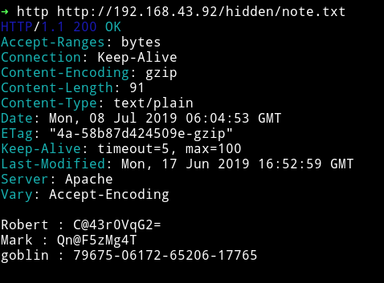

```yaml
Robert : C@43r0VqG2=
Mark : Qn@F5zMg4T
goblin : 79675-06172-65206-17765
```
I tried them as SSH login but none of them worked.

Also in `/seeds/seed.txt.gpg` I got an encrypted GPG.

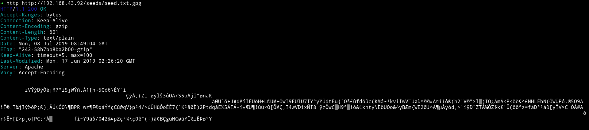

We can try to decode it but it will need a password. I used the `CeWL` tool to make a dictionary and bruteforce on the GPG file but got nothing.

After that I manually picked words that were unique like `Mission` or `Gearedup` etc to use them as a password. After like 15 minute I finally got a hit `SEEDWATERSUNLIGHT`(these are the word you see first when you visit the webpage)

I ran `gpg seed.txt.gpg` and entered the password and got the output in file called `seed.txt`.

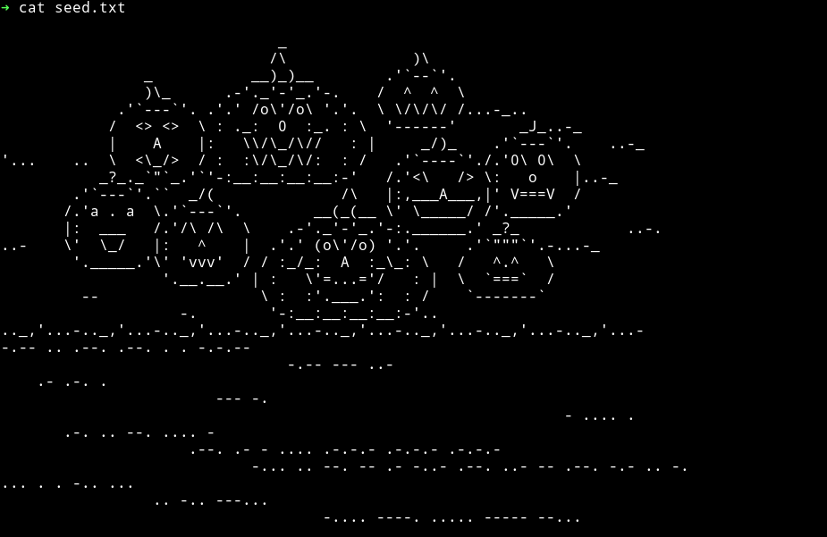

At first this may look like an ascii art but if we look at the lines we an clearly see it's a `morse code`(all those hours I put in jeopardy style CTFs are paying off).

Decoding the `morse code` I got:

```
 T     I   E OF U   M N  YIPPEE! YOU ARE ON THE RIGHT PATH... BIGMAXPUMPKIN SEEDS ID: 69507
```

***

Let's see what does the main website shows us.

Visiting the URL it gave a very appealing website :)

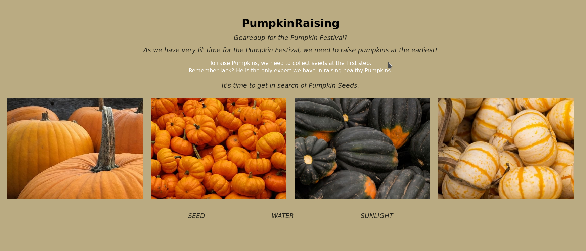

Focus on the message in the white:


It talks about `collecting seed` as the first step so I think it's talking about the `/seed/seed.txt.gpg` file which contains a gpg key and the message goes on to say `Remember Jack? He is the only expert we have in raising healthy Pumpkins.` meaning that key has to be related to `jack`

There's a base64 encoded comment in source of that website:


```bash
➜ echo "VGhpcyBpcyBqdXN0IHRvIHJlbWFpbmQgeW91IHRoYXQgaXQncyBMZXZlbCAyIG9mIE1pc3Npb24tUHVtcGtpbiEgOyk=" | base64 -d
This is just to remaind you that it's Level 2 of Mission-Pumpkin! ;)
```

Also in the source we see `pumpkin seeds` refering to another page:


Let's check that page out.

***

Again we are greeted by such a beautiful web page.


If we look at the source of the page, we can see some `hex code` in the end of the page(you might miss it if you won't scroll down in browser's `view-source`).

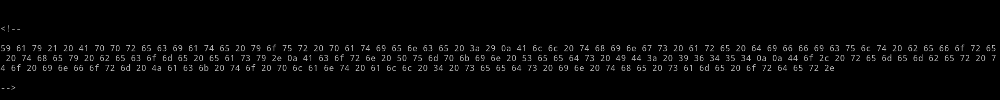

Decoding that hex I got

```
Yay! Appreciate your patience :)
All things are difficult before they become easy.
Acorn Pumpkin Seeds ID: 96454

Do, remember to inform Jack to plant all 4 seeds in the same order.
```

__Oops!!__ Looks like this was supposed to be the last seed 😜

Anyway, the other thing we can see in the source is an encoded string:

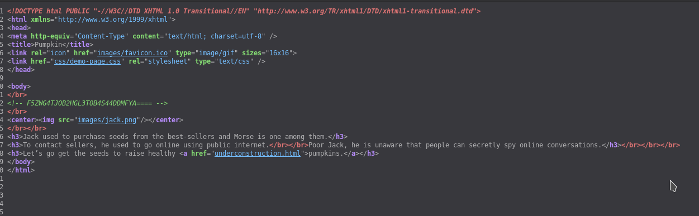

it's base32 encoded string `F5ZWG4TJOB2HGL3TOB4S44DDMFYA====`, decoding it gives a path `/scripts/spy.pcap`

Let's analyze the `pcap` file in wireshark.

***

## PCAP

All the packets in the PCAP file where TCP protocol so I simply followed the TCP steam(`ctrl+shift+alt+T`) and we can see a conversation

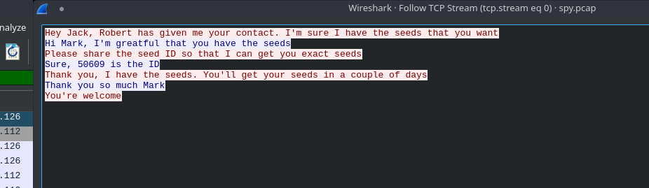

I got the another seed ID `50609`.

We have two seed IDs and we need two more(description of the machine says something about 4 Seed IDs)


Back to enumerating the website

***

After I started looking around for more I realized I didn't checked all the pages I got from `robots.txt`. The `info.php` and `underconstruction.html` were remaining.

I got nothing on `info.php`.

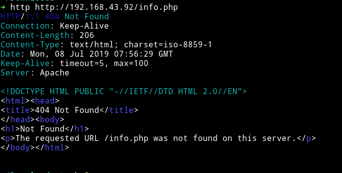

On `underconstruction.html` I got a very beautiful website(__AGAIN!!__)


__NOTE__: That pumpkin is actually a GIF and not an image :)

The source of the website had a credit to someone from whom the image is taken and a line saying `Looking for seeds? I ate them all!`.

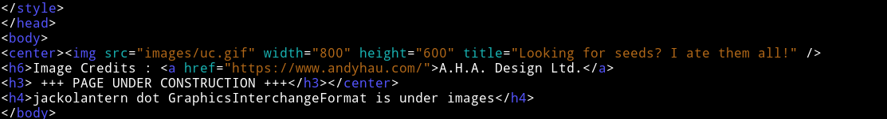

The interesting thing was that there was a `h4` heading saying

```html
<h4>jackolantern dot GraphicsInterchangeFormat is under images</h4>
```
but it's not visible in the browser.

This line is referencing to `jackolantern.gif`. We get a hint of `steganography` in two ways:

* The image was hidden.
* One of the line on that website said `I ate them all` meaning something is inside the image.

So I downloaded the image and I used `stegosuite` on that image(steghide only works on jpg or bmp file.)

I ran
```bash
stegosuite -x jackolantern.gif
```

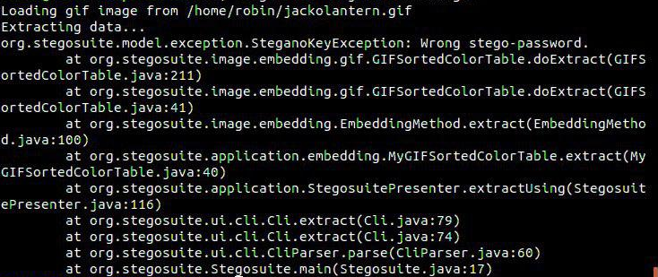

But got an error because it need `password` to extract data. Now the only thing I had remaining which can be used as password are the encoded strings I got from `/hidden/note.txt`. One by One I tried them and got hit on `Mark : Qn@F5zMg4T`

```bash
stegosuite -x jackolantern.gif -k Qn@F5zMg4T
```

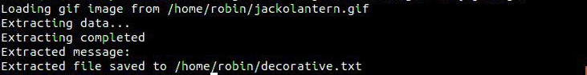

It wrote a file named `decorative.txt` and that file had following content

```
Fantastic!!! looking forward for your presence in pumpkin party.
Lil’ Pump-Ke-Mon Pumpkin seeds ID : 86568’
```


__Thanks to @[D4mianWayne](https://github.com/D4mianWayne/) for helping me with stegosuite__

***

## SSH

So now we have all the seeds. The order I got them were:
```
69507
96454
50609
86568
```

But if we look at the message we got after decoding the hex it said `Do, remember to inform Jack to plant all 4 seeds in the same order.` so this could mean that it's a password for jack's SSH account(since there's no other service having accounts)

The problem is the order since I messed up the order in finding them but that's not a big problem since we have to bruteforce set of 4 numbers.

After few tries I got the correct order `69507-50609-96454-86568`. I logged in into jack's account using `jack: 69507506099645486568` but it was a rbash  or restricted bash shell.

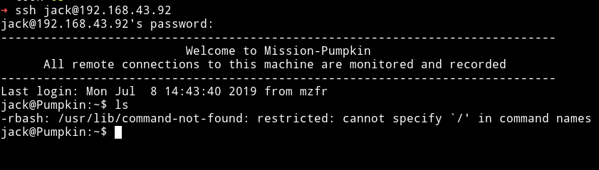

There are many way to bypass it. Here I used the `-t "bash --noprofile"`

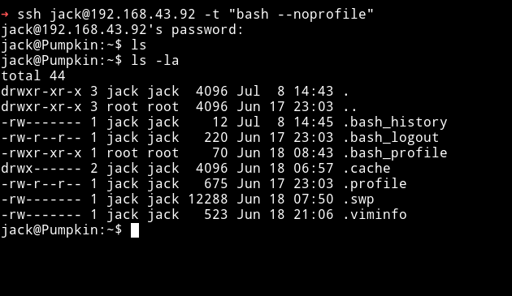

***

The first thing I did was to check the sudo rights for jack and to my surprise I saw that jack can run `strace` with sudo rights.

I recently did a machine named [unknowndecives:1](https://mzfr.github.io/unknowndevices) that had the same privilege escalation method so I just knew how to do it.

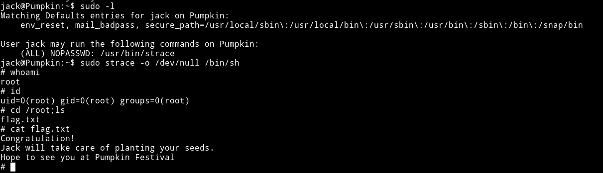

***

__Started 0n__:     `Mon Jul  8 11:20:41 IST 2019`

__End on__:         `Mon Jul  8 16:20:41 IST 2019`

***

This was really really amazing machine. I loved it a lot. Thanks to [Jayanth](https://twitter.com/askjayanth) for making such a great box.
