<h1 align="center" style="font-size:30px;">
  <br>
  <a href="https://www.vulnhub.com/entry/matrix-3,326/">Matrix 3</a>
  <br>
</h1>

<h4 align="center"> Author: <a href="https://twitter.com/unknowndevice64"> unknowndevice64</a></h4>


## Nmap

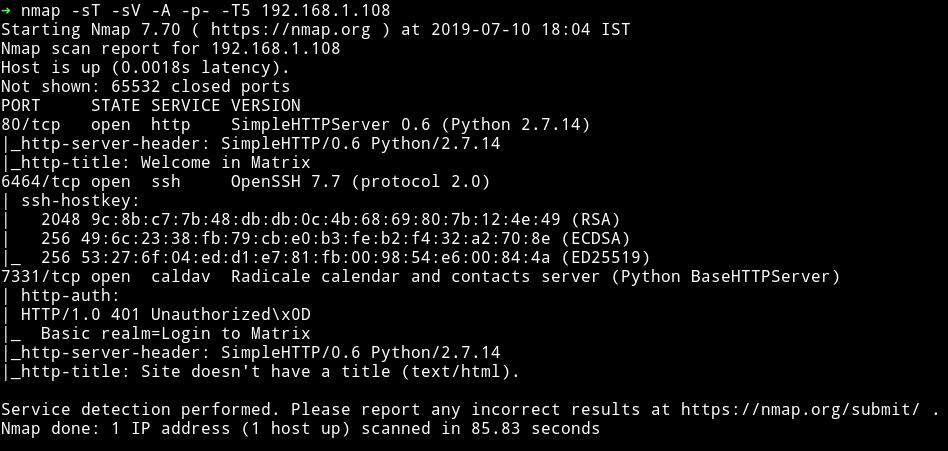

There's a HTTP server running and an SSH server on port `6464`. Also there's another HTTP server on `7331` but seems like it has authentication.

Let's start with HTTP

***

## HTTP


There's a nice looking website.

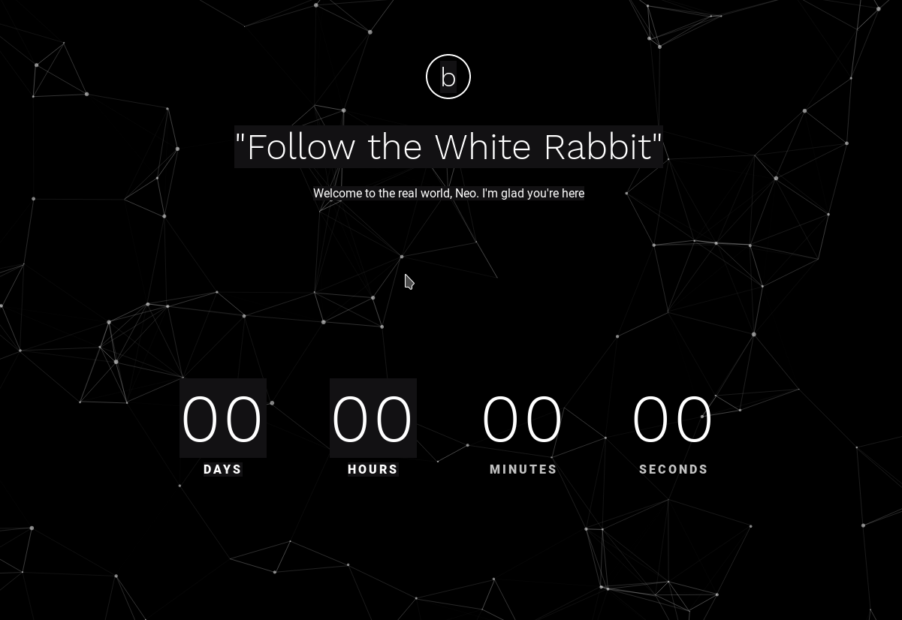

Source of that page had nothing. But as we can see that the website says `Follow the white rabbit.` Maybe we need to find a white rabbit.

I started `gobuster` on the main URL and found some pages:

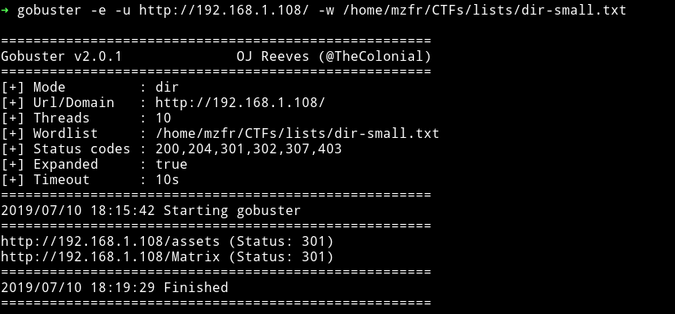

If we visit the `/assets/img` there's a file named `Matrix_can-show-you-the-door.png` and that image is of a white rabbit. So maybe we are on the right track.

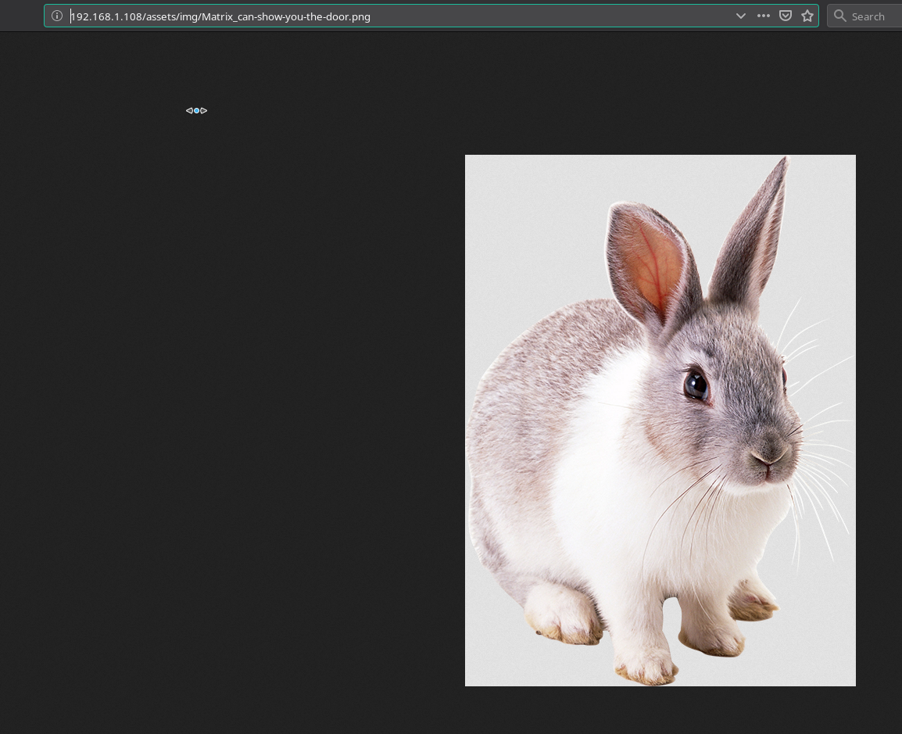

Now before we do some analysis on that image lets checkout that `/Matrix/` Page.

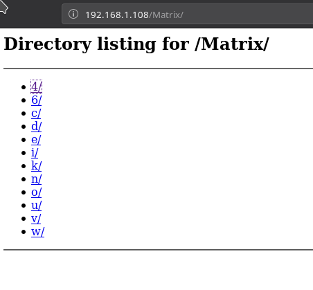

So there are lot of links. Using `wget` I recursively downloaded all those diectory. You can do that by running:

```bash
➜ wget --recursive --no-parent http://192.168.1.108/Matrix/
```

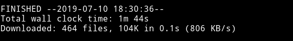

Okay these are lot of files so I don't think I was supposed to download them like this 😜

I realized that all these directory were just to confuse us and the directory listing we should be looking into is `/n/e/o` for obvious reasons. After few minutes I found something on `Matrix/n/e/o/6/4/`, it was a link to a `gzip` file.

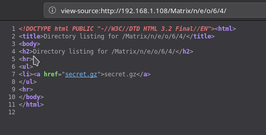

Actually it was with the `.gz` extension but it wasn't gzip. It was simple `ascii text` file. Running `cat` on it I got some creds:

```
admin:76a2173be6393254e72ffa4d6df1030a
```

That is the md5 hash which is equivalent to `passwd`.

__Note:__: You can use websites like [hashkiller.co.uk](https://hashkiller.co.uk/Cracker/MD5) or [crackstation](https://crackstation.net/) to crack that md5.

So we have the credentials `admin:passwd` but not sure where to login.

If you remember the nmap scan we had another HTTP server running on port `7331`. Let's check that out.

***

## HTTP: 7331

As we try to visit the page it ask for password, we can use the creds we found i.e `admin:passwd` and we are in.


Again on this website I found a path `/assests` and again in the `img/` I found an image saying `p0rt_31337` and opening that image I found a white rabbit. So maybe we are not supposed to find white rabbit but instead it resembles that we are on the right path.

But port `31337` is closed.
I tried looking for something else for a while which might give me some hint about the `port: 31337` but I couldn't. Then I decided to run `dirsearch` on this website.

```bash
➜ python dirsearch.py -u http://192.168.1.108:7331/ -e * --header "Authorization: Basic YWRtaW46cGFzc3dk" -w dir-small.txt
```

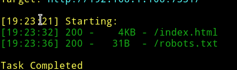

__NOTE__: I didn't used gobuster because I couldn't figure out how to add headers to it. In `dirsearch` we have an option for that.

In `robots.txt` there was a path `/data`.

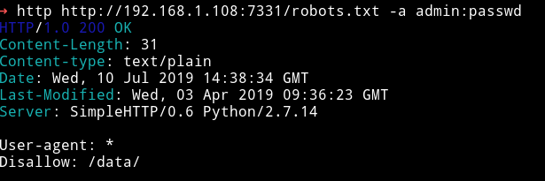

There was file named `data`. I downloaded the file and it was a

```bash
data: PE32 executable (GUI) Intel 80386 Mono/.Net assembly, for MS Windows
```

When I opened the file I got:


We can open this file in `ghidra` and see if we can find anything.

__Thanks to [@Andreas](https://twitter.com/4nqr34z) for suggesting me to use ghidra__

***

## Ghidra

I was confused on how and where to look and actually what to look for. But thanks to __[@DCUA7](https://twitter.com/DCAU7)__ for letting me know that we are looking for credentials.

Just run ghidra and
* open the `data` file in the `code browser` of ghidra.
* On the left hand side you'll notice a section called `symbol tree` click on that
* In that open `Labels` and then click on `CLI_Stream_#US`.

Scroll a bit and you'll see credentials

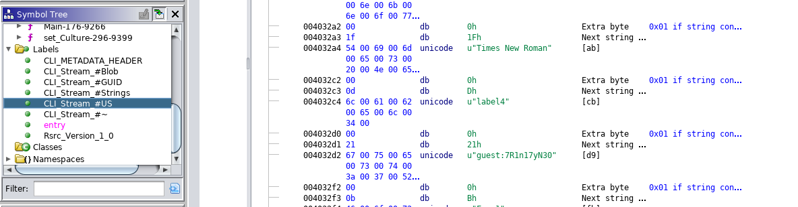

`guest:7R1n17yN30`

***

## rbash

I logged in via SSH using those credentials and it was a rbash shell.

Just gonna use the trick that I always use i.e `-t "bash --noprofile"` ezpz :)

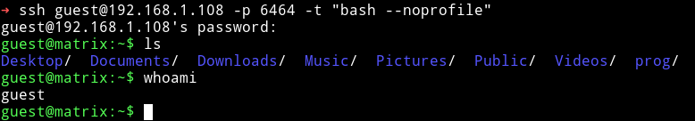

***

Now we have a proper shell, let's just use our enumeration script and see what we can find.

I got some other users:

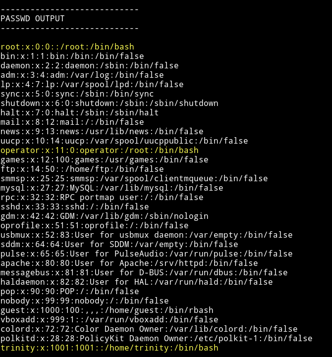

and for some reason I found insane amount of `SUIDs`

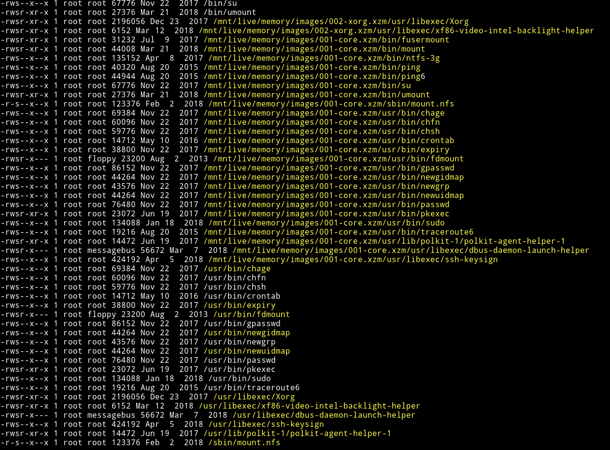

and if we checkout the `sudo` rights we see:

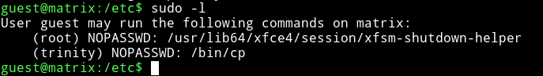

we can run `cp` as trinity. Now we need to find a file which can be worth copying :)

***

I ran

```bash
guest@matrix:/home/trinity/.ssh$ find / -user trinity 2>/dev/null
```

and got some files:

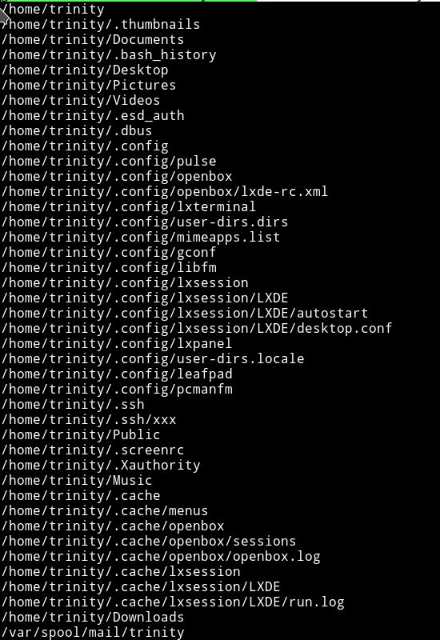

Few files that can bear us something important are `.bashrc`, `/mail/trinity`, `.ssh/xxx` or instead of copying anything from `trinity` how about we copy something into trinity's directory. We can put a SSH key into trinity's `.ssh` folder and then login as trinity.

To do so:

* use `ssh-keygen` command to generate new keys
* run `chmod 777 id_rsa.pub` or else you won't be able to copy it.
* use `sudo -u trinity /bin/cp ./id_rsa.pub /home/trinity/.ssh/authorized_keys`
* then do `ssh trinity@IP -p 6464 -i id_rsa`

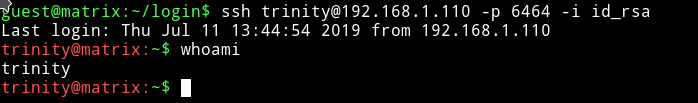

***

Thanks to @DCAU7 for helping with this. I was doing it all wrong I was copying the private key i.e `id_rsa` which shouldn't be the way.

It took me more than 2 hours to figure out a way to use `/bin/cp` for priv escalation.

***

After this I checked the `trinity's` sudo right.

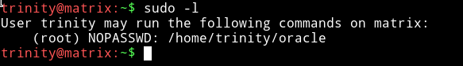

This shows that trinity can run `/home/trinity/oracle` with root privileges but the surprising thing is that there's no file name `oracle` in trinity's home directory.

I was again lost on this part. But then again the GREAT @DCAU7 saved me by givig a hint. He said `correct It doesn not exists` and thats when it clicked that if it doesn't then I can make it and it will be executed as `root`.

So I ran:

```bash
echo "/bin/sh" > oracle
```
chmod that and run it to get the root shell.

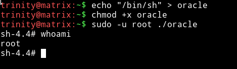

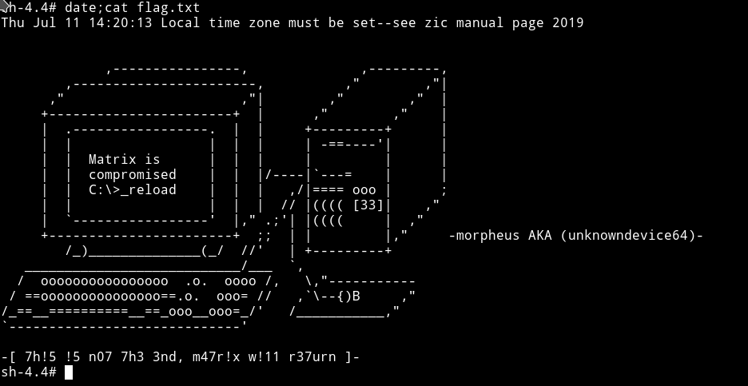


***

Took me more than a day to root it

***

Thanks to

* [@unknowndevice64](https://twitter.com/unknowndevice64) for making an awesome machine.
* [@DCUA7](https://twitter.com/DCAU7) for helping me out.


