# Summary

This is the very first machine in the DC series. I was easily able to hack this machine and tried to make a simple writeup so others can follow that up.

# Index

* [Enumeration](#enumeration)
    - [nmap scan](#nmap)
    - [HTTP Enumeration](#http)
* [Privilege Escalation](#privilege-escalation)

***

# Enumeration

## Nmap

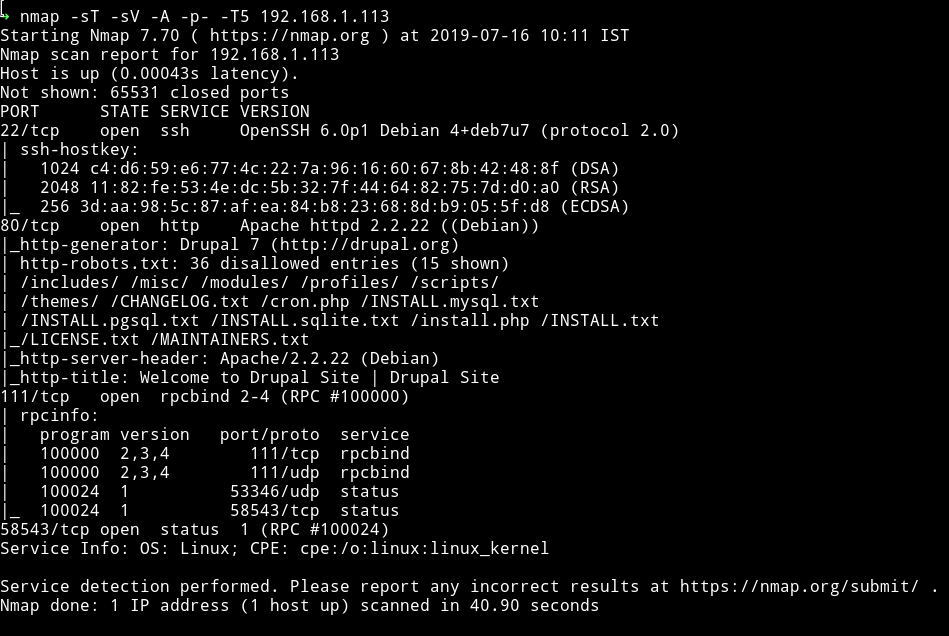

We got some usual port opened, Let's just start with the website since there are lot of entries in `robots.txt`

***

## HTTP

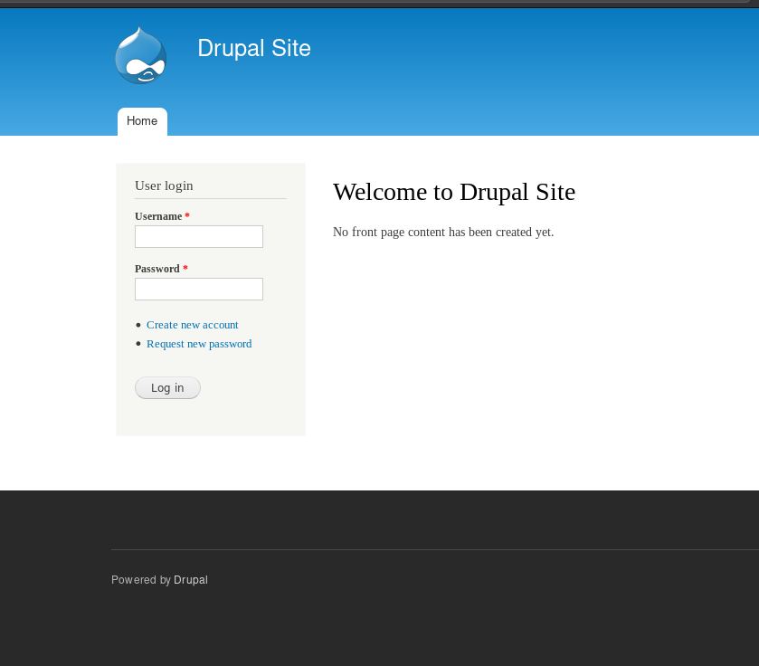

It's a drupal site. Good for me I haven't done any machine which be running  `drupal CMS`.

Found nothing in the source of the webpage.

Let's see if we can find anything interesting in the `robots.txt`

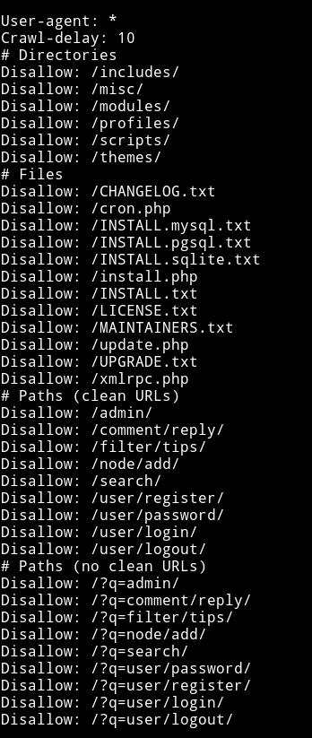

There was nothing interesting in any of the files.

So I decided to search exploit related to `Drupal` on metasploit.

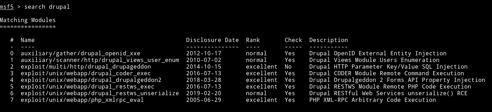

I first decided to use `exploit/unix/webapp/php_xmlrpc_eval` because I found the `xmlrpc.php` in the `robots.txt` file but it didn't worked.


After trying some exploit the `exploit/unix/webapp/drupal_drupalgeddon2` worked. It gave me `meterpreter` shell.

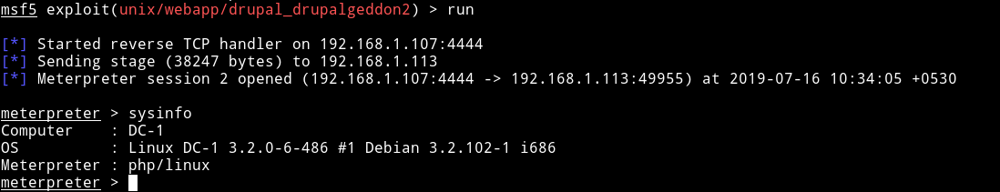

Then using the `shell` command I got shell, I spwaned the TTY shell using

```bash
python -c 'import pty; pty.spawn("/bin/sh")'
```

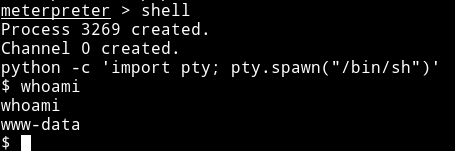

***

## Privilege Escalation

In the home directory I found a `flag4.txt` file so maybe I was supposed to find the other 3 flag ;)

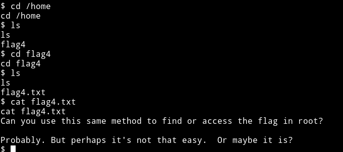

I downloaded the enumeration script from my system and I found a SUID which shouldn't be present with that permission.

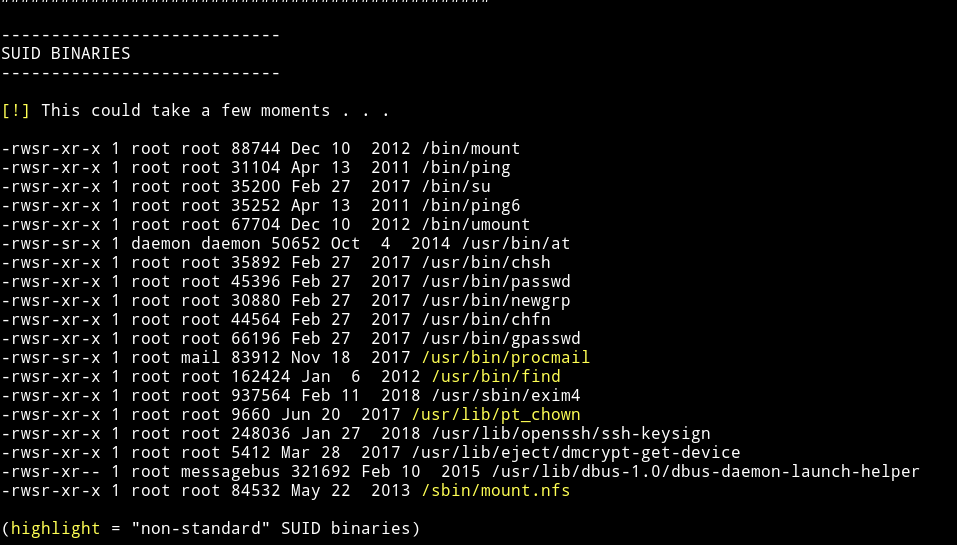

and on [gtfobins/find](https://gtfobins.github.io/gtfobins/find/) I found the command to get the root shell:

```bash
find . -exec /bin/sh \; -quit
```

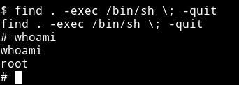

and then I got the root flag.

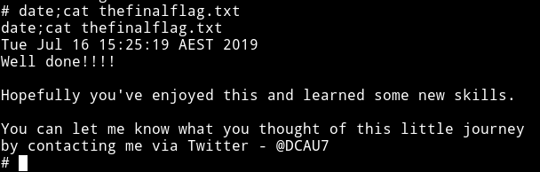

***

I was still curious about the `flag3` or `flag2` or `flag1` since I think I did it the unintended way. So using `find` command I found the `flag1.txt`

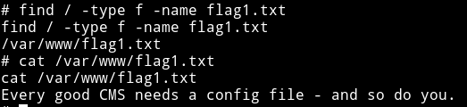

But I couldn't find any other flag on the system so I think that might be present on the `Drupal CMS` or somewhere else.

***

I have not found all the flags and have skipped 1 or 2 flags so if you are interested go ahead and hunt those down.
Thanks to [DCAU7](https://twitter.com/DCau7) for making this VM.

***

Thanks for reading, Feedback is always appreciated.

Follow me [@0xmzfr](https://twitter.com/0xmzfr) for more “Writeups”. And if you'd like to support me considering [donating](https://mzfr.github.io/donate/) 😄
