# Summary

Second machine in the DC series and this includes bruteforcing Wordpress credentials. This writeup will take you through each step of rooting this machine.

# Index

* [Enumeration](#enumeration)
    - [nmap scan](#nmap)
    - [HTTP Enumeration](#http)
    - [Wordpress](#wordpress)
* [Privilege Escalation](#privilege-escalation)

## Nmap

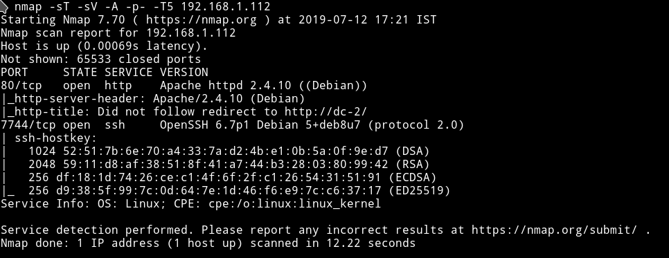

Let's see what we can find on the website.

***

## HTTP

Edit the `/etc/host` file and then visit the website.

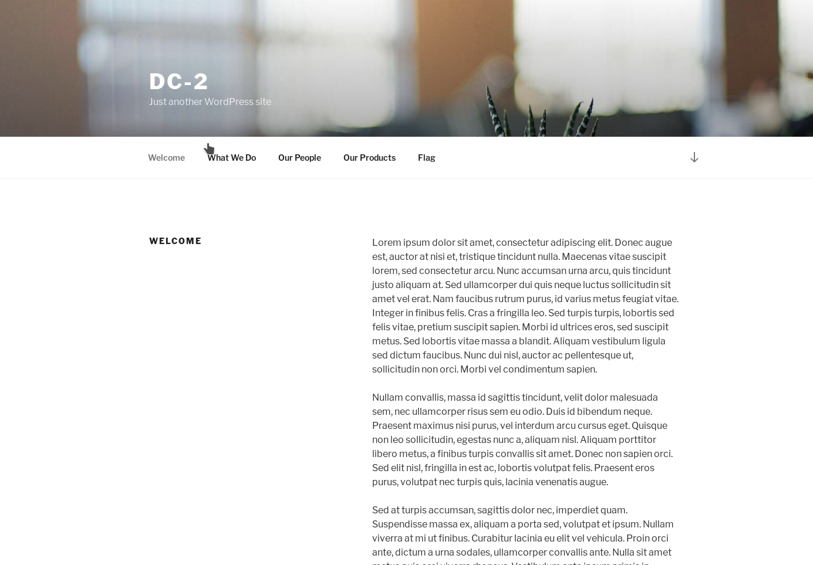

It's a wordpress website. Instead of running any tool like gobuster let's just run `wpscan`.

I got some users:

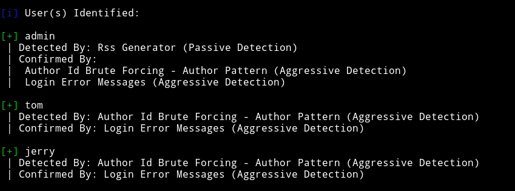

and some vulnerabilities:

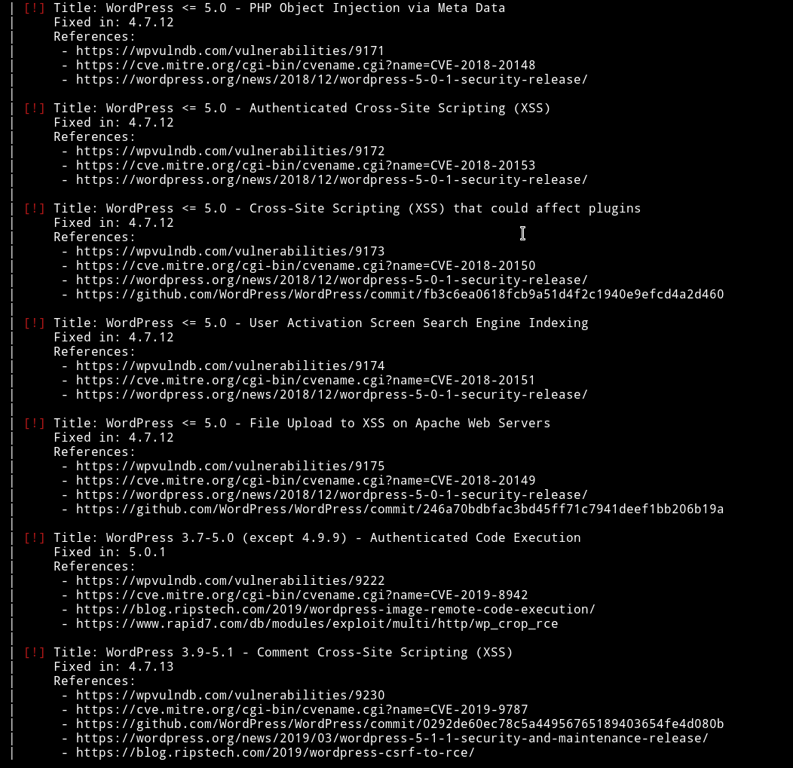

None of the vulnerabilities looks usable since they need authentication.

***

After looking around a bit I found a message on `http://dc-2/index.php/flag/`

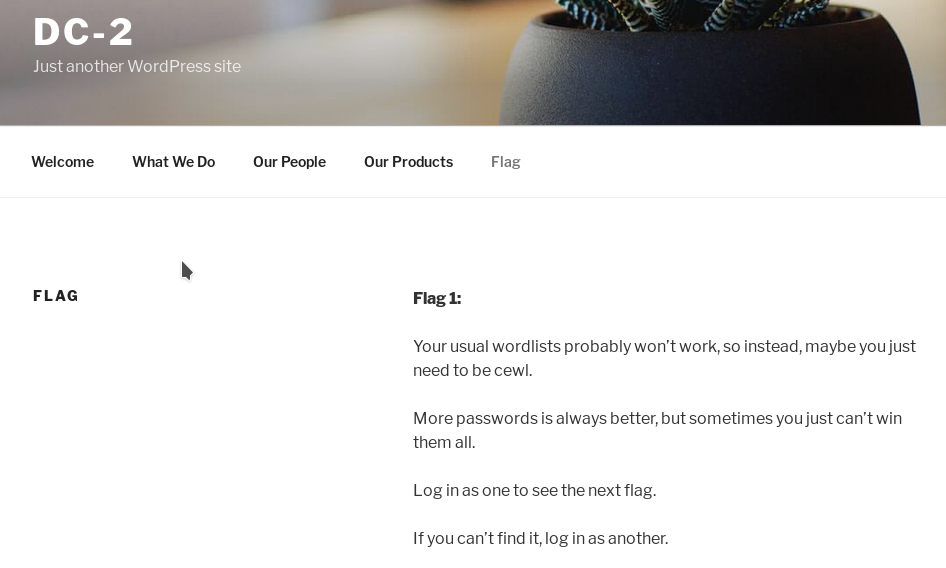

So we can use [CeWL](https://github.com/digininja/CeWL) to generate the password list and then try it with wpscan.

Run: `➜ ruby cewl.rb http://dc-2/ > passwords.txt` and pass that list to `wpscan`

I first tried it's with `tom` and got the correct password.

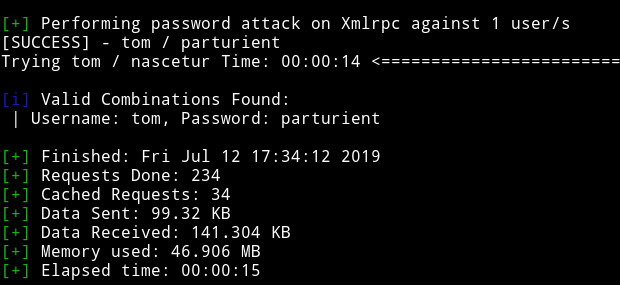

`tom / parturient`

and surprisingly I also found `jerry's` password.


`jerry / adipiscing`

So I tried to see if I can find the `admin` password but nope there wasn't any match for that ;)

***

## Wordpress

After login using `jerry's` credentials I found a page called `flag-2`

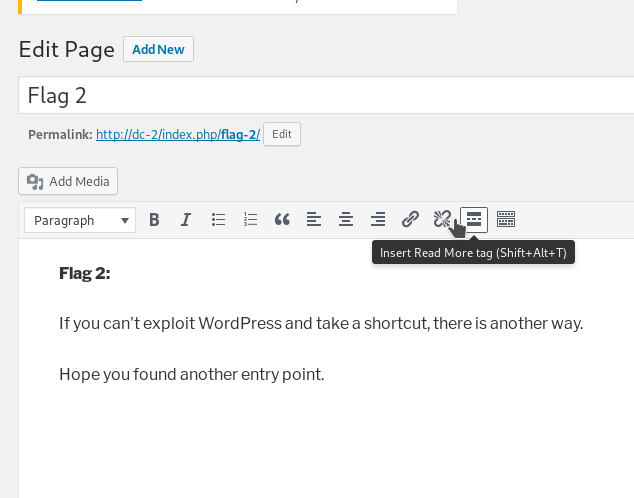

We can't exploit this because there are no templates or themes to edit to run our reverse shell.

The message on that page is referring to `SSH` service. Because that is the only remaining entrypoint.

Let's see if we can login using credentials we found via `SSH`.

***

## Privilege Escalation

I couldn't login using `jerry` credentials but I was in using `Tom's`.

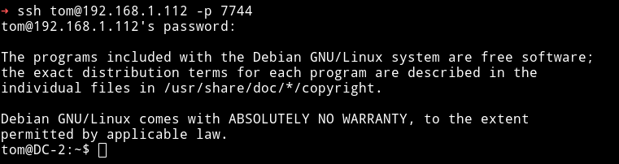

But when I tried running commands like `whoami` or `cat` it gave `rbasg` error.

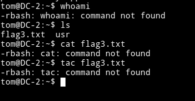

So I used `vim` trick i.e

* run `vi`
* Then `:set shell=/bin/sh`

    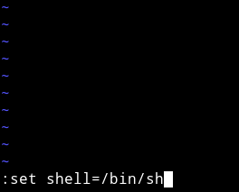

* Then `:shell`

    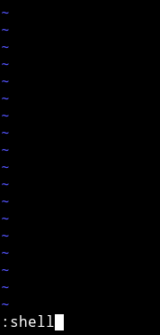

This will give us `shell` but I was still not able to run commands like `cat` etc

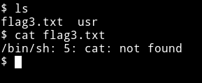

This could mean that `/bin/sh` might be missing from the `PATH`. We can run

```bash
tom@DC-2:~$ export PATH=$PATH:/usr/local/sbin:/usr/local/bin:/usr/sbin:/usr/bin:/sbin:/bin
```
This will fix the problem for us.

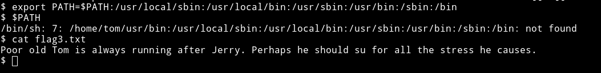

This says something about `su` command so we should try to change to `jerry's` account using the su command.

Since we already have a password for `jerry` i.e `adipiscing` we can su easily.

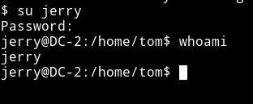

***

The first thing I checked was the sudo right for `jerry`

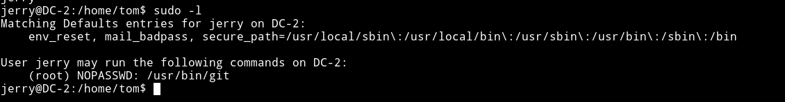

I found a way on [gtfobin](https://gtfobins.github.io/gtfobins/git/) to use `git` for privilege escalation.

We can run `sudo git -p help config` and when the output stops we can type `!/bin/sh` to get us a `root` shell.

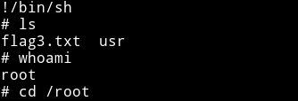

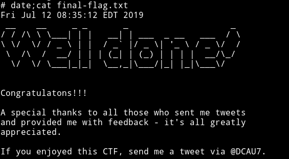

***

Had fun doing this one. Because I learned another way to escape rbash shell.

Thanks to [@DCAU7](https://twitter.com/DCAU7/) for this machine.

***

Thanks for reading, Feedback is always appreciated.

Follow me [@0xmzfr](https://twitter.com/0xmzfr) for more “Writeups”. And if you'd like to support me considering [donating](https://mzfr.github.io/donate/) 😄
