<h1 align="center" style="font-size:30px;">
  <br>
  <a href="https://www.vulnhub.com/entry/mission-pumpkin-v10-pumpkinfestival,329/">Pumpkin Raising</a>
  <br>
</h1>

<h4 align="center"> Author: <a href="https://twitter.com/askjayanth"> Jayanth</a></h4>

***

```
In this level (Level 3) it is time for Pumpkin Festival, the goal is to reach root and access PumpkinFestival_Ticket and collect PumpkinTokens on the way.
```

***

## Nmap

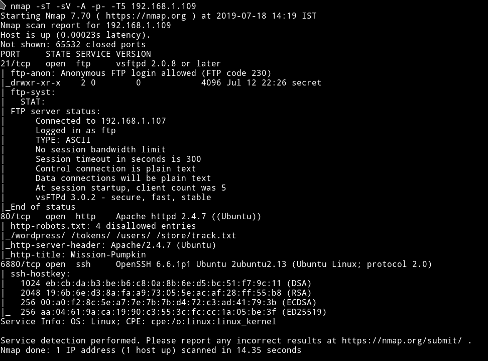

We have FTP on port 21 and it's allows Anonymous login. So let's just start with it.

***

## FTP

I got a token on the FTP server.

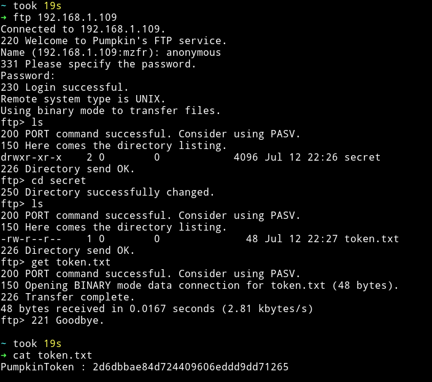

`PumpkinToken : 2d6dbbae84d724409606eddd9dd71265`

We got one token. Let's move on to HTTP

***

## HTTP

oh man....Again these beautifully designed websites :)

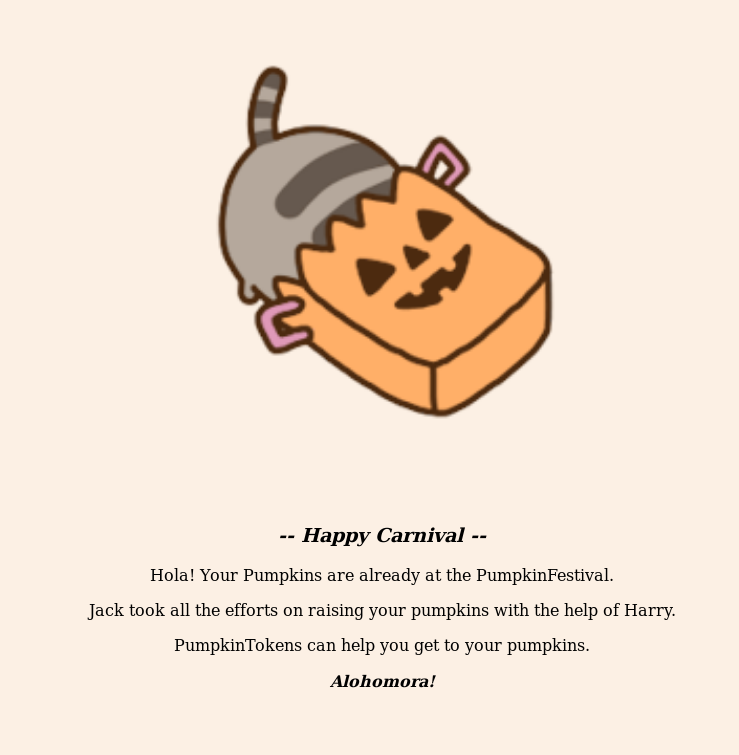

So the page says that we can use `PumpkinToken` to get to our pumpkins.

In the source of that page I found another token `PumpkinToken : 45d9ee7239bc6b0bb21d3f8e1c5faa52`.

Actually it's not in the source, it just the text for token is of same color as of website's.

We can see it on the page if we select all(`ctrl+A`).

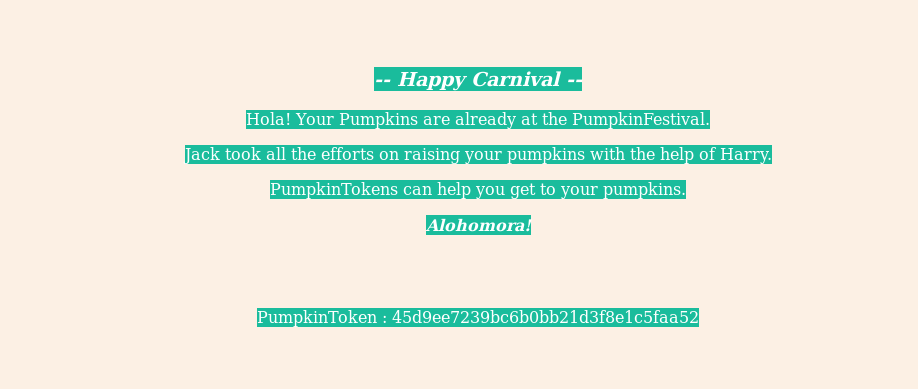

From nmap scan we know that there was a `robots.txt` present. Let's look into all those pages.

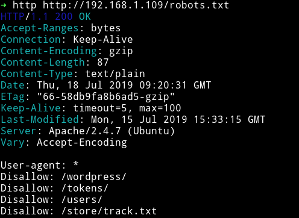

`/tokens/` and `/users/` were forbidden. `/wordpress/` was giving `404`

In `/store/track.txt` I found a note for tracking something

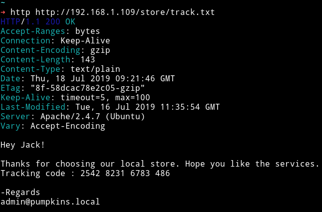

```
Hey Jack!

Thanks for choosing our local store. Hope you like the services.
Tracking code : 2542 8231 6783 486

-Regards
admin@pumpkins.local
```

I continued to look around the website but got nothing. I even tried to download the `cat.gif` and extract something out of it but got nothing.

Then it clicked to me there's a `wordpress` path on which we got `404` and in the `track.txt` we notice the email as `admin@pumpkins.local` so what if we edit out `/etc/hosts` and add the following line to it:

```
192.168.1.109 pumpkins.local
```

Well if we do that and try to visit `pumpkins.local` we get the damn wordpress website 😈😈😈😈


We got another token `PumpkinToken : 06c3eb12ef2389e2752335beccfb2080`

Now we can just use `wpscan` to see if we find anything on this blog.

***

From `wpscan` I got two users:

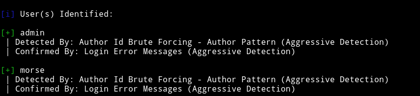

and found quite a few vulnerabilities

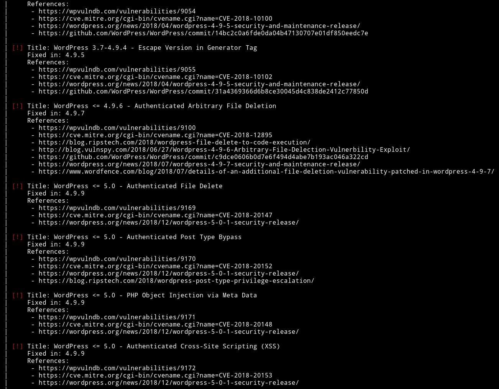

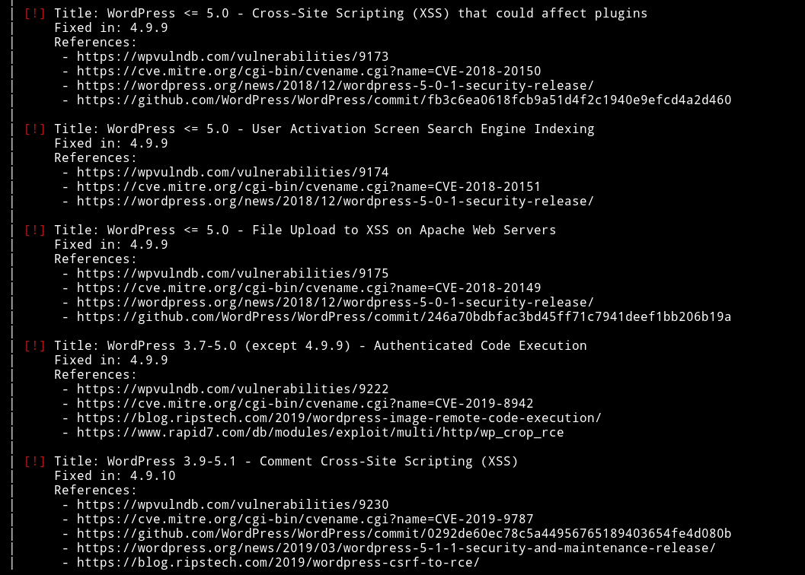

But all the vulnerabilities either need some kind of authentication or are useless to us.

After waiting for almost 3 days I was able to talk with the author and he gave me a hint. He said I need to focus on the FTP now.

***

## FTP (again)

This time we need to focus on something we found in the very starting i.e `Jack took all the efforts on raising your pumpkins with the help of Harry.`

I totatlly forgot about the name `Harry` we can find the password harry by bruteforce.

I ran hydra with:

```bash
➜ hydra -l harry -e nsr -P passwords.txt ftp://192.168.1.109
```

__Command Explanation__

* `-l`: For the specific username
* `-e`: it take `nsr` as args
    - `n`: null password
    - `s`: login as passwd
    - `r`: reverse the word used
* `-P`: password list.


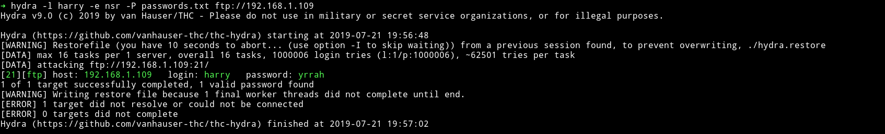

`harry:yrrah`

__Note__: In `-e` we only needed `sr` :)

This time we got another directory named `Donotopen`.

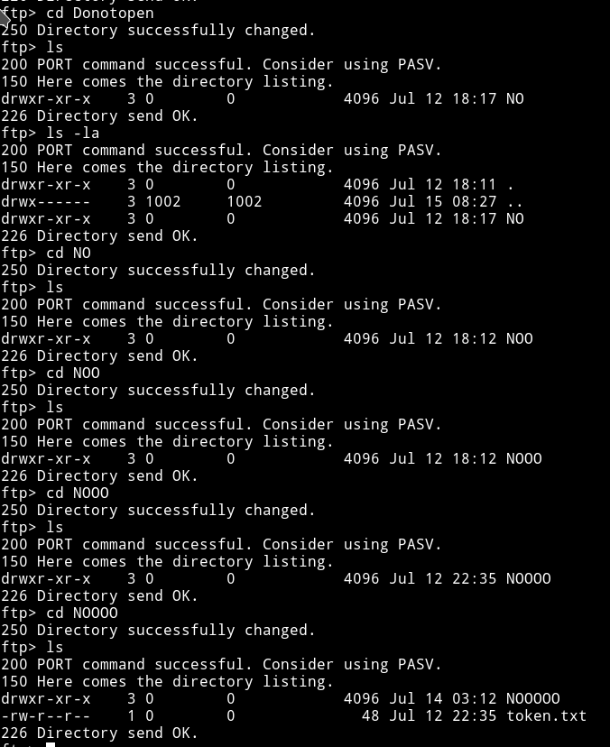

I `get` the token and then I continued with the `NO` thing and finally I got another file name `data.txt`

First I `cat` the 4th token

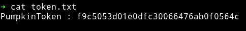

`PumpkinToken : f9c5053d01e0dfc30066476ab0f0564c`

When I `cat` the content of `data.txt` I got the output which looked like a binary but if we focus on the starting numbers they'll tell a different story

```
data000066400000000054051351244746700055630ustar00BZh91AY&SY
```

I recognized this to be a `tar` file because of that `ustar`.

__note__: Read [List_of_file_signatures](https://en.wikipedia.org/wiki/List_of_file_signatures)

I know this because I've done lot of these kind of challenges in `jeopardy` style CTF.

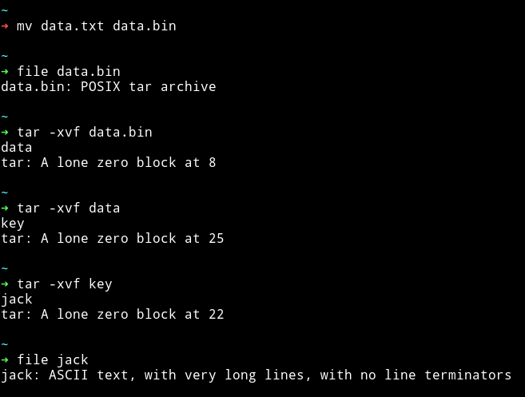

Now we've got a file named `jack` which contains the `hex` type values.


I used [cyberchef](https://gchq.github.io/CyberChef/) to decode that hex and it turned out it was a private key for `jack`.

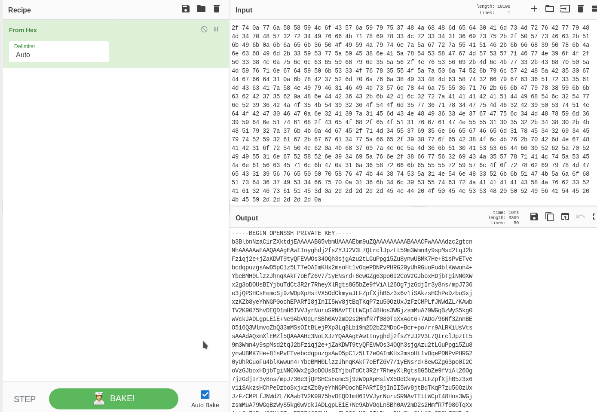

We can now just login into jack's account.

__Note__: Remember to `chmod 600` the `keyz`

I ran the enumeration script and found some user and SUIDs


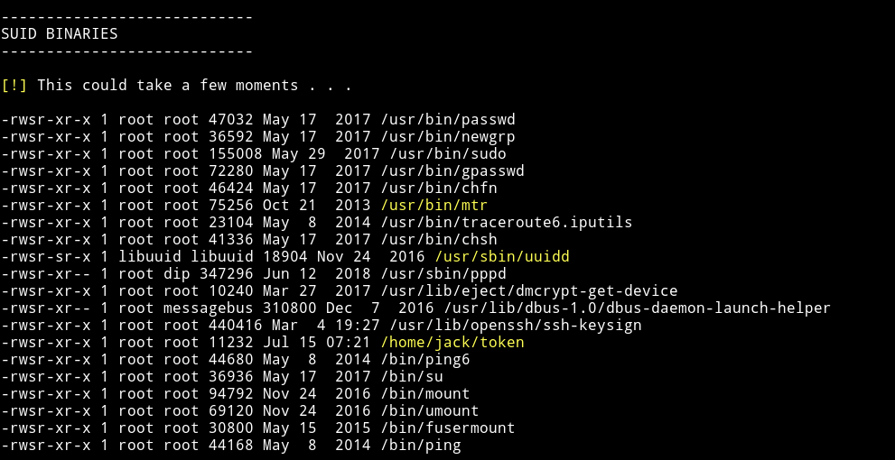

If we run the `token` SUID it will print out another token for us

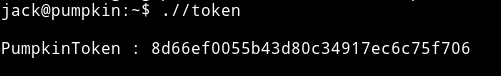

```
PumpkinToken : 8d66ef0055b43d80c34917ec6c75f706
```

I think this is it from here.

***

## HTTP (again)

Since I got nothing with `jack` account I decided to start HTTP again.

I started to enumerate the HTTP website but this time with some some file extensions

```bash
➜ gobuster -e -w CTFs/lists/directory-list-2.3-medium.txt -u http://pumpkins.local/ -x html,xml,php
```

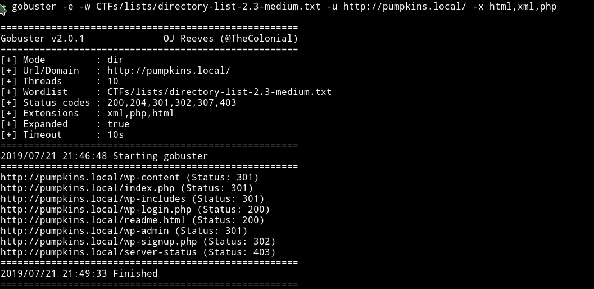

And on `readme.html` file I found a hash.

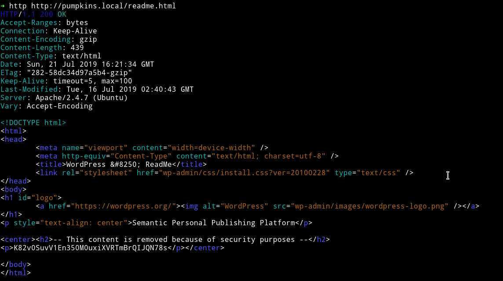

`K82v0SuvV1En350M0uxiXVRTmBrQIJQN78s`

This is a base62 encoded strings (again thanks to CTFs :-)

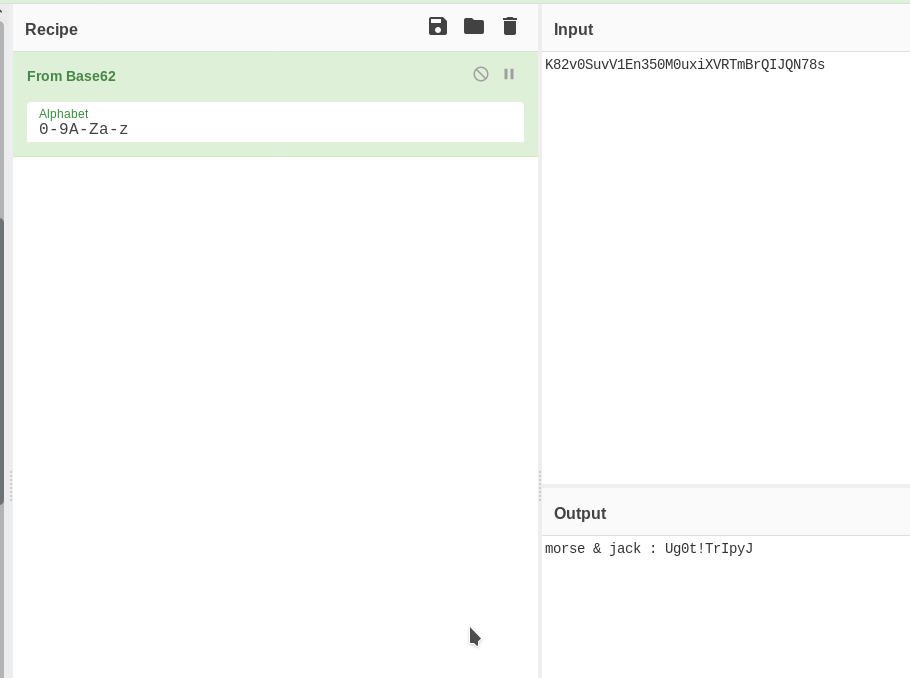

`morse & jack : Ug0t!TrIpyJ`

This looks like password for both the `morse` and `jack`. Let's try them on wordpress login i.e `wp-login.php`

After loggin into the wordpress I got a dashboard but there wasn't any theme editor so we can't get the reverse shell for `morse` account.

I used the password to check `jack` sudo right after login into the SSH

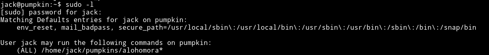

It says jack can run `/home/jack/pumpkin/alohomora` since this file doesn't exists we can just make it and with some shell in it and run it as sudo to get the shell.

```bash
$ mkdir pumpkins
$ echo "#!/bin/bash\n/bin/sh" > pumpkins/alohomora
$ sudo ./pumpkins/alohomora
```

This will give you the root shell and then just get the flag.

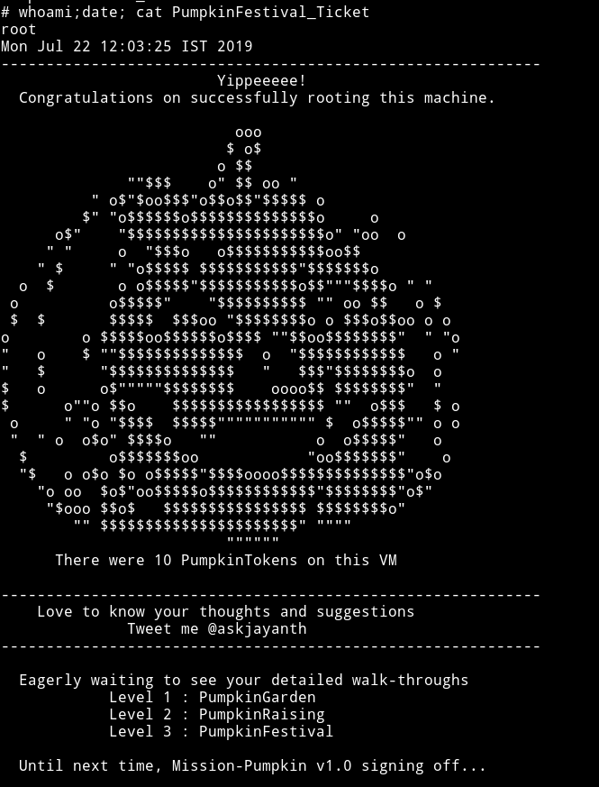

***

Thanks to [@jayanth](https://twitter.com/askjayanth) for making this amazing machine and thanks to [@andre](https://twitter.com/mrhenrike) for helping me.

***

Thanks for reading, Feedback is always appreciated.

Follow me [@0xmzfr](https://twitter.com/0xmzfr) for more “Writeups”.
