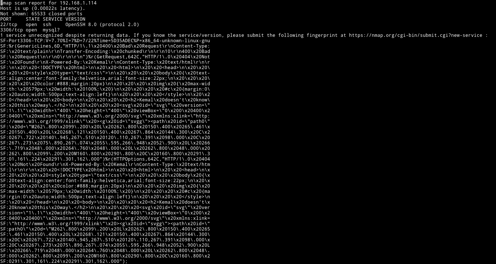
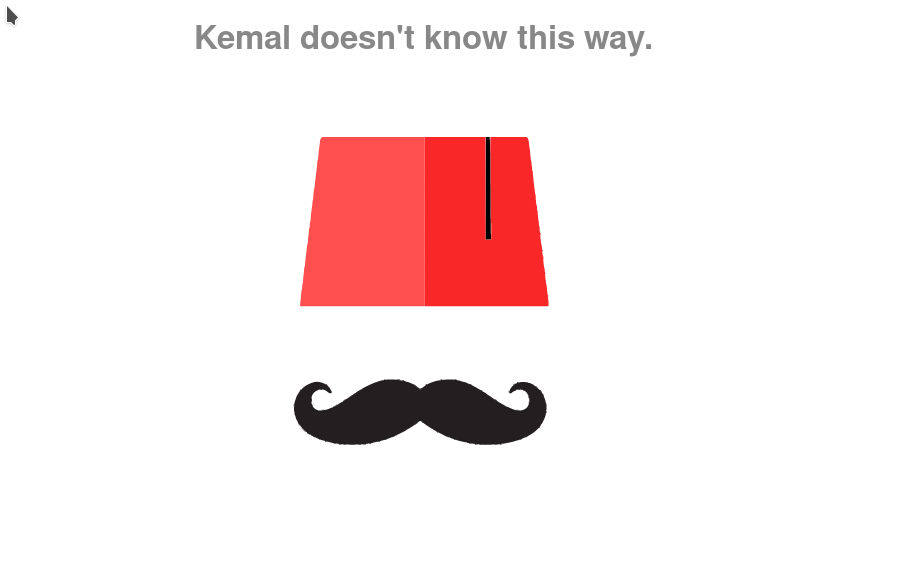
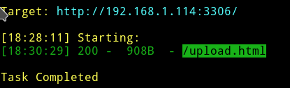
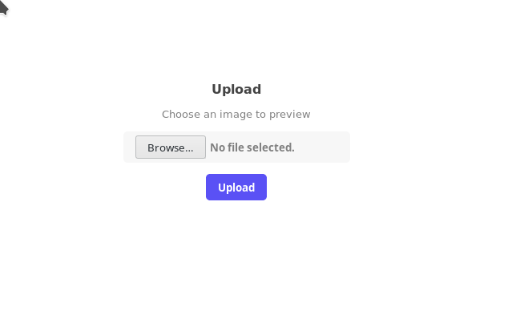
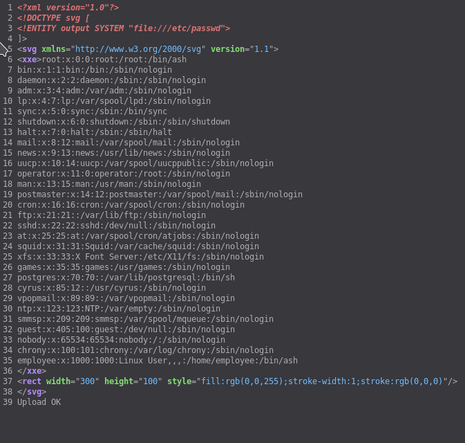
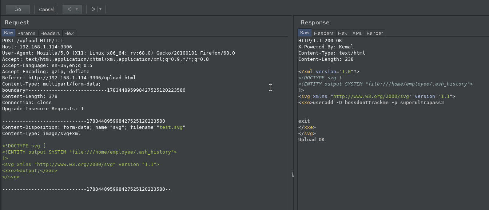
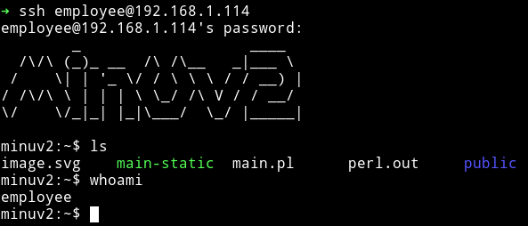
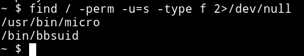
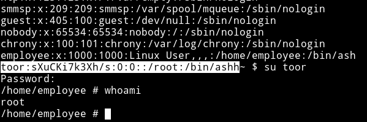
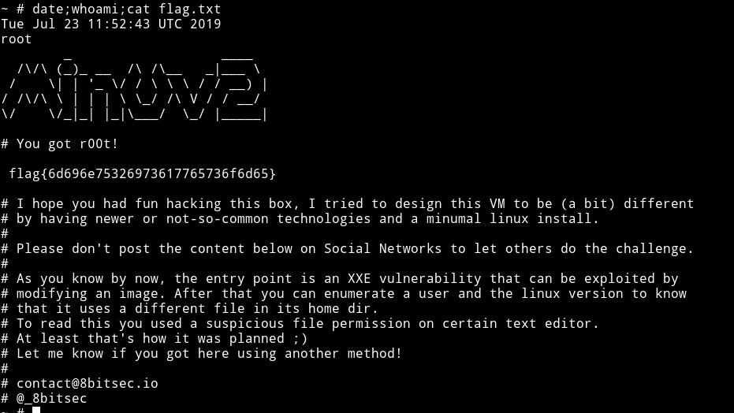

<h1 align="center" style="font-size:30px;">
  <br>
  <a href="https://www.vulnhub.com/entry/minu-v2,333/">MinU v2</a>
  <br>
</h1>

<h4 align="center"> Author: <a href="https://twitter.com/_8bitsec"> 8bitsec</a></h4>

## Nmap



Since only two ports are open let's just start with the `3306`

***

## HTTP



There was nothing in the source so I ran dirsearch on it.

```bash
➜ python dirsearch.py -f -r -R2 -u http://192.168.1.114:3306/ -e php,html,tar.gz,txt,bak,zip,gz
```



And on visiting the `/upload.html`



We can upload any image to preview it and since it take only `.svg` we can easily exploit this to get LFI/RFI.

***
__Stupid tries__

First I was trying to get reverse shell with this vulnerability. I was able to exploit it to get me a JS shell meaning I was able to run command like `alert(1)` and they were popping up on the browser. But since we can't do anything with just JS I was stuck on it for quite sometime.

Thanks to [@4ndr34z](https://twitter.com/4ndr34z) for helping me with LFI

***

To exploit the LFI with XXE we can use the following payload

```xml
<!DOCTYPE svg [
<!ENTITY output SYSTEM "file:///etc/passwd">
]>
<svg xmlns="http://www.w3.org/2000/svg" version="1.1">
<xxe>&output;</xxe>
<rect width="300" height="100"
style="fill:rgb(0,0,255);stroke-width:1;stroke:rgb(0,0,0)" />
</svg>
```

When you upload that file you'll get the content of the `/etc/passwd` in the source of the page.



Since we are sure that it's LFI we can use burp to find some important files to include so we can read some information from them.

***

I was stuck here for hour because I didn't read the `/etc/passwd` file output properly. The users are using `/bin/ash` meaning we will have to find something related to that shell. I kept on looking for `.bashrc` or `.bash_history` 🤦‍♂️🤦‍♂️🤦‍♂️🤦‍♂️

***


If we look at `.ash_history` file we'll see something very juicy.



`useradd -D bossdonttrackme -p superultrapass3`

We can login into `employee` account with the `superultrapass3` password.

***

## Privilege Escalation

I logged into the `employee` account via SSH



It's enumeration time but my normal enumeration script didn't worked due to change in syntax. So I manually started checking things, there was no `sudo` command in `ash` so no sudo right thing.

I then searched for SUIDs

```bash
find / -perm -u=s -type f 2>/dev/null
```



Here we see that `micro` which is a text editor is setup as `SUID`. I first thought that I'll be able to run commands in it just like `vim` but it didn't worked then @DCUA7 suggest to edit the `/etc/passwd` file to add an entry.

So I ran the following command

```bash
$ cat /etc/passwd | micro
```

And then added the following entry

```
toor:sXuCKi7k3Xh/s:0:0::/root:/bin/ashh
```

__NOTE__: Notice the extra `h` in the end of that line, I added this because when I add `toor:sXuCKi7k3Xh/s:0:0::/root:/bin/ash` I got error saying I can't run `as` because there isn't any such file so I just thought that for some reason the last char is being ignored so I added an extra `h`.

After this you can `su toor` with `toor` as the password and you'll be `root`





***

This is really really amazing machine. I wasted so many hours on this just because I made so many mistakes but I learned lot of new tricks in this one.

Thanks to [@_8bitsec](http://twitter/_8bitsec) for making such an awesome machine and thanks to [@4ndr34z](http://twitter/4ndr34z) and [@DCUA](http://twitter/DCUA7) for their help.

***

Thanks for reading, Feedback is always appreciated.

Follow me [@0xmzfr](http://twitter/mzfr) for more “Writeups”.
