<h1 align="center" style="font-size:30px;">
  <br>
  <a href="https://www.vulnhub.com/entry/digitalworldlocal-joy,298/">digitalworldlocal-Joy</a>
  <br>
</h1>

<h4 align="center"> Author: <a href="https://donavan.sg/blog"> Donavan</a></h4>

## Nmap

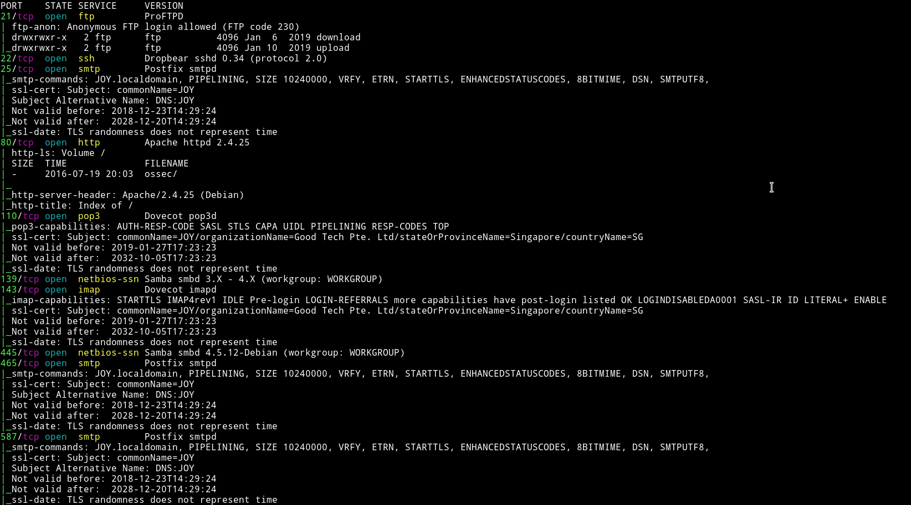

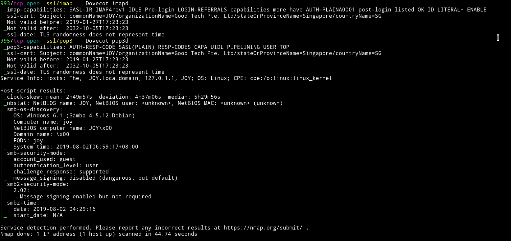

DAMN!!!... Insane amount of ports are opened.

We have `FTP`, `SMB`, `HTTP` and `email` services running. Since FTP allows anonymous login let's start with that.

***

## FTP

After logging in I found two directory. One of them was empty and another was quite full.

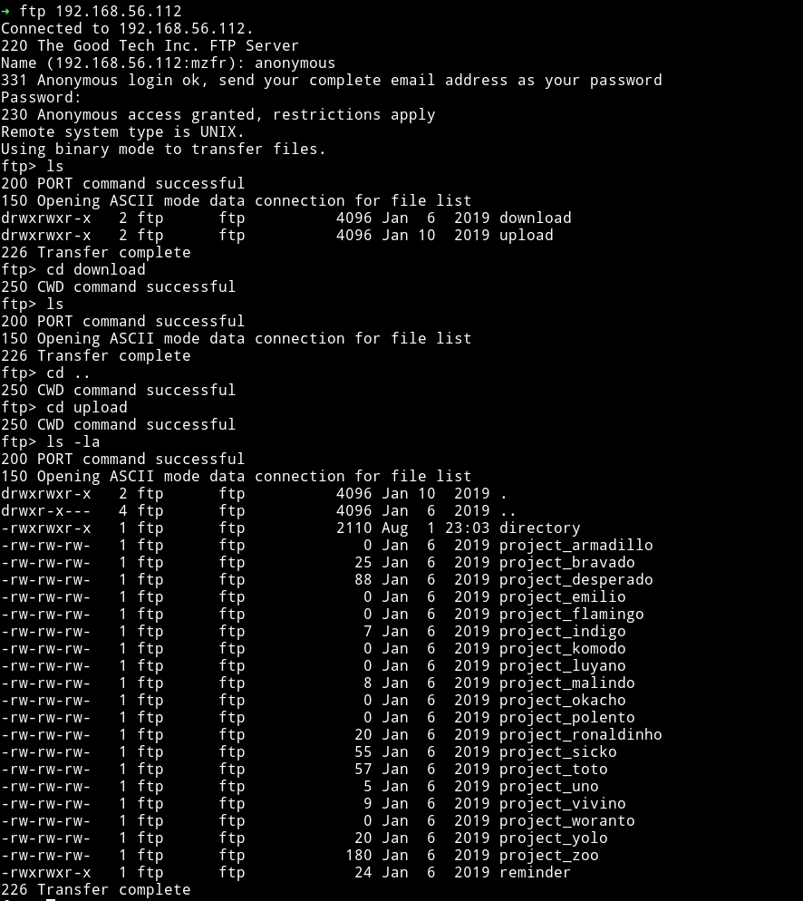


Let's get all those files and see what we can find in them.

When I `cat` all the project file I got something that made sense and something that didn't.

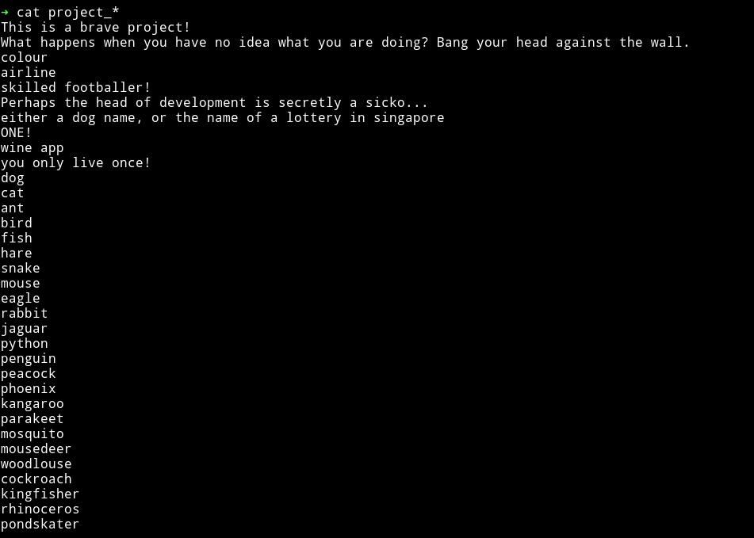

In the `directory` file I found the output of `ls -la` in a directory.

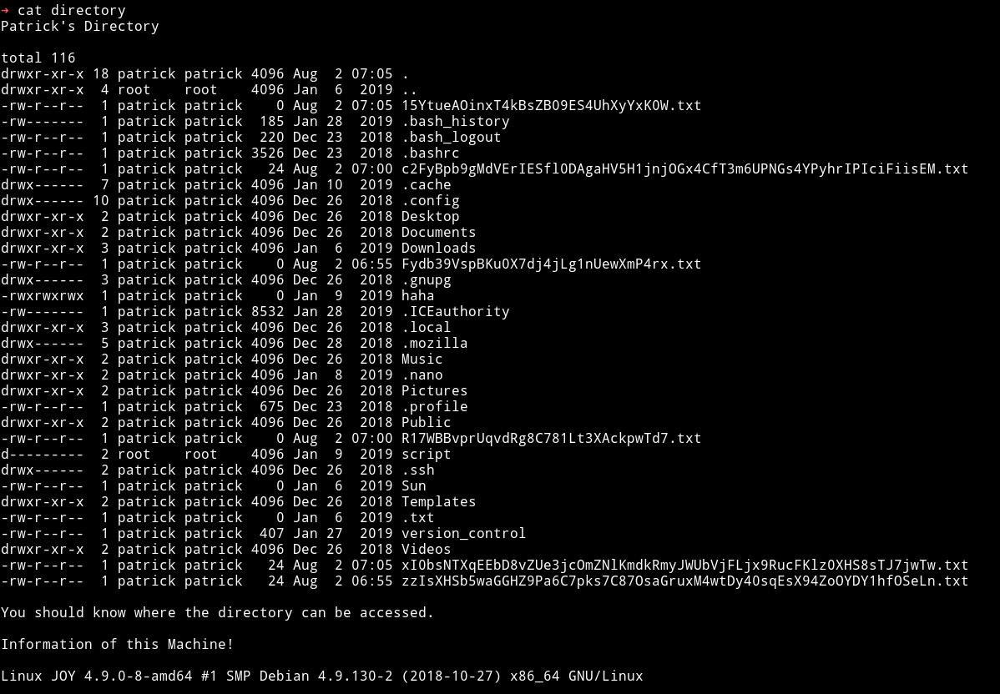

and in the `reminder` file I got a `reminder`

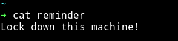

One thing to notice here is that we have `read/write` permission in `/upload` directory. So maybe we can use `cpfr & cpto` command to get the files from the `patrick's` home directory to there and then find some information.

To do so connect to FTP using `telnet` i.e `telnet IP 21` and use the following commands:

```bash
site cpfr /path-of-file/folder-to-copy
site cpto /path-where-to-copy
```
Since we can see a folder named `.ssh` we can simply copy that folder to `/upload` directory in FTP to get the SSH key.

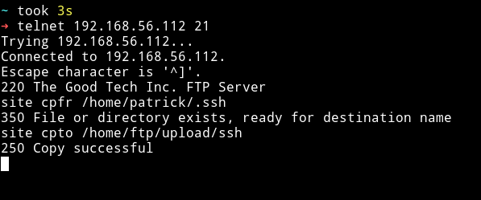

But that didn't worked because the folder I got was empty so maybe that is just redherring.

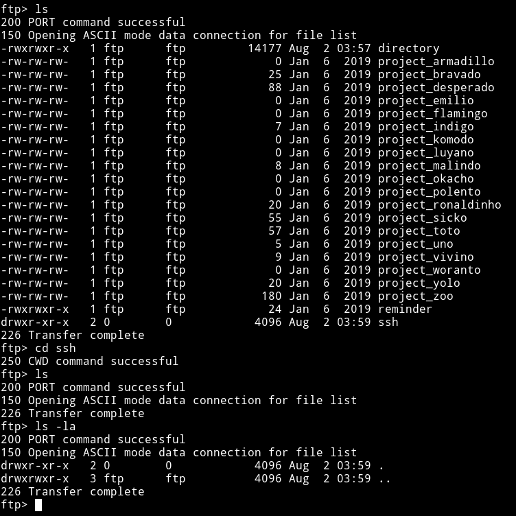

The next file/folder that looked worth of something was `version_control`. It might contain some information about the FTP version.

__NOTE__: If you haven't noticed yet then let me tell you. We can't see the version of FTP running. If you look at the nmap scan there is no version mentioned. When we connect to `ftp` we can see a version banner. If we try to run `status` command after connecting even then the line that contains the version is missing.

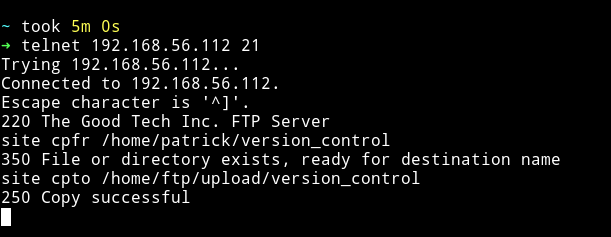

I downloaded the file after copying it.

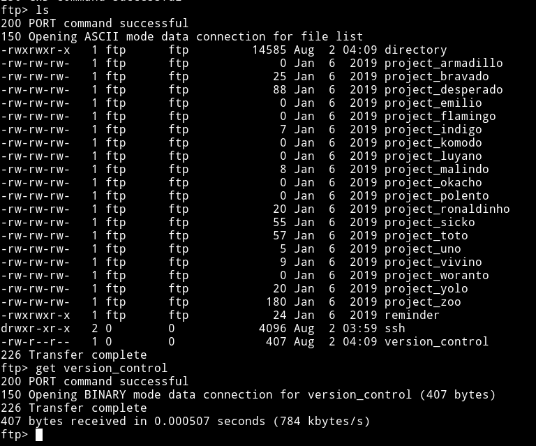

That file contained a note about ProFTPd and it's version.

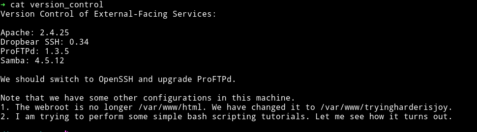

The whole message is kind of refering to `exploiting FTP`like the `We should switch to OpenSSH and upgrade ProFTPd.`

I used `searchsploit` to find the exploit for it and saw that there is one for `metasploit.`


We can run `msfconsole` and then look for the exact one to use.

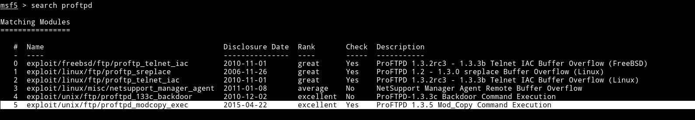

I changed the RHOSTS and SITEPATH in the exploit options


After running this exploit I got a shell

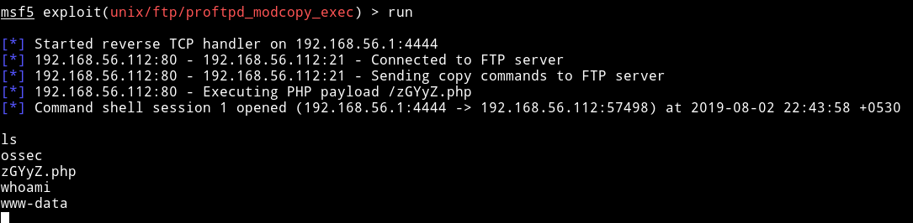

We can run `python -c 'import pty; pty.spawn("/bin/sh")'` to spwan a TTY shell.

***

## Privilege escalation

I decided to first checkout the `ossec` folder to see if I can find any config file with password or something like that.

I found file name `patricksecretsofjoy` which had credentials for users.


```
credentials for JOY:
patrick:apollo098765
root:howtheheckdoiknowwhattherootpasswordis
```

yeah for a second I thought that this is actually the `root` password and the first thing I tried was `su root` but it didn't work.

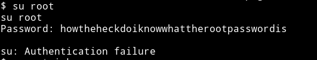

But the password for `patrick` account worked and I was able to escalate from `www-data` to `patrick`.

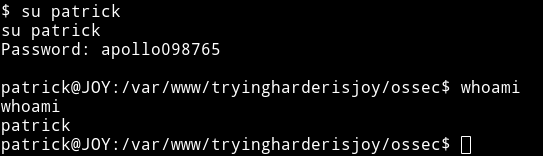

***

After that I checked whether `patrick's` sudo right by running `sudo -l`

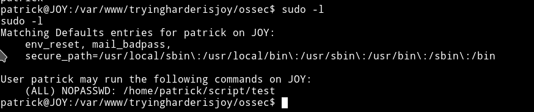

I tried `cd` into the `/home/script` but I got permission denied.

I ran `sudo -u root ./script/test` and got some weird output:

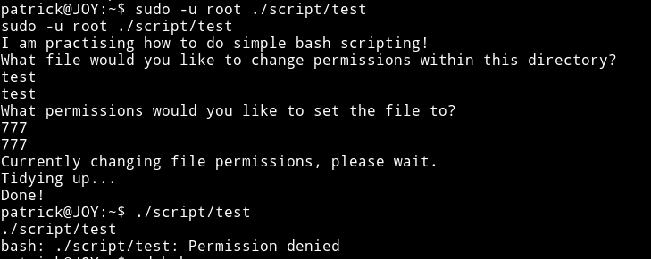

But as we can see it didn't do what it said it will do.

One thing I was sure of was that we'll have to exploit this `test` file. It took me a while to figure out how to actually do it.

We can use ftp `cpfr & cpto` to place a file into the script directory and if that works we can get the shell.

I made a file named `test` by running:

```bash
➜ echo "/bin/sh" > test
```

I then placed the file in the `/upload` folder on FTP

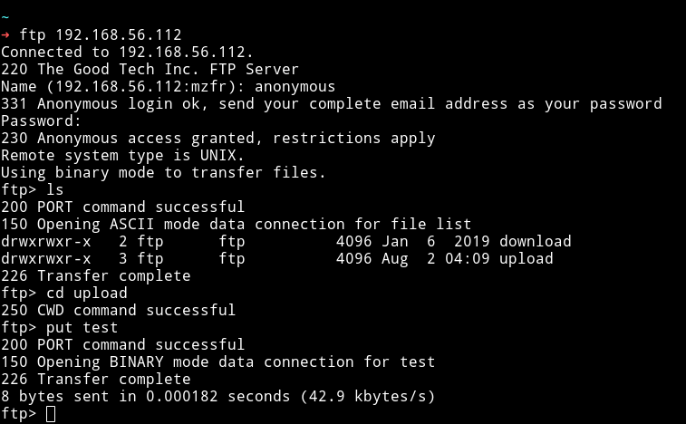

Now we can use telnet to transfer to `/home/script` folder.

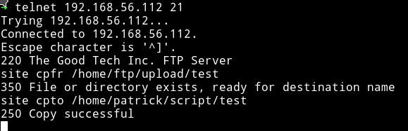

I was scared that this might fail 😌😌

Now we can just execute this file as `sudo ./script/test` to get the root shell.

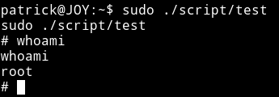

And then we get the root flag.

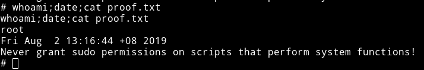

Also the `author's secret`

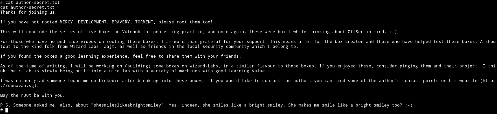

***

This was really good machine, I mean so many ports were opened and all we needed was FTP.

Thanks to [Donavan](https://donavan.sg/blog) for this joyful machine ;-)

I will be doing all the other machines for sure because this one was really a JOY.

***

Thanks for reading, Feedback is always appreciated.

Follow me [@0xmzfr](https://twitter.com/) for more “Writeups”.
