<h1 align="center" style="font-size:30px;">
   
  <a href="https://www.vulnhub.com/entry/westwild-11,338/">WestWild:1.1</a>
   
</h1>

<h4 align="center"> Author: <a href="https://twitter.com/hashimalshareff">  Hashim Alsharef</a></h4>

## Nmap

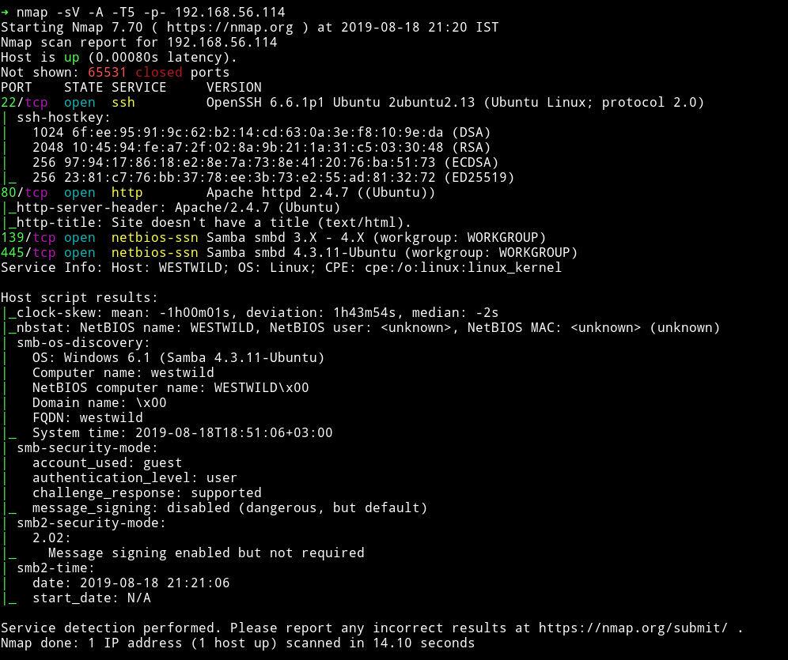

Okay so other then HTTP and SSH we have SMB. So let's just start with that.

***

## SMB

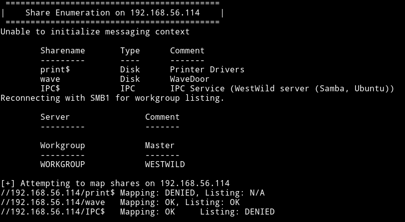

So I logged into the `wave` share and found 2 files there.

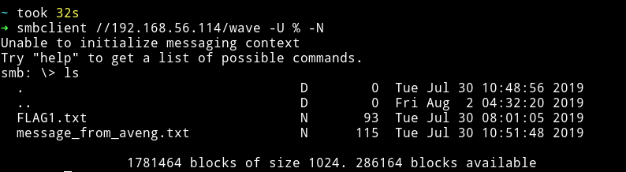

I downloaded both the files by using the `get` command.

The `FLAG1.txt` had the first flag and credentials for the user `wavex`

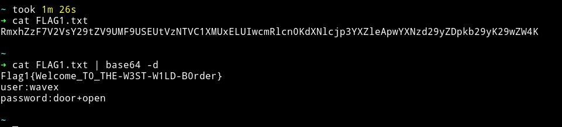

`wavex:door+open`

And the message file had a message ;-)

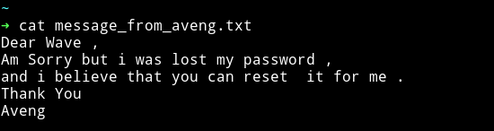

***

## Privilege escalation

With the credentials we found in `FLAG1.txt` we can login via SSH.

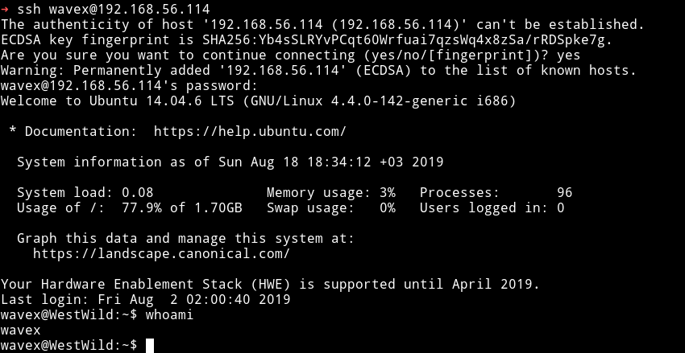

Since I was in the system I ran the enumerations script but found nothing interesting. I tried to check the `sudo` right with `sudo -l` but `wavex` didn't had any.

Then I decided to check all the directories that are editable by `wavex`

* `find / -writeable -type d 2>/dev/null`

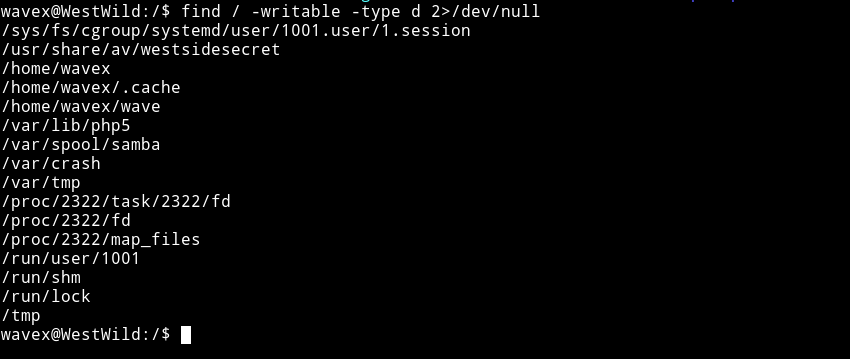

There was this interesting dir `usr/share/av/westsidesecret/`. In there I found a file which had credentials for `aveng`.

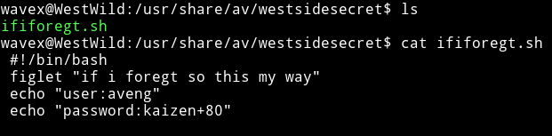

`aveng:kaizen+80`

I `su` to `aveng` using the credentials.

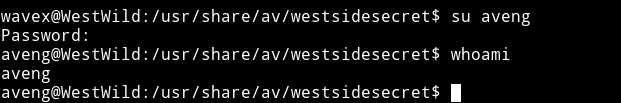

Then I checked it's `sudo` rights and this user was allowed to run all the command.

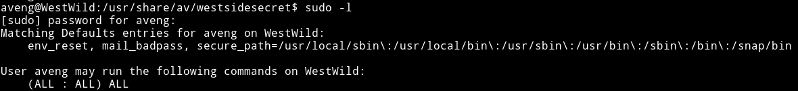

So I did `sudo su` to become root.

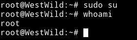

Now get the damn flag.

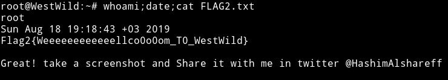

***

It's definitely a good box for beginners, especially getting the root part should be fun.

Thanks to [@hashimalshareff](https://twitter.com/hashimalshareff) for this cute little box :-)

***

Thanks for reading, Feedback is always appreciated.

Follow me [@0xmzfr](https://twitter.com/0xmzfr) for more “Writeups”.
