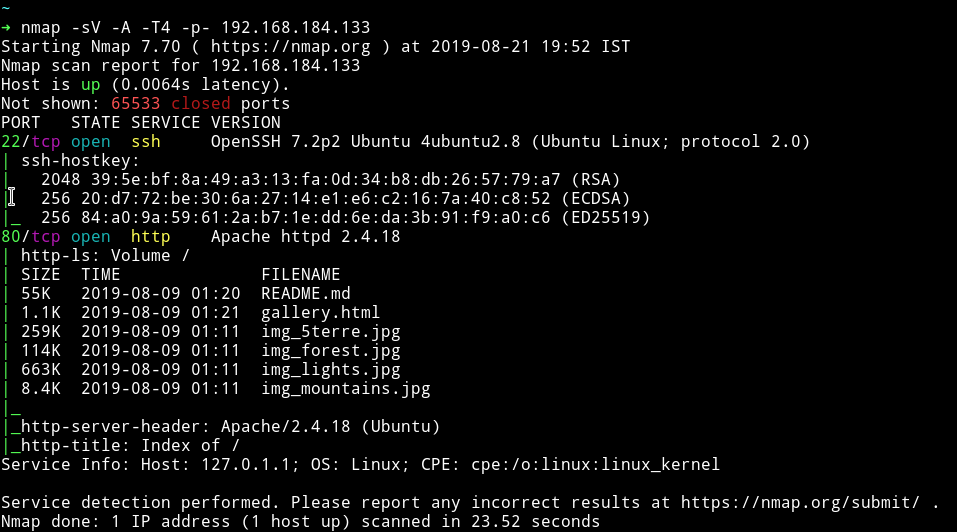
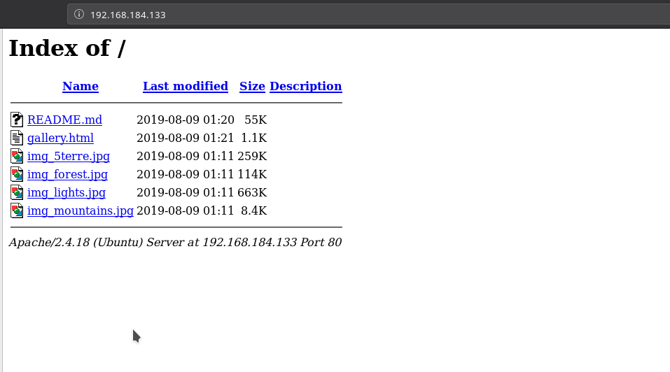
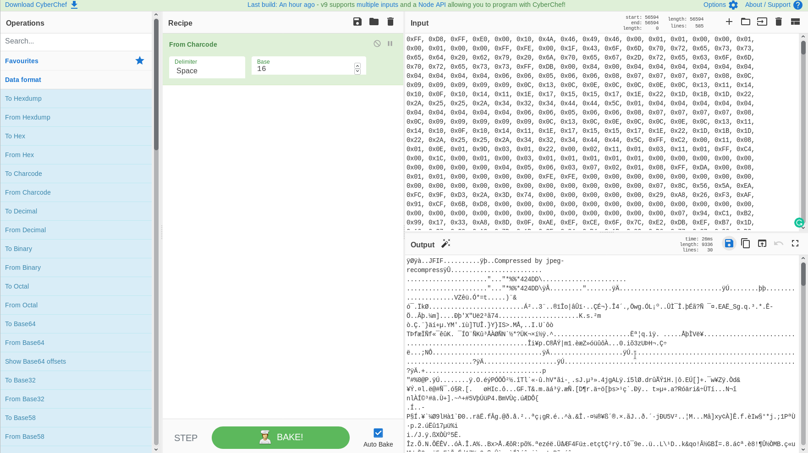
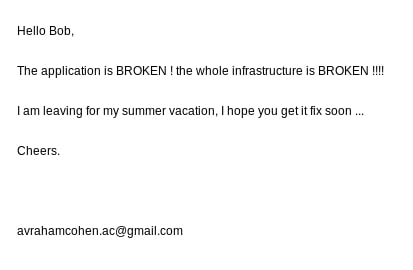
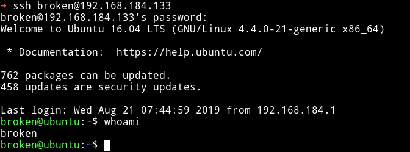
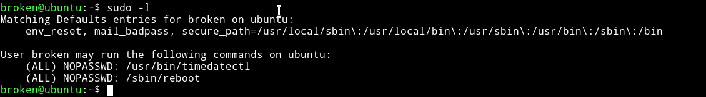
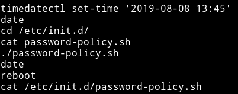
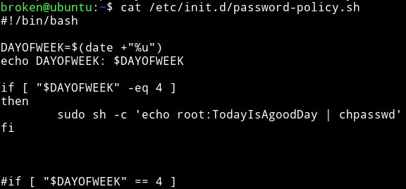
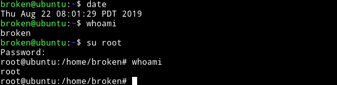
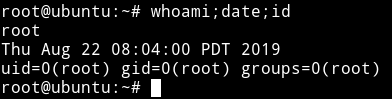

<h1 align="center" style="font-size:30px;">
  <br>
  <a href="https://www.vulnhub.com/entry/broken-gallery,344/">Broken: Gallery</a>
  <br>
</h1>

<h4 align="center"> Author: Avraham Cohen</h4>

## Nmap



Only two ports are open. We'll just start with HTTP service.

***

## HTTP



There are multiple images and a readme file. I tried doing some steganography on the images to see if I can find anything but got nothing.

I ran dirsearch on the website to see if we can find any hidden page but nothing.

Then in the source of `gallery.html` I noticed `Readme.md` being refered.
So I decided to shift my focus on the Readme file. It seemed like hex values so I used [CyberChef](https://gchq.github.io/CyberChef/) to decoded them as hex but it gave some junk data.

Then I tried to decoded it with `charcode` and I got out data which was a `JPG` file.



I downloaded it and this is what that image looked like



Since it gives us a username `Bob` I decided to try to login as `bob` on SSH with random passwords like `Broken` or `Mountain` etc. Then I decided to change the username from `bob` to `broken` since the image we recovered emphasize on the word `Broken` and the creds `broken:broken` finally worked.



***

## Privilege escalation

Instead of running any enumeration script the first thing I checked was `sudo` rights. The user `broken` could run `reboot` and `timedatectl`.



I tried searching `gtfobin` for any of those but couldn't find any.

So I kept looking around and in the `.bash_history` I found some interesting command.



There is a file name `password-policy.sh` in `/etc/init.d/password-policy.sh`.

I `cat` that file and found creds for root



`root:TodayIsAgoodDay`

If you try to `su` to root account with these creds it won't work 😄😄
The script says that If the current `DAYOFWEEK` is `4` i.e `Thursday` the credentials will become what we found. Basically we need to use `timedatectl` to change the `DAYOFWEEK` and then `reboot`.

```bash
$ sudo timedatectl set-time '2019-08-22 07:56'
```


Now run `sudo reboot` to reboot the machine.


__NOTE__: After running the `reboot` command you will be disconnected from the machine. reconnect to machine and use the credentials we found for root.

I SSH into the machine, again and then just `su root` using the password `TodayIsAgoodDay`.





***

It's an easy machine but I liked the Privilege escalation. It was very new and interesting. Thanks to Cohen for this machine.

***

Thanks for reading, Feedback is always appreciated.

Follow me [@0xmzfr](https://twitter.com/0xmzfr) for more “Writeups”.
