<h1 align="center" style="font-size:30px;">
  <br>
  <a href="https://www.vulnhub.com/entry/westwild-2,351/">WestWild: 2</a>
  <br>
</h1>

<h4 align="center"> Author: <a href="https://twitter.com/hashimalshareff">  Hashim Alsharef</a></h4>

## Nmap

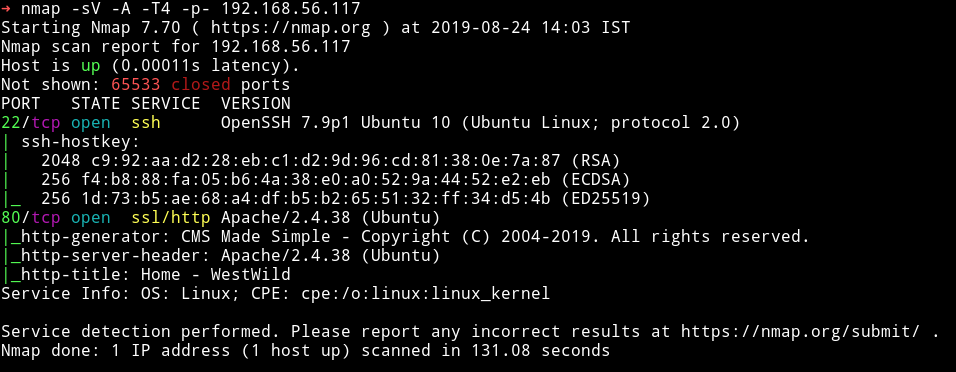

There are only two ports open. We'll start our enumeration from HTTP(port 80)

***

## HTTP


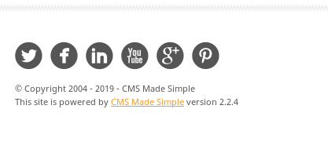

There's a `CMS made simple` running with version `2.2.4`

I used gobuster to enuemrate this and there were lot of directories.

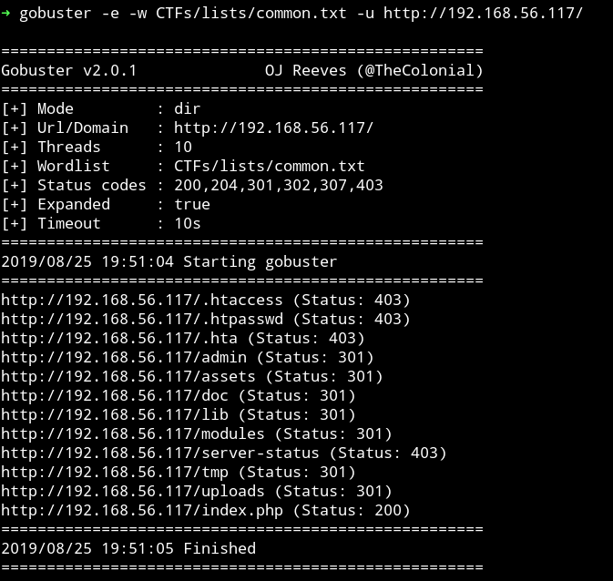

And in `admin/` I found a directory listening named `aspadmin`,

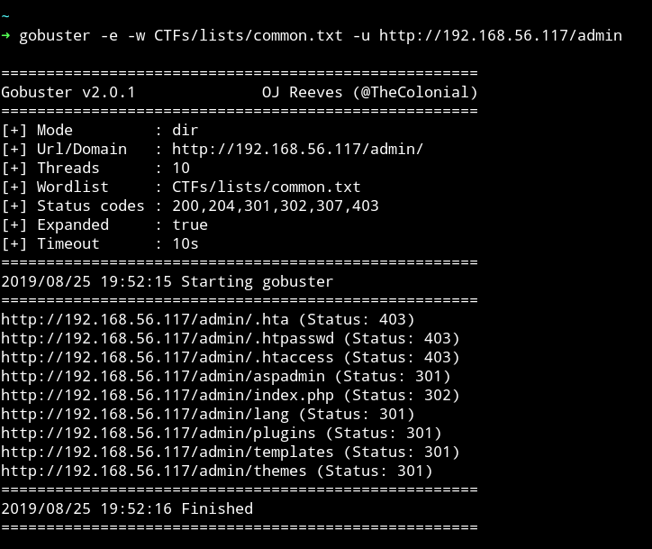

This dir had two files named `password.list` and `user.list`


I used burp suite's Intruder to bruteforce the login for the CMS.
Since the `username` list was small I decided to use the username that made sense to me i.e `west` because of the name of the machine.

With username set to `west` I loaded the password list in the Intruder and started the attack.

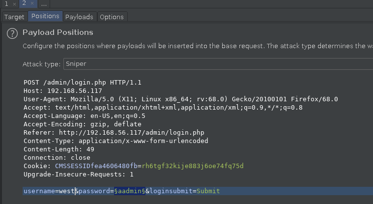

After waiting for a while I found the creds so my hunch was right about the username.

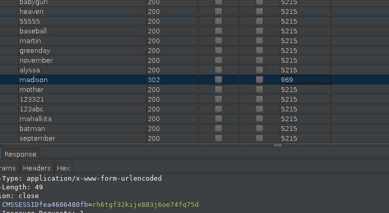

***

## Exploitation

I logged in with those credentials and found that there was a plugin installed named `showtime2`.

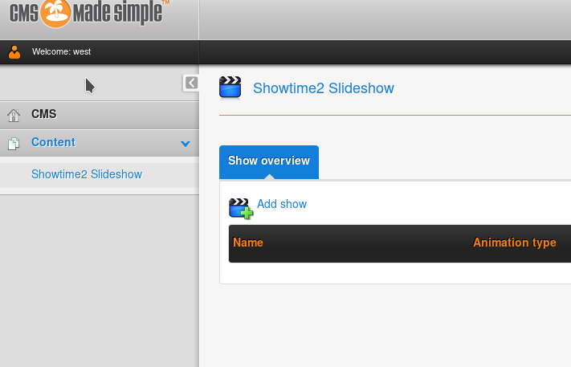

I searched it with `searchsploit` and found one with metsploit.

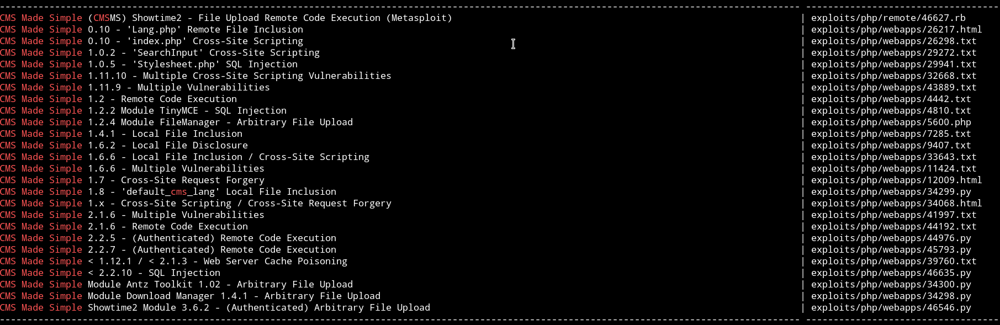

I run msfconsole and used that exploit with the following options:

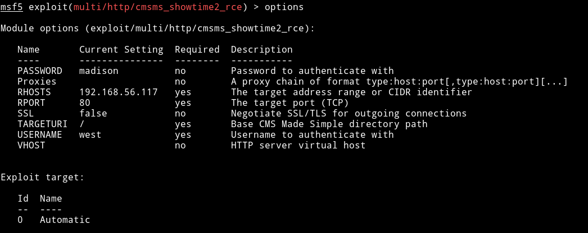

and with this I got the reverse shell

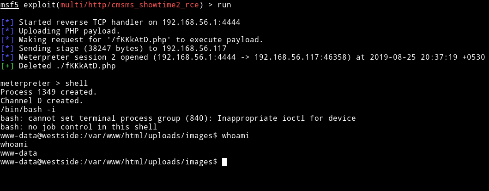

***

## Horizontal Pivilege escalation

Since we are in the system now I downloaded the enumeration script and then ran it.

With that I found that one of the file was marked as `suid`.

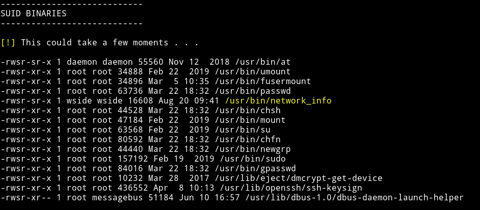

I ran the command `network_info` to see what that binary does.

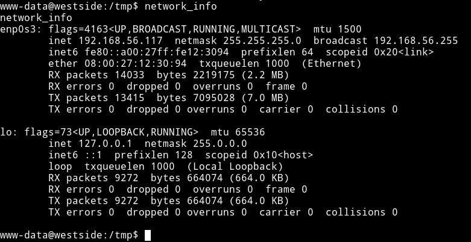

So it does what the name says, it prints the output of `ifconfig` command.
We can run `cat /bin/network_info` to confirm that.

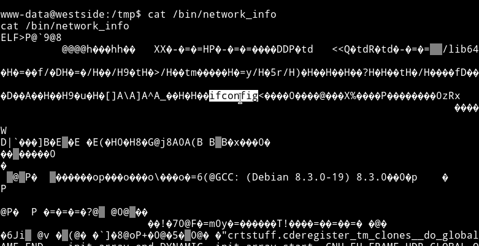

Now usually we can simply make a new file named `ifconfig` with shell in it and then run the command to get the root shell. That works because the absolute path is not given.

We can make a fake `ifconfig` file and then run the `network_info` to get a privileged shell.

In the `/tmp` folder run the following command:

* `echo "/bin/sh" > ifconfig`
* `chmod +x ifconfig`
* `export PATH=.:$PATH`

Now run the `network_info` and we'll have a shell for `wside`


***

## Vertical Privilege escalation.

So now we had the access to the `wside` home directory so I made a new folder name `.ssh` and added my public key in `authorized_keys` file this way I was able to login via SSH.

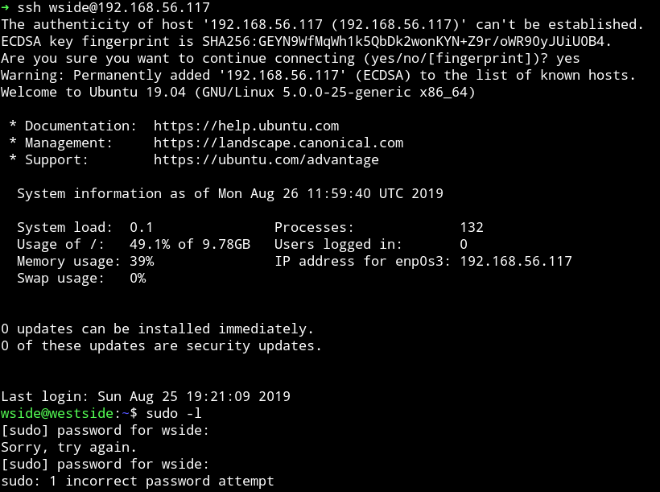

Then [@DCAU7]() found out that `wside` has access to `/etc/passwd` file so basically we can edit that file and have a new user who will have the root access.

This can be found by running `find / -user wside -type f 2>/dev/null`

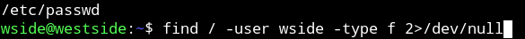

I added the following line to `/etc/passwd`

```
toor:sXuCKi7k3Xh/s:0:0::/root:/bin/bash
```

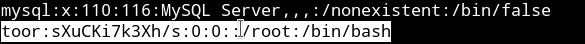

This entry means that we are adding a new user name `toor` which will have password `toor`.

Once we run `su toor` and enter `toor` as password we'll get the flag.

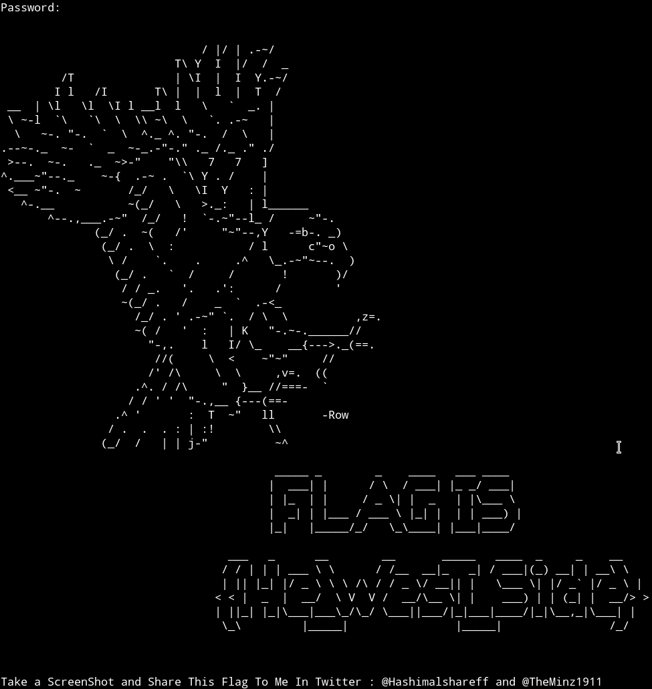

***

This was a nice box even though we had some issue in the starting because the original VM had issues with `network_info` file we found in the `Horizontal privilege escalation phase`. But all in all it was pretty good.

Thanks to [@theart42](https://twitter.com/theart42), [@DCAU7](https://twitter.com/DCAU7), [@4nqr34z](https://twitter.com/4nqr34z), [@D4mianWayne](https://twitter.com/D4mianWayne) for this awesome team work.

***

Thanks for reading, Feedback is always appreciated.

Follow me [@0xmzfr](https://twitter.com/0xmzfr) for more “Writeups”.
