<h1 align="center" style="font-size:30px;">
  <br>
  <a href="https://www.vulnhub.com/entry/sunset-nightfall,355/">Sunset: Nightfall</a>
  <br>
</h1>

<h4 align="center"> Author: <a href="https://twitter.com/whitecr0w1"> whitecr0w1</a></h4>

## Nmap

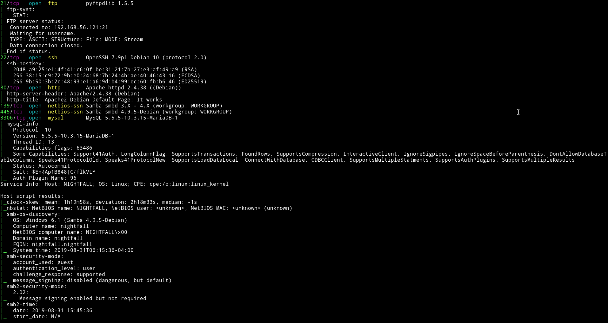

There are quite a few port open. Let's start with SMB

***

## SMB

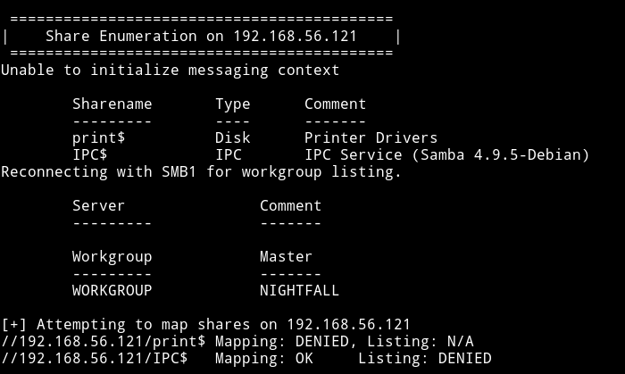

There are no shares to login into. But I found some users.

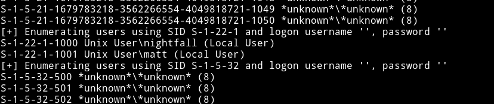

***

## FTP

First we were not sure what to do, [@theart42]() even tried to bruteforce password for `nightfall` user on FTP but found nothing.

Then I tried to brute force FTP password for `matt` and found it.

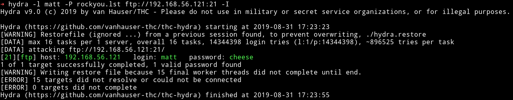

`matt:cheese`

I logged it and found some directory which looked like home directory.

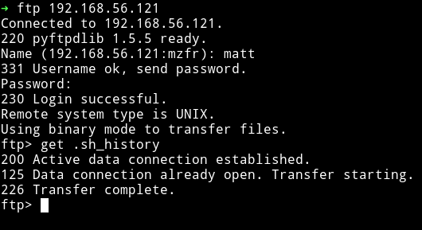

I started to look around and thought that there was a share for user `matt`.

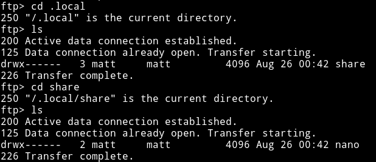

But this wasn't a SMB share. Then [@theart42]() said that he made a `.ssh` directory and placed my public key in a file called `authorized_key` and then use `put` to place it in  that directory.

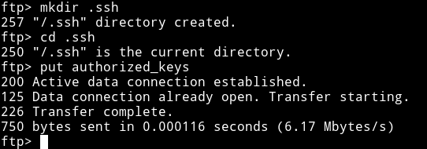

Now we can login as `matt` via `SSH`.

***

## Horizontal Privilege escalation

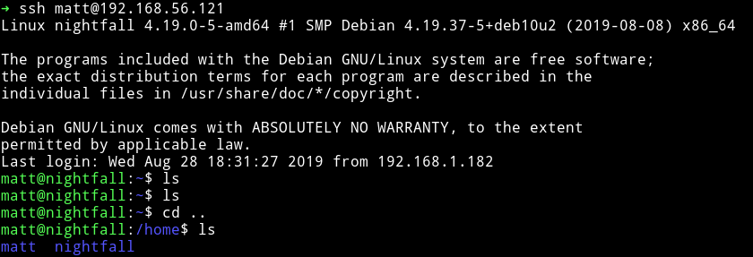

I ran my enumeration script and found a SUID file

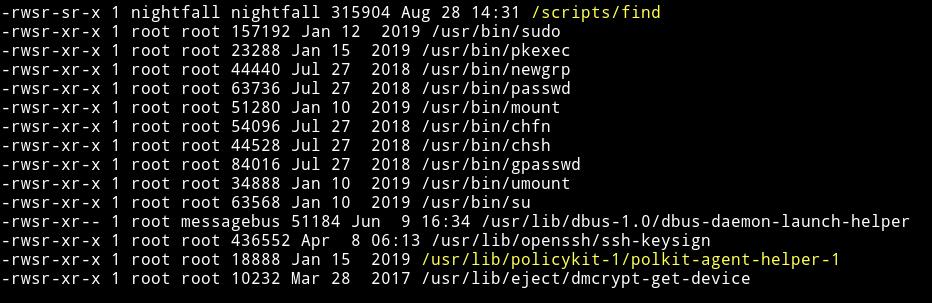

but it had permission of `nightfall` user meaning if we use `find` to escalate our privileges we'll become `nightfall` and not `root`.

I used [gtfobins/find](https://gtfobins.github.io/gtfobins/find/#suid) to get shell for `nightfall` user.

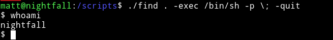

And then I got the `user.txt`

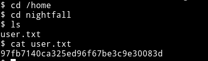

I decided to do the same thing as I did before, made a `.ssh` directory in `nightfall` home directory and placed my public key to login through SSH.

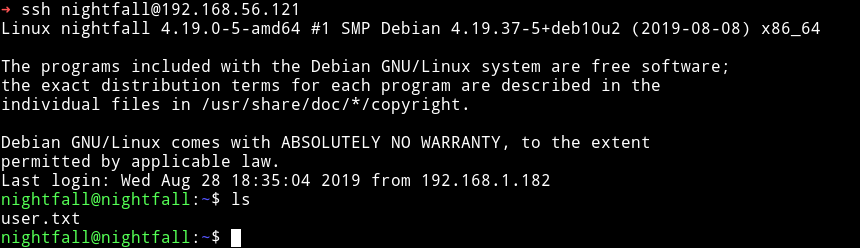

***

## Vertical Privilege escalation

In the `nightfall` home directory we can see a file named `.mysql_history`.
In the process we can see that `mysql` is running as `root`.

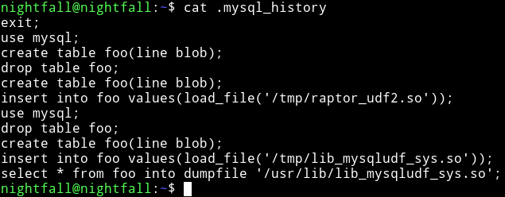

And then [@theart42]() said that mysql is running as `root`. So maybe we can login into mysql and then might be able to escalate our privileges.

Then I found out that `nightfall` can run `cat` as `root`

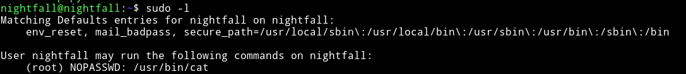

[@theart42]() used this to cat the `.mysql_history` of `root` user.

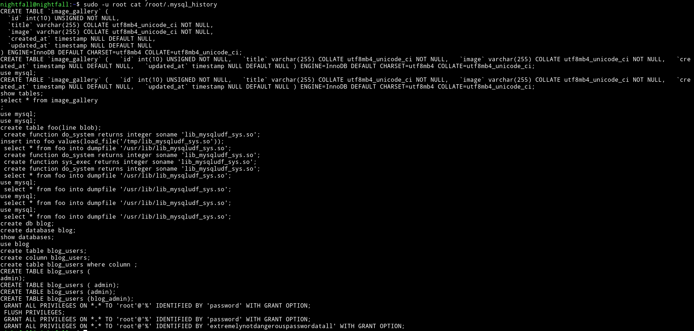

and in that we found the password for `root`.

`root:extremelynotdangerouspasswordatall`

We used this to login in `mysql`

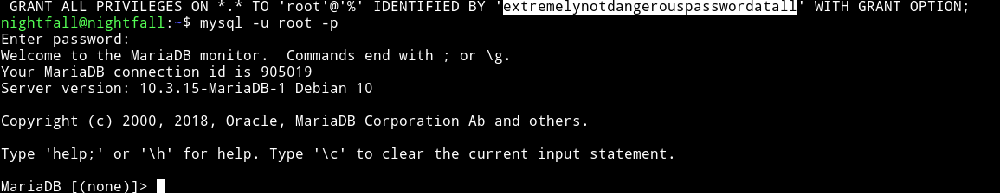

Since the `.mysql_history` in the `/home/nightfall` was talking about `raptor` etc we thought that we have to exploit mysql with [MySQL 4.x/5.0 (Linux) - User-Defined Function (UDF) Dynamic Library (2)](https://www.exploit-db.com/exploits/1518).

We tried to use that exploit but it didn't worked.

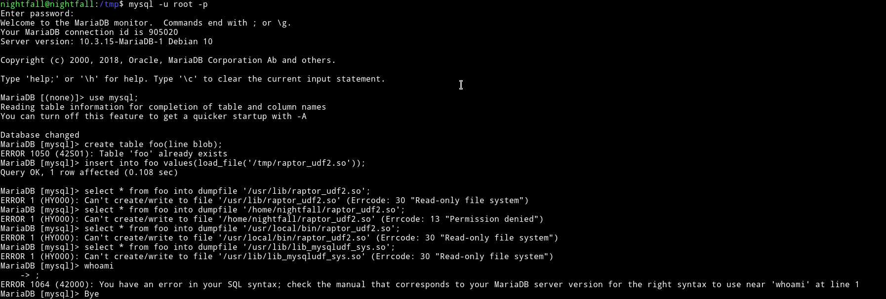

Since we have root permission to `cat` any file as `root` I decided to get the `/etc/shadow` and `/etc/passwd`.

```bash
$ sudo -u root cat /etc/shadow
```

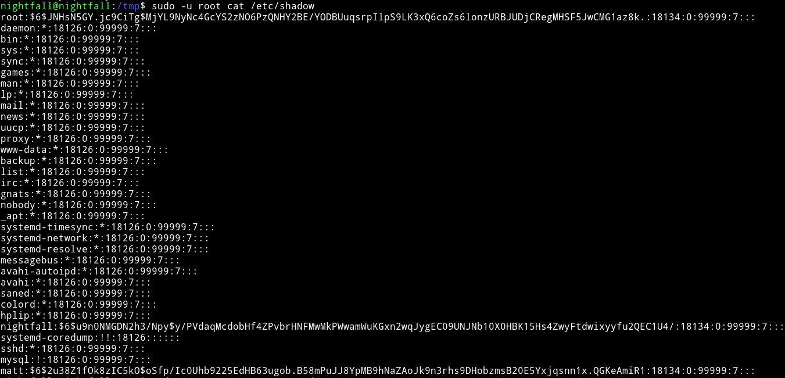

```bash
$ sudo -u root cat /etc/passwd
```

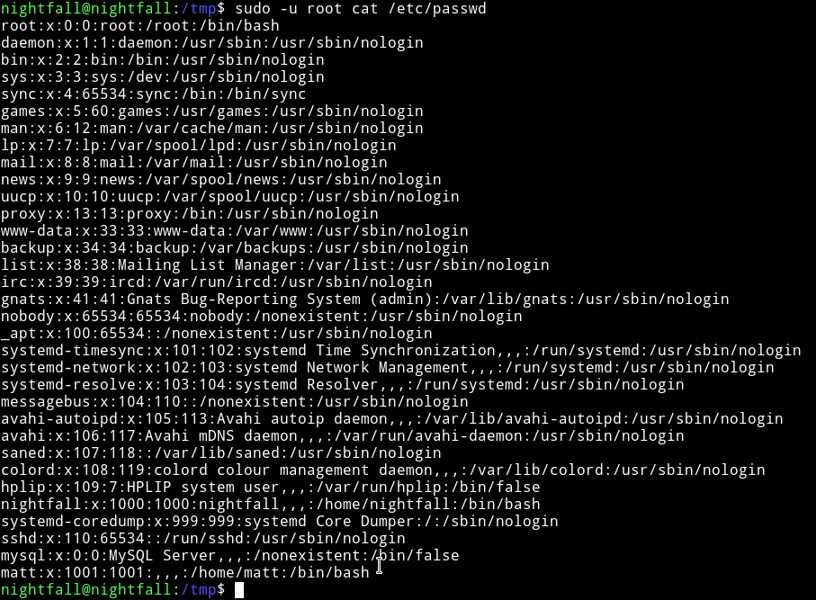

Then I did

```bash
$ unshadow passwd shadow > hash.txt
```

and started `john` on `hash.txt` and within few minutes I got the password.

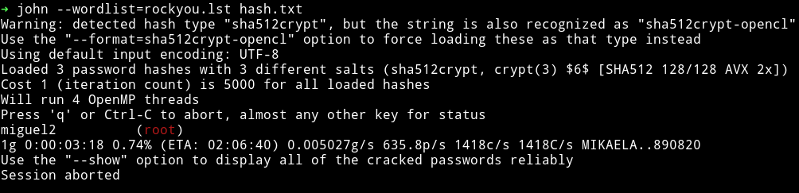

I used this password to `su root`.

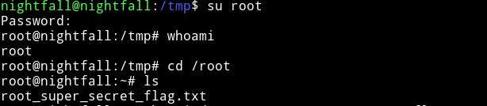

and then get the root flag.

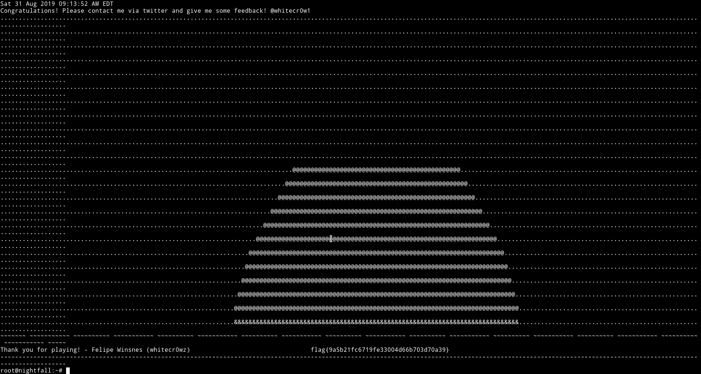

***

This was really awesome machine. For starting we had no idea because for a sec we ignored all the usernames. But things went so fast that we rooted it in an hour or so.

Thanks [@whitecr0w1](https://twitter.com/whitecr0w1) for this awesome machine.

And thanks to [@theart42](https://twitter.com/theart42) and [@4ndr34z](https://twitter.com/4ndr34z) for this awesome machine.

***

Thanks for reading, Feedback is always appreciated.

Follow me [@0xmzfr](https://twitter.com/0xmzfr) for more “Writeups”.
