<h1 align="center" style="font-size:30px;">
  <br>
  <a href="https://www.vulnhub.com/entry/prime-1,358/">Prime: 1</a>
  <br>
</h1>

<h4 align="center"> Author: Suraj Pandey</h4>

## Nmap

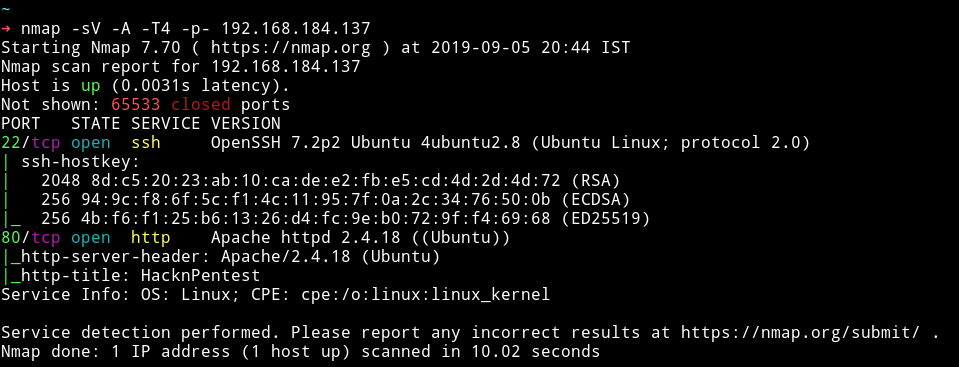

Seems like a simple start. Let's enumerate HTTP service.

***

## HTTP


Nothing fancy going on here. Also nothing in the comments.

I ran gobuster on it and found few URLs

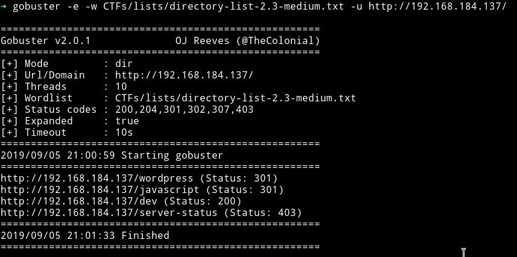

I opened the `/dev` URL and got a message.

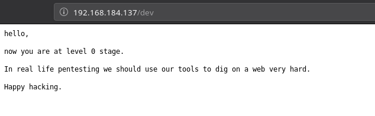

Since there is a `/wordpress` URL so I decided to run `wpscan`.
I found no vulnerability, only a username.

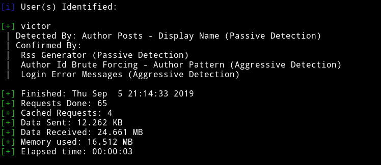

Since there were no vulnerabilities I decided not to go deep in WP.

I ran dirsearch on it again but this time with extension and found some extra URLs.

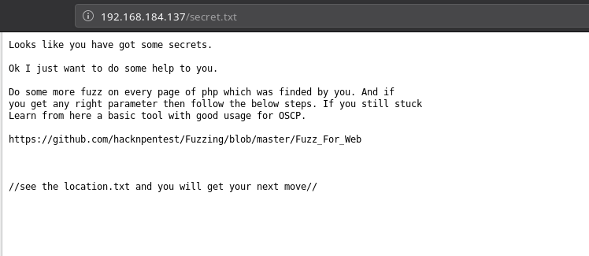

I used wfuzz as mentioned in the link we found and was able to find a `parameter` name `file`

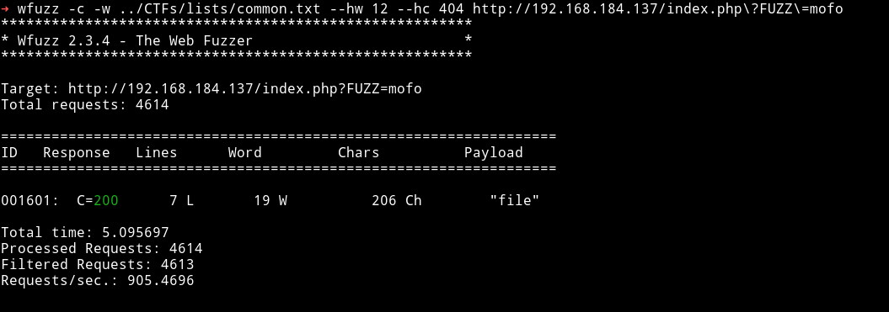

I used that parameter to see `location.txt`.

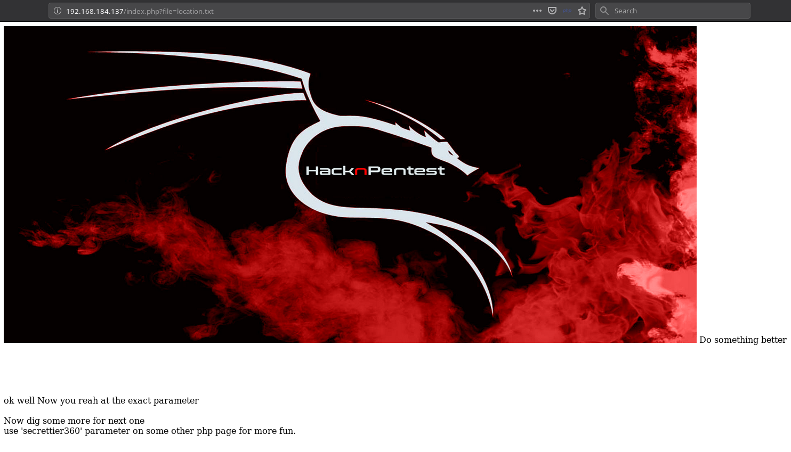

After sometime [@4nqr34z](https://twitter.com/4nqr34z) found that the `image.php?secrettier360=` is vulnerable to LFI. So if we vist the following URL we'll get base64 encoded data of /etc/passwd

`http://192.168.184.137/image.php?secrettier360=php://filter/convert.base64-encode/resource=../../../../../../../home/saket/password.txt`

And in one of the entry there was a hint.

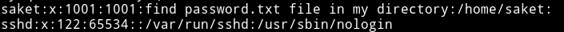

So I read the `/home/saket/password.txt` and found a base64 encoded string.

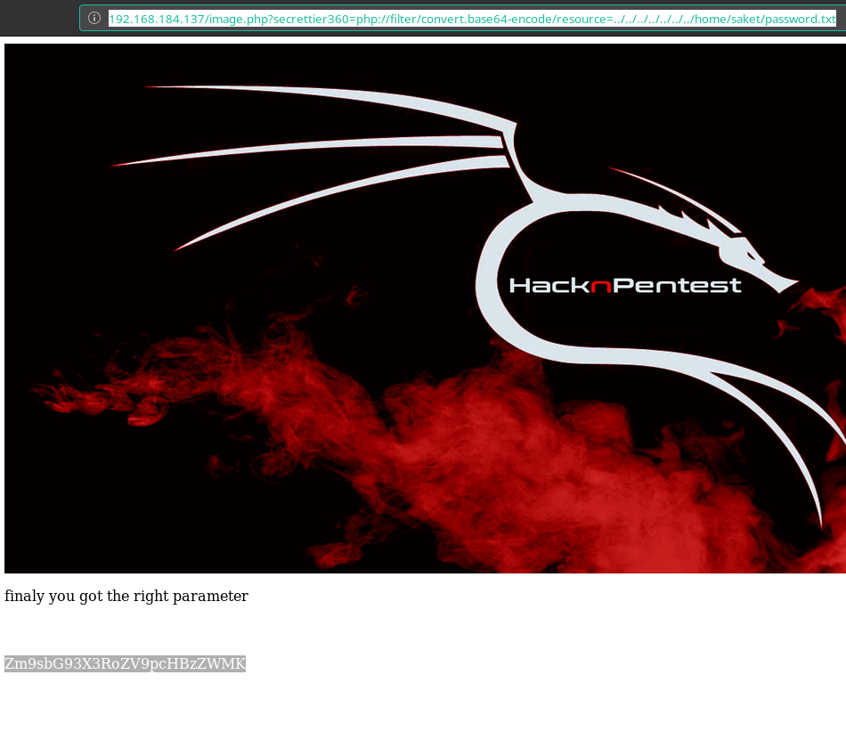

When we decoded the string I got a simple string.


For once we thought we had to watch some `ippsec` video but then [@theart42](https://twitter.com/theart42) said that it's password for user `victor` on `Wordpress`

`victor:follow_the_ippsec`

***

__For reverse shell__

In themes editor I found a file named `secret.php` which was editable.

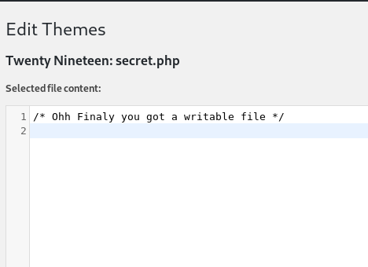

So I copy pasted my reverse shell in it, saved it and then visited the following URL while my listener was running on port 4444

```
➜ http http://192.168.184.137/wordpress/wp-content/themes/twentynineteen/secret.php
```

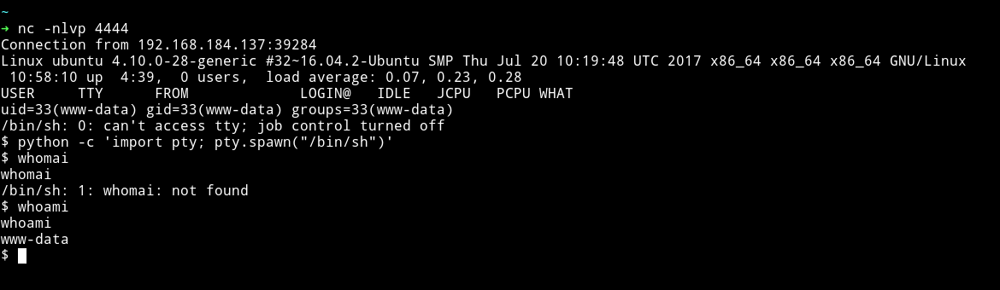

And now we can get the user flag.

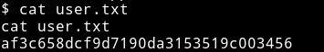

***

## Privelege escalation

I had shell so I downloaded the enumeration script and ran it. One thing that stood out was the kernel used:

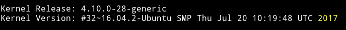

I used [grsc kernel exploit](https://raw.githubusercontent.com/kkamagui/linux-kernel-exploits/master/kernel-4.10.0-28-generic/CVE-2017-16995/CVE-2017-16995.c) I copy pasted in a file and then transfered that file to /tmp and compiled it.
After that I executed it.

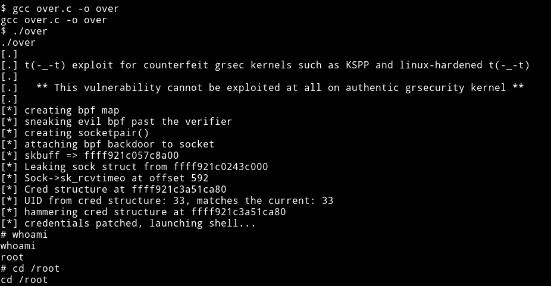

And then get the root flag.

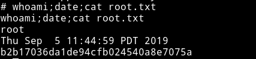

__Thanks to [@Anderson Valong](https://twitter.com/AndersonValong2) for giving the exploit link__

***

## Intended Way

So the kernel exploit is the unintended way to get the root. The real was involves decoding a AES ECB encrypted text.

If we run `sudo -l` we'll see that user `www-data` can run `/home/saket/enc` as root.

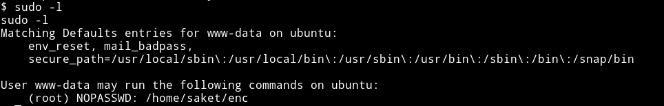

If we run that binary it will ask for `password` to find the password check out `/opt/backups`. We find a directory named `server_database` which contains a file having a password for binary in `/home/saket`

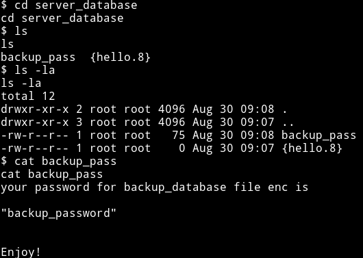

`backup_password`

If we use that password we'll get two new files named `key.txt` and `enc.txt`

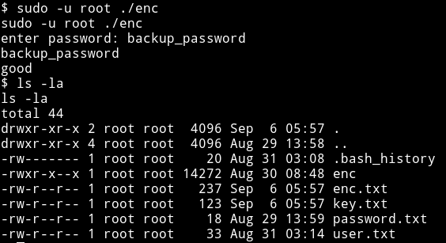

The `enc.txt` contains  AES ECB encrypted text and `key.txt` contains hint for key.

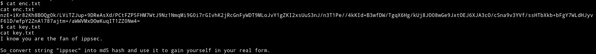

Since we have the key and the encrypted text we can decode it with `python`

```python
from Crypto.Cipher import AES
from base64 import b64decode

data = b64decode(b"nzE+iKr82Kh8BOQg0k/LViTZJup+9DReAsXd/PCtFZP5FHM7WtJ9Nz1NmqMi9G0i7rGIvhK2jRcGnFyWDT9MLoJvY1gZKI2xsUuS3nJ/n3T1Pe//4kKId+B3wfDW/TgqX6Hg/kUj8JO08wGe9JxtOEJ6XJA3cO/cSna9v3YVf/ssHTbXkb+bFgY7WLdHJyvF6lD/wfpY2ZnA1787ajtm+/aWWVMxDOwKuqIT1ZZ0Nw4=")
key = b"366a74cb3c959de17d61db30591c39d1"
cip = AES.new(key,AES.MODE_ECB)
print(cip.decrypt(data).decode("utf-8"))
```
__Thanks to [@D4mianWayne](https://twitter.com/D4mianWayne) for the code__

If we run this we'll get the following output

```
Dont worry saket one day we will reach to
our destination very soon. And if you forget
your username then use your old password
==> "tribute_to_ippsec"

Victor,
```

Now we can use that password to `su` to `saket` user

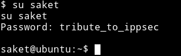

I checked the `sudo` right for `saket` user and found out that he can run `/home/victor/undefeated_victor` as root.

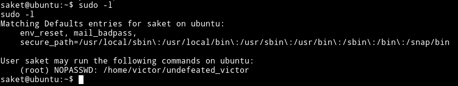

I ran this file and got an error.


This mean that `undefeated_victor` binary is running a file named `/tmp/challenge`, so we can use this to get a root shell. We can make a file in `/tmp/` having name `challenge` which will contain code to run shell. That will trigger the root shell when we run the `undefeated_victor`

To get a root shell do the following:

* `cd /tmp`
* `echo "/bin/sh" > challenge`
* `chmod +x challenge`
* Now in `/home/victor` run `sudo -u root ./undefeated_victor`

And we'll get the root shell

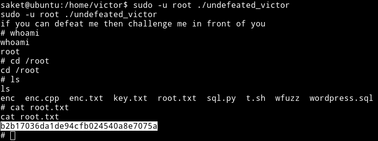

***

This was really a great machine. The intended way to get the root is very cool. I really enjoyed this.

Thanks to [Suraj Pandey](https://hacknpentest.com/capture-the-flag-security-machines/) for this machine.

Thanks to [@theart42](https://twitter.com/theart42), [@DCAU7](https://twitter.com/DCAU7), [@4nqr34z](https://twitter.com/4nqr34z), [@D4mianWayne](https://twitter.com/D4mianWayne) for this awesome team work.

***

Thanks for reading, Feedback is always appreciated.

Follow me [@0xmzfr](https://twitter.com/0xmzfr) for more “Writeups”.

