<h1 align="center" style="font-size:30px;">
  <br>
  <a href="https://www.vulnhub.com/entry/connect-the-dots-1,384/"> Connect the dots</a>
  <br>
</h1>

<h4 align="center"> Author: <a href="https://www.linkedin.com/in/sumit-verma-125576129/"> Sumit Verma</a></h4>

## Nmap

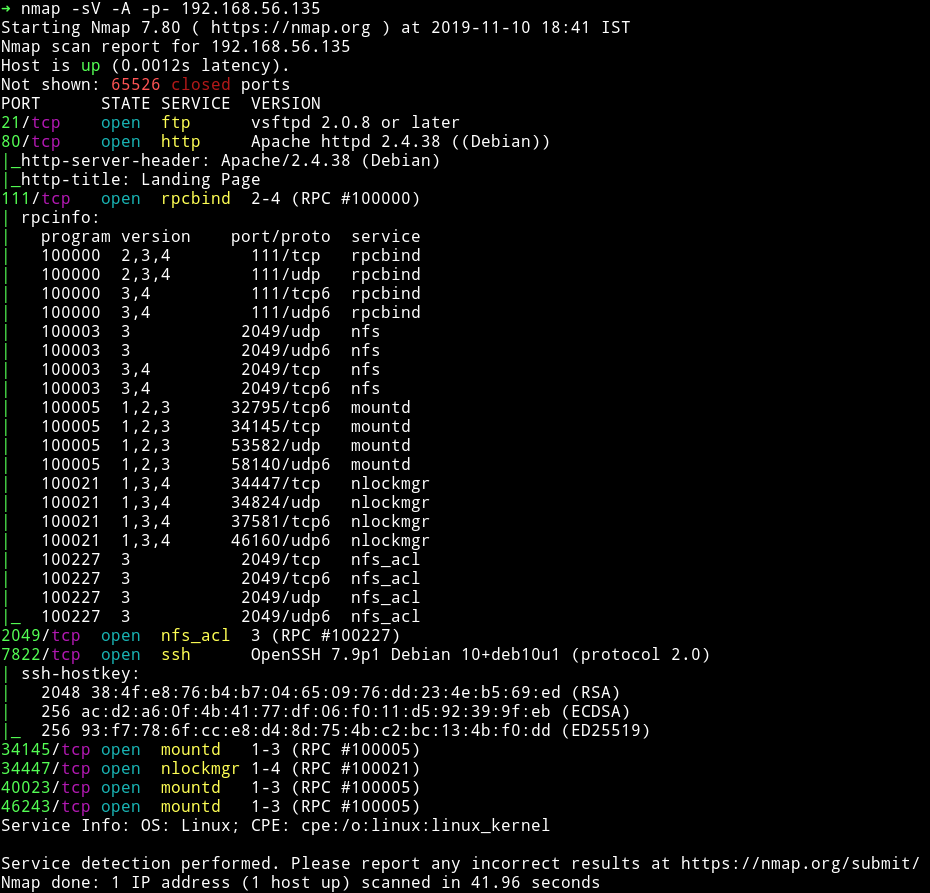

There are lot of RPC port opened. Other than that we can see that SSH service is running but not on 22 but instead on `7822`. There is FTP service on and our good old HTTP service.

We can see that there is `nfs` so let's mount that and try to play with it.

***

## NFS

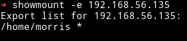

We can see that there is a `/home/morris` which can be mounted by anyone.

We can do the following to mount it:

```bash
$ mkdir /home/dots
$ sudo mount -t nfs 192.168.56.135:/home/morris /home/dots
```

This will give you that share in `/home/dots`.

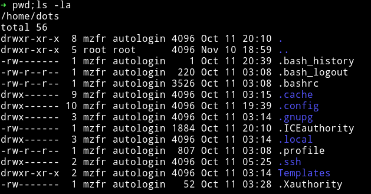

We can see that there are `.ssh/` so I copied the `id_rsa` and tried to use it to login via SSH into `morris` account but for some reason it didn't work.

So We moved on.

***
## HTTP

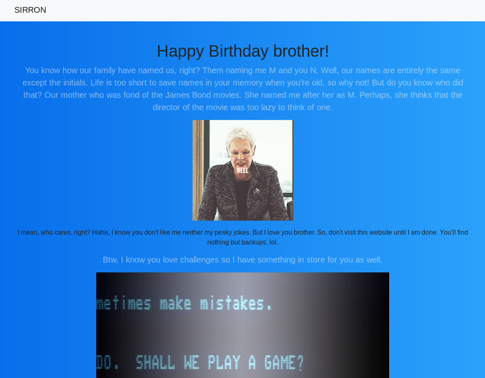

This website gives some background/story line of two brother morris and norris. Without reading ahead I ran `gobuster` on it to see if I find anything.

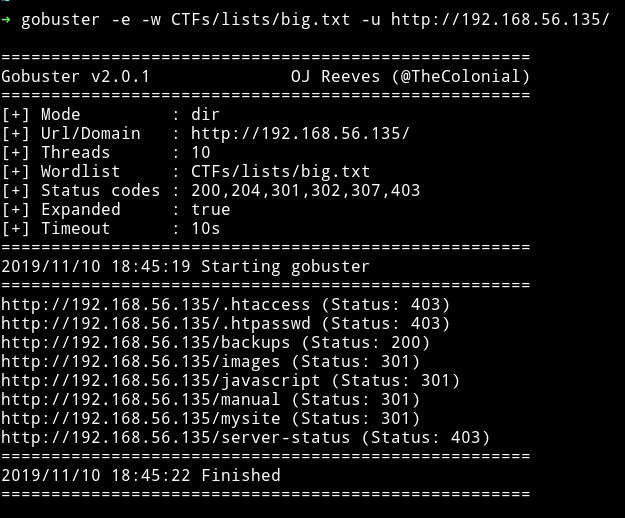

There are two directory one is `/backups` and the other one is `/mysite`. On `/backups` I found the `backups.mp4` which didn't had anything interesting in it. And on `/mysite` I found few files out of which `/register.html` takes us to a form.


I decided to look in the source of that page and found `bootstrap.min.cs` which had the very interesting thing in it, some [jsfuck](https://en.wikipedia.org/wiki/JSFuck) code.

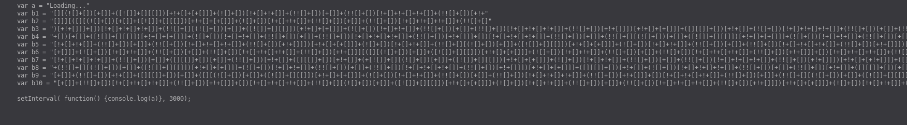

We used [jsfuck decoder](http://www.jsfuck.com/#) this to decrypt it.

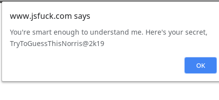

`norris:TryToGuessThisNorris@2k19`

I used this password with `norris` as username on SSH and I was able to log in.

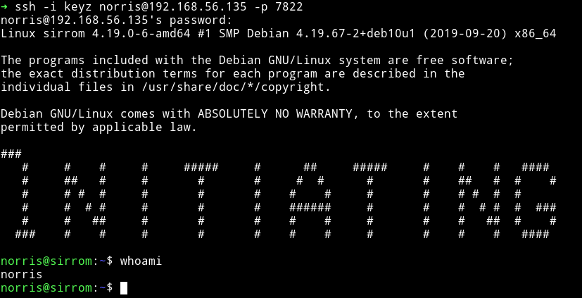

and then I grabbed the user flag.

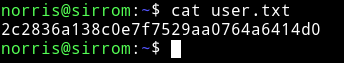

***

## Privilege escalation

I ran the enumeration script and found a SUID file.

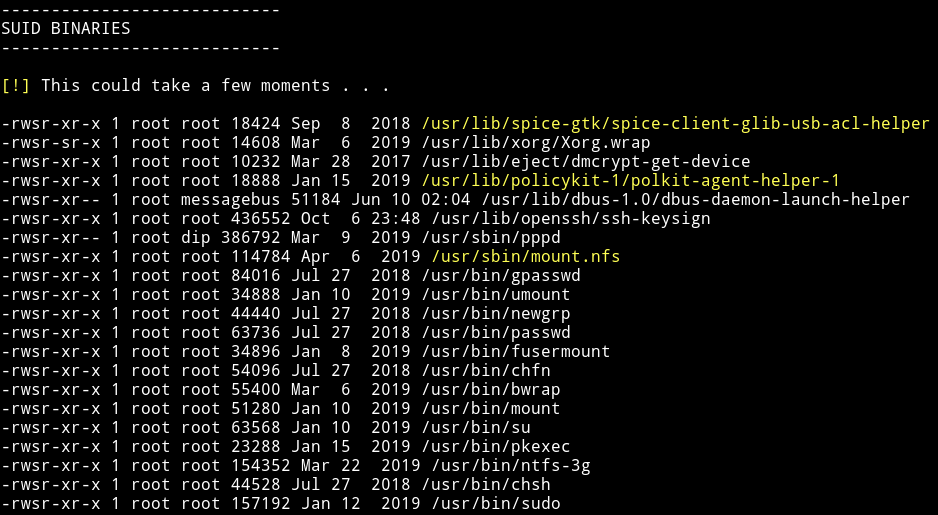

I didn't knew how to use `mount.nfs` to escalate priveleges but then @theart42 said that we can run a nfs server on our system and share a folder which will contain a setuidThanks for reading, Feedback is always appreciated.

Follow me [@0xmzfr](https://twitter.com/0xmzfr) for more “Writeups”.
 file. Once it will be mounted on the victim machine we can run it to get the root shell.

Sadly we tried this method but couldn't get it working.

So we kept looking around, in `/ftp/files` we found a file named `games.jpg.bak` which had morse code in `strings`.

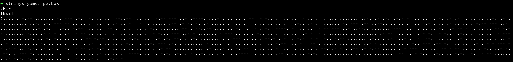

cracked it using cyberchef

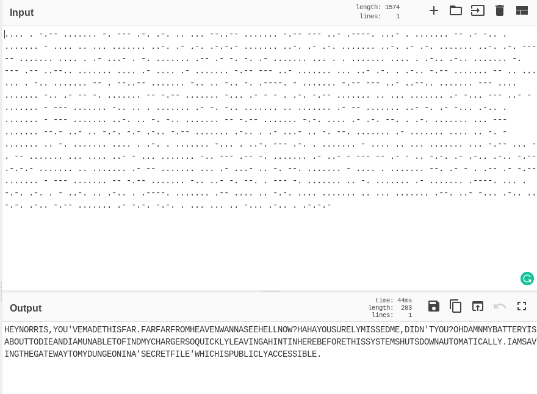

```
HEYNORRIS,YOU'VEMADETHISFAR.FARFARFROMHEAVENWANNASEEHELLNOW?HAHAYOUSURELYMISSEDME,DIDN'TYOU?OHDAMNMYBATTERYISABOUTTODIEANDIAMUNABLETOFINDMYCHARGERSOQUICKLYLEAVINGAHINTINHEREBEFORETHISSYSTEMSHUTSDOWNAUTOMATICALLY.IAMSAVINGTHEGATEWAYTOMYDUNGEONINA'SECRETFILE'WHICHISPUBLICLYACCESSIBLE.
```

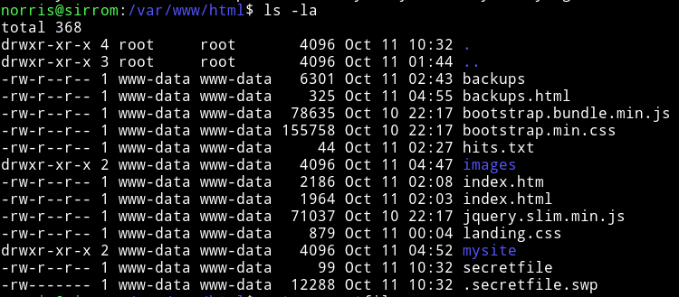

Download it via webserver meaning `IP/.secretfile.swp` that will download the file and then we can cat it.

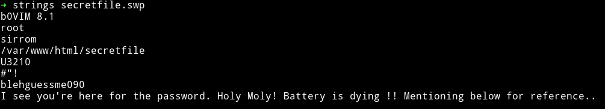

`morris:blehguessme090`

Then I did `su morris` to become morris. At this point we were stuck for quite sometime because we couldn't find anything to escalate the priveleges. Then out of blue [@theart42](https://twitter.com/theart42) found a way to root it.

He said that `tar` is allowed to read the `/root` so we can compress the root directory and then untar it to get the root flag, but all this has to be done as `norris` and not as `morris`

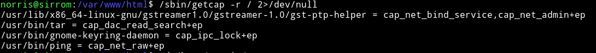

We can see that tar is set to `/usr/bin/tar = cap_dac_read_search+ep` so we can compress the `/root` directory using this.


And then we can read the root flag.

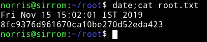

***

This isn't really a hard machine but it was still kind of fun to do because of lot of rabbit holes. Like that `mount.nfs` being given as SUID, we thought of mounting a nfs share on the system which will contain a root setuid. But that didn't seemed to work. We completely missed the `tar` in our enumeration process.

All in all it was a fun box to do. Thanks to the author for this box.
Also amazing teamwork by [@theart42]().

***

Thanks for reading, Feedback is always appreciated.

Follow me [@0xmzfr](https://twitter.com/0xmzfr) for more “Writeups”.
