<h4 align="center">Box Author: <a href="https://twitter.com/Ic0deWs"> Ic0de</a></h4>

## Nmap

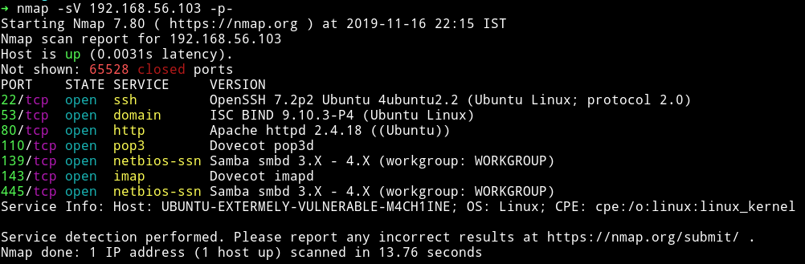

We can see that there are some email services like pop and imap. Then there is SMB service and we also have a DNS running along with the common SSH and HTTP service.

We'll start enumerating with SMB.

***

## SMB

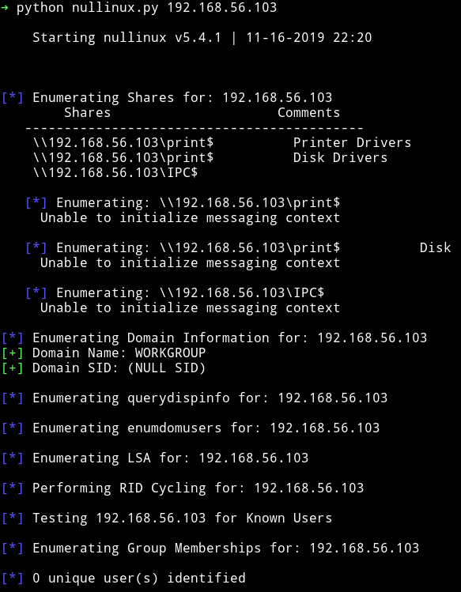

We don't see any share there, also no unique user was found.
So let's move on to HTTP service.

***

## HTTP

When we visit the IP we get a normal `Apache2 Ubuntu Default` Page. So the first thing I did was to use gobuster


With that I was able to find the `/wordpress` directory. Since it's wordpress the very first thing I did was to run wpscan to see if it's vulnerable to something.

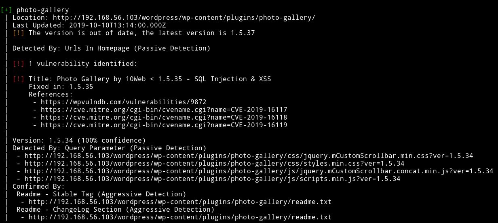

wpscan did find a vulnerablity and one user

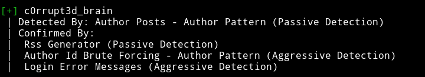

I didn't had to exploit that vulnerability to get the shell on the system. On one of the blog post I found the comment saying the host is super vulnerable

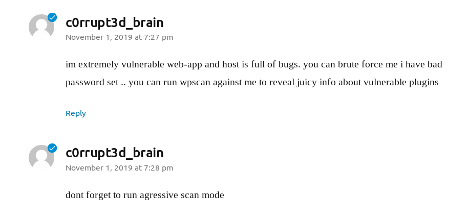

So I ran a bruteforce attack against the user found and I was able to crack the password in few minutes.

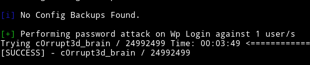

`c0rrupt3d_brain:24992499`

Once I was able to log in, I directly went to edit the theme and there in `404.php` I found a note.

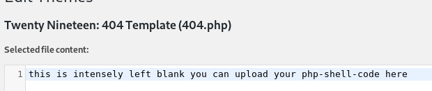

Once I copy pasted my [php reverse shell code](http://pentestmonkey.net/tools/web-shells/php-reverse-shell) there I ran

```bash
➜ http http://192.168.56.103/wordpress/wp-content/themes/twentynineteen/404.php
```

and got the reverse shell on my listener which was started by running: `nc -nlvp 4444`

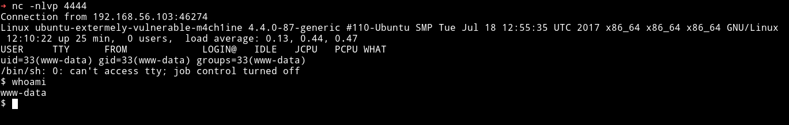

***

## Privilege escalation

Since I had the shell I decided to look into the user directory and guess what I found, the damn root password.

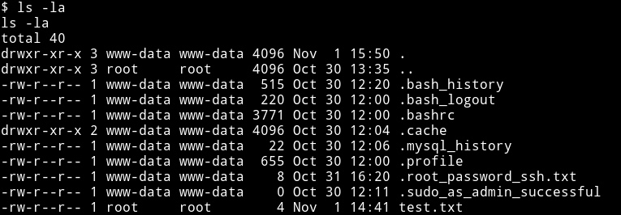

The password was `willy26`. I did `su root` to become root

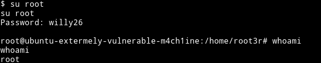

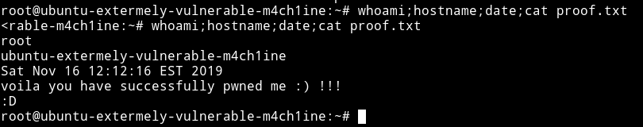

***

Kinda good beginner box.

***

Thanks for reading, Feedback is always appreciated.

Follow me [@0xmzfr](https://twitter.com/0xmzfr) for more “Writeups”.


