## Nmap

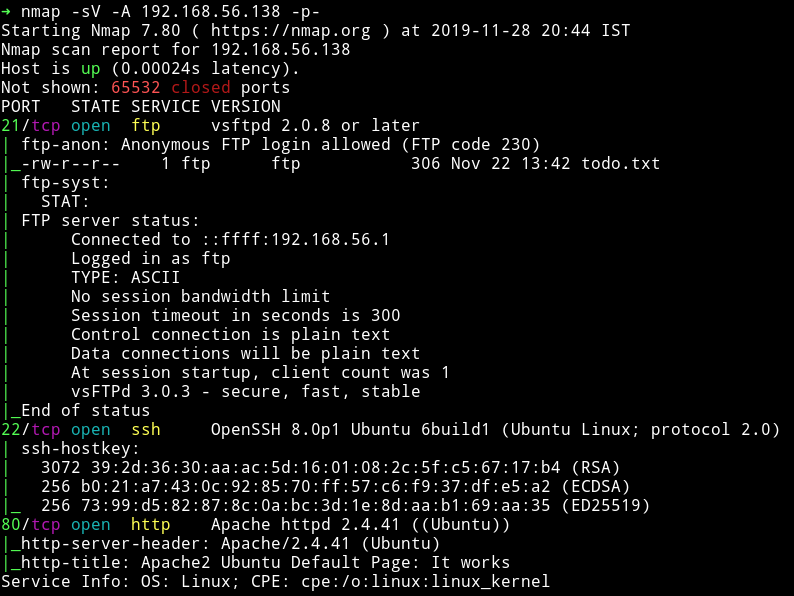

Nothing fancy here, just some common port opened. Let's start enumeration with FTP.

***

## FTP

We can see in nmap scan that FTP allowed anonymous login and there is a `todo.txt`.Let's read that:

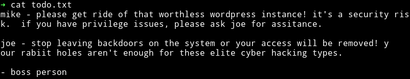

We can see that there seem to be 2 users named `joe` and `mike`. Also there might be some rabbit holes. Another thing we know is that there is `wordpress` somewhere there.

***

## HTTP

When we move on to the website we can see default apache page so I directly ran gobuster.

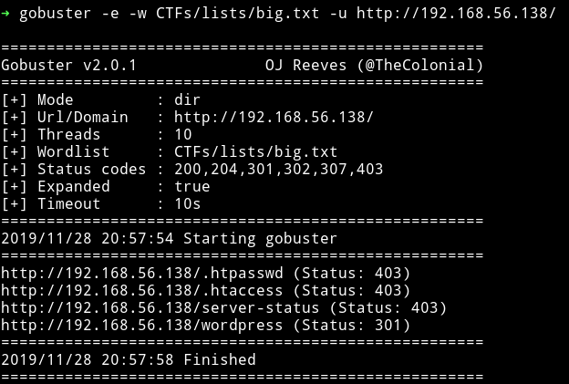

I found nothing on the wordpress. [@4nqr34z](https://twitter.com/4nqr34z) told me to `look in the plain sight` and that's when I found something on the default page of Apache2.

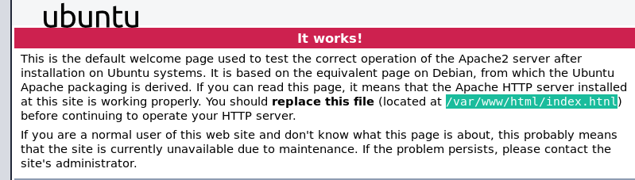

We need to visit `index.htnl` and not `index.html`(notice the `n` in place of `m`). When we visit that page we can see a gif


if we click on that gif we'll be taken to an `upload page`.

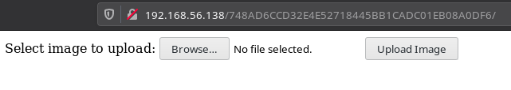

I decided to upload a `php` file to see if that is restricted or not.
When I did that I was directed to `/upload.php` and there  I noticed it said `File is an image - image/gif. ` when it was actually not, meaning this `upload` could be a rabbit hole.

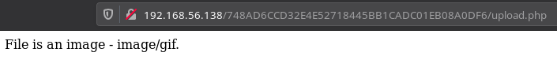

I decided to checkout the source of the page and there I found a comment.

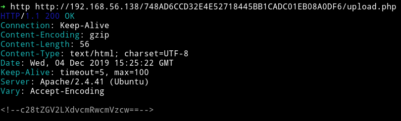

Since it's a base64 we can decode it using the base64 command. I did

```bash
➜ http -b http://192.168.56.138/748AD6CCD32E4E52718445BB1CADC01EB08A0DF6/upload.php | tr -dc 'a-zA-Z0-9' | base64 -d 2>/dev/null
```

This will give us the decoded string i.e `so-dev-wordpress`. This could mean that we need to visit this `directory path`.

When I opened `IP/so-dev-wordpress` I got the similar looking WP. I started to look around but couldn't find anything special there. Then I decided to do dictionary attack on the `admin` login account. And that's when I found the admin password.

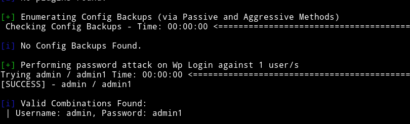

Once I was in the WP I directly went to edit the `Theme` and in `404.php` pasted my reverse shell code and updated it file.

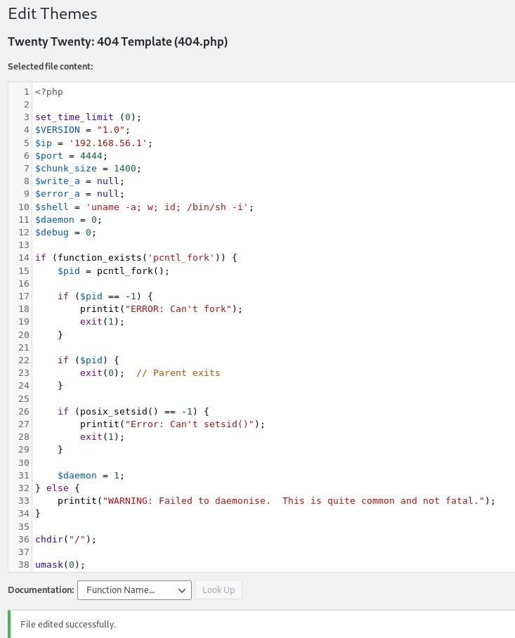

And then I triggered the reverse shell by running:

```bash
➜ http http://192.168.56.138/so-dev-wordpress/wp-content/themes/twentytwenty/404.php
```

__Note__: here `http` is a tool know as [`httpie`](https://httpie.org/)

And that will give us a reverse shell.

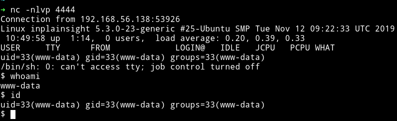

## Horizontal Privilege Escalation

Since we are in the system we can download our enumeration script and start enumerating the system.

Enumeration script didn't find anything special. So I decided to do it manually.

In the `/var/mail` I found two email for `www-data` and `mike`.

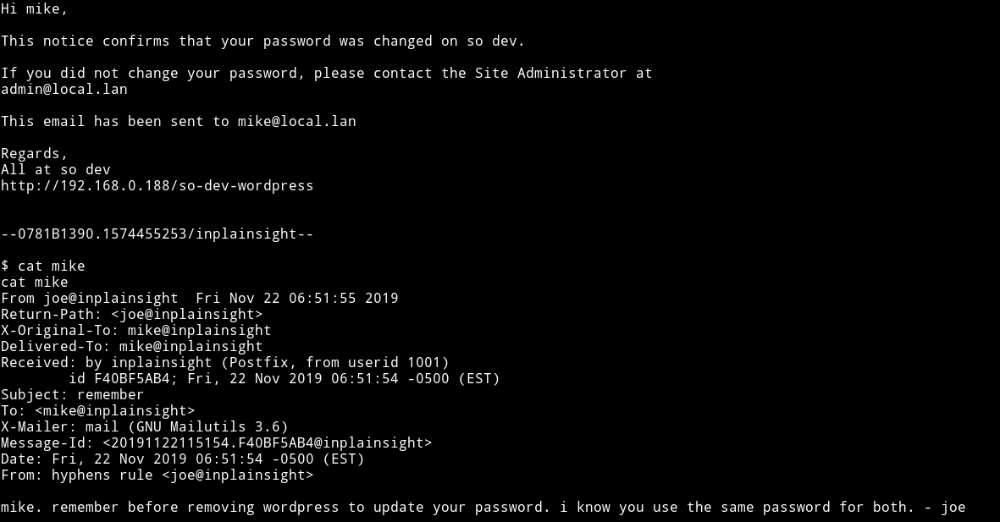

Both of them refers to `mikes` password and the `mike` email even says that he uses the same password as `wordpress` so I decided to see if I can dump database for the wordpress.

First I read the `mysql` password for `so-dev-wordpress` from `/var/www/html/wordpress/wp-config.php`.

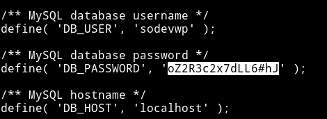

I read the `sodevwp_users` table from the `sodevwp` database and that had password hash `admin` and `mike`.

`select * from sodevwp_users;`

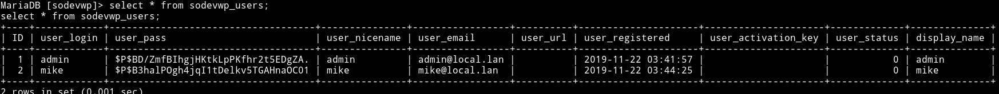

I copied the `mike` hash to a file and used `john the ripper` to crack the hash.

`john --wordlist=rockyou.txt hash.txt`

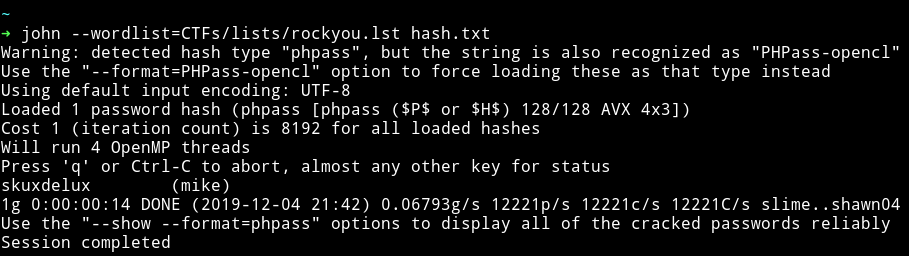

`mike:skuxdelux`

Now we can use this password to become `mike`

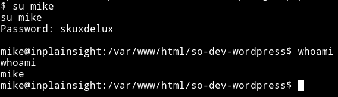

After becoming `mike` I started to look around for a way to become `joe` but coudn't find anything. Then @theart42 told me to look at the `/etc/passwd`. When I read that file I found out that there was a hint infront of `joe` username

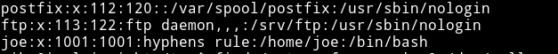

So I decided to find files with hypen in them and I ran

```bash
mike@inplainsight:/tmp$ find / -type f -name *-* 2>/dev/null
```
And it gave me the following output:

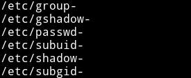

And then I read the `/etc/passwd-` which had the joe's password.

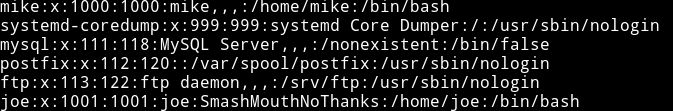

Using `joe:SmashMouthNoThanks` I su'ed joe

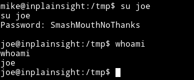

## Vertical Privilege Escalation

I found a file name `journal` in `/home/joe` and it said

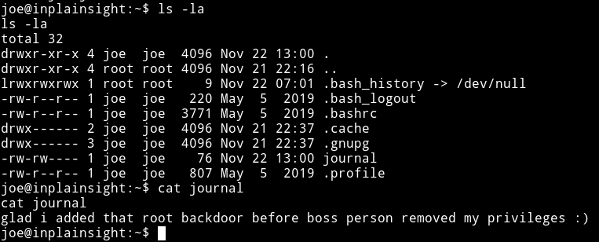

I started to look around but couldn't find anything and then in the SUID section I noticed that there was a SUID named `bwrap` which had a `+` permission

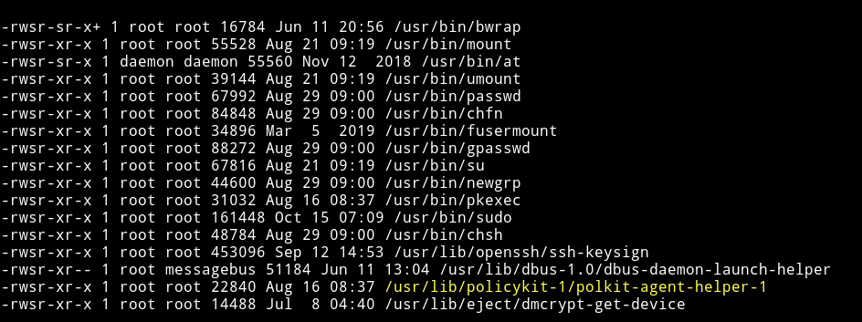

This mean we can try to run this as `root`.

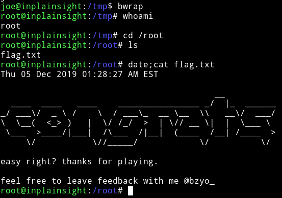

***

This was a pretty good machine, even though there wasn't anything tough but still a sweet way to root. Thanks to [@bzyo_](https://twitter.com/@bzyo_) for making this machine.

***

Thanks for reading, Feedback is always appreciated.

Follow me [@0xmzfr](https://twitter.com/0xmzfr) for more “Writeups”. And if you'd like to support me considering [donating](https://mzfr.github.io/donate/) 😄
